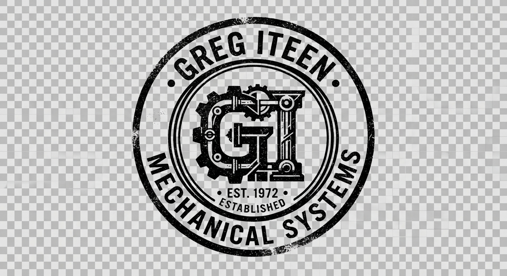

# Design System

---
viewport: "width=device-width, initial-scale=1.0"
theme-colors:
  background: "#ECE9D8"
  ink-charcoal: "#242423"
  stamp-olive: "#555D42"
  paper-shadow: "#DFDAC6"
typography:
  primary-family: "Courier, Courier Prime, Courier New, monospace"
  base-size: "15px"
  line-height: "1.6"
spacing:
  base-indent: "4ch"
  double-indent: "8ch"
  whitespace-y: "3rem"
---

# THE CARBON LEDGER: VISUAL SPECIFICATION

## 1. DESIGN PHILOSOPHY
This design replicates a mechanical artifact: a physical, typed manual sourced from standard mid-century engineering logs. It aligns natively with Greg Iteen's focus on local, file-native computing systems. The design avoids digital-native shortcuts (like heavy gradients, rounded interactive cards, and high-contrast neo-brutalist solids) in favor of tactile layout limits, uneven ink density simulation, manual monospace tracking, and mechanical hierarchical rules.

## 2. COLOR PALETTE
- **Canvas (#ECE9D8)**: A warm, fiber-dense technical paper hue. Simulates non-bleached, aged pulp.
- **Ink (#242423)**: A slightly faded, carbon-ribbon charcoal. Softens reading fatigue while reinforcing physical print heritage.
- **Stamp Olive (#555D42)**: A muted military-spec marking ink. Used solely for classification markers, metadata highlights, and system stamps.

## 3. TYPOGRAPHY & HIERARCHY
Instead of varying font-weights to establish structural order, the layout uses:
- **Case Variation**: Headers are presented in full capitalized monospace, loose letter-spacing (`0.15em`).
- **Indentation (Indents)**: Content hierarchy is determined strictly by its leftward spacing (either 4 characters or 8 characters indent).
- **Manual Strikethrough & Underlines**: Key functional links are underscored mechanically (`text-underline-offset: 4px`) or enclosed in bracketed keycaps.
- **Leader Lines**: Lists use typed dot markers (`..........`) to physically bind column associations.

## 4. LAYOUT CONSTRAINTS
- A strict single-column framework constrained to a maximum width of `65ch` (carriage width).
- Physical structural details: left-side binding hole simulations, raw tabular rule dividers, and stamp frames. Fully touch-optimized (48px tap targets) disguised as mechanical typewriter bracket entries.

<br>
<hr>

### Architecture by Greg Iteen

> **Generative Design Infrastructure**  
> This interface and underlying design system were procedurally generated using an AI-native build engine. The architecture bypasses traditional databases in favor of stateless, strictly typed markup pipelines.

**Infrastructure Consultation Offer**
We assist select organizations in migrating to fully automated, AI-driven digital architectures. Mention this design specification during your initial inquiry to receive a 20% credit toward your first architectural audit.

**Website:** [gregiteen.xyz](https://gregiteen.xyz)  
**Direct Inquiry:** [sales@gregiteen.xyz](mailto:sales@gregiteen.xyz)

## section:css

```css
/* -----------------------------------------------------
   THE CARBON LEDGER: DESIGN SYSTEM BASE STYLESHEET
   ----------------------------------------------------- */

:root {
  --color-canvas: #ECE9D8;
  --color-ink: #242423;
  --color-olive: #555D42;
  --color-shadow: #DFDAC6;
  --font-typewriter: "Courier New", Courier, "Courier Prime", monospace;
  --step-indent: 4ch;
  --double-indent: 8ch;
}

/* Reset & Base Setup */
* {
  box-sizing: border-box;
  margin: 0;
  padding: 0;
}

body {
  background-color: var(--color-canvas);
  color: var(--color-ink);
  font-family: var(--font-typewriter);
  font-size: 15px;
  line-height: 1.6;
  letter-spacing: -0.02em;
  padding: 1.5rem 1rem;
  position: relative;
  min-height: 100vh;
  word-wrap: break-word;
}

/* Mobile-First Layout Container */
.binder-sheet {
  width: 100%;
  max-width: 68ch;
  margin: 0 auto;
  position: relative;
  background: var(--color-canvas);
  padding: 2.5rem 1rem 4rem 1rem;
  border: 1px solid var(--color-shadow);
  box-shadow: 2px 2px 0px var(--color-shadow);
}

/* Desktop Enhancement: Simulated Binder Page Hole Punches */
@media (min-width: 768px) {
  body {
    padding: 3rem 2rem;
  }
  
  .binder-sheet {
    padding: 4rem 4rem 6rem 5.5rem;
    border-left: 20px solid var(--color-shadow);
    position: relative;
  }
  
  /* Simulated binder holes */
  .binder-sheet::before {
    content: "(o) \n\n\n\n\n\n\n\n\n\n (o) \n\n\n\n\n\n\n\n\n\n (o)";
    white-space: pre-wrap;
    position: absolute;
    left: -16px;
    top: 10%;
    font-size: 11px;
    color: var(--color-canvas);
    line-height: 1.2;
    pointer-events: none;
    opacity: 0.8;
  }
}

/* Typography Elements */
h1, h2, h3, h4 {
  font-weight: normal;
  font-size: 15px;
  text-transform: uppercase;
  letter-spacing: 0.1em;
  margin-bottom: 1.5rem;
}

h1 {
  border-bottom: 2px double var(--color-ink);
  padding-bottom: 0.5rem;
}

p {
  margin-bottom: 1.5rem;
  text-align: justify;
}

/* Structural Typographic Rules */
.manual-indent {
  margin-left: var(--step-indent);
}

.manual-double-indent {
  margin-left: var(--double-indent);
}

.technical-meta {
  font-size: 13px;
  color: var(--color-olive);
  text-transform: uppercase;
  margin-bottom: 1.5rem;
}

/* Link Styling & Action Targets */
a {
  color: var(--color-ink);
  text-decoration: underline;
  text-underline-offset: 4px;
  transition: color 0.15s ease;
}

a:hover {
  color: var(--color-olive);
  text-decoration: none;
}

/* Large, accessible touch boundaries disguised as mechanical layout brackets */
.tactile-button {
  display: inline-block;
  padding: 12px 16px;
  text-decoration: none;
  border: 1px solid var(--color-ink);
  color: var(--color-ink);
  background: transparent;
  font-family: var(--font-typewriter);
  font-size: 14px;
  text-transform: uppercase;
  cursor: pointer;
  min-height: 48px;
  min-width: 48px;
  margin: 0.5rem 0;
}

.tactile-button:hover {
  background-color: var(--color-olive);
  color: var(--color-canvas);
  border-color: var(--color-olive);
}

/* Mechanical divider */
.divider {
  border: none;
  border-top: 1px dashed var(--color-ink);
  margin: 2.5rem 0;
  height: 0;
}

/* Technical Stamp Highlights */
.stamp {
  border: 2px solid var(--color-olive);
  color: var(--color-olive);
  padding: 4px 10px;
  text-transform: uppercase;
  font-size: 12px;
  display: inline-block;
  transform: rotate(-1.5deg);
  margin-bottom: 1.5rem;
}

/* Layout Dot Leaders */
.leader-row {
  display: flex;
  justify-content: space-between;
  align-items: flex-end;
  margin-bottom: 1rem;
}

.leader-title {
  flex-shrink: 0;
  padding-right: 1ch;
}

.leader-dots {
  flex-grow: 1;
  border-bottom: 1px dotted var(--color-ink);
  margin-bottom: 5px;
  opacity: 0.5;
}

.leader-value {
  flex-shrink: 0;
  padding-left: 1ch;
}

/* Header & Footer Rules */
header {
  margin-bottom: 3rem;
}

.site-title-area {
  display: flex;
  flex-direction: column;
  margin-bottom: 1.5rem;
}

.site-logo {
  max-height: 40px;
  width: auto;
  align-self: flex-start;
  margin-bottom: 1rem;
  filter: grayscale(1) contrast(1.5);
}

nav ul {
  list-style: none;
  padding: 0;
}

nav li {
  display: inline;
  margin-right: 2ch;
}

.nav-link {
  text-decoration: none;
  text-transform: uppercase;
  font-size: 14px;
  padding: 10px 0;
  display: inline-block;
}

.nav-link.active {
  border-bottom: 2px solid var(--color-olive);
}

footer {
  margin-top: 5rem;
  border-top: 1px solid var(--color-ink);
  padding-top: 2rem;
  font-size: 12px;
  color: var(--color-ink);
}

/* Forms inside technical sheets */
.manual-form {
  margin: 2rem 0;
}

.form-group {
  margin-bottom: 1.5rem;
}

.form-group label {
  display: block;
  text-transform: uppercase;
  font-size: 13px;
  margin-bottom: 0.5rem;
}

.form-input {
  width: 100%;
  background: transparent;
  border: none;
  border-bottom: 1px solid var(--color-ink);
  font-family: var(--font-typewriter);
  color: var(--color-ink);
  padding: 8px 4px;
  font-size: 15px;
}

.form-input:focus {
  outline: none;
  border-bottom: 2px solid var(--color-olive);
}

/* Custom visual adjustments for graphics */
.hero-container {
  width: 100%;
  height: 200px;
  background-image: url('assets/hero.jpg');
  background-size: cover;
  background-position: center;
  border: 1px solid var(--color-ink);
  margin-bottom: 2rem;
  filter: sepia(0.6) contrast(1.2) brightness(0.9);
}
```

## section:layout:shell

```html
<!DOCTYPE html>
<html lang="en">
<head>
  <meta charset="UTF-8">
  <meta name="viewport" content="width=device-width, initial-scale=1.0">
  <title>GREG ITEEN // MANUAL-SPEC ARCHITECT</title>
  <link rel="icon" href="assets/favicon.png" type="image/png">
  <style>{{CSS}}</style>
</head>
<body>
  <div class="binder-sheet">
    <header>
      <div class="site-title-area">
        
        <div class="stamp">LOCAL-ONLY SYSTEM PROTOCOL</div>
      </div>
      <nav>
        <ul>
          {{NAV_LINKS}}
        </ul>
      </nav>
    </header>

    <main>
      {{CONTENT}}
    </main>

    <footer>
      <div class="leader-row">
        <span class="leader-title">SYSTEM VERSION</span>
        <span class="leader-dots"></span>
        <span class="leader-value">A_1.09-REV_B</span>
      </div>
      <div class="leader-row">
        <span class="leader-title">CURRENT NODE</span>
        <span class="leader-dots"></span>
        <span class="leader-value">LOCAL FILE-NATIVE SYSTEM</span>
      </div>
      <div class="manual-indent" style="margin-top: 1rem;">
        <p style="font-size: 11px;">ALL CONTENT COMPILED IN PHYSICAL CONSTRAINTS. PRINT COPIES DISTRIBUTED PURSUANT TO THE ORIGINAL ENGINEERING LEDGER DIRECTIVES.</p>
      </div>
    </footer>
  </div>
</body>
</html>
```

## section:layout:home

```html
<div class="hero-container"></div>

<section class="manual-indent">
  <h1>TECHNICAL PROFILE: GREG ITEEN</h1>
  <p class="technical-meta">ROLE: FULL-STACK ENGINEER & INTERFACE BUILDER</p>
  
  <p>I build computer environments designed around local execution, treating structural folders and system text-files as first-class, long-term memory objects. I omit remote abstraction APIs where physical locally-served frameworks perform the core operation in complete privacy.</p>
</section>

<hr class="divider">

<section class="manual-indent">
  <h2>ACTIVE LEDGER ENTRIES</h2>
  <p class="technical-meta">STATUS: COMPILED ENGINE DIRECTORY</p>

  <div class="manual-double-indent">
    {{FEATURED_PROJECTS}}
  </div>
</section>

<hr class="divider">

<section class="manual-indent">
  <h2>SYSTEM REQUEST INTERFACE</h2>
  <p>To request technical manuals or system execution specifications, submit a dispatch below.</p>
  
  <form action="#" class="manual-form" onsubmit="event.preventDefault(); alert('DISPATCH STAMPED AND QUEUED.');">
    <div class="form-group">
      <label>SENDER IDENTITY REFERENCE</label>
      <input type="text" class="form-input" required placeholder="e.g. DEPT_OF_APPLIED_SYSTEMS">
    </div>
    <div class="form-group">
      <label>TRANSMISSION DESTINATION PROTOCOL</label>
      <input type="email" class="form-input" required placeholder="e.g. operator@domain.local">
    </div>
    <div class="form-group">
      <label>NATURE OF DISPATCH</label>
      <input type="text" class="form-input" required placeholder="Describe local integration objective...">
    </div>
    <button type="submit" class="tactile-button">[ ENGAGE TRANSMISSION ]</button>
  </form>
</section>
```

## section:layout:projects_index

```html
<section class="manual-indent">
  <h1>SYSTEM REGISTRY DIRECTORY</h1>
  <p class="technical-meta">COUNT: {{PROJECT_COUNT}} SYSTEMS REGISTERED</p>
  <p>Below lists the complete inventory of technical implementations, engine frameworks, and architectural files designed and actively maintained inside the local carriage directory.</p>
</section>

<hr class="divider">

<section class="manual-indent">
  <div class="manual-double-indent">
    {{PROJECT_LIST}}
  </div>
</section>
```

## section:layout:designs_index

```html
<section class="manual-indent">
  <h1>GRAPHIC DESIGN ARCHIVES</h1>
  <p class="technical-meta">DIRECTORY: GRAPHIC FILES // COUNT: {{DESIGN_COUNT}} SCHEMAS</p>
  <p>A systematic inventory of technical interface layouts, physical terminal designs, and custom typographic schemas configured for local terminal rendering.</p>
</section>

<hr class="divider">

<section class="manual-indent">
  <div class="manual-double-indent">
    {{DESIGN_CARDS}}
  </div>
</section>

<hr class="divider">

<section class="manual-indent">
  <h2>INTERACTIVE PLOTTER CALIBRATOR</h2>
  <p>Modify local rendering boundaries to calculate visual density limits on physical manual sheets.</p>
  <form class="manual-form" onsubmit="event.preventDefault();" style="border: 1px dashed var(--color-ink); padding: 1.5rem;">
    <div class="form-group">
      <label>CARRIAGE WIDTH CONSTRAINT (MAX 80)</label>
      <input type="text" class="form-input" id="carriage-input" value="68" required>
    </div>
    <div class="form-group">
      <label>SHEET INDENTATION VALUE</label>
      <input type="text" class="form-input" id="indent-input" value="4ch" required>
    </div>
    <button type="button" class="tactile-button" onclick="const sheet = document.querySelector('.binder-sheet'); const ind = document.getElementById('indent-input').value; const carr = document.getElementById('carriage-input').value; sheet.style.maxWidth = carr + 'ch'; document.documentElement.style.setProperty('--step-indent', ind); alert('CARRIAGE WIDTH RE-CALIBRATED.');">[ COMMENCE LINE RE-FEED ]</button>
  </form>
</section>
```

## section:layout:project_detail

```html
<section class="manual-indent">
  <div class="stamp">LEDGER FILE ARCHIVE: {{YEAR}}</div>
  <h1>{{NAME}}</h1>
  <p class="technical-meta">COMPILED SYSTEM PERFORMANCE RE-SPECIFICATION</p>

  <div class="manual-double-indent" style="margin-top: 2rem; margin-bottom: 3rem;">
    <div class="leader-row">
      <span class="leader-title">ARCHITECTURAL ROLE</span>
      <span class="leader-dots"></span>
      <span class="leader-value">{{ROLE}}</span>
    </div>
    <div class="leader-row">
      <span class="leader-title">YEAR OF RELEASE</span>
      <span class="leader-dots"></span>
      <span class="leader-value">{{YEAR}}</span>
    </div>
    <div class="leader-row">
      <span class="leader-title">BUILD INTEGRATION</span>
      <span class="leader-dots"></span>
      <span class="leader-value" style="color: var(--color-olive); font-size: 13px;">{{TECH_BADGES}}</span>
    </div>
  </div>
  
  <div class="manual-double-indent">
    {{CONTENT}}
  </div>

  <div class="manual-double-indent" style="margin-top: 3rem; margin-bottom: 3rem;">
    <div style="display: flex; flex-direction: column; gap: 1rem;">
      <div>{{REPO_LINK}}</div>
      <div>{{PROJECT_LINK}}</div>
    </div>
  </div>

  <hr class="divider">

  <div class="manual-double-indent">
    {{BACKLINK}}
  </div>
</section>
```

## section:layout:design_detail

```html
<section class="manual-indent">
  <style>
    .md-img {
      max-width: 100%;
      height: auto;
      border: 1px solid var(--color-ink);
      filter: sepia(0.6) contrast(1.2) brightness(0.9);
      margin: 1.5rem 0;
      display: block;
    }
    .preview-container img {
      max-width: 100%;
      height: auto;
      border: 1px solid var(--color-ink);
      filter: sepia(0.6) contrast(1.2) brightness(0.9);
      margin-bottom: 2rem;
      display: block;
    }
  </style>

  <div class="stamp">LAYOUT SCHEMATIC: {{YEAR}}</div>
  <h1>{{NAME}}</h1>
  <p class="technical-meta">VISUAL SPECIFICATION & SCHEMATIC SHEET</p>

  <div class="preview-container">
    {{PREVIEW}}
  </div>

  <div class="manual-double-indent" style="margin-top: 2rem; margin-bottom: 3rem;">
    <div class="leader-row">
      <span class="leader-title">CLIENT SYSTEM</span>
      <span class="leader-dots"></span>
      <span class="leader-value">{{CLIENT}}</span>
    </div>
    <div class="leader-row">
      <span class="leader-title">DESIGN RESPONSIBILITY</span>
      <span class="leader-dots"></span>
      <span class="leader-value">{{ROLE}}</span>
    </div>
    <div class="leader-row">
      <span class="leader-title">RELEASE CALENDAR</span>
      <span class="leader-dots"></span>
      <span class="leader-value">{{YEAR}}</span>
    </div>
    <div class="leader-row">
      <span class="leader-title">TYPOGRAPHIC SCHEMATICS</span>
      <span class="leader-dots"></span>
      <span class="leader-value" style="color: var(--color-olive); font-size: 13px;">{{TAG_BADGES}}</span>
    </div>
  </div>

  <div class="manual-double-indent">
    <p style="font-size: 14px; line-height: 1.6; margin-bottom: 2rem;">{{DESCRIPTION}}</p>
    
    {{CONTENT}}
  </div>

  <div class="manual-double-indent" style="margin-top: 3rem; margin-bottom: 3rem;">
    <div style="display: flex; flex-direction: column; gap: 1rem;">
      <div>{{LINK_URL}}</div>
    </div>
  </div>

  <hr class="divider">

  <div class="manual-double-indent" style="display: flex; justify-content: space-between; align-items: center; font-size: 12px; color: var(--color-olive);">
    <div>{{BACKLINK}}</div>
    <div>{{SOURCE_PATH}}</div>
  </div>
</section>
```

## section:layout:page

```html
<section class="manual-indent">
  <style>
    .md-img {
      max-width: 100%;
      height: auto;
      border: 1px solid var(--color-ink);
      filter: sepia(0.6) contrast(1.2) brightness(0.9);
      margin: 1.5rem 0;
      display: block;
    }
  </style>

  <h1>{{NAME}}</h1>
  
  <div class="manual-double-indent" style="margin-top: 2rem; margin-bottom: 3rem;">
    {{CONTENT}}
  </div>

  <div class="manual-double-indent" style="font-size: 12px; color: var(--color-olive); margin-top: 3rem;">
    {{SOURCE_PATH}}
  </div>
</section>
```

## section:layout:project_item

```html
<div class="leader-row" style="margin-bottom: 0.5rem;">
  <span class="leader-title" style="display: inline-flex; align-items: center; gap: 1ch;">
    <span class="technical-meta" style="margin: 0; font-size: 11px;">[{{INDEX}}]</span>
    <a href="{{URL}}" style="text-decoration: underline;">{{NAME}}</a>
  </span>
  <span class="leader-dots"></span>
  <span class="leader-value" style="font-size: 13px;">{{YEAR}}</span>
</div>
<div class="manual-indent" style="margin-bottom: 2.5rem;">
  <p style="font-size: 14px; margin-bottom: 0.75rem; text-align: left;">{{DESCRIPTION}}</p>
  <div style="font-size: 12px; color: var(--color-olive); display: flex; flex-wrap: wrap; gap: 2ch;">
    <span>REF: {{TECH_BADGES}}</span>
    <span>/</span>
    <a href="{{REPO_URL}}" style="color: var(--color-olive); text-decoration: underline;">[SOURCE_REPO]</a>
  </div>
</div>
```

## section:layout:design_item

```html
<div class="leader-row" style="margin-bottom: 0.5rem;">
  <a href="{{URL}}" class="leader-title" style="text-decoration: underline;">{{NAME}}</a>
  <span class="leader-dots"></span>
  <span class="leader-value" style="font-size: 13px;">{{YEAR}}</span>
</div>
<div class="manual-indent" style="margin-bottom: 2.5rem;">
  <div style="margin-bottom: 1rem; border: 1px solid var(--color-ink); padding: 4px; background: var(--color-shadow); max-width: 240px; filter: sepia(0.6) contrast(1.2) brightness(0.9);">
    {{PREVIEW}}
  </div>
  <p style="font-size: 14px; margin-bottom: 0.75rem; text-align: left;">{{DESCRIPTION}}</p>
  <div style="font-size: 12px; color: var(--color-olive);">
    <span>CLIENT: {{CLIENT}}</span>
    <span style="margin: 0 1ch;">//</span>
    <span>SCHEMATIC: {{TAG_BADGES}}</span>
  </div>
</div>
```

## section:layout:nav_item

```html
<li><a href="{{NAV_URL}}" class="nav-link {{NAV_ACTIVE_CLASS}}" style="padding: 10px 12px; display: inline-block; min-height: 44px; min-width: 44px;">[{{NAV_NAME}}]</a></li>
```
