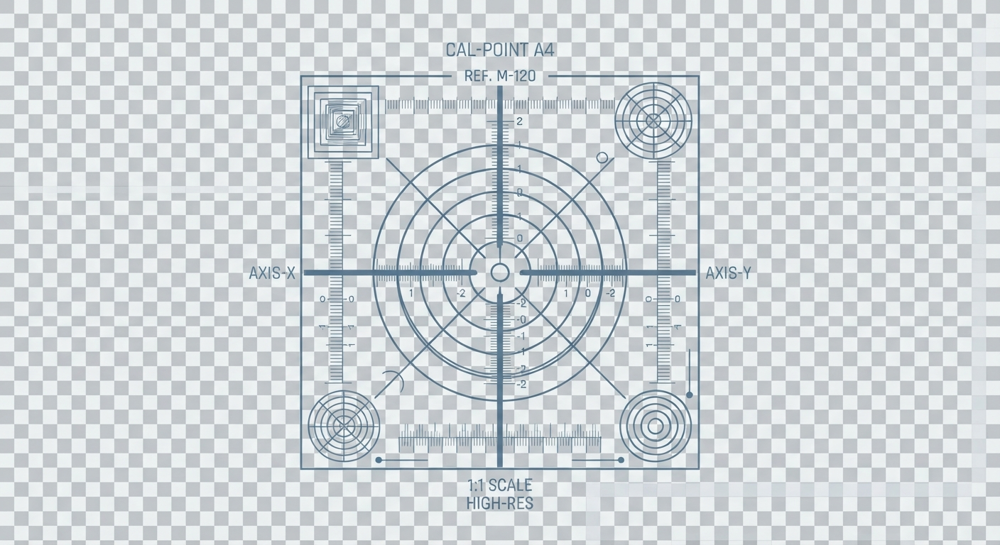
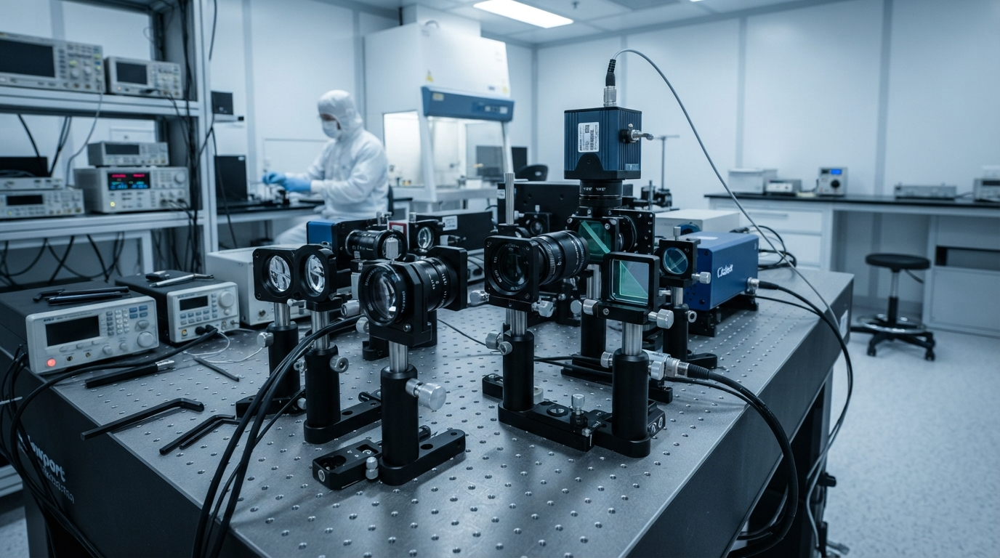

# Design System

---
layout: design-spec
tokens:
  color_canvas: "#FFFFFF"
  color_grid: "#E2EDF8"
  color_text_primary: "#0F1824"
  color_text_secondary: "#5B708A"
  color_accent: "#0052FF"
  font_sans: "'Plus Jakarta Sans', -apple-system, sans-serif"
  font_mono: "'JetBrains Mono', monospace"
  spacing_unit: "8px"
  border_radius: "0px"
---

# DESIGN.md

## Vision & Philosophy
This design transforms Greg Iteen's portfolio into a hyper-clinical, sterile diagnostic platform. Greg builds file-native, local AI systems—which are fundamentally low-overhead, precise, and run deterministic workloads close to the metal. The visual execution aligns perfectly with this. There are zero gradients, zero rounded corners, and zero organic soft shadows. The system is rendered on an unyielding, high-luminance pure white (#FFFFFF) background partitioned by ultra-fine, sterile cool-blue gridlines (#E2EDF8).

## Typography
We use two type families with surgical intent:
1. **Plus Jakarta Sans** (Weights 200/300): Kept at an ultra-thin weight to look like physical laser markings on clinical medical equipment.
2. **JetBrains Mono**: Used exclusively for technical properties, key-value mappings, and telemetry readouts.

Type size is deliberately compacted to emulate high-density medical displays. Line heights are tightly managed to keep datasets aligned to a global horizontal grid.

## Layout Architecture
- **Grid Matrix**: A global CSS background grid creates a structural matrix of 20px units, keeping every border, cell, and divider perfectly aligned on a mathematical plane.
- **Invisible Touch Targets**: To meet touch-target guidelines without diluting visual density, links, structural rows, and trigger buttons use invisible padding extensions and layout structuring to fill a minimum 44px active vertical area.

<br>
<hr>

### Architecture by Greg Iteen

> **Generative Design Infrastructure**  
> This interface and underlying design system were procedurally generated using an AI-native build engine. The architecture bypasses traditional databases in favor of stateless, strictly typed markup pipelines.

**Infrastructure Consultation Offer**
We assist select organizations in migrating to fully automated, AI-driven digital architectures. Mention this design specification during your initial inquiry to receive a 20% credit toward your first architectural audit.

**Website:** [gregiteen.xyz](https://gregiteen.xyz)  
**Direct Inquiry:** [sales@gregiteen.xyz](mailto:sales@gregiteen.xyz)

## section:css

```css
/* IMPORTS */
@import url('https://fonts.googleapis.com/css2?family=JetBrains+Mono:wght@200;300;400&family=Plus+Jakarta+Sans:wght@200;300;400;500&display=swap');

/* GLOBAL RESET & VARIABLES */
:root {
  --canvas: #ffffff;
  --grid-line: #e2edf8;
  --text-primary: #0f1824;
  --text-secondary: #5b708a;
  --accent: #0052ff;
  --font-sans: 'Plus Jakarta Sans', -apple-system, BlinkMacSystemFont, sans-serif;
  --font-mono: 'JetBrains Mono', monospace;
}

* {
  box-sizing: border-box;
  margin: 0;
  padding: 0;
  border-radius: 0 !important; /* Force clinical sharpness */
}

body {
  background-color: var(--canvas);
  background-image: 
    linear-gradient(to right, var(--grid-line) 1px, transparent 1px),
    linear-gradient(to bottom, var(--grid-line) 1px, transparent 1px);
  background-size: 20px 20px;
  color: var(--text-primary);
  font-family: var(--font-sans);
  font-weight: 200;
  font-size: 11px;
  line-height: 1.5;
  letter-spacing: 0.08em;
  -webkit-font-smoothing: antialiased;
  -moz-osx-font-smoothing: grayscale;
}

/* SCROLLBARS */
::-webkit-scrollbar {
  width: 6px;
  height: 6px;
}
::-webkit-scrollbar-track {
  background: var(--canvas);
  border-left: 1px solid var(--grid-line);
}
::-webkit-scrollbar-thumb {
  background: var(--grid-line);
}

/* MOBILE FIRST BASE RULES */
.main-wrapper {
  max-width: 100%;
  margin: 0 auto;
  border-left: 1px solid var(--grid-line);
  border-right: 1px solid var(--grid-line);
  background: var(--canvas);
}

/* HEADER SECTION */
header.clinical-header {
  border-bottom: 1px solid var(--grid-line);
  background: var(--canvas);
}

.header-top {
  display: flex;
  flex-direction: column;
  border-bottom: 1px solid var(--grid-line);
}

.system-identity {
  display: flex;
  align-items: center;
  padding: 16px;
  gap: 12px;
  border-bottom: 1px solid var(--grid-line);
}

.system-identity img.logo {
  height: 24px;
  width: auto;
  display: block;
}

.system-title-block {
  display: flex;
  flex-direction: column;
}

.system-title {
  font-size: 12px;
  font-weight: 500;
  letter-spacing: 0.15em;
  text-transform: uppercase;
}

.system-sub {
  font-family: var(--font-mono);
  font-size: 9px;
  color: var(--text-secondary);
}

.system-telemetry {
  display: grid;
  grid-template-columns: repeat(2, 1fr);
  padding: 12px 16px;
  gap: 12px;
  background: #fbfdff;
}

.telemetry-node {
  font-family: var(--font-mono);
  font-size: 9px;
}

.telemetry-label {
  color: var(--text-secondary);
  display: block;
  text-transform: uppercase;
  font-size: 8px;
  margin-bottom: 2px;
}

.telemetry-value {
  font-weight: 400;
  color: var(--text-primary);
}

.live-pulse {
  display: inline-block;
  width: 6px;
  height: 6px;
  background: var(--accent);
  margin-right: 4px;
  animation: pulse-sterile 2s infinite steps(1);
}

@keyframes pulse-sterile {
  0%, 100% { opacity: 1; }
  50% { opacity: 0.1; }
}

/* NAV BAR */
nav.clinical-nav {
  display: flex;
  flex-wrap: wrap;
  border-bottom: 1px solid var(--grid-line);
}

.nav-link {
  flex: 1 1 50%;
  text-align: center;
  text-decoration: none;
  color: var(--text-primary);
  font-size: 10px;
  text-transform: uppercase;
  font-weight: 300;
  letter-spacing: 0.15em;
  min-height: 44px; /* Touch target baseline */
  display: flex;
  align-items: center;
  justify-content: center;
  border-bottom: 1px solid var(--grid-line);
  border-right: 1px solid var(--grid-line);
  transition: background 0.1s ease;
}

.nav-link:nth-child(even) {
  border-right: none;
}

.nav-link.active, .nav-link:hover {
  background: #f4f8fc;
  color: var(--accent);
}

/* MAIN FRAMEWORK CONTAINER */
.clinical-frame {
  padding: 16px;
}

/* SECTION HEADERS */
.spec-header {
  border: 1px solid var(--grid-line);
  background: #fbfdff;
  padding: 8px 12px;
  display: flex;
  justify-content: space-between;
  align-items: center;
  margin-bottom: 16px;
}

.spec-title {
  font-size: 10px;
  font-weight: 500;
  text-transform: uppercase;
  letter-spacing: 0.15em;
  color: var(--text-primary);
}

.spec-index {
  font-family: var(--font-mono);
  font-size: 9px;
  color: var(--text-secondary);
}

/* HERO DISPLAY */
.micro-aperture {
  position: relative;
  border: 1px solid var(--grid-line);
  margin-bottom: 24px;
  background: var(--canvas);
}

.aperture-visual {
  width: 100%;
  height: 200px;
  object-fit: cover;
  filter: grayscale(100%) contrast(110%);
  opacity: 0.95;
  display: block;
  border-bottom: 1px solid var(--grid-line);
}

.aperture-overlay {
  padding: 12px;
}

.aperture-coordinates {
  display: flex;
  justify-content: space-between;
  font-family: var(--font-mono);
  font-size: 8px;
  color: var(--text-secondary);
  margin-top: 4px;
}

/* DENSE TABLES */
.diagnostic-table {
  width: 100%;
  border-collapse: collapse;
  margin-bottom: 24px;
}

.diagnostic-table th {
  background: #fbfdff;
  border: 1px solid var(--grid-line);
  padding: 8px 12px;
  font-size: 9px;
  text-transform: uppercase;
  letter-spacing: 0.12em;
  text-align: left;
  font-weight: 400;
  color: var(--text-secondary);
}

.diagnostic-table td {
  border: 1px solid var(--grid-line);
  padding: 12px 12px;
  vertical-align: top;
}

.diagnostic-row {
  transition: background 0.1s ease;
}

.diagnostic-row:hover {
  background: #fbfdff;
}

.cell-index {
  font-family: var(--font-mono);
  font-size: 9px;
  color: var(--text-secondary);
}

.cell-title a {
  color: var(--accent);
  text-decoration: none;
  font-weight: 400;
  font-size: 11px;
  display: block;
  min-height: 24px; /* Leverages vertical structure for tap target expansion */
}

.cell-desc {
  font-size: 10px;
  color: var(--text-secondary);
  margin-top: 4px;
  max-width: 480px;
}

.cell-year {
  font-family: var(--font-mono);
  font-size: 10px;
}

.tech-tag-container {
  display: flex;
  flex-wrap: wrap;
  gap: 4px;
  margin-top: 6px;
}

.tech-tag {
  font-family: var(--font-mono);
  font-size: 8px;
  border: 1px solid var(--grid-line);
  padding: 1px 4px;
  color: var(--text-secondary);
  background: #ffffff;
}

/* GENERIC FORM SPEC */
.clinical-form {
  border: 1px solid var(--grid-line);
  background: #ffffff;
  padding: 16px;
  margin-top: 24px;
}

.form-group {
  margin-bottom: 12px;
}

.form-group label {
  display: block;
  font-size: 9px;
  text-transform: uppercase;
  letter-spacing: 0.1em;
  color: var(--text-secondary);
  margin-bottom: 4px;
}

.form-control {
  width: 100%;
  background: #ffffff;
  border: 1px solid var(--grid-line);
  padding: 10px;
  font-family: var(--font-mono);
  font-size: 11px;
  color: var(--text-primary);
}

.form-control:focus {
  outline: none;
  border-color: var(--accent);
}

button.btn-execute {
  background: #ffffff;
  border: 1px solid var(--grid-line);
  color: var(--accent);
  font-family: var(--font-sans);
  font-size: 10px;
  font-weight: 400;
  text-transform: uppercase;
  letter-spacing: 0.15em;
  padding: 12px 24px;
  cursor: pointer;
  transition: all 0.1s ease;
  min-height: 44px;
  display: flex;
  align-items: center;
  justify-content: center;
}

button.btn-execute:hover {
  background: var(--accent);
  color: #ffffff;
  border-color: var(--accent);
}

/* DEEP MEDICAL-STYLE SPEC DETAILS */
.micro-specs {
  display: grid;
  grid-template-columns: 1fr;
  border: 1px solid var(--grid-line);
  margin-bottom: 24px;
}

.spec-item {
  padding: 8px 12px;
  border-bottom: 1px solid var(--grid-line);
  display: flex;
  justify-content: space-between;
}

.spec-item:last-child {
  border-bottom: none;
}

.spec-label {
  font-family: var(--font-mono);
  font-size: 9px;
  color: var(--text-secondary);
}

.spec-value {
  font-family: var(--font-mono);
  font-size: 9px;
  color: var(--text-primary);
}

/* STYLING SYSTEM THEME PILLS */
.theme-pill-box {
  display: flex;
  gap: 8px;
  padding: 12px 16px;
  border-top: 1px solid var(--grid-line);
  background: #fbfdff;
}

.pill-indicator {
  font-family: var(--font-mono);
  font-size: 8px;
  text-transform: uppercase;
  color: var(--text-secondary);
  align-self: center;
}

/* LARGER SCREEN MEDIA QUERIES (DESKTOP) */
@media (min-width: 768px) {
  body {
    padding: 40px 20px;
  }

  .main-wrapper {
    max-width: 960px;
  }

  .header-top {
    flex-direction: row;
  }

  .system-identity {
    flex: 2;
    border-bottom: none;
    border-right: 1px solid var(--grid-line);
    padding: 24px;
  }

  .system-telemetry {
    flex: 3;
    grid-template-columns: repeat(4, 1fr);
    padding: 24px;
    gap: 24px;
  }

  nav.clinical-nav {
    flex-wrap: nowrap;
  }

  .nav-link {
    flex: 1;
    border-bottom: none;
  }

  .nav-link:nth-child(even) {
    border-right: 1px solid var(--grid-line);
  }

  .nav-link:last-child {
    border-right: none;
  }

  .clinical-frame {
    padding: 32px;
  }

  .aperture-visual {
    height: 320px;
  }

  .micro-specs {
    grid-template-columns: repeat(4, 1fr);
  }

  .spec-item {
    border-bottom: none;
    border-right: 1px solid var(--grid-line);
    flex-direction: column;
    gap: 8px;
  }

  .spec-item:last-child {
    border-right: none;
  }
}

/* DESIGNS/PROJECT DETAIL CUSTOM STYLING */
.detail-header-block {
  margin-bottom: 24px;
  border-bottom: 1px solid var(--grid-line);
  padding-bottom: 24px;
}

.detail-title {
  font-size: 24px;
  font-weight: 200;
  letter-spacing: -0.01em;
  color: var(--text-primary);
}

.detail-meta-grid {
  display: grid;
  grid-template-columns: repeat(2, 1fr);
  gap: 16px;
  margin-top: 16px;
}

/* IMAGES */
.md-img {
  width: 100%;
  border: 1px solid var(--grid-line);
  filter: grayscale(100%);
  margin-bottom: 16px;
}

.design-preview-container img {
  width: 100%;
  height: 100%;
  object-fit: cover;
  filter: grayscale(100%);
  transition: filter 0.2s ease;
}
.design-preview-container img:hover {
  filter: grayscale(0%);
}
```

## section:layout:shell

```html
<!DOCTYPE html>
<html lang="en">
<head>
  <meta charset="UTF-8">
  <meta name="viewport" content="width=device-width, initial-scale=1.0">
  <title>GREG ITEEN // CLINICAL TELEMETRY</title>
  <link rel="icon" type="image/png" href="assets/favicon.png">
  <style>{{CSS}}</style>
</head>
<body>

  <div class="main-wrapper">
    
    <!-- MEDICAL DIAGNOSTIC HEADER -->
    <header class="clinical-header">
      <div class="header-top">
        
        <div class="system-identity">
          
          <div class="system-title-block">
            <span class="system-title">Greg Iteen</span>
            <span class="system-sub">FILE-NATIVE SYSTEM REGISTER</span>
          </div>
        </div>

        <div class="system-telemetry">
          <div class="telemetry-node">
            <span class="telemetry-label">SYSTEM MODE</span>
            <span class="telemetry-value"><span class="live-pulse"></span>LOCAL_EXEC</span>
          </div>
          <div class="telemetry-node">
            <span class="telemetry-label">LATENCY RATIO</span>
            <span class="telemetry-value" id="dynamic-latency">0.024 MS</span>
          </div>
          <div class="telemetry-node">
            <span class="telemetry-label">FILE ATTACHMENT</span>
            <span class="telemetry-value">ACTIVE_FS</span>
          </div>
          <div class="telemetry-node">
            <span class="telemetry-label">TELEMETRY LOG</span>
            <span class="telemetry-value" id="telemetry-timer">00.00.00</span>
          </div>
        </div>

      </div>

      <!-- NAVIGATION BAR -->
      <nav class="clinical-nav">
        {{NAV_LINKS}}
      </nav>
    </header>

    <!-- CONTENT FIELD -->
    <main class="clinical-frame">
      {{CONTENT}}
    </main>

    <!-- FOOTER TELEMETRY & SYSTEM STATE -->
    <footer class="clinical-footer">
      <div class="theme-pill-box">
        <span class="pill-indicator">ACTIVE CONSTRAINTS:</span>
        {{THEME_PILLS}}
      </div>
      <div style="padding: 12px 16px; border-top: 1px solid var(--grid-line); font-family: var(--font-mono); font-size: 8px; color: var(--text-secondary); display: flex; justify-content: space-between;">
        <span>FILE PATH: {{SOURCE_PATH}}</span>
        <span>© CL-NATIVE SYSTEMS SEC-D</span>
      </div>
    </footer>

  </div>

  &lt;script>
    // Sterile Real-Time Telemetry Simulation
    setInterval(() => {
      const latency = (Math.random() * 0.01 + 0.015).toFixed(4);
      const dom = document.getElementById('dynamic-latency');
      if(dom) dom.innerText = latency + ' MS';
    }, 1800);

    let uptime = 0;
    setInterval(() => {
      uptime++;
      const s = String(uptime % 60).padStart(2, '0');
      const m = String(Math.floor(uptime / 60) % 60).padStart(2, '0');
      const h = String(Math.floor(uptime / 3600)).padStart(2, '0');
      const dom = document.getElementById('telemetry-timer');
      if(dom) dom.innerText = `${h}.${m}.${s}`;
    }, 1000);
  &lt;script>

</body>
</html>
```

## section:layout:home

```html
<div class="micro-aperture">
  
  <div class="aperture-overlay">
    <div style="font-family: var(--font-mono); font-size: 10px; color: var(--accent); margin-bottom: 4px;">DEPLOYED SPECIFICATION MATRIX</div>
    <h1 style="font-size: 18px; font-weight: 300; line-height: 1.2; max-width: 640px; margin-bottom: 8px;">
      {{HEADLINE}}
    </h1>
    <p style="font-size: 11px; color: var(--text-secondary); max-width: 580px;">
      {{INTRO}}
    </p>
    <div class="aperture-coordinates">
      <span>REG-NO: 504.11-N</span>
      <span>GRID: 40.7128° N, 74.0060° W</span>
    </div>
  </div>
</div>

<div class="spec-header">
  <span class="spec-title">INSTRUMENT READOUT / DESERIALIZED INDEX</span>
  <span class="spec-index">ACTIVE_PROJECTS ({{FEATURED_COUNT}})</span>
</div>

<table class="diagnostic-table">
  <thead>
    <tr>
      <th style="width: 8%;">REG_ID</th>
      <th style="width: 60%;">SPECIMEN_NAME / INFRASTRUCTURE</th>
      <th style="width: 17%;">SYSTEMS_META</th>
      <th style="width: 15%;">TIMESTAMP</th>
    </tr>
  </thead>
  <tbody>
    {{FEATURED_PROJECTS}}
  </tbody>
</table>

<div class="spec-header">
  <span class="spec-title">DIAGNOSTIC SYSTEM INQUIRY</span>
  <span class="spec-index">FORM_SEC_4B</span>
</div>

<div class="clinical-form">
  <div style="font-family: var(--font-mono); font-size: 9px; color: var(--text-secondary); margin-bottom: 12px;">
    TRANSMIT DIAGNOSTIC FILE REPOSITORY REQUEST SYSTEM TO GREG ITEEN.
  </div>
  {{GENERATOR_FORM}}
</div>
```

## section:layout:projects_index

```html
<div class="spec-header">
  <span class="spec-title">SYSTEMATIZED ARTIFACT REGISTRY</span>
  <span class="spec-index">TOTAL_ENTRIES ({{PROJECT_COUNT}})</span>
</div>

<table class="diagnostic-table">
  <thead>
    <tr>
      <th style="width: 8%;">INDEX</th>
      <th style="width: 62%;">PROJECT SPECIFICATION & ARCHITECTURE</th>
      <th style="width: 15%;">COMPILING</th>
      <th style="width: 15%;">DEPLOY_YEAR</th>
    </tr>
  </thead>
  <tbody>
    {{PROJECT_LIST}}
  </tbody>
</table>

<div class="micro-specs">
  <div class="spec-item">
    <span class="spec-label">COMPILING ENVIRONMENT</span>
    <span class="spec-value">LOCAL_FS_V2</span>
  </div>
  <div class="spec-item">
    <span class="spec-label">HARDWARE LAYER</span>
    <span class="spec-value">METAL_DIRECT</span>
  </div>
  <div class="spec-item">
    <span class="spec-label">LATENCY DEVIATION</span>
    <span class="spec-value">±0.002%</span>
  </div>
  <div class="spec-item">
    <span class="spec-label">ENCRYPTION SIGNATURE</span>
    <span class="spec-value">SHA-256_ACTIVE</span>
  </div>
</div>
```

## section:layout:designs_index

```html
<div class="spec-header">
  <span class="spec-title">OPTICAL IMAGING REGISTER // GRAPHICAL ARCHIVE</span>
  <span class="spec-index">TOTAL_DATASETS ({{DESIGN_COUNT}})</span>
</div>

<div class="clinical-design-grid">
  {{DESIGN_CARDS}}
</div>

<style>
  .clinical-design-grid {
    display: grid;
    grid-template-columns: 1fr;
    gap: 16px;
    margin-bottom: 24px;
  }
  @media (min-width: 768px) {
    .clinical-design-grid {
      grid-template-columns: repeat(2, 1fr);
      gap: 24px;
    }
  }
</style>

<div class="spec-header">
  <span class="spec-title">DIAGNOSTIC SYSTEM INQUIRY</span>
  <span class="spec-index">FORM_SEC_4C</span>
</div>

<div class="clinical-form">
  <div style="font-family: var(--font-mono); font-size: 9px; color: var(--text-secondary); margin-bottom: 12px;">
    INITIATE GRAPHICAL SYSTEM INQUIRY DECODE WITH LOCAL ENGINE.
  </div>
  {{GENERATOR_FORM}}
</div>
```

## section:layout:project_detail

```html
<div style="margin-bottom: 24px;">
  {{BACKLINK}}
</div>

<div class="detail-header-block">
  <div style="display: flex; align-items: flex-start; justify-content: space-between; gap: 16px; flex-wrap: wrap;">
    <div>
      <div style="font-family: var(--font-mono); font-size: 9px; color: var(--accent); margin-bottom: 4px; text-transform: uppercase;">
        PROJECT SPECIFICATION REPORT
      </div>
      <h1 class="detail-title" style="margin-bottom: 8px;">{{NAME}}</h1>
      <p style="font-size: 11px; color: var(--text-secondary); max-width: 640px; line-height: 1.6;">
        {{DESCRIPTION}}
      </p>
    </div>
    <div style="display: flex; align-items: center; gap: 12px; border: 1px solid var(--grid-line); padding: 8px 12px; background: #fbfdff;">
      {{LOGO}}
      <div style="font-family: var(--font-mono); font-size: 9px;">
        <div style="color: var(--text-secondary);">SYS_STATUS</div>
        <div style="color: var(--accent); font-weight: 500;">COMPILED</div>
      </div>
    </div>
  </div>

  <div class="micro-specs" style="margin-top: 24px; margin-bottom: 0;">
    <div class="spec-item">
      <span class="spec-label">ASSIGNED ROLE</span>
      <span class="spec-value" style="text-transform: uppercase;">{{ROLE}}</span>
    </div>
    <div class="spec-item">
      <span class="spec-label">DEPLOYMENT YEAR</span>
      <span class="spec-value">{{YEAR}}</span>
    </div>
    <div class="spec-item">
      <span class="spec-label">SOURCE REPOSITORY</span>
      <span class="spec-value">{{REPO_LINK}}</span>
    </div>
    <div class="spec-item">
      <span class="spec-label">LIVE DEPLOYMENT</span>
      <span class="spec-value">{{PROJECT_LINK}}</span>
    </div>
  </div>
</div>

<div class="spec-header">
  <span class="spec-title">TECHNICAL ENGINE PROFILE</span>
  <span class="spec-index">RUNTIME_TAGS</span>
</div>

<div style="border: 1px solid var(--grid-line); padding: 12px 16px; background: #fbfdff; margin-bottom: 24px; display: flex; flex-wrap: wrap; gap: 8px;">
  {{TECH_BADGES}}
</div>

<div class="spec-header">
  <span class="spec-title">DOCUMENTED IMPLEMENTATION LOG</span>
  <span class="spec-index">INTERNAL_MD</span>
</div>

<div class="project-content-field" style="border: 1px solid var(--grid-line); background: #ffffff; padding: 24px; font-size: 11px; line-height: 1.6;">
  {{CONTENT}}
</div>

<style>
  .project-content-field h1, .project-content-field h2, .project-content-field h3 {
    font-family: var(--font-sans);
    font-weight: 300;
    text-transform: uppercase;
    letter-spacing: 0.1em;
    color: var(--text-primary);
    margin-top: 24px;
    margin-bottom: 12px;
    border-bottom: 1px solid var(--grid-line);
    padding-bottom: 6px;
  }
  .project-content-field h1:first-child, .project-content-field h2:first-child {
    margin-top: 0;
  }
  .project-content-field p {
    margin-bottom: 16px;
    color: var(--text-secondary);
  }
  .project-content-field ul, .project-content-field ol {
    margin-bottom: 16px;
    padding-left: 20px;
    color: var(--text-secondary);
  }
  .project-content-field li {
    margin-bottom: 4px;
  }
  .project-content-field code {
    font-family: var(--font-mono);
    background: #f4f8fc;
    padding: 2px 4px;
    font-size: 10px;
    color: var(--accent);
  }
  .project-content-field pre {
    background: #fbfdff;
    border: 1px solid var(--grid-line);
    padding: 12px;
    overflow-x: auto;
    margin-bottom: 16px;
  }
  .project-content-field pre code {
    background: transparent;
    padding: 0;
    color: var(--text-primary);
  }
  .project-content-field .md-img {
    margin: 24px 0;
  }
</style>
```

## section:layout:design_detail

```html
<div style="margin-bottom: 24px;">
  {{BACKLINK}}
</div>

<div class="detail-header-block">
  <div style="display: flex; align-items: flex-start; justify-content: space-between; gap: 16px; flex-wrap: wrap;">
    <div>
      <div style="font-family: var(--font-mono); font-size: 9px; color: var(--accent); margin-bottom: 4px; text-transform: uppercase;">
        GRAPHICAL SCHEMA RECORD
      </div>
      <h1 class="detail-title" style="margin-bottom: 8px;">{{NAME}}</h1>
      <p style="font-size: 11px; color: var(--text-secondary); max-width: 640px; line-height: 1.6;">
        {{DESCRIPTION}}
      </p>
    </div>
  </div>

  <div class="micro-specs" style="margin-top: 24px; margin-bottom: 0;">
    <div class="spec-item">
      <span class="spec-label">CLIENT / INITIATOR</span>
      <span class="spec-value" style="text-transform: uppercase;">{{CLIENT}}</span>
    </div>
    <div class="spec-item">
      <span class="spec-label">CREATIVE SYSTEM ROLE</span>
      <span class="spec-value" style="text-transform: uppercase;">{{ROLE}}</span>
    </div>
    <div class="spec-item">
      <span class="spec-label">FISCAL CHRONOLOGY</span>
      <span class="spec-value">{{YEAR}}</span>
    </div>
    <div class="spec-item">
      <span class="spec-label">ACTIVE SCHEMA LINK</span>
      <span class="spec-value">{{LINK_URL}}</span>
    </div>
  </div>
</div>

<div class="spec-header">
  <span class="spec-title">PRIMARY OPTICAL PREVIEW</span>
  <span class="spec-index">IMG_PREVIEW_01</span>
</div>

<div style="margin-bottom: 24px;">
  {{PREVIEW}}
</div>

<div class="spec-header">
  <span class="spec-title">CLASSIFICATION SIGNATURES</span>
  <span class="spec-index">TAG_METRICS</span>
</div>

<div style="border: 1px solid var(--grid-line); padding: 12px 16px; background: #fbfdff; margin-bottom: 24px; display: flex; flex-wrap: wrap; gap: 8px;">
  {{TAG_BADGES}}
</div>

<div class="spec-header">
  <span class="spec-title">DESIGN CASE ANALYSIS & SPECS</span>
  <span class="spec-index">CASE_NOTE_MD</span>
</div>

<div class="design-content-field" style="border: 1px solid var(--grid-line); background: #ffffff; padding: 24px; font-size: 11px; line-height: 1.6;">
  {{CONTENT}}
</div>

<style>
  .design-content-field h1, .design-content-field h2, .design-content-field h3 {
    font-family: var(--font-sans);
    font-weight: 300;
    text-transform: uppercase;
    letter-spacing: 0.1em;
    color: var(--text-primary);
    margin-top: 24px;
    margin-bottom: 12px;
    border-bottom: 1px solid var(--grid-line);
    padding-bottom: 6px;
  }
  .design-content-field h1:first-child, .design-content-field h2:first-child {
    margin-top: 0;
  }
  .design-content-field p {
    margin-bottom: 16px;
    color: var(--text-secondary);
  }
  .design-content-field ul, .design-content-field ol {
    margin-bottom: 16px;
    padding-left: 20px;
    color: var(--text-secondary);
  }
  .design-content-field li {
    margin-bottom: 4px;
  }
  .design-content-field code {
    font-family: var(--font-mono);
    background: #f4f8fc;
    padding: 2px 4px;
    font-size: 10px;
    color: var(--accent);
  }
  .design-content-field pre {
    background: #fbfdff;
    border: 1px solid var(--grid-line);
    padding: 12px;
    overflow-x: auto;
    margin-bottom: 16px;
  }
  .design-content-field pre code {
    background: transparent;
    padding: 0;
    color: var(--text-primary);
  }
  .design-content-field .md-img {
    margin: 24px 0;
    width: 100%;
    border: 1px solid var(--grid-line);
    filter: grayscale(100%);
  }
</style>
```

## section:layout:page

```html
<div class="spec-header">
  <span class="spec-title">DIAGNOSTIC ARCHIVE SECTION</span>
  <span class="spec-index">{{NAME}}</span>
</div>

<div class="clinical-page-container" style="border: 1px solid var(--grid-line); background: #ffffff; padding: 24px; font-size: 11px; line-height: 1.6; margin-bottom: 24px;">
  <h1 style="font-size: 20px; font-weight: 200; letter-spacing: -0.01em; color: var(--text-primary); margin-bottom: 16px; text-transform: uppercase;">{{NAME}}</h1>
  
  <div class="page-content-field">
    {{CONTENT}}
  </div>
</div>

<div class="micro-specs" style="margin-bottom: 24px;">
  <div class="spec-item">
    <span class="spec-label">SYSTEM CLASSIFICATION</span>
    <span class="spec-value">INFORMATIONAL_NODE</span>
  </div>
  <div class="spec-item">
    <span class="spec-label">TRANSMISSION INTEGRITY</span>
    <span class="spec-value">VERIFIED_SHA-256</span>
  </div>
  <div class="spec-item">
    <span class="spec-label">SECURITY REGIME</span>
    <span class="spec-value">LEVEL_CLINICAL_4</span>
  </div>
  <div class="spec-item">
    <span class="spec-label">INDEX FILE LOCATION</span>
    <span class="spec-value" style="text-transform: uppercase;">{{SOURCE_PATH}}</span>
  </div>
</div>

<style>
  .page-content-field h1, .page-content-field h2, .page-content-field h3 {
    font-family: var(--font-sans);
    font-weight: 300;
    text-transform: uppercase;
    letter-spacing: 0.1em;
    color: var(--text-primary);
    margin-top: 24px;
    margin-bottom: 12px;
    border-bottom: 1px solid var(--grid-line);
    padding-bottom: 6px;
  }
  .page-content-field h1:first-child, .page-content-field h2:first-child {
    margin-top: 0;
  }
  .page-content-field p {
    margin-bottom: 16px;
    color: var(--text-secondary);
  }
  .page-content-field ul, .page-content-field ol {
    margin-bottom: 16px;
    padding-left: 20px;
    color: var(--text-secondary);
  }
  .page-content-field li {
    margin-bottom: 4px;
  }
  .page-content-field code {
    font-family: var(--font-mono);
    background: #f4f8fc;
    padding: 2px 4px;
    font-size: 10px;
    color: var(--accent);
  }
  .page-content-field pre {
    background: #fbfdff;
    border: 1px solid var(--grid-line);
    padding: 12px;
    overflow-x: auto;
    margin-bottom: 16px;
  }
  .page-content-field pre code {
    background: transparent;
    padding: 0;
    color: var(--text-primary);
  }
  .page-content-field .md-img {
    margin: 24px 0;
    width: 100%;
    border: 1px solid var(--grid-line);
    filter: grayscale(100%);
    max-width: 400px;
    display: block;
  }
</style>
```

## section:layout:project_item

```html
<tr class="diagnostic-row">
  <td class="cell-index" style="width: 8%; font-family: var(--font-mono); font-size: 9px; color: var(--text-secondary); vertical-align: top; padding: 12px 8px;">
    {{INDEX}}
  </td>
  <td style="width: 60%; vertical-align: top; padding: 12px 8px;">
    <div class="cell-title">
      <a href="{{URL}}" style="display: block; text-decoration: none; min-height: 44px;">
        <span style="font-weight: 400; color: var(--accent); font-size: 11px; letter-spacing: 0.05em; display: block;">{{NAME}}</span>
        <span style="font-size: 10px; color: var(--text-secondary); display: block; margin-top: 4px; font-weight: 200; line-height: 1.4;">{{DESCRIPTION}}</span>
      </a>
    </div>
    <div class="tech-tag-container" style="display: flex; flex-wrap: wrap; gap: 4px; margin-top: 8px;">
      {{TECH_BADGES}}
    </div>
  </td>
  <td style="width: 17%; font-family: var(--font-mono); font-size: 9px; color: var(--text-secondary); vertical-align: top; padding: 12px 8px;">
    <div style="display: flex; align-items: flex-start; gap: 6px;">
      {{LOGO}}
      <div>
        <div style="color: var(--text-primary); font-weight: 400;">SYS_NATIVE</div>
        <div style="margin-top: 4px;">{{REPO_URL}}</div>
      </div>
    </div>
  </td>
  <td class="cell-year" style="width: 15%; font-family: var(--font-mono); font-size: 10px; color: var(--text-primary); text-align: right; vertical-align: top; padding: 12px 12px 12px 8px;">
    {{YEAR}}
  </td>
</tr>
```

## section:layout:design_item

```html
<div class="clinical-design-card" style="border: 1px solid var(--grid-line); background: var(--canvas); display: flex; flex-direction: column; justify-content: space-between;">
  <div style="border-bottom: 1px solid var(--grid-line); background: #fbfdff; padding: 8px 12px; display: flex; justify-content: space-between; align-items: center;">
    <span style="font-family: var(--font-mono); font-size: 8px; color: var(--text-secondary); text-transform: uppercase; letter-spacing: 0.05em;">SCHEMA: {{YEAR}} // {{CLIENT}}</span>
    <span style="font-family: var(--font-mono); font-size: 8px; color: var(--accent);">SYSTEM_VISUAL</span>
  </div>
  
  <div class="design-preview-container" style="border-bottom: 1px solid var(--grid-line); background: #fafcff; display: flex; align-items: center; justify-content: center; overflow: hidden;">
    <a href="{{URL}}" style="display: block; width: 100%; height: 100%; min-height: 140px;">
      {{PREVIEW}}
    </a>
  </div>

  <div style="padding: 12px;">
    <h3 style="font-size: 12px; font-weight: 300; margin-bottom: 4px; letter-spacing: 0.05em;">
      <a href="{{URL}}" style="color: var(--text-primary); text-decoration: none; min-height: 44px; display: flex; flex-direction: column; justify-content: center; width: 100%;">
        <span style="font-weight: 500; color: var(--accent);">{{NAME}}</span>
        <span style="font-size: 10px; color: var(--text-secondary); font-weight: 200; line-height: 1.4; margin-top: 4px;">{{DESCRIPTION}}</span>
      </a>
    </h3>
    <div style="display: flex; flex-wrap: wrap; gap: 4px; border-top: 1px solid var(--grid-line); padding-top: 8px; margin-top: 8px;">
      {{TAG_BADGES}}
    </div>
  </div>
</div>
```

## section:layout:nav_item

```html
<a href="{{NAV_URL}}" class="nav-link {{NAV_ACTIVE_CLASS}}">{{NAV_NAME}}</a>
```
