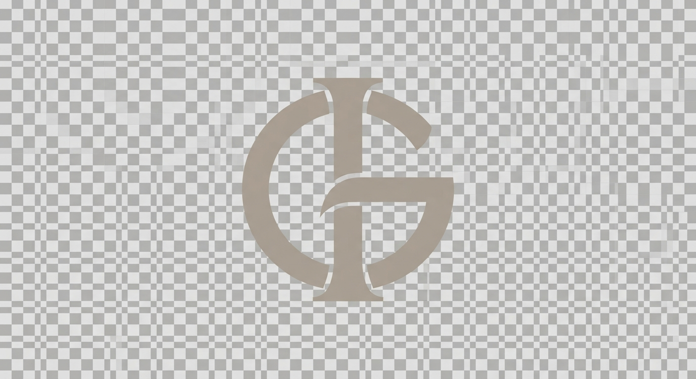

# Design System

---
layout: specifications
metadata:
  author: Design Lead
  client: Greg Iteen
  studio: Atelier Archival
tokens:
  colors:
    background: "#FAF9F6"
    surface: "#F4F1EA"
    border: "#E5DFD3"
    text_primary: "#1C1B19"
    text_secondary: "#6B665F"
    accent: "#8C7E6C"
  typography:
    serif_display: "'Cormorant Garamond', 'Didot', 'Georgia', serif"
    sans_interface: "'Helvetica Neue', -apple-system, sans-serif"
    mono_technical: "'Courier New', Courier, monospace"
  spacing:
    scale: "4px, 8px, 16px, 24px, 32px, 64px, 128px"
  border_radius:
    sharp: "0px"
    button: "2px"
---

# Design Philosophy

This system recasts high-end, file-native computing as an act of timeless architectural design. Rejecting standard tech-bro layouts, high-energy neon indicators, and dark cyber-slop, the visual framework leverages luxury, high-fashion editorial codes: spacious warm alabaster frames, delicate hairlines, and towering serif display typography. 

## Core Principles

1. **Austere Materiality**: The interface feels like a printed monograph. High contrast is avoided in favor of subtle shifts in warm greys, taupe, and deep charcoal.
2. **The Aesthetic Risk**: Treating highly complex, raw file-native AI architecture with the extreme elegance of a Parisian fashion house. We bring an offline, tactile prestige to file-based operations.
3. **Precision Framing**: Instead of grids of glowing boxes, information is arranged in structural columns with explicit, whisper-thin borders and generous asymmetrical breathing room.
4. **Typographic Decorum**: Titles are large but set in light, elegant serifs. Interface labels are set in tiny, wide-spaced mono-serif or clean sans, offering an intellectual, archival layout.

<br>
<hr>

### Architecture by Greg Iteen

> **Generative Design Infrastructure**  
> This interface and underlying design system were procedurally generated using an AI-native build engine. The architecture bypasses traditional databases in favor of stateless, strictly typed markup pipelines.

**Infrastructure Consultation Offer**
We assist select organizations in migrating to fully automated, AI-driven digital architectures. Mention this design specification during your initial inquiry to receive a 20% credit toward your first architectural audit.

**Website:** [gregiteen.xyz](https://gregiteen.xyz)  
**Direct Inquiry:** [sales@gregiteen.xyz](mailto:sales@gregiteen.xyz)

## section:css

```css
/* Google Fonts Import */
@import url('https://fonts.googleapis.com/css2?family=Cormorant+Garamond:ital,wght@0,300;0,400;0,500;1,300;1,400&display=swap');

/* Base Custom Tokens */
:root {
  --color-bg: #FAF9F6;
  --color-surface: #F4F1EA;
  --color-border: #E5DFD3;
  --color-text-primary: #1C1B19;
  --color-text-secondary: #6B665F;
  --color-accent: #8C7E6C;
  
  --font-serif: 'Cormorant Garamond', 'Didot', 'Georgia', serif;
  --font-sans: 'Helvetica Neue', -apple-system, BlinkMacSystemFont, sans-serif;
  --font-mono: 'Courier New', Courier, monospace;

  --transition-smooth: all 0.5s cubic-bezier(0.16, 1, 0.3, 1);
  --site-width: 1200px;
}

/* Mobile-First Reset & Core Layout */
* {
  box-sizing: border-box;
  margin: 0;
  padding: 0;
}

body {
  background-color: var(--color-bg);
  color: var(--color-text-primary);
  font-family: var(--font-sans);
  font-size: 15px;
  line-height: 1.6;
  -webkit-font-smoothing: antialiased;
  -moz-osx-font-smoothing: grayscale;
}

/* Interactive Targets (Minimum 44px for touch optimization) */
a, button, select, input, textarea {
  color: inherit;
  text-decoration: none;
  min-height: 44px;
  min-width: 44px;
  display: inline-flex;
  align-items: center;
  transition: var(--transition-smooth);
}

/* Layout Wrapper */
.container {
  width: 100%;
  max-width: var(--site-width);
  margin: 0 auto;
  padding: 24px;
}

/* Header & Branding */
header.site-header {
  border-bottom: 1px solid var(--color-border);
  padding: 32px 0;
}

.header-inner {
  display: flex;
  flex-direction: column;
  align-items: flex-start;
  gap: 24px;
}

.logo-wrap {
  display: inline-flex;
  align-items: center;
}

.logo-wrap img {
  height: 44px;
  width: auto;
  display: block;
  filter: grayscale(1) contrast(1.1);
}

nav.main-nav {
  display: flex;
  flex-wrap: wrap;
  gap: 24px;
}

nav.main-nav a {
  font-family: var(--font-sans);
  font-size: 11px;
  font-weight: 500;
  letter-spacing: 0.2em;
  text-transform: uppercase;
  color: var(--color-text-secondary);
  border-bottom: 1px solid transparent;
  padding: 4px 0;
}

nav.main-nav a:hover, 
nav.main-nav a.active {
  color: var(--color-text-primary);
  border-bottom-color: var(--color-accent);
}

/* Typographical Treatments */
h1, h2, h3, h4 {
  font-family: var(--font-serif);
  font-weight: 300;
  line-height: 1.15;
  letter-spacing: -0.01em;
}

.hero-headline {
  font-size: 2.8rem;
  margin-top: 40px;
  margin-bottom: 24px;
  font-weight: 300;
  line-height: 1.1;
}

.hero-tagline {
  font-family: var(--font-mono);
  font-size: 11px;
  letter-spacing: 0.15em;
  text-transform: uppercase;
  color: var(--color-accent);
  margin-bottom: 16px;
}

.editorial-intro {
  font-family: var(--font-serif);
  font-size: 1.35rem;
  font-style: italic;
  color: var(--color-text-secondary);
  max-width: 680px;
  margin-bottom: 48px;
  line-height: 1.5;
}

/* Featured Banner Asset */
.hero-banner {
  width: 100%;
  height: 300px;
  background-size: cover;
  background-position: center;
  border: 1px solid var(--color-border);
  margin-bottom: 64px;
}

/* Layout Columns */
.grid-layout {
  display: grid;
  grid-template-columns: 1fr;
  gap: 32px;
}

/* Project Display Cards */
.project-card {
  border: 1px solid var(--color-border);
  background-color: var(--color-surface);
  padding: 32px;
  transition: var(--transition-smooth);
  display: flex;
  flex-direction: column;
  justify-content: space-between;
}

.project-card:hover {
  border-color: var(--color-accent);
  background-color: var(--color-bg);
  transform: translateY(-2px);
}

.project-card .project-meta {
  font-family: var(--font-mono);
  font-size: 10px;
  letter-spacing: 0.1em;
  text-transform: uppercase;
  color: var(--color-accent);
  margin-bottom: 16px;
  display: block;
}

.project-card h3 {
  font-size: 1.8rem;
  margin-bottom: 12px;
}

.project-card p {
  font-size: 14px;
  color: var(--color-text-secondary);
  margin-bottom: 24px;
  max-width: 480px;
}

.project-card .project-link {
  font-family: var(--font-sans);
  font-size: 11px;
  font-weight: 600;
  letter-spacing: 0.1em;
  text-transform: uppercase;
  border-bottom: 1px solid var(--color-text-primary);
  padding-bottom: 4px;
  width: fit-content;
}

/* Badge Architecture */
.tech-badge {
  font-family: var(--font-mono);
  font-size: 9px;
  letter-spacing: 0.05em;
  text-transform: uppercase;
  padding: 4px 10px;
  background-color: var(--color-bg);
  border: 1px solid var(--color-border);
  color: var(--color-text-secondary);
  border-radius: 2px;
}

/* Form elements - Premium styling */
.contact-section {
  border-top: 1px solid var(--color-border);
  padding-top: 64px;
  margin-top: 80px;
}

.form-group {
  margin-bottom: 32px;
}

.form-group label {
  display: block;
  font-family: var(--font-mono);
  font-size: 11px;
  letter-spacing: 0.1em;
  text-transform: uppercase;
  margin-bottom: 12px;
  color: var(--color-text-secondary);
}

.form-input {
  width: 100%;
  border: none;
  border-bottom: 1px solid var(--color-border);
  background-color: transparent;
  padding: 12px 0;
  font-family: var(--font-serif);
  font-size: 1.25rem;
  outline: none;
  color: var(--color-text-primary);
  transition: var(--transition-smooth);
}

.form-input:focus {
  border-bottom-color: var(--color-accent);
}

.btn-primary {
  background-color: var(--color-text-primary);
  color: var(--color-bg);
  border: none;
  padding: 0 32px;
  font-family: var(--font-sans);
  font-size: 11px;
  letter-spacing: 0.2em;
  text-transform: uppercase;
  cursor: pointer;
  transition: var(--transition-smooth);
  height: 48px;
  display: inline-flex;
  align-items: center;
  justify-content: center;
}

.btn-primary:hover {
  background-color: var(--color-accent);
  color: var(--color-bg);
}

/* Footer */
.site-footer {
  border-top: 1px solid var(--color-border);
  margin-top: 120px;
  padding: 64px 0;
  text-align: center;
  font-family: var(--font-mono);
  font-size: 10px;
  letter-spacing: 0.15em;
  text-transform: uppercase;
  color: var(--color-text-secondary);
}

/* Media Queries for Tablet/Desktop scale (strictly min-width) */
@media (min-width: 768px) {
  .header-inner {
    flex-direction: row;
    justify-content: space-between;
    align-items: center;
  }

  .hero-headline {
    font-size: 4.2rem;
  }

  .grid-layout {
    grid-template-columns: repeat(2, 1fr);
  }

  .hero-banner {
    height: 440px;
  }
}

@media (min-width: 1024px) {
  .hero-headline {
    font-size: 5rem;
  }

  .grid-layout {
    grid-template-columns: repeat(2, 1fr);
    gap: 48px;
  }
}
```

## section:layout:home

```html
<!DOCTYPE html>
<html lang="en">
<head>
  <meta charset="UTF-8">
  <meta name="viewport" content="width=device-width, initial-scale=1.0">
  <title>Greg Iteen — High-Fidelity File-Native Systems</title>
  <link rel="icon" href="assets/favicon.png" type="image/png">
  <style>{{CSS}}</style>
</head>
<body>

  <div class="container">
    <header class="site-header">
      <div class="header-inner">
        <a href="/" class="logo-wrap">
          
        </a>
        <nav class="main-nav">
          <a href="/" class="active">Overview</a>
          <a href="/projects">Systems Index</a>
          <a href="/designs">Design Works</a>
          <a href="/about">About</a>
          <a href="/contact">Inquiries</a>
        </nav>
      </div>
    </header>

    <main>
      <section class="hero-section">
        <p class="hero-tagline">{{TAGLINE}}</p>
        <h1 class="hero-headline">{{HEADLINE}}</h1>
        <p class="editorial-intro">{{INTRO}}</p>
        
        <div class="hero-banner" style="background-image: url('assets/hero.jpg');"></div>
      </section>

      <section class="portfolio-preview">
        <h2 style="font-size: 2.2rem; margin-bottom: 32px; font-family: var(--font-serif); font-weight: 300;">Selected Systems & Engines</h2>
        <div class="grid-layout">
          {{FEATURED_PROJECTS}}
        </div>
      </section>

      <section class="contact-section">
        <h2 style="font-size: 2.2rem; margin-bottom: 16px; font-family: var(--font-serif); font-weight: 300;">Architectural Inquiries</h2>
        <p style="max-width: 520px; color: var(--color-text-secondary); margin-bottom: 40px; font-size: 14px; line-height: 1.7;">
          Initiate a technical consultation for high-performance offline architectures, private systems, and custom layouts.
        </p>
        {{GENERATOR_FORM}}
      </section>
    </main>

    <footer class="site-footer">
      <p>&copy; Greg Iteen. All technical protocols archived in perpetuity.</p>
    </footer>
  </div>

</body>
</html>
```

## section:layout:projects_index

```html
<!DOCTYPE html>
<html lang="en">
<head>
  <meta charset="UTF-8">
  <meta name="viewport" content="width=device-width, initial-scale=1.0">
  <title>Systems Portfolio — Greg Iteen</title>
  <link rel="icon" href="assets/favicon.png" type="image/png">
  <style>{{CSS}}</style>
</head>
<body>

  <div class="container">
    <header class="site-header">
      <div class="header-inner">
        <a href="/" class="logo-wrap">
          
        </a>
        <nav class="main-nav">
          <a href="/">Overview</a>
          <a href="/projects" class="active">Systems Index</a>
          <a href="/designs">Design Works</a>
          <a href="/about">About</a>
          <a href="/contact">Inquiries</a>
        </nav>
      </div>
    </header>

    <main style="margin-top: 48px;">
      <header style="margin-bottom: 56px; border-bottom: 1px solid var(--color-border); padding-bottom: 32px;">
        <p style="font-family: var(--font-mono); font-size: 11px; letter-spacing: 0.15em; text-transform: uppercase; color: var(--color-accent); margin-bottom: 8px;">Archival Portfolio — {{PROJECT_COUNT}} Projects</p>
        <h1 style="font-size: 3.5rem; font-family: var(--font-serif); font-weight: 300; line-height: 1.1;">Private Local Intelligence & Frameworks</h1>
      </header>

      <div class="grid-layout">
        {{PROJECT_LIST}}
      </div>
    </main>

    <footer class="site-footer">
      <p>&copy; Greg Iteen. All technical protocols archived in perpetuity.</p>
    </footer>
  </div>

</body>
</html>
```

## section:layout:designs_index

```html
<!DOCTYPE html>
<html lang="en">
<head>
  <meta charset="UTF-8">
  <meta name="viewport" content="width=device-width, initial-scale=1.0">
  <title>Aesthetic Specifications & Works — Greg Iteen</title>
  <link rel="icon" href="assets/favicon.png" type="image/png">
  <style>
    {{CSS}}
    
    .design-grid {
      display: grid;
      grid-template-columns: 1fr;
      gap: 48px;
      margin-top: 40px;
    }
    
    @media (min-width: 768px) {
      .design-grid {
        grid-template-columns: repeat(2, 1fr);
      }
    }
    
    @media (min-width: 1024px) {
      .design-grid {
        grid-template-columns: repeat(3, 1fr);
        gap: 56px;
      }
    }

    .editorial-header {
      padding: 64px 0 40px 0;
      border-bottom: 1px solid var(--color-border);
    }

    .aesthetic-spec-meta {
      font-family: var(--font-mono); 
      font-size: 11px; 
      letter-spacing: 0.2em; 
      text-transform: uppercase; 
      color: var(--color-accent);
      margin-bottom: 16px;
    }

    .aesthetic-title {
      font-family: var(--font-serif);
      font-size: 3.5rem;
      font-weight: 300;
      line-height: 1.1;
      color: var(--color-text-primary);
    }

    .generation-box {
      background: var(--color-surface);
      border: 1px solid var(--color-border);
      padding: 40px;
      margin-top: 80px;
    }
  </style>
</head>
<body>

  <div class="container">
    <header class="site-header">
      <div class="header-inner">
        <a href="/" class="logo-wrap">
          
        </a>
        <nav class="main-nav">
          <a href="/">Overview</a>
          <a href="/projects">Systems Index</a>
          <a href="/designs" class="active">Design Works</a>
          <a href="/about">About</a>
          <a href="/contact">Inquiries</a>
        </nav>
      </div>
    </header>

    <main>
      <section class="editorial-header">
        <p class="aesthetic-spec-meta">System Architecture Maps — Catalog [{{DESIGN_COUNT}}]</p>
        <h1 class="aesthetic-title">System Ergonomics & Spatial Layouts</h1>
        <p style="max-width: 620px; margin-top: 24px; color: var(--color-text-secondary); font-size: 15px; line-height: 1.7;">
          An exploration of minimal, local visual systems. Each blueprint prioritizes tactical constraints, absolute typographic performance, and file-native structure over contemporary transient aesthetics.
        </p>
      </section>

      <section class="design-grid">
        {{DESIGN_CARDS}}
      </section>

      <section class="generation-box">
        <h2 style="font-family: var(--font-serif); font-size: 1.8rem; font-weight: 300; margin-bottom: 16px;">Custom Theme Compiler</h2>
        <p style="color: var(--color-text-secondary); max-width: 600px; margin-bottom: 32px; font-size: 14px;">
          Generate technical specifications and visual templates customized to precise archival requirements.
        </p>
        {{GENERATOR_FORM}}
      </section>
    </main>

    <footer class="site-footer">
      <p>&copy; Greg Iteen. All technical protocols archived in perpetuity.</p>
    </footer>
  </div>

</body>
</html>
```

## section:layout:project_detail

```html
<!DOCTYPE html>
<html lang="en">
<head>
  <meta charset="UTF-8">
  <meta name="viewport" content="width=device-width, initial-scale=1.0">
  <title>{{NAME}} — Greg Iteen Specification</title>
  <link rel="icon" href="assets/favicon.png" type="image/png">
  <style>
    {{CSS}}
    
    .detail-layout {
      display: grid;
      grid-template-columns: 1fr;
      gap: 48px;
      margin-top: 48px;
    }
    
    @media (min-width: 768px) {
      .detail-layout {
        grid-template-columns: 280px 1fr;
        gap: 64px;
      }
    }

    .meta-panel {
      border-top: 1px solid var(--color-border);
      padding-top: 32px;
    }

    @media (min-width: 768px) {
      .meta-panel {
        border-top: none;
        border-right: 1px solid var(--color-border);
        padding-right: 32px;
        padding-top: 0;
      }
    }

    .meta-group {
      margin-bottom: 32px;
    }

    .meta-label {
      font-family: var(--font-mono);
      font-size: 10px;
      letter-spacing: 0.15em;
      text-transform: uppercase;
      color: var(--color-accent);
      margin-bottom: 10px;
    }

    .meta-value {
      font-size: 14px;
      color: var(--color-text-primary);
      line-height: 1.5;
    }

    .system-content {
      font-family: var(--font-sans);
      font-size: 15px;
      line-height: 1.8;
      color: var(--color-text-primary);
    }

    .system-content h1, 
    .system-content h2,
    .system-content h3 {
      font-family: var(--font-serif);
      font-weight: 300;
      margin-top: 40px;
      margin-bottom: 16px;
    }

    .system-content h2 {
      font-size: 2rem;
      border-bottom: 1px solid var(--color-border);
      padding-bottom: 12px;
    }

    .system-content p {
      margin-bottom: 24px;
      color: var(--color-text-secondary);
    }

    .system-content pre {
      background: var(--color-surface);
      border: 1px solid var(--color-border);
      padding: 24px;
      overflow-x: auto;
      font-family: var(--font-mono);
      font-size: 13px;
      margin-bottom: 24px;
      color: var(--color-text-primary);
    }

    .detail-back-link {
      display: inline-flex;
      align-items: center;
      font-family: var(--font-mono);
      font-size: 11px;
      letter-spacing: 0.15em;
      text-transform: uppercase;
      color: var(--color-accent);
      border-bottom: 1px solid transparent;
      height: 44px;
    }

    .detail-back-link:hover {
      color: var(--color-text-primary);
      border-bottom-color: var(--color-accent);
    }

    .detail-header-wrapper {
      border-bottom: 1px solid var(--color-border);
      padding-bottom: 32px;
      margin-bottom: 32px;
    }

    .action-button {
      display: inline-flex;
      align-items: center;
      justify-content: center;
      border: 1px solid var(--color-text-primary);
      background-color: transparent;
      color: var(--color-text-primary);
      padding: 0 24px;
      font-family: var(--font-sans);
      font-size: 11px;
      letter-spacing: 0.1em;
      text-transform: uppercase;
      transition: var(--transition-smooth);
      height: 44px;
      width: 100%;
    }

    .action-button:hover {
      background-color: var(--color-text-primary);
      color: var(--color-bg);
    }
  </style>
</head>
<body>

  <div class="container">
    <header class="site-header">
      <div class="header-inner">
        <a href="/" class="logo-wrap">
          
        </a>
        <nav class="main-nav">
          <a href="/">Overview</a>
          <a href="/projects" class="active">Systems Index</a>
          <a href="/designs">Design Works</a>
          <a href="/about">About</a>
          <a href="/contact">Inquiries</a>
        </nav>
      </div>
    </header>

    <main style="margin-top: 32px;">
      
      <div style="margin-bottom: 24px;">
        {{BACKLINK}}
      </div>

      <div class="detail-header-wrapper">
        <div style="display: flex; align-items: center; justify-content: space-between; margin-bottom: 16px;">
          <span style="font-family: var(--font-mono); font-size: 11px; letter-spacing: 0.15em; text-transform: uppercase; color: var(--color-accent);">Technical Blueprint</span>
          {{LOGO}}
        </div>
        <h1 style="font-family: var(--font-serif); font-size: 3.2rem; font-weight: 300; line-height: 1.1; margin-bottom: 16px;">{{NAME}}</h1>
        <p style="font-family: var(--font-serif); font-size: 1.35rem; font-style: italic; color: var(--color-text-secondary); max-width: 720px;">
          {{DESCRIPTION}}
        </p>
      </div>

      <div class="detail-layout">
        <aside class="meta-panel">
          
          <div class="meta-group">
            <div class="meta-label">System Role</div>
            <div class="meta-value">{{ROLE}}</div>
          </div>

          <div class="meta-group">
            <div class="meta-label">Archival Year</div>
            <div class="meta-value">{{YEAR}}</div>
          </div>

          <div class="meta-group">
            <div class="meta-label">Environment</div>
            <div class="meta-value" style="display: flex; flex-wrap: wrap; gap: 8px; margin-top: 8px;">
              {{TECH_BADGES}}
            </div>
          </div>

          <div class="meta-group">
            <div class="meta-label">Source Index</div>
            <div class="meta-value" style="font-family: var(--font-mono); font-size: 11px; color: var(--color-accent);">
              {{SOURCE_PATH}}
            </div>
          </div>

          <div class="meta-group" style="margin-top: 48px; display: flex; flex-direction: column; gap: 12px;">
            {{REPO_LINK}}
            {{PROJECT_LINK}}
          </div>

        </aside>

        <article class="system-content">
          {{CONTENT}}
        </article>
      </div>
    </main>

    <footer class="site-footer">
      <p>&copy; Greg Iteen. All technical protocols archived in perpetuity.</p>
    </footer>
  </div>

</body>
</html>
```

## section:layout:design_detail

```html
<!DOCTYPE html>
<html lang="en">
<head>
  <meta charset="UTF-8">
  <meta name="viewport" content="width=device-width, initial-scale=1.0">
  <title>{{NAME}} — Greg Iteen Design Study</title>
  <link rel="icon" href="assets/favicon.png" type="image/png">
  <style>
    {{CSS}}
    
    .design-detail-hero {
      margin-top: 32px;
      border-bottom: 1px solid var(--color-border);
      padding-bottom: 40px;
    }

    .design-back-wrapper {
      margin-bottom: 24px;
    }

    .design-meta-eyebrow {
      font-family: var(--font-mono);
      font-size: 11px;
      letter-spacing: 0.2em;
      text-transform: uppercase;
      color: var(--color-accent);
      margin-bottom: 16px;
      display: block;
    }

    .design-title {
      font-family: var(--font-serif);
      font-size: 3rem;
      font-weight: 300;
      line-height: 1.15;
      margin-bottom: 24px;
    }

    @media (min-width: 768px) {
      .design-title {
        font-size: 4rem;
      }
    }

    .design-intro {
      font-family: var(--font-serif);
      font-size: 1.3rem;
      line-height: 1.5;
      font-style: italic;
      color: var(--color-text-secondary);
      max-width: 760px;
      margin-bottom: 40px;
    }

    .preview-container {
      width: 100%;
      border: 1px solid var(--color-border);
      background-color: var(--color-surface);
      padding: 16px;
      margin-bottom: 48px;
    }

    .preview-container img {
      width: 100%;
      height: auto;
      display: block;
      filter: sepia(0.12) contrast(1.02);
    }

    .design-grid-layout {
      display: grid;
      grid-template-columns: 1fr;
      gap: 48px;
    }

    @media (min-width: 768px) {
      .design-grid-layout {
        grid-template-columns: 280px 1fr;
        gap: 64px;
      }
    }

    .design-sidebar {
      border-top: 1px solid var(--color-border);
      padding-top: 32px;
    }

    @media (min-width: 768px) {
      .design-sidebar {
        border-top: none;
        border-right: 1px solid var(--color-border);
        padding-right: 32px;
        padding-top: 0;
      }
    }

    .sidebar-item {
      margin-bottom: 32px;
    }

    .sidebar-label {
      font-family: var(--font-mono);
      font-size: 10px;
      letter-spacing: 0.15em;
      text-transform: uppercase;
      color: var(--color-accent);
      margin-bottom: 8px;
    }

    .sidebar-value {
      font-size: 14px;
      color: var(--color-text-primary);
      line-height: 1.5;
    }

    .design-badge-wrap {
      display: flex;
      flex-wrap: wrap;
      gap: 8px;
      margin-top: 8px;
    }

    .design-badge {
      font-family: var(--font-mono);
      font-size: 10px;
      background-color: var(--color-surface);
      border: 1px solid var(--color-border);
      padding: 4px 8px;
      color: var(--color-text-secondary);
    }

    .design-body-content {
      font-size: 15px;
      line-height: 1.8;
      color: var(--color-text-primary);
    }

    .design-body-content h2,
    .design-body-content h3 {
      font-family: var(--font-serif);
      font-weight: 300;
      margin-top: 40px;
      margin-bottom: 16px;
    }

    .design-body-content h2 {
      font-size: 1.8rem;
      border-bottom: 1px solid var(--color-border);
      padding-bottom: 8px;
    }

    .design-body-content p {
      margin-bottom: 24px;
      color: var(--color-text-secondary);
    }
  </style>
</head>
<body>
  <div class="container">
    <header class="site-header">
      <div class="header-inner">
        <a href="/" class="logo-wrap">
          
        </a>
        <nav class="main-nav">
          <a href="/">Overview</a>
          <a href="/projects">Systems Index</a>
          <a href="/designs" class="active">Design Works</a>
          <a href="/about">About</a>
          <a href="/contact">Inquiries</a>
        </nav>
      </div>
    </header>

    <main>
      <div class="design-detail-hero">
        <div class="design-back-wrapper">
          {{BACKLINK}}
        </div>
        <span class="design-meta-eyebrow">Aesthetic Specification Map</span>
        <h1 class="design-title">{{NAME}}</h1>
        <p class="design-intro">{{DESCRIPTION}}</p>
      </div>

      <div style="margin-top: 48px;" class="preview-container">
        {{PREVIEW}}
      </div>

      <div class="design-grid-layout">
        <aside class="design-sidebar">
          <div class="sidebar-item">
            <div class="sidebar-label">Patron</div>
            <div class="sidebar-value">{{CLIENT}}</div>
          </div>
          <div class="sidebar-item">
            <div class="sidebar-label">Direction</div>
            <div class="sidebar-value">{{ROLE}}</div>
          </div>
          <div class="sidebar-item">
            <div class="sidebar-label">Archival Year</div>
            <div class="sidebar-value">{{YEAR}}</div>
          </div>
          <div class="sidebar-item">
            <div class="sidebar-label">Design Taxonomy</div>
            <div class="design-badge-wrap">
              {{TAG_BADGES}}
            </div>
          </div>
          <div class="sidebar-item">
            <div class="sidebar-label">Schema File</div>
            <div class="sidebar-value" style="font-family: var(--font-mono); font-size: 11px; color: var(--color-accent);">
              {{SOURCE_PATH}}
            </div>
          </div>
          <div class="sidebar-item" style="margin-top: 48px;">
            {{LINK_URL}}
          </div>
        </aside>

        <article class="design-body-content">
          {{CONTENT}}
        </article>
      </div>
    </main>

    <footer class="site-footer">
      <p>&copy; Greg Iteen. All technical protocols archived in perpetuity.</p>
    </footer>
  </div>
</body>
</html>
```

## section:layout:page

```html
<!DOCTYPE html>
<html lang="en">
<head>
  <meta charset="UTF-8">
  <meta name="viewport" content="width=device-width, initial-scale=1.0">
  <title>{{NAME}} — Greg Iteen</title>
  <link rel="icon" href="assets/favicon.png" type="image/png">
  <style>
    {{CSS}}
    
    .editorial-page-header {
      margin-top: 48px;
      margin-bottom: 48px;
      border-bottom: 1px solid var(--color-border);
      padding-bottom: 24px;
    }

    .editorial-page-title {
      font-family: var(--font-serif);
      font-size: 3.5rem;
      font-weight: 300;
      line-height: 1.1;
      color: var(--color-text-primary);
    }

    .page-meta-source {
      font-family: var(--font-mono);
      font-size: 11px;
      letter-spacing: 0.15em;
      text-transform: uppercase;
      color: var(--color-accent);
      margin-bottom: 12px;
      display: block;
    }

    .editorial-page-content {
      font-size: 15px;
      line-height: 1.8;
      color: var(--color-text-primary);
      max-width: 800px;
    }

    .editorial-page-content p {
      margin-bottom: 24px;
      color: var(--color-text-secondary);
    }

    .editorial-page-content h2,
    .editorial-page-content h3 {
      font-family: var(--font-serif);
      font-weight: 300;
      margin-top: 40px;
      margin-bottom: 16px;
    }

    /* Portait Image Configuration */
    .editorial-page-content .md-img {
      width: 100%;
      max-width: 440px;
      height: auto;
      border: 1px solid var(--color-border);
      padding: 12px;
      background: var(--color-surface);
      margin: 32px 0;
      display: block;
      filter: sepia(0.12) contrast(1.04);
    }
  </style>
</head>
<body>
  <div class="container">
    <header class="site-header">
      <div class="header-inner">
        <a href="/" class="logo-wrap">
          
        </a>
        <nav class="main-nav">
          <a href="/">Overview</a>
          <a href="/projects">Systems Index</a>
          <a href="/designs">Design Works</a>
          <a href="/about">About</a>
          <a href="/contact">Inquiries</a>
        </nav>
      </div>
    </header>

    <main>
      <header class="editorial-page-header">
        <span class="page-meta-source">Specification path // {{SOURCE_PATH}}</span>
        <h1 class="editorial-page-title">{{NAME}}</h1>
      </header>

      <article class="editorial-page-content">
        {{CONTENT}}
      </article>
    </main>

    <footer class="site-footer">
      <p>&copy; Greg Iteen. All technical protocols archived in perpetuity.</p>
    </footer>
  </div>
</body>
</html>
```

## section:layout:project_item

```html
<div class="project-card">
  <div>
    <div style="display: flex; justify-content: space-between; align-items: flex-start; margin-bottom: 20px;">
      <span class="project-meta" style="margin-bottom: 0;">
        {{YEAR}} // FILE-NATIVE SYSTEM [{{INDEX}}]
      </span>
      <span style="display: inline-flex; filter: grayscale(1); opacity: 0.85;">
        {{LOGO}}
      </span>
    </div>
    <h3 style="font-family: var(--font-serif); font-size: 1.8rem; font-weight: 300; margin-bottom: 12px; line-height: 1.25;">
      <a href="{{URL}}" style="display: inline; min-height: auto; min-width: auto; color: var(--color-text-primary); text-decoration: none;">{{NAME}}</a>
    </h3>
    <p style="font-size: 14px; color: var(--color-text-secondary); line-height: 1.6; margin-bottom: 24px; max-width: 480px;">
      {{DESCRIPTION}}
    </p>
  </div>
  <div style="margin-top: auto;">
    <div style="display: flex; flex-wrap: wrap; gap: 6px; margin-bottom: 24px;">
      {{TECH_BADGES}}
    </div>
    <div style="display: flex; flex-direction: row; gap: 24px; align-items: center;">
      <a href="{{URL}}" class="project-link" style="min-height: 44px; display: inline-flex; align-items: center;">
        Read Blueprint
      </a>
    </div>
  </div>
</div>
```

## section:layout:design_item

```html
<div class="design-card" style="display: flex; flex-direction: column; transition: var(--transition-smooth); border-bottom: 1px solid var(--color-border); padding-bottom: 40px;">
  <a href="{{URL}}" style="display: block; width: 100%; min-height: auto; margin-bottom: 24px; overflow: hidden; background: var(--color-surface); border: 1px solid var(--color-border); padding: 12px; transition: var(--transition-smooth);" onmouseover="this.style.borderColor='var(--color-accent)'" onmouseout="this.style.borderColor='var(--color-border)'">
    <div style="width: 100%; aspect-ratio: 16/10; overflow: hidden; display: flex; align-items: center; justify-content: center;">
      <div style="width: 100%; height: 100%; display: block; filter: sepia(0.12) contrast(1.02); transition: var(--transition-smooth);">
        {{PREVIEW}}
      </div>
    </div>
  </a>
  <span style="font-family: var(--font-mono); font-size: 10px; letter-spacing: 0.15em; text-transform: uppercase; color: var(--color-accent); margin-bottom: 10px; display: block;">
    {{YEAR}} — BY APPOINTMENT FOR {{CLIENT}}
  </span>
  <h3 style="font-family: var(--font-serif); font-weight: 300; font-size: 1.7rem; margin-bottom: 12px; line-height: 1.2;">
    <a href="{{URL}}" style="display: inline; min-height: auto; color: var(--color-text-primary); text-decoration: none; transition: var(--transition-smooth);">{{NAME}}</a>
  </h3>
  <p style="font-size: 14px; color: var(--color-text-secondary); line-height: 1.6; margin-bottom: 20px;">
    {{DESCRIPTION}}
  </p>
  <div style="display: flex; flex-wrap: wrap; gap: 6px; margin-bottom: 24px;">
    {{TAG_BADGES}}
  </div>
  <a href="{{URL}}" style="font-family: var(--font-sans); font-size: 11px; letter-spacing: 0.1em; text-transform: uppercase; font-weight: 600; border-bottom: 1px solid var(--color-text-primary); padding-bottom: 4px; width: fit-content; min-height: 44px; display: inline-flex; align-items: center;">
    Examine Specifications
  </a>
</div>
```

## section:layout:nav_item

```html
<a href="{{NAV_URL}}" class="{{NAV_ACTIVE_CLASS}}">
  {{NAV_NAME}}
</a>
```
