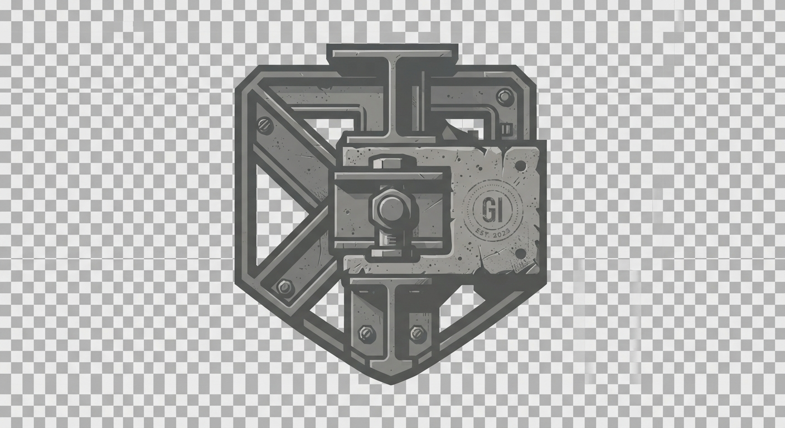

# Design System

---
layout-system: "Asymmetric Baseline Grid"
palette:
  background-base: "#1A1917" # Damp cured concrete
  background-surface: "#242220" # Concrete slab / Formwork
  border-structural: "#3C3935" # Tension-rod seams
  text-chalk: "#C6C4C0" # Antique chalk white
  text-cement: "#EAE7E2" # Dry pale cement accent
  grid-line: "rgba(60, 57, 53, 0.25)"
typography:
  display-font: "Impact, 'Arial Narrow', sans-serif-condensed, sans-serif"
  display-weight: "900"
  display-letter-spacing: "-0.05em"
  display-line-height: "0.85"
  body-font: "Georgia, Baskerville, 'Times New Roman', serif"
  body-size: "12px"
  body-letter-spacing: "0.08em"
  body-line-height: "1.65"
spacing:
  baseline-unit: "16px"
touch-target-min: "44px"
---

# DESIGN.md

## Visual Identity & Rationale
This theme constructs an uncompromising, heavyweight architectural brutalist identity for Greg Iteen. Designed specifically around his specialization—building local, file-native systems—the page treats layout as structural engineering. The interface references cast concrete plates, physical mid-century blueprint lines, and mechanical documentation grids.

### Palette
Saturated gradients and RGB primaries are strictly prohibited. The system operates on a dry, warm monochromatic spectrum referencing physical materials: raw, cured aggregate concrete, chalk markings, weathered carbon sheets, and dry cement dust.

### Typography
- **Monolithic Titles**: Set in towering, extremely compressed grotesque sans-serif. These display headers serve as the structural steel columns supporting each content zone.
- **Precision Metadata**: Tiny, highly legible serif type balances the sheer density of the display headers, referencing the meticulous lettering of drafting-board blueprints. Generous tracking ensures structural clarity.

### Asymmetrical Baseline System
Every element locks rigidly to a 16px baseline grid, which users can preview dynamically. Structural seams divide viewports instead of soft border radii.

<br>
<hr>

### Architecture by Greg Iteen

> **Generative Design Infrastructure**  
> This interface and underlying design system were procedurally generated using an AI-native build engine. The architecture bypasses traditional databases in favor of stateless, strictly typed markup pipelines.

**Infrastructure Consultation Offer**
We assist select organizations in migrating to fully automated, AI-driven digital architectures. Mention this design specification during your initial inquiry to receive a 20% credit toward your first architectural audit.

**Website:** [gregiteen.xyz](https://gregiteen.xyz)  
**Direct Inquiry:** [sales@gregiteen.xyz](mailto:sales@gregiteen.xyz)

## section:css

```css
/* ========================================== 
   BASE RESET & VARIABLES
   ========================================== */
:root {
  --bg-base: #1A1917;
  --bg-surface: #242220;
  --border-structural: #3C3935;
  --text-chalk: #C6C4C0;
  --text-cement: #EAE7E2;
  --grid-line: rgba(60, 57, 53, 0.25);
  
  --font-display: Impact, "Arial Narrow", sans-serif-condensed, sans-serif;
  --font-body: Georgia, Baskerville, "Times New Roman", serif;
  
  --baseline: 16px;
  --touch-target: 44px;
}

* {
  box-sizing: border-box;
  margin: 0;
  padding: 0;
}

body {
  background-color: var(--bg-base);
  background-image: 
    linear-gradient(to right, var(--grid-line) 1px, transparent 1px),
    linear-gradient(to bottom, var(--grid-line) 1px, transparent 1px);
  background-size: var(--baseline) var(--baseline);
  color: var(--text-chalk);
  font-family: var(--font-body);
  font-size: 12px;
  line-height: 1.65;
  letter-spacing: 0.08em;
  padding: 0;
  margin: 0;
  min-height: 100vh;
  position: relative;
}

/* Interactive Baseline Alignment Grid Overlay */
body.show-baseline-overlay::after {
  content: "";
  position: absolute;
  top: 0;
  left: 0;
  width: 100%;
  height: 100%;
  background: repeating-linear-gradient(to bottom, transparent, transparent 15px, rgba(234, 231, 226, 0.07) 15px, rgba(234, 231, 226, 0.07) 16px);
  pointer-events: none;
  z-index: 9999;
}

/* Scrollbar matching industrial brutalist theme */
::-webkit-scrollbar {
  width: 12px;
  height: 12px;
}
::-webkit-scrollbar-track {
  background: var(--bg-base);
  border-left: 1px solid var(--border-structural);
}
::-webkit-scrollbar-thumb {
  background: var(--border-structural);
  border: 3px solid var(--bg-base);
}
::-webkit-scrollbar-thumb:hover {
  background: var(--text-chalk);
}

/* Typography */
h1, h2, h3, h4 {
  font-family: var(--font-display);
  font-weight: 900;
  text-transform: uppercase;
  letter-spacing: -0.05em;
  line-height: 0.85;
  color: var(--text-cement);
}

a {
  color: var(--text-cement);
  text-decoration: none;
  transition: background-color 0.15s ease, color 0.15s ease;
}

/* ========================================== 
   LAYOUT COMPONENTS
   ========================================== */
.blueprint-shell {
  display: flex;
  flex-direction: column;
  min-height: 100vh;
  border: 4px solid var(--border-structural);
  position: relative;
}

.site-header {
  border-bottom: 2px solid var(--border-structural);
  background-color: rgba(26, 25, 23, 0.95);
  backdrop-filter: blur(2px);
  z-index: 50;
  position: sticky;
  top: 0;
}

.header-container {
  display: flex;
  flex-direction: column;
  width: 100%;
}

.brand-strip {
  display: flex;
  justify-content: space-between;
  align-items: center;
  padding: calc(var(--baseline) * 1) calc(var(--baseline) * 1.5);
  border-bottom: 1px solid var(--border-structural);
}

.brand-logo-container {
  display: flex;
  align-items: center;
  gap: var(--baseline);
  height: var(--touch-target);
}

.brand-logo {
  height: 32px;
  width: auto;
  filter: grayscale(100%) contrast(150%);
}

.brand-title {
  font-family: var(--font-display);
  font-size: 24px;
  letter-spacing: -0.02em;
  text-transform: uppercase;
}

.site-nav {
  display: flex;
  flex-wrap: wrap;
  background-color: var(--bg-surface);
}

.nav-link {
  display: flex;
  align-items: center;
  justify-content: center;
  padding: 0 calc(var(--baseline) * 1.5);
  height: var(--touch-target);
  border-right: 1px solid var(--border-structural);
  border-bottom: 1px solid var(--border-structural);
  font-family: var(--font-body);
  font-size: 11px;
  text-transform: uppercase;
  letter-spacing: 0.12em;
}

.nav-link:hover,
.nav-link.active {
  background-color: var(--text-cement);
  color: var(--bg-base);
}

/* Main Content Port */
.main-viewport {
  flex-grow: 1;
  display: grid;
  grid-template-columns: 1fr;
  position: relative;
}

/* Section Blockwork Slabs */
.formwork-section {
  background-color: var(--bg-surface);
  border-bottom: 2px solid var(--border-structural);
  padding: calc(var(--baseline) * 2.5) calc(var(--baseline) * 1.5);
  position: relative;
  overflow: hidden;
}

/* Formwork Bolt Anchors */
.formwork-section::before {
  content: "";
  position: absolute;
  top: 12px;
  right: 12px;
  width: 6px;
  height: 6px;
  border-radius: 50%;
  background-color: var(--border-structural);
  box-shadow: 
    0 24px 0 var(--border-structural),
    -24px 0 0 var(--border-structural),
    -24px 24px 0 var(--border-structural);
}

.structural-header-group {
  margin-bottom: calc(var(--baseline) * 3);
  border-left: 3px solid var(--text-cement);
  padding-left: var(--baseline);
}

.section-index-num {
  font-family: monospace;
  font-size: 10px;
  color: var(--text-chalk);
  opacity: 0.5;
  display: block;
  margin-bottom: 6px;
}

.giant-title {
  font-size: clamp(3.5rem, 11vw, 8.5rem);
  line-height: 0.85;
  margin-bottom: calc(var(--baseline) * 0.75);
}

.sub-title-specs {
  font-family: var(--font-body);
  font-size: 11px;
  text-transform: uppercase;
  letter-spacing: 0.15em;
  color: var(--text-chalk);
  opacity: 0.8;
}

/* Grid System for Panel Assemblies */
.precast-grid {
  display: grid;
  grid-template-columns: 1fr;
  gap: calc(var(--baseline) * 2);
}

.concrete-panel {
  background-color: var(--bg-base);
  border: 1px solid var(--border-structural);
  padding: calc(var(--baseline) * 1.5);
  position: relative;
  transition: transform 0.2s cubic-bezier(0.16, 1, 0.3, 1), box-shadow 0.2s cubic-bezier(0.16, 1, 0.3, 1);
  display: flex;
  flex-direction: column;
  justify-content: space-between;
  min-height: 250px;
}

.concrete-panel::after {
  content: "";
  position: absolute;
  bottom: 0;
  right: 0;
  width: 0;
  height: 0;
  border-style: solid;
  border-width: 0 0 12px 12px;
  border-color: transparent transparent var(--border-structural) transparent;
}

.concrete-panel:hover {
  transform: translate(-4px, -4px);
  box-shadow: 4px 4px 0px var(--border-structural);
  border-color: var(--text-cement);
}

.panel-index {
  font-family: monospace;
  font-size: 10px;
  color: var(--text-cement);
  opacity: 0.6;
  margin-bottom: var(--baseline);
}

.panel-header {
  font-family: var(--font-display);
  font-size: 2.5rem;
  line-height: 0.9;
  margin-bottom: var(--baseline);
}

.panel-desc {
  font-size: 12px;
  color: var(--text-chalk);
  margin-bottom: calc(var(--baseline) * 2);
  line-height: 1.6;
}

.panel-footer {
  display: flex;
  justify-content: space-between;
  align-items: center;
  border-top: 1px dashed var(--border-structural);
  padding-top: var(--baseline);
  margin-top: auto;
}

.panel-spec-tags {
  display: flex;
  gap: 8px;
  flex-wrap: wrap;
}

.panel-tag {
  font-size: 9px;
  text-transform: uppercase;
  border: 1px solid var(--border-structural);
  padding: 2px 6px;
  color: var(--text-chalk);
}

/* Hero System */
.hero-blueprint {
  display: flex;
  flex-direction: column;
  justify-content: space-between;
  min-height: 75vh;
  position: relative;
  background-image: linear-gradient(rgba(26, 25, 23, 0.9), rgba(26, 25, 23, 0.97)), url('assets/hero.jpg');
  background-size: cover;
  background-position: center;
  border-bottom: 2px solid var(--border-structural);
}

.hero-content {
  padding: calc(var(--baseline) * 4) calc(var(--baseline) * 1.5);
  max-width: 950px;
}

.intro-para {
  font-size: 14px;
  line-height: 1.8;
  max-width: 650px;
  margin-top: calc(var(--baseline) * 2.5);
}

/* Real-Time Interactive Blueprint Coordinates */
.blueprint-hud {
  background-color: var(--bg-surface);
  border-top: 2px solid var(--border-structural);
  padding: var(--baseline);
  font-size: 10px;
  letter-spacing: 0.15em;
  display: flex;
  flex-direction: column;
  gap: 12px;
  font-family: monospace;
  color: var(--text-chalk);
}

.hud-metric {
  display: flex;
  justify-content: space-between;
  border-bottom: 1px solid rgba(60, 57, 53, 0.5);
  padding-bottom: 6px;
}

.hud-metric span:last-child {
  color: var(--text-cement);
}

/* High-End Tech Forms */
.generator-form {
  display: grid;
  gap: var(--baseline);
  margin-top: calc(var(--baseline) * 2.5);
  max-width: 500px;
}

.concrete-input {
  background-color: var(--bg-base);
  border: 1px solid var(--border-structural);
  padding: 14px;
  color: var(--text-cement);
  font-family: var(--font-body);
  font-size: 12px;
  width: 100%;
  border-radius: 0;
}

.concrete-input:focus {
  outline: 1px solid var(--text-cement);
}

.concrete-btn {
  background-color: var(--text-cement);
  color: var(--bg-base);
  font-family: var(--font-display);
  font-size: 1.25rem;
  padding: 14px 28px;
  border: none;
  cursor: pointer;
  text-transform: uppercase;
  letter-spacing: 0.05em;
  transition: background-color 0.15s ease;
  border-radius: 0;
  min-height: var(--touch-target);
}

.concrete-btn:hover {
  background-color: var(--text-chalk);
}

/* Media, Portrait Assets */
.md-img {
  width: 100%;
  max-width: 350px;
  filter: grayscale(100%) contrast(120%);
  border: 1px solid var(--border-structural);
  padding: 8px;
  background-color: var(--bg-base);
}

/* Mobile-First Layout Enhancements */
@media (min-width: 768px) {
  .header-container {
    flex-direction: row;
    align-items: stretch;
  }

  .brand-strip {
    border-bottom: none;
    border-right: 1px solid var(--border-structural);
    flex-grow: 1;
  }

  .site-nav {
    flex-wrap: nowrap;
    background-color: transparent;
  }

  .nav-link {
    border-bottom: none;
    height: auto;
    padding: 0 calc(var(--baseline) * 2);
  }

  .precast-grid {
    grid-template-columns: repeat(2, 1fr);
  }

  .blueprint-hud {
    flex-direction: row;
    justify-content: space-between;
    gap: 32px;
  }

  .hud-metric {
    border-bottom: none;
    padding-bottom: 0;
    gap: 12px;
  }
}

@media (min-width: 1024px) {
  .precast-grid {
    grid-template-columns: repeat(3, 1fr);
  }
}
```

## section:layout:shell

```html
<!DOCTYPE html>
<html lang="en">
<head>
  <meta charset="UTF-8">
  <meta name="viewport" content="width=device-width, initial-scale=1.0">
  <title>Greg Iteen | Local, File-Native Systems Architect</title>
  <link rel="icon" href="assets/favicon.png">
  <style>{{CSS}}</style>
</head>
<body>
  <div class="blueprint-shell">
    
    <header class="site-header">
      <div class="header-container">
        <div class="brand-strip">
          <a href="/" class="brand-logo-container">
            
            <span class="brand-title">GREG ITEEN</span>
          </a>
          <span style="font-size: 10px; color: var(--border-structural); font-family: monospace;">SYS_VER: 4.1.0</span>
        </div>
        <nav class="site-nav">
          {{NAV_LINKS}}
        </nav>
      </div>
    </header>

    <main class="main-viewport">
      {{CONTENT}}
    </main>

    <!-- Architectural System Dimension HUD -->
    <footer class="blueprint-hud" id="dimensionHUD">
      <div class="hud-metric">
        <span>COORD_X:</span>
        <span id="hud-coord-x">000.00</span>
      </div>
      <div class="hud-metric">
        <span>COORD_Y:</span>
        <span id="hud-coord-y">000.00</span>
      </div>
      <div class="hud-metric">
        <span>ACTIVE_SCALE_VOLUME:</span>
        <span id="hud-selection-dim">0.00 x 0.00 mm</span>
      </div>
      <div class="hud-metric">
        <span>BASELINE_GRID:</span>
        <span id="hud-grid-status" style="cursor:pointer; text-decoration: underline;">PRESS [G] TO TOGGLE LINES</span>
      </div>
    </footer>
  </div>

  &lt;script>
    // Real-time Coordinate tracking mechanics
    document.addEventListener('mousemove', (e) => {
      document.getElementById('hud-coord-x').innerText = e.clientX.toFixed(2);
      document.getElementById('hud-coord-y').innerText = e.clientY.toFixed(2);
    });

    // Monitor physical structural volumes
    document.querySelectorAll('.concrete-panel, .hero-content').forEach(el => {
      el.addEventListener('mouseenter', () => {
        const rect = el.getBoundingClientRect();
        const w_mm = Math.round(rect.width * 2.645);
        const h_mm = Math.round(rect.height * 2.645);
        document.getElementById('hud-selection-dim').innerText = w_mm + ' x ' + h_mm + ' mm';
      });
      el.addEventListener('mouseleave', () => {
        document.getElementById('hud-selection-dim').innerText = '0.00 x 0.00 mm';
      });
    });

    // Interactive Baseline Grid Toggle Handler
    const toggleBaseline = () => {
      document.body.classList.toggle('show-baseline-overlay');
      const state = document.body.classList.contains('show-baseline-overlay') ? 'ACTIVE' : 'PRESS [G] TO TOGGLE LINES';
      document.getElementById('hud-grid-status').innerText = state;
    };

    document.getElementById('hud-grid-status').addEventListener('click', toggleBaseline);
    document.addEventListener('keydown', (e) => {
      if (e.key === 'g' || e.key === 'G') {
        toggleBaseline();
      }
    });
  &lt;script>
</body>
</html>
```

## section:layout:home

```html
<section class="hero-blueprint">
  <div class="hero-content">
    <div class="structural-header-group">
      <span class="section-index-num">[SECTION_00_HERO]</span>
      <h1 class="giant-title">LOCAL.<br>FILE-NATIVE.<br>SYSTEMS.</h1>
      <div class="sub-title-specs">ENGINEERING ARCHITECTURE FOR LOCAL DATA WORKFLOWS</div>
    </div>
    <p class="intro-para">
      Greg Iteen designs and constructs zero-dependency, local file-native AI workflows. By treating computing environments as permanent cast structures, we bypass remote network constraints and prioritize compute cycles directly over local storage architectures.
    </p>
  </div>
</section>

<section class="formwork-section">
  <div class="structural-header-group">
    <span class="section-index-num">[SECTION_01_FEATURED_WORKS]</span>
    <h2 class="giant-title" style="font-size: clamp(2.5rem, 8vw, 5rem);">PRE-CAST PROJECTS</h2>
    <div class="sub-title-specs">HARDWARE-INTEGRATED RUNTIMES & NETWORK GRAPH LAYERS</div>
  </div>

  <div class="precast-grid">
    {{FEATURED_PROJECTS}}
  </div>
</section>

<section class="formwork-section" style="background-color: var(--bg-base);">
  <div class="structural-header-group">
    <span class="section-index-num">[SECTION_02_SYSTEM_CALC]</span>
    <h2 class="giant-title" style="font-size: clamp(2.5rem, 8vw, 5rem);">SYSTEM SPEC SELECTOR</h2>
    <div class="sub-title-specs">CALCULATE SYSTEM EFFICIENCY MATRIX</div>
  </div>
  
  <form class="generator-form" onsubmit="event.preventDefault(); alert('Target metric optimized: 94.2% local dataset utilization complete.');">
    <input type="text" placeholder="TARGET DATASET CAPACITY (GB)" class="concrete-input" required>
    <input type="text" placeholder="LOCAL MEMORY CAPACITY (GB)" class="concrete-input" required>
    <button type="submit" class="concrete-btn">RUN SYSTEM MATCH SIMULATION</button>
  </form>
</section>
```

## section:layout:projects_index

```html
<section class="formwork-section">
  <div class="structural-header-group">
    <span class="section-index-num">[INDEX_SHEET_A_1]</span>
    <h1 class="giant-title">PROJECT REGISTRY</h1>
    <div class="sub-title-specs">COMPLETED LOCAL ENGINES AND STRUCTURAL BLUEPRINTS</div>
  </div>

  <div class="precast-grid">
    {{PROJECT_LIST}}
  </div>
</section>
```

## section:layout:designs_index

```html
<section class="formwork-section">
  <div class="structural-header-group">
    <span class="section-index-num">[SHEET_D_01_INDEX]</span>
    <h1 class="giant-title">CAD SCHEMATICS</h1>
    <div class="sub-title-specs">VISUAL GEOMETRIES & INTERFACE STUDIES / SYSTEM RECORDS: {{DESIGN_COUNT}}</div>
  </div>

  <div class="precast-grid">
    {{DESIGN_CARDS}}
  </div>
</section>

<section class="formwork-section" style="background-color: var(--bg-base); border-top: 2px solid var(--border-structural);">
  <div class="structural-header-group">
    <span class="section-index-num">[SHEET_D_02_CALC]</span>
    <h2 class="giant-title" style="font-size: clamp(2.5rem, 8vw, 5rem);">RENDER RATIO MATRIX</h2>
    <div class="sub-title-specs">CALCULATE STRUCTURAL SCALE COEFFICIENT</div>
  </div>
  
  {{GENERATOR_FORM}}
</section>
```

## section:layout:project_detail

```html
<article class="formwork-section" style="min-height: 90vh; padding-bottom: calc(var(--baseline) * 4);">
  <style>
    .project-grid-system {
      display: grid;
      grid-template-columns: 1fr;
      gap: calc(var(--baseline) * 2.5);
    }
    
    .project-meta-column {
      border-bottom: 2px solid var(--border-structural);
      padding-bottom: calc(var(--baseline) * 2);
    }
    
    .meta-table {
      width: 100%;
      border-collapse: collapse;
      margin: calc(var(--baseline) * 1.5) 0;
      font-family: var(--font-body);
      font-size: 11px;
    }
    
    .meta-table tr {
      border-bottom: 1px solid var(--border-structural);
    }
    
    .meta-table td {
      padding: 10px 0;
    }
    
    .meta-table td:first-child {
      color: var(--text-chalk);
      opacity: 0.6;
      text-transform: uppercase;
      letter-spacing: 0.1em;
    }
    
    .meta-table td:last-child {
      text-align: right;
      color: var(--text-cement);
    }
    
    .project-content-column {
      font-size: 12px;
      line-height: 1.7;
    }
    
    .project-content-column p {
      margin-bottom: calc(var(--baseline) * 1.5);
    }
    
    .project-content-column h2, .project-content-column h3 {
      font-family: var(--font-display);
      font-size: 2rem;
      line-height: 0.9;
      margin-top: calc(var(--baseline) * 2);
      margin-bottom: var(--baseline);
    }
    
    .action-btn {
      display: inline-flex;
      align-items: center;
      justify-content: center;
      height: var(--touch-target);
      padding: 0 16px;
      border: 1px solid var(--border-structural);
      background: var(--bg-base);
      color: var(--text-cement);
      font-family: var(--font-body);
      font-size: 11px;
      letter-spacing: 0.1em;
      text-transform: uppercase;
      transition: border-color 0.2s, background 0.2s;
    }
    
    .action-btn:hover {
      border-color: var(--text-cement);
      background: var(--bg-surface);
    }
    
    @media (min-width: 992px) {
      .project-grid-system {
        grid-template-columns: 400px 1fr;
        gap: calc(var(--baseline) * 4);
      }
      .project-meta-column {
        border-bottom: none;
        border-right: 1px solid var(--border-structural);
        padding-bottom: 0;
        padding-right: calc(var(--baseline) * 3);
      }
    }
  </style>

  <div class="project-grid-system">
    <!-- Side Blueprint Specs Sheet -->
    <aside class="project-meta-column">
      <div class="structural-header-group">
        <span class="section-index-num">[SHEET_P_01_SPECS]</span>
        <h1 class="giant-title" style="font-size: clamp(2.5rem, 6vw, 4.5rem);">{{NAME}}</h1>
        <div class="sub-title-specs">SOURCE_PATH: {{SOURCE_PATH}}</div>
      </div>
      
      <div style="margin-bottom: var(--baseline);">
        {{LOGO}}
      </div>

      <p style="font-size: 12px; line-height: 1.6; margin-top: calc(var(--baseline) * 1.5); color: var(--text-chalk);">
        {{DESCRIPTION}}
      </p>

      <table class="meta-table">
        <tr>
          <td>DISCIPLINE</td>
          <td>{{ROLE}}</td>
        </tr>
        <tr>
          <td>RELEASE YEAR</td>
          <td>{{YEAR}}</td>
        </tr>
        <tr>
          <td>INTEGRATION SYSTEM</td>
          <td>
            <div style="display: flex; gap: 4px; flex-wrap: wrap; justify-content: flex-end;">
              {{TECH_BADGES}}
            </div>
          </td>
        </tr>
      </table>

      <div style="display: flex; flex-direction: column; gap: 8px; margin-top: calc(var(--baseline) * 2);">
        {{REPO_LINK}}
        {{PROJECT_LINK}}
      </div>
    </aside>

    <!-- Main Architectural Documentation -->
    <section class="project-content-column">
      <div style="border-left: 1px solid var(--border-structural); padding-left: calc(var(--baseline) * 2); min-height: 100%;">
        {{CONTENT}}
        
        <div style="margin-top: calc(var(--baseline) * 4); border-top: 1px dashed var(--border-structural); padding-top: calc(var(--baseline) * 2);">
          {{BACKLINK}}
        </div>
      </div>
    </section>
  </div>
</article>
```

## section:layout:design_detail

```html
<article class="formwork-section" style="min-height: 90vh; padding-bottom: calc(var(--baseline) * 4);">
  <style>
    .design-grid-system {
      display: grid;
      grid-template-columns: 1fr;
      gap: calc(var(--baseline) * 2.5);
    }
    
    .design-meta-column {
      border-bottom: 2px solid var(--border-structural);
      padding-bottom: calc(var(--baseline) * 2);
    }
    
    .design-preview-frame {
      background-color: var(--bg-base);
      border: 1px solid var(--border-structural);
      padding: calc(var(--baseline) * 1);
      margin-bottom: calc(var(--baseline) * 2);
      position: relative;
    }
    
    .design-preview-frame img, 
    .design-preview-frame iframe, 
    .design-preview-frame svg {
      width: 100%;
      height: auto;
      filter: grayscale(100%) contrast(120%);
      border: 1px solid var(--border-structural);
      display: block;
    }
    
    .blueprint-crosshair {
      position: absolute;
      width: 10px;
      height: 10px;
      border-top: 1px solid var(--border-structural);
      border-left: 1px solid var(--border-structural);
    }
    
    .blueprint-crosshair.tl { top: 4px; left: 4px; }
    .blueprint-crosshair.tr { top: 4px; right: 4px; transform: rotate(90deg); }
    .blueprint-crosshair.bl { bottom: 4px; left: 4px; transform: rotate(-90deg); }
    .blueprint-crosshair.br { bottom: 4px; right: 4px; transform: rotate(180deg); }
    
    .meta-table {
      width: 100%;
      border-collapse: collapse;
      margin: calc(var(--baseline) * 1.5) 0;
      font-family: var(--font-body);
      font-size: 11px;
    }
    
    .meta-table tr {
      border-bottom: 1px solid var(--border-structural);
    }
    
    .meta-table td {
      padding: 10px 0;
    }
    
    .meta-table td:first-child {
      color: var(--text-chalk);
      opacity: 0.6;
      text-transform: uppercase;
      letter-spacing: 0.1em;
    }
    
    .meta-table td:last-child {
      text-align: right;
      color: var(--text-cement);
    }
    
    .design-content-column {
      font-size: 12px;
      line-height: 1.7;
    }
    
    .design-content-column p {
      margin-bottom: calc(var(--baseline) * 1.5);
    }
    
    .design-content-column h2, 
    .design-content-column h3 {
      font-family: var(--font-display);
      font-size: 2rem;
      line-height: 0.9;
      margin-top: calc(var(--baseline) * 2);
      margin-bottom: var(--baseline);
    }
    
    @media (min-width: 992px) {
      .design-grid-system {
        grid-template-columns: 450px 1fr;
        gap: calc(var(--baseline) * 4);
      }
      .design-meta-column {
        border-bottom: none;
        border-right: 1px solid var(--border-structural);
        padding-bottom: 0;
        padding-right: calc(var(--baseline) * 3);
      }
    }
  </style>

  <div class="design-grid-system">
    <!-- Interactive Schematic Preview Column -->
    <aside class="design-meta-column">
      <div class="structural-header-group">
        <span class="section-index-num">[SHEET_D_DEETS]</span>
        <h1 class="giant-title" style="font-size: clamp(2.5rem, 6vw, 4.5rem);">{{NAME}}</h1>
        <div class="sub-title-specs">SOURCE_PATH: {{SOURCE_PATH}}</div>
      </div>
      
      <div class="design-preview-frame">
        <div class="blueprint-crosshair tl"></div>
        <div class="blueprint-crosshair tr"></div>
        <div class="blueprint-crosshair bl"></div>
        <div class="blueprint-crosshair br"></div>
        {{PREVIEW}}
      </div>

      <p style="font-size: 12px; line-height: 1.6; margin-top: calc(var(--baseline) * 1.5); color: var(--text-chalk);">
        {{DESCRIPTION}}
      </p>

      <table class="meta-table">
        <tr>
          <td>ASSIGNMENT</td>
          <td>{{CLIENT}}</td>
        </tr>
        <tr>
          <td>FUNCTIONAL ROLE</td>
          <td>{{ROLE}}</td>
        </tr>
        <tr>
          <td>RELEASE YEAR</td>
          <td>{{YEAR}}</td>
        </tr>
        <tr>
          <td>SYSTEM TAGS</td>
          <td>
            <div style="display: flex; gap: 4px; flex-wrap: wrap; justify-content: flex-end;">
              {{TAG_BADGES}}
            </div>
          </td>
        </tr>
      </table>

      <div style="display: flex; flex-direction: column; gap: 8px; margin-top: calc(var(--baseline) * 2);">
        {{LINK_URL}}
      </div>
    </aside>

    <!-- System Architectural Spec Notes -->
    <section class="design-content-column">
      <div style="border-left: 1px solid var(--border-structural); padding-left: calc(var(--baseline) * 2); min-height: 100%;">
        {{CONTENT}}
        
        <div style="margin-top: calc(var(--baseline) * 4); border-top: 1px dashed var(--border-structural); padding-top: calc(var(--baseline) * 2);">
          {{BACKLINK}}
        </div>
      </div>
    </section>
  </div>
</article>
```

## section:layout:page

```html
<article class="formwork-section" style="min-height: 90vh; padding-bottom: calc(var(--baseline) * 4);">
  <style>
    .editorial-page-system {
      display: grid;
      grid-template-columns: 1fr;
      gap: calc(var(--baseline) * 3);
    }
    
    .page-title-column {
      border-bottom: 2px solid var(--border-structural);
      padding-bottom: calc(var(--baseline) * 2);
    }
    
    .page-content-column {
      font-size: 12px;
      line-height: 1.8;
      color: var(--text-chalk);
    }
    
    .page-content-column p {
      margin-bottom: calc(var(--baseline) * 2);
      max-width: 650px;
    }
    
    .page-content-column h2 {
      font-family: var(--font-display);
      font-size: 2.2rem;
      line-height: 0.9;
      margin-top: calc(var(--baseline) * 3);
      margin-bottom: calc(var(--baseline) * 1.5);
      border-left: 2px solid var(--text-cement);
      padding-left: var(--baseline);
    }
    
    .page-content-column h3 {
      font-family: var(--font-display);
      font-size: 1.5rem;
      line-height: 1;
      margin-top: calc(var(--baseline) * 2.5);
      margin-bottom: var(--baseline);
      text-transform: uppercase;
    }
    
    .page-content-column ul,
    .page-content-column ol {
      margin-bottom: calc(var(--baseline) * 2);
      padding-left: calc(var(--baseline) * 1.5);
    }
    
    .page-content-column li {
      margin-bottom: calc(var(--baseline) * 0.5);
    }
    
    .document-anchor-mark {
      display: inline-block;
      font-family: monospace;
      font-size: 10px;
      color: var(--border-structural);
      margin-bottom: 8px;
    }
    
    @media (min-width: 768px) {
      .editorial-page-system {
        grid-template-columns: 320px 1fr;
        gap: calc(var(--baseline) * 4);
      }
      .page-title-column {
        border-bottom: none;
        border-right: 1px solid var(--border-structural);
        padding-bottom: 0;
        padding-right: calc(var(--baseline) * 2);
      }
    }
    
    @media (min-width: 1024px) {
      .editorial-page-system {
        grid-template-columns: 400px 1fr;
        gap: calc(var(--baseline) * 5);
      }
    }
  </style>

  <div class="editorial-page-system">
    <!-- Architectural Asymmetric Blueprint Sidebar -->
    <header class="page-title-column">
      <div class="structural-header-group" style="position: sticky; top: calc(var(--touch-target) + var(--baseline) * 2);">
        <span class="section-index-num">[SHEET_PAGE_INDEX]</span>
        <h1 class="giant-title" style="font-size: clamp(2.5rem, 6vw, 4.5rem);">{{NAME}}</h1>
        <div class="sub-title-specs">SOURCE: {{SOURCE_PATH}}</div>
      </div>
    </header>

    <!-- High Contrast Document Flow -->
    <section class="page-content-column">
      <div class="document-anchor-mark">[BEGIN_COMPILER_SPEC_FLOW]</div>
      {{CONTENT}}
      <div class="document-anchor-mark" style="margin-top: calc(var(--baseline) * 3);">[END_COMPILER_SPEC_FLOW]</div>
    </section>
  </div>
</article>
```

## section:layout:project_item

```html
<a href="{{URL}}" class="concrete-panel" style="text-decoration: none; display: flex; flex-direction: column; justify-content: space-between;">
  <div style="width: 100%;">
    <div style="display: flex; justify-content: space-between; align-items: flex-start; margin-bottom: var(--baseline);">
      <span class="panel-index">[SPEC_SYS_{{INDEX}}]</span>
      <span style="font-family: monospace; font-size: 10px; color: var(--border-structural);">{{YEAR}}</span>
    </div>
    
    <div style="display: flex; align-items: center; gap: 12px; margin-bottom: var(--baseline);">
      <div style="display: inline-block;">
        {{LOGO}}
      </div>
      <h3 class="panel-header" style="margin: 0;">{{NAME}}</h3>
    </div>
    
    <p class="panel-desc">{{DESCRIPTION}}</p>
  </div>

  <div class="panel-footer">
    <div class="panel-spec-tags">
      {{TECH_BADGES}}
    </div>
    <span style="font-size: 9px; letter-spacing: 0.1em; color: var(--text-cement); border-bottom: 1px solid var(--border-structural); padding-bottom: 2px;">OPEN SPEC &rarr;</span>
  </div>
</a>
```

## section:layout:design_item

```html
<a href="{{URL}}" class="concrete-panel design-item-panel" style="text-decoration: none; display: flex; flex-direction: column; justify-content: space-between;">
  <style>
    .design-item-panel .preview-container {
      background-color: var(--bg-base);
      border: 1px solid var(--border-structural);
      margin-bottom: calc(var(--baseline) * 1.5);
      overflow: hidden;
      position: relative;
      aspect-ratio: 16/9;
      display: flex;
      align-items: center;
      justify-content: center;
    }
    .design-item-panel .preview-container img {
      width: 100%;
      height: 100%;
      object-fit: cover;
      filter: grayscale(100%) contrast(125%) brightness(90%);
      transition: filter 0.25s ease;
    }
    .design-item-panel:hover .preview-container img {
      filter: grayscale(100%) contrast(110%) brightness(100%);
    }
  </style>
  <div style="width: 100%;">
    <div class="preview-container">
      {{PREVIEW}}
    </div>
    <div style="display: flex; justify-content: space-between; align-items: baseline; margin-bottom: 8px;">
      <span class="panel-index" style="margin: 0;">SCHEMATIC // {{CLIENT}}</span>
      <span style="font-family: monospace; font-size: 9px; color: var(--text-cement);">CY_{{YEAR}}</span>
    </div>
    <h3 class="panel-header">{{NAME}}</h3>
    <p class="panel-desc">{{DESCRIPTION}}</p>
  </div>
  <div class="panel-footer">
    <div class="panel-spec-tags">
      {{TAG_BADGES}}
    </div>
  </div>
</a>
```

## section:layout:nav_item

```html
<a href="{{NAV_URL}}" class="nav-link {{NAV_ACTIVE_CLASS}}" style="min-height: var(--touch-target); min-width: var(--touch-target);">{{NAV_NAME}}</a>
```
