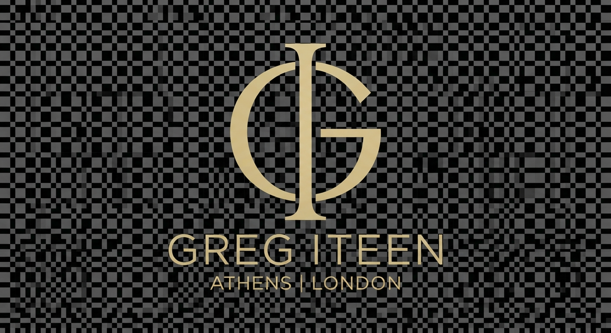
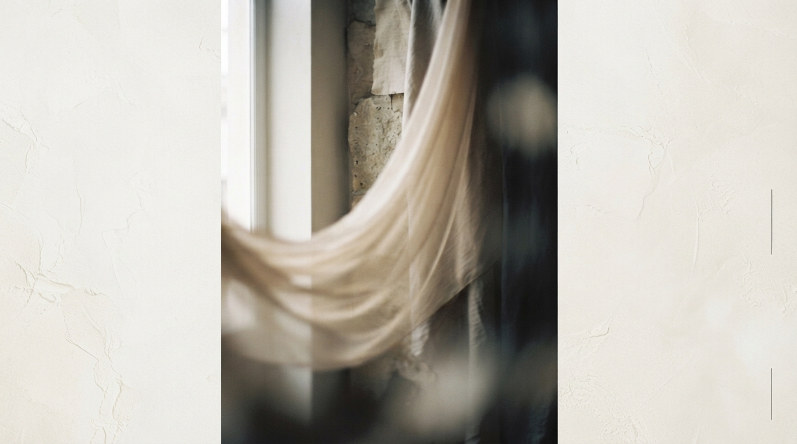

# Design System

---
brand_name: "Greg Iteen"
theme_name: "Ethereal Gallery"
colors:
  background_primary: "#FAF9F6"
  background_secondary: "#F2F1EC"
  text_primary: "#1C1C1A"
  text_secondary: "#5E5E5A"
  text_muted: "#9E9E97"
  accent: "#8E8E7D"
  border: "#E5E4DF"
typography:
  font_display: "system-ui, -apple-system, sans-serif"
  font_body: "system-ui, -apple-system, sans-serif"
  size_scale: "fluid-type"
  letter_spacing: "0.15em"
---

# Design Philosophy

This system translates Greg Iteen's high-performance architectural systems into an ultra-high-end luxury fashion boutique aesthetic.

### Spatial Strategy
We employ extreme, intentional whitespace. Margins are generous, lines are razor-thin, and typography takes on an architectural grace. Every technical asset has deep breathing room, framing Greg's engineering feats as curated exhibits.

### Motion Guidance
Animations remain whisper-quiet. We use slow, hardware-accelerated fade-ups and micro-scale transformations. Interactivity is physical and deliberate, reacting gracefully to touch and mouse movement without introducing synthetic complexity.

### Typography and Color
We utilize a refined system-ui stack styled with massive tracking (letter-spacing) and light font-weights to project luxury. The palette relies entirely on natural alabaster, raw linen, and muted slate shadows, reflecting the focus on pristine, file-native, quiet compute architectures.

<br>
<hr>

### Architecture by Greg Iteen

> **Generative Design Infrastructure**  
> This interface and underlying design system were procedurally generated using an AI-native build engine. The architecture bypasses traditional databases in favor of stateless, strictly typed markup pipelines.

**Infrastructure Consultation Offer**
We assist select organizations in migrating to fully automated, AI-driven digital architectures. Mention this design specification during your initial inquiry to receive a 20% credit toward your first architectural audit.

**Website:** [gregiteen.xyz](https://gregiteen.xyz)  
**Direct Inquiry:** [sales@gregiteen.xyz](mailto:sales@gregiteen.xyz)

## section:css

```css
/* ------------------------------------------------------------- */
/* Core Variables & Reset                                        */
/* ------------------------------------------------------------- */
:root {
  --bg-primary: #FAF9F6;
  --bg-secondary: #F2F1EC;
  --text-primary: #1C1C1A;
  --text-secondary: #5E5E5A;
  --text-muted: #9E9E97;
  --accent: #8E8E7D;
  --border: #E5E4DF;
  --border-light: #F0EFEA;
  --transition-smooth: all 0.7s cubic-bezier(0.16, 1, 0.3, 1);
  --transition-fast: all 0.3s cubic-bezier(0.16, 1, 0.3, 1);
  --font-sans: -apple-system, BlinkMacSystemFont, "Segoe UI", Roboto, Helvetica, Arial, sans-serif;
  --touch-target: 44px;
}

* {
  box-sizing: border-box;
  margin: 0;
  padding: 0;
}

body {
  background-color: var(--bg-primary);
  color: var(--text-primary);
  font-family: var(--font-sans);
  -webkit-font-smoothing: antialiased;
  -moz-osx-font-smoothing: grayscale;
  line-height: 1.75;
  overflow-x: hidden;
  letter-spacing: 0.04em;
}

/* ------------------------------------------------------------- */
/* Layout and Structure                                          */
/* ------------------------------------------------------------- */
.site-container {
  max-width: 1200px;
  margin: 0 auto;
  padding: 2rem 1.5rem 8rem 1.5rem;
}

@media (min-width: 768px) {
  .site-container {
    padding: 5rem 4rem 12rem 4rem;
  }
}

header.global-nav {
  display: flex;
  flex-direction: column;
  justify-content: space-between;
  align-items: flex-start;
  gap: 2rem;
  border-bottom: 1px solid var(--border);
  padding-bottom: 2.5rem;
  margin-bottom: 5rem;
}

@media (min-width: 768px) {
  header.global-nav {
    flex-direction: row;
    align-items: center;
    padding-bottom: 3.5rem;
    margin-bottom: 8rem;
  }
}

.logo-wrap {
  display: flex;
  align-items: center;
  gap: 1.25rem;
  text-decoration: none;
  color: var(--text-primary);
  min-height: var(--touch-target);
}

.logo-img {
  height: 32px;
  width: auto;
  opacity: 0.95;
  transition: var(--transition-smooth);
}

.logo-wrap:hover .logo-img {
  opacity: 0.6;
}

.logo-text {
  font-size: 0.85rem;
  font-weight: 300;
  text-transform: uppercase;
  letter-spacing: 0.3em;
}

nav.nav-links {
  display: flex;
  gap: 2rem;
  flex-wrap: wrap;
}

.nav-item-link {
  font-size: 0.75rem;
  text-transform: uppercase;
  letter-spacing: 0.25em;
  text-decoration: none;
  color: var(--text-secondary);
  position: relative;
  display: inline-flex;
  align-items: center;
  min-height: var(--touch-target);
  padding: 0 0.25rem;
  transition: var(--transition-fast);
}

.nav-item-link:hover,
.nav-item-link.active {
  color: var(--text-primary);
}

.nav-item-link::after {
  content: "";
  position: absolute;
  bottom: 6px;
  left: 0;
  width: 0%;
  height: 1px;
  background-color: var(--text-primary);
  transition: var(--transition-smooth);
}

.nav-item-link:hover::after,
.nav-item-link.active::after {
  width: 100%;
}

/* ------------------------------------------------------------- */
/* Hero / Editorial Framing                                      */
/* ------------------------------------------------------------- */
.editorial-hero {
  display: grid;
  grid-template-columns: 1fr;
  gap: 4rem;
  margin-bottom: 8rem;
}

@media (min-width: 992px) {
  .editorial-hero {
    grid-template-columns: 1.1fr 0.9fr;
    align-items: center;
    gap: 6rem;
    margin-bottom: 12rem;
  }
}

.hero-content {
  opacity: 0;
  transform: translateY(20px);
  animation: fadeInUp 1.2s cubic-bezier(0.16, 1, 0.3, 1) forwards 0.2s;
}

.hero-pre {
  font-size: 0.75rem;
  text-transform: uppercase;
  letter-spacing: 0.3em;
  color: var(--text-muted);
  margin-bottom: 1.75rem;
  display: block;
}

.hero-title {
  font-size: clamp(2.2rem, 5vw, 3.8rem);
  line-height: 1.2;
  font-weight: 200;
  letter-spacing: -0.02em;
  color: var(--text-primary);
  margin-bottom: 2.5rem;
}

.hero-desc {
  font-size: 1.1rem;
  font-weight: 300;
  line-height: 1.9;
  color: var(--text-secondary);
  max-width: 560px;
}

.hero-media {
  position: relative;
  width: 100%;
  aspect-ratio: 4 / 5;
  background-color: var(--bg-secondary);
  overflow: hidden;
  border: 1px solid var(--border);
  opacity: 0;
  transform: scale(0.98) translateY(20px);
  animation: fadeInUp 1.5s cubic-bezier(0.16, 1, 0.3, 1) forwards 0.4s;
}

.hero-media-img {
  width: 100%;
  height: 100%;
  object-fit: cover;
  filter: grayscale(100%) contrast(1.02);
  mix-blend-mode: multiply;
  opacity: 0.9;
  transition: var(--transition-smooth);
}

.hero-media:hover .hero-media-img {
  transform: scale(1.02);
  opacity: 0.98;
}

/* ------------------------------------------------------------- */
/* Interactive Flow Field Canvas                                 */
/* ------------------------------------------------------------- */
.canvas-section {
  margin-bottom: 8rem;
  padding: 4rem 1.5rem;
  background-color: var(--bg-secondary);
  border: 1px solid var(--border);
  text-align: center;
  position: relative;
  overflow: hidden;
}

@media (min-width: 768px) {
  .canvas-section {
    padding: 5rem 3rem;
    margin-bottom: 12rem;
  }
}

.canvas-header {
  position: relative;
  z-index: 2;
  margin-bottom: 3rem;
}

.canvas-title {
  font-size: 0.8rem;
  text-transform: uppercase;
  letter-spacing: 0.3em;
  color: var(--text-primary);
  margin-bottom: 0.75rem;
}

.canvas-desc {
  font-size: 0.85rem;
  color: var(--text-secondary);
  max-width: 520px;
  margin: 0 auto;
  font-weight: 300;
}

.canvas-wrapper {
  position: relative;
  width: 100%;
  height: 300px;
  background: var(--bg-primary);
  border: 1px solid var(--border);
  z-index: 2;
}

#flowCanvas {
  width: 100%;
  height: 100%;
  display: block;
  cursor: crosshair;
}

.sandbox-status {
  position: absolute;
  bottom: 15px;
  right: 20px;
  font-size: 0.7rem;
  letter-spacing: 0.2em;
  text-transform: uppercase;
  color: var(--text-muted);
  pointer-events: none;
}

/* ------------------------------------------------------------- */
/* Grid Systems & Exhibition Lists                              */
/* ------------------------------------------------------------- */
.section-header {
  border-top: 1px solid var(--border);
  padding-top: 3rem;
  margin-bottom: 4rem;
  display: flex;
  flex-direction: column;
  justify-content: space-between;
  align-items: flex-start;
  gap: 1rem;
}

@media (min-width: 768px) {
  .section-header {
    flex-direction: row;
    align-items: flex-end;
    margin-bottom: 5rem;
  }
}

.section-title {
  font-size: 1.1rem;
  font-weight: 300;
  text-transform: uppercase;
  letter-spacing: 0.25em;
  color: var(--text-primary);
}

.section-meta {
  font-size: 0.75rem;
  color: var(--text-muted);
  text-transform: uppercase;
  letter-spacing: 0.2em;
}

/* Exhibition Grid (Projects) */
.exhibition-grid {
  display: grid;
  grid-template-columns: 1fr;
  gap: 4rem;
}

@media (min-width: 768px) {
  .exhibition-grid {
    grid-template-columns: repeat(2, 1fr);
    gap: 6rem 4rem;
  }
}

.exhibition-card {
  display: flex;
  flex-direction: column;
  text-decoration: none;
  color: inherit;
  opacity: 0;
  transform: translateY(30px);
  animation: fadeInUp 1.2s cubic-bezier(0.16, 1, 0.3, 1) forwards;
}

.exhibition-card:nth-child(1) { animation-delay: 0.1s; }
.exhibition-card:nth-child(2) { animation-delay: 0.2s; }
.exhibition-card:nth-child(3) { animation-delay: 0.3s; }
.exhibition-card:nth-child(4) { animation-delay: 0.4s; }

.card-frame {
  width: 100%;
  aspect-ratio: 16 / 10;
  background-color: var(--bg-secondary);
  margin-bottom: 2rem;
  overflow: hidden;
  position: relative;
  border: 1px solid var(--border);
  transition: var(--transition-smooth);
}

.exhibition-card:hover .card-frame {
  border-color: var(--text-secondary);
}

.card-img-placeholder {
  width: 100%;
  height: 100%;
  display: flex;
  align-items: center;
  justify-content: center;
  background-color: var(--bg-secondary);
  font-size: 0.7rem;
  text-transform: uppercase;
  letter-spacing: 0.3em;
  color: var(--text-muted);
  transition: var(--transition-smooth);
}

.exhibition-card:hover .card-img-placeholder {
  color: var(--text-primary);
  transform: scale(1.02);
}

.card-meta {
  display: flex;
  justify-content: space-between;
  font-size: 0.7rem;
  text-transform: uppercase;
  letter-spacing: 0.2em;
  color: var(--text-muted);
  margin-bottom: 1rem;
  border-bottom: 1px solid var(--border-light);
  padding-bottom: 0.5rem;
}

.card-title {
  font-size: 1.15rem;
  font-weight: 300;
  color: var(--text-primary);
  margin-bottom: 0.75rem;
  letter-spacing: 0.02em;
  transition: var(--transition-fast);
}

.exhibition-card:hover .card-title {
  color: var(--accent);
}

.card-description {
  font-size: 0.9rem;
  color: var(--text-secondary);
  line-height: 1.7;
  font-weight: 300;
}

/* ------------------------------------------------------------- */
/* List View (For Projects Index)                                */
/* ------------------------------------------------------------- */
.editorial-list {
  display: flex;
  flex-direction: column;
  margin-top: 2rem;
}

.list-item {
  display: grid;
  grid-template-columns: 1fr;
  gap: 1.5rem;
  padding: 2.5rem 0;
  border-bottom: 1px solid var(--border);
  text-decoration: none;
  color: inherit;
  min-height: var(--touch-target);
  transition: var(--transition-smooth);
}

@media (min-width: 768px) {
  .list-item {
    grid-template-columns: 100px 1fr 220px;
    align-items: center;
    gap: 4rem;
  }
}

.list-item:hover {
  padding-left: 1.5rem;
  background-color: var(--bg-secondary);
}

.list-year {
  font-size: 0.75rem;
  color: var(--text-muted);
  letter-spacing: 0.2em;
}

.list-details {
  display: flex;
  flex-direction: column;
  gap: 0.5rem;
}

.list-title {
  font-size: 1.1rem;
  font-weight: 300;
  letter-spacing: 0.05em;
  color: var(--text-primary);
}

.list-desc {
  font-size: 0.9rem;
  color: var(--text-secondary);
  font-weight: 300;
}

.list-tags {
  display: flex;
  gap: 0.5rem;
  flex-wrap: wrap;
}

.badge {
  font-size: 0.65rem;
  text-transform: uppercase;
  letter-spacing: 0.15em;
  padding: 0.35rem 0.75rem;
  border: 1px solid var(--border);
  color: var(--text-secondary);
  background: transparent;
  border-radius: 0;
}

/* ------------------------------------------------------------- */
/* Footer                                                        */
/* ------------------------------------------------------------- */
.editorial-footer {
  margin-top: 12rem;
  border-top: 1px solid var(--border);
  padding-top: 5rem;
  display: flex;
  flex-direction: column;
  gap: 4rem;
}

@media (min-width: 768px) {
  .editorial-footer {
    flex-direction: row;
    justify-content: space-between;
    align-items: flex-start;
  }
}

.footer-brand {
  display: flex;
  flex-direction: column;
  gap: 1.5rem;
}

.footer-tagline {
  font-size: 0.8rem;
  text-transform: uppercase;
  letter-spacing: 0.25em;
  color: var(--text-muted);
  max-width: 360px;
  line-height: 1.8;
}

.footer-meta {
  font-size: 0.75rem;
  color: var(--text-muted);
  letter-spacing: 0.1em;
}

/* ------------------------------------------------------------- */
/* Animations                                                    */
/* ------------------------------------------------------------- */
@keyframes fadeInUp {
  from {
    opacity: 0;
    transform: translateY(24px);
  }
  to {
    opacity: 1;
    transform: translateY(0);
  }
}

/* Utility Classes */
.generous-whitespace {
  margin-bottom: 8rem;
}

@media (min-width: 768px) {
  .generous-whitespace {
    margin-bottom: 12rem;
  }
}
```

## section:layout:home

```html
<div class="site-container">
  <!-- Navigation -->
  <header class="global-nav">
    <a href="/" class="logo-wrap">
      
      <span class="logo-text">Greg Iteen</span>
    </a>
    <nav class="nav-links">
      <a href="/" class="nav-item-link active">Exhibition</a>
      <a href="/projects" class="nav-item-link">Systems</a>
      <a href="/designs" class="nav-item-link">Visuals</a>
      <a href="/about" class="nav-item-link">Context</a>
      <a href="/contact" class="nav-item-link">Inquire</a>
    </nav>
  </header>

  <!-- Editorial Hero -->
  <section class="editorial-hero">
    <div class="hero-content">
      <span class="hero-pre">System Architecture Studio</span>
      <h1 class="hero-title">Designing low-latency, file-native computational layers.</h1>
      <p class="hero-desc">Structuring highly resilient architectures for local intelligence. Standardizing raw data files directly into integrated, context-rich graph engines.</p>
    </div>
    <div class="hero-media">
      
    </div>
  </section>

  <!-- Interactive Flow Field Canvas -->
  <section class="canvas-section">
    <div class="canvas-header">
      <h3 class="canvas-title">File System Gravity Matrix</h3>
      <p class="canvas-desc">An aesthetic node projection mapping files streamed into integrated context. Interact with the field to distribute architectural elements.</p>
    </div>
    <div class="canvas-wrapper">
      <canvas id="flowCanvas"></canvas>
      <div class="sandbox-status" id="sandboxStatus">Matrix State: Balanced</div>
    </div>
  </section>

  <!-- Dynamic Curated Architectures Grid -->
  <section class="generous-whitespace">
    <div class="section-header">
      <h2 class="section-title">Curated Systems</h2>
      <span class="section-meta">Select Works</span>
    </div>
    
    <div class="exhibition-grid">
      {{FEATURED_PROJECTS}}
    </div>
  </section>

  <!-- Footer -->
  <footer class="editorial-footer">
    <div class="footer-brand">
      <span class="logo-text">Greg Iteen</span>
      <p class="footer-tagline">Architecting local-first system layers and persistent data structures.</p>
    </div>
    <div class="footer-meta">
      <p>&copy; Current Era. Minimalist presentation layout.</p>
    </div>
  </footer>
</div>

&lt;script>
(function() {
  const canvas = document.getElementById('flowCanvas');
  if (!canvas) return;
  const ctx = canvas.getContext('2d');
  const statusElement = document.getElementById('sandboxStatus');
  
  let width = canvas.width = canvas.offsetWidth;
  let height = canvas.height = canvas.offsetHeight;
  
  window.addEventListener('resize', () => {
    width = canvas.width = canvas.offsetWidth;
    height = canvas.height = canvas.offsetHeight;
  });

  const nodes = [];
  const nodeCount = 32;
  let mouse = { x: null, y: null, active: false };

  for (let i = 0; i < nodeCount; i++) {
    nodes.push({
      x: Math.random() * width,
      y: Math.random() * height,
      vx: (Math.random() - 0.5) * 0.3,
      vy: (Math.random() - 0.5) * 0.3,
      radius: Math.random() * 1.5 + 1
    });
  }

  canvas.addEventListener('mousemove', (e) => {
    const rect = canvas.getBoundingClientRect();
    mouse.x = e.clientX - rect.left;
    mouse.y = e.clientY - rect.top;
    mouse.active = true;
    if (statusElement) {
      statusElement.textContent = `Force Vector: [${Math.round(mouse.x)}, ${Math.round(mouse.y)}]`;
    }
  });

  canvas.addEventListener('mouseleave', () => {
    mouse.active = false;
    if (statusElement) {
      statusElement.textContent = "Matrix State: Balanced";
    }
  });

  function animate() {
    ctx.clearRect(0, 0, width, height);
    
    // Gentle background grid representation
    ctx.strokeStyle = 'rgba(142, 142, 125, 0.05)';
    ctx.lineWidth = 0.5;
    for (let i = 0; i < width; i += 40) {
      ctx.beginPath();
      ctx.moveTo(i, 0);
      ctx.lineTo(i, height);
      ctx.stroke();
    }
    for (let j = 0; j < height; j += 40) {
      ctx.beginPath();
      ctx.moveTo(0, j);
      ctx.lineTo(width, j);
      ctx.stroke();
    }

    // Fine lines between nodes
    ctx.strokeStyle = 'rgba(142, 142, 125, 0.12)';
    ctx.lineWidth = 0.8;
    for (let i = 0; i < nodeCount; i++) {
      for (let j = i + 1; j < nodeCount; j++) {
        const dist = Math.hypot(nodes[i].x - nodes[j].x, nodes[i].y - nodes[j].y);
        if (dist < 110) {
          ctx.beginPath();
          ctx.moveTo(nodes[i].x, nodes[i].y);
          ctx.lineTo(nodes[j].x, nodes[j].y);
          ctx.stroke();
        }
      }
    }

    // Draw and coordinate nodes
    nodes.forEach(node => {
      ctx.beginPath();
      ctx.arc(node.x, node.y, node.radius, 0, Math.PI * 2);
      ctx.fillStyle = 'rgba(28, 28, 26, 0.45)';
      ctx.fill();

      node.x += node.vx;
      node.y += node.vy;

      if (node.x < 0 || node.x > width) node.vx *= -1;
      if (node.y < 0 || node.y > height) node.vy *= -1;

      if (mouse.active) {
        const dx = mouse.x - node.x;
        const dy = mouse.y - node.y;
        const dist = Math.hypot(dx, dy);
        if (dist < 90) {
          node.x -= (dx / dist) * 0.9;
          node.y -= (dy / dist) * 0.9;
        }
      }
    });

    requestAnimationFrame(animate);
  }
  animate();
})();
&lt;script>
```

## section:layout:projects_index

```html
<div class="site-container">
  <!-- Navigation -->
  <header class="global-nav">
    <a href="/" class="logo-wrap">
      
      <span class="logo-text">Greg Iteen</span>
    </a>
    <nav class="nav-links">
      <a href="/" class="nav-item-link">Exhibition</a>
      <a href="/projects" class="nav-item-link active">Systems</a>
      <a href="/designs" class="nav-item-link">Visuals</a>
      <a href="/about" class="nav-item-link">Context</a>
      <a href="/contact" class="nav-item-link">Inquire</a>
    </nav>
  </header>

  <!-- Productions Archive -->
  <section class="generous-whitespace">
    <div class="section-header">
      <h1 class="section-title">Index of Systems</h1>
      <span class="section-meta">{{PROJECT_COUNT}} Structures Documented</span>
    </div>

    <p class="hero-desc" style="margin-bottom: 4.5rem;">
      A structured collection of architectural integrations, physical representations, and local computational pipelines conceptualized and implemented by Greg Iteen.
    </p>

    <!-- System Exhibition List -->
    <div class="editorial-list">
      {{PROJECT_LIST}}
    </div>
  </section>

  <!-- Footer -->
  <footer class="editorial-footer">
    <div class="footer-brand">
      <span class="logo-text">Greg Iteen</span>
      <p class="footer-tagline">Architecting local-first system layers and persistent data structures.</p>
    </div>
    <div class="footer-meta">
      <p>&copy; Current Era. Minimalist presentation layout.</p>
    </div>
  </footer>
</div>
```

## section:layout:designs_index

```html
<div class="site-container">
  <!-- Navigation -->
  <header class="global-nav">
    <a href="/" class="logo-wrap">
      
      <span class="logo-text">Greg Iteen</span>
    </a>
    <nav class="nav-links">
      <a href="/" class="nav-item-link">Exhibition</a>
      <a href="/projects" class="nav-item-link">Systems</a>
      <a href="/designs" class="nav-item-link active">Visuals</a>
      <a href="/about" class="nav-item-link">Context</a>
      <a href="/contact" class="nav-item-link">Inquire</a>
    </nav>
  </header>

  <!-- Visual Gallery Header -->
  <section class="generous-whitespace">
    <div class="section-header">
      <h1 class="section-title">Visual Artifacts</h1>
      <span class="section-meta">{{DESIGN_COUNT}} Specimens Indexed</span>
    </div>
    
    <p class="hero-desc" style="margin-bottom: 5rem;">
      High-contrast spatial graphics, interface layouts, and rendering studies translating raw architecture concepts into physical geometries.
    </p>

    <!-- Exhibition Gallery Grid -->
    <div class="exhibition-grid">
      {{DESIGN_CARDS}}
    </div>
  </section>

  <!-- Secondary Generator Integration -->
  {{GENERATOR_FORM}}

  <!-- Footer -->
  <footer class="editorial-footer">
    <div class="footer-brand">
      <span class="logo-text">Greg Iteen</span>
      <p class="footer-tagline">Architecting local-first system layers and persistent data structures.</p>
    </div>
    <div class="footer-meta">
      <p>&copy; Current Era. Minimalist presentation layout.</p>
    </div>
  </footer>
</div>
```

## section:layout:project_detail

```html
<div class="site-container">
  <!-- Navigation -->
  <header class="global-nav">
    <a href="/" class="logo-wrap">
      
      <span class="logo-text">Greg Iteen</span>
    </a>
    <nav class="nav-links">
      <a href="/" class="nav-item-link">Exhibition</a>
      <a href="/projects" class="nav-item-link active">Systems</a>
      <a href="/designs" class="nav-item-link">Visuals</a>
      <a href="/about" class="nav-item-link">Context</a>
      <a href="/contact" class="nav-item-link">Inquire</a>
    </nav>
  </header>

  <!-- Back navigation with adequate touch-target mapping -->
  <div class="detail-backlink-wrap" style="margin-bottom: 4rem;">
    {{BACKLINK}}
  </div>

  <article class="project-detail-article">
    <header class="project-detail-header" style="border-bottom: 1px solid var(--border); padding-bottom: 3.5rem; margin-bottom: 5rem;">
      <div class="detail-meta-row" style="display: flex; flex-wrap: wrap; justify-content: space-between; align-items: flex-start; gap: 2rem; margin-bottom: 2.5rem;">
        <div class="detail-meta-item">
          <span style="display: block; font-size: 0.7rem; text-transform: uppercase; letter-spacing: 0.25em; color: var(--text-muted); margin-bottom: 0.5rem;">System Layer</span>
          <h1 class="project-detail-name" style="font-size: clamp(2rem, 4vw, 3.2rem); font-weight: 200; letter-spacing: -0.01em; color: var(--text-primary); line-height: 1.15;">{{NAME}}</h1>
        </div>
        <div class="detail-meta-specs" style="display: flex; gap: 3.5rem; flex-wrap: wrap;">
          <div class="spec-unit">
            <span style="display: block; font-size: 0.7rem; text-transform: uppercase; letter-spacing: 0.2em; color: var(--text-muted); margin-bottom: 0.35rem;">Integration</span>
            <span style="font-size: 0.85rem; font-weight: 300; color: var(--text-secondary); letter-spacing: 0.05em;">{{ROLE}}</span>
          </div>
          <div class="spec-unit">
            <span style="display: block; font-size: 0.7rem; text-transform: uppercase; letter-spacing: 0.2em; color: var(--text-muted); margin-bottom: 0.35rem;">Cycle</span>
            <span style="font-size: 0.85rem; font-weight: 300; color: var(--text-secondary); letter-spacing: 0.05em;">{{YEAR}}</span>
          </div>
        </div>
      </div>

      <div class="detail-summary-block" style="max-width: 760px; margin-top: 3rem;">
        <p class="detail-description" style="font-size: 1.2rem; font-weight: 300; line-height: 1.85; color: var(--text-secondary);">{{DESCRIPTION}}</p>
      </div>

      <!-- Action bar & details -->
      <div class="detail-tech-row" style="display: flex; flex-wrap: wrap; align-items: center; justify-content: space-between; gap: 2rem; margin-top: 4rem; padding-top: 2rem; border-top: 1px solid var(--border-light);">
        <div class="tech-badges-list" style="display: flex; gap: 0.5rem; flex-wrap: wrap;">
          {{TECH_BADGES}}
        </div>
        <div class="project-actions" style="display: flex; gap: 1.5rem; align-items: center;">
          {{REPO_LINK}}
          {{PROJECT_LINK}}
        </div>
      </div>
    </header>

    <!-- Main Article Frame -->
    <div class="project-rich-content-wrapper" style="max-width: 800px; margin: 0 auto 10rem auto; opacity: 0; transform: translateY(20px); animation: fadeInUp 1s cubic-bezier(0.16, 1, 0.3, 1) forwards 0.2s;">
      <style>
        .project-rich-content-wrapper h2 {
          font-size: 1.25rem;
          font-weight: 300;
          letter-spacing: 0.15em;
          color: var(--text-primary);
          margin-top: 4.5rem;
          margin-bottom: 1.75rem;
          text-transform: uppercase;
          border-bottom: 1px solid var(--border-light);
          padding-bottom: 0.75rem;
        }
        .project-rich-content-wrapper h3 {
          font-size: 1.05rem;
          font-weight: 400;
          color: var(--text-primary);
          margin-top: 3rem;
          margin-bottom: 1rem;
          letter-spacing: 0.05em;
        }
        .project-rich-content-wrapper p {
          font-size: 0.95rem;
          line-height: 1.9;
          color: var(--text-secondary);
          margin-bottom: 2.25rem;
          font-weight: 300;
        }
        .project-rich-content-wrapper ul, .project-rich-content-wrapper ol {
          margin-bottom: 3rem;
          padding-left: 1.5rem;
        }
        .project-rich-content-wrapper li {
          font-size: 0.95rem;
          color: var(--text-secondary);
          margin-bottom: 0.85rem;
          font-weight: 300;
        }
        .project-rich-content-wrapper pre {
          background-color: var(--bg-secondary);
          border: 1px solid var(--border);
          padding: 1.75rem;
          margin: 3rem 0;
          overflow-x: auto;
          font-size: 0.8rem;
          color: var(--text-primary);
          border-radius: 0;
        }
        .project-rich-content-wrapper code {
          font-family: monospace;
          background-color: var(--bg-secondary);
          padding: 0.2rem 0.4rem;
          font-size: 0.8rem;
          color: var(--text-secondary);
        }
        .project-rich-content-wrapper blockquote {
          border-left: 1px solid var(--accent);
          padding-left: 2rem;
          margin: 3.5rem 0;
          font-style: italic;
          color: var(--text-secondary);
        }
        .project-rich-content-wrapper img {
          max-width: 100%;
          height: auto;
          border: 1px solid var(--border);
          margin: 3.5rem 0;
        }
      </style>
      
      {{CONTENT}}
    </div>
  </article>

  <!-- Footer -->
  <footer class="editorial-footer">
    <div class="footer-brand">
      <span class="logo-text">Greg Iteen</span>
      <p class="footer-tagline">Architecting local-first system layers and persistent data structures.</p>
    </div>
    <div class="footer-meta">
      <p>&copy; Current Era. Minimalist presentation layout.</p>
    </div>
  </footer>
</div>
```

## section:layout:design_detail

```html
<div class="site-container">
  <!-- Navigation -->
  <header class="global-nav">
    <a href="/" class="logo-wrap">
      
      <span class="logo-text">Greg Iteen</span>
    </a>
    <nav class="nav-links">
      <a href="/" class="nav-item-link">Exhibition</a>
      <a href="/projects" class="nav-item-link">Systems</a>
      <a href="/designs" class="nav-item-link active">Visuals</a>
      <a href="/about" class="nav-item-link">Context</a>
      <a href="/contact" class="nav-item-link">Inquire</a>
    </nav>
  </header>

  <!-- Back navigations -->
  <div class="detail-backlink-wrap" style="margin-bottom: 4rem;">
    {{BACKLINK}}
  </div>

  <!-- Exhibition Detail Frame -->
  <article class="design-detail-article">
    <header class="design-detail-header" style="border-bottom: 1px solid var(--border); padding-bottom: 3.5rem; margin-bottom: 5rem;">
      <div class="detail-meta-row" style="display: flex; flex-wrap: wrap; justify-content: space-between; align-items: flex-start; gap: 2rem; margin-bottom: 2.5rem;">
        <div class="detail-meta-item">
          <span style="display: block; font-size: 0.7rem; text-transform: uppercase; letter-spacing: 0.25em; color: var(--text-muted); margin-bottom: 0.5rem;">Visual Artifact</span>
          <h1 class="design-detail-name" style="font-size: clamp(2rem, 4vw, 3.2rem); font-weight: 200; letter-spacing: -0.01em; color: var(--text-primary); line-height: 1.15;">{{NAME}}</h1>
        </div>
        <div class="detail-meta-specs" style="display: flex; gap: 3.5rem; flex-wrap: wrap;">
          <div class="spec-unit">
            <span style="display: block; font-size: 0.7rem; text-transform: uppercase; letter-spacing: 0.2em; color: var(--text-muted); margin-bottom: 0.35rem;">Client</span>
            <span style="font-size: 0.85rem; font-weight: 300; color: var(--text-secondary); letter-spacing: 0.05em;">{{CLIENT}}</span>
          </div>
          <div class="spec-unit">
            <span style="display: block; font-size: 0.7rem; text-transform: uppercase; letter-spacing: 0.2em; color: var(--text-muted); margin-bottom: 0.35rem;">Scope</span>
            <span style="font-size: 0.85rem; font-weight: 300; color: var(--text-secondary); letter-spacing: 0.05em;">{{ROLE}}</span>
          </div>
          <div class="spec-unit">
            <span style="display: block; font-size: 0.7rem; text-transform: uppercase; letter-spacing: 0.2em; color: var(--text-muted); margin-bottom: 0.35rem;">Cycle</span>
            <span style="font-size: 0.85rem; font-weight: 300; color: var(--text-secondary); letter-spacing: 0.05em;">{{YEAR}}</span>
          </div>
        </div>
      </div>

      <!-- Main Exhibition Image Wrap -->
      <div class="exhibition-view-frame" style="width: 100%; aspect-ratio: 16/10; background-color: var(--bg-secondary); border: 1px solid var(--border); overflow: hidden; margin: 3.5rem 0; display: flex; align-items: center; justify-content: center; position: relative;">
        {{PREVIEW}}
      </div>

      <div class="detail-summary-block" style="max-width: 760px; margin-top: 3rem;">
        <p class="detail-description" style="font-size: 1.15rem; font-weight: 300; line-height: 1.85; color: var(--text-secondary);">{{DESCRIPTION}}</p>
      </div>

      <div class="detail-tech-row" style="display: flex; flex-wrap: wrap; align-items: center; justify-content: space-between; gap: 2rem; margin-top: 4rem; padding-top: 2rem; border-top: 1px solid var(--border-light);">
        <div class="tech-badges-list" style="display: flex; gap: 0.5rem; flex-wrap: wrap;">
          {{TAG_BADGES}}
        </div>
        <div class="project-actions" style="display: flex; gap: 1.5rem; align-items: center;">
          <a href="{{LINK_URL}}" class="nav-item-link" style="font-size: 0.75rem; border-bottom: 1px solid var(--text-primary); padding-bottom: 2px; min-height: var(--touch-target);">Inspect Matrix</a>
        </div>
      </div>
    </header>

    <!-- Content details -->
    <div class="design-rich-content-wrapper" style="max-width: 800px; margin: 0 auto 10rem auto; opacity: 0; transform: translateY(20px); animation: fadeInUp 1s cubic-bezier(0.16, 1, 0.3, 1) forwards 0.2s;">
      <style>
        .design-rich-content-wrapper h2 {
          font-size: 1.2rem;
          font-weight: 300;
          letter-spacing: 0.15em;
          color: var(--text-primary);
          margin-top: 4.5rem;
          margin-bottom: 1.75rem;
          text-transform: uppercase;
          border-bottom: 1px solid var(--border-light);
          padding-bottom: 0.75rem;
        }
        .design-rich-content-wrapper p {
          font-size: 0.95rem;
          line-height: 1.9;
          color: var(--text-secondary);
          margin-bottom: 2.25rem;
          font-weight: 300;
        }
        .design-rich-content-wrapper blockquote {
          border-left: 1px solid var(--accent);
          padding-left: 2rem;
          margin: 3.5rem 0;
          font-style: normal;
          font-weight: 300;
          color: var(--text-secondary);
        }
        .design-rich-content-wrapper img {
          max-width: 100%;
          height: auto;
          border: 1px solid var(--border);
          margin: 3.5rem 0;
        }
      </style>
      {{CONTENT}}
    </div>
  </article>

  <!-- Footer -->
  <footer class="editorial-footer">
    <div class="footer-brand">
      <span class="logo-text">Greg Iteen</span>
      <p class="footer-tagline">Architecting local-first system layers and persistent data structures.</p>
    </div>
    <div class="footer-meta">
      <p>&copy; Current Era. Minimalist presentation layout.</p>
    </div>
  </footer>
</div>
```

## section:layout:page

```html
<div class="site-container">
  <!-- Navigation -->
  <header class="global-nav">
    <a href="/" class="logo-wrap">
      
      <span class="logo-text">Greg Iteen</span>
    </a>
    <nav class="nav-links">
      <a href="/" class="nav-item-link">Exhibition</a>
      <a href="/projects" class="nav-item-link">Systems</a>
      <a href="/designs" class="nav-item-link">Visuals</a>
      <a href="/about" class="nav-item-link">Context</a>
      <a href="/contact" class="nav-item-link">Inquire</a>
    </nav>
  </header>

  <!-- Standing Editorial Content -->
  <main class="editorial-page-content" style="max-width: 800px; margin: 0 auto 10rem auto; opacity: 0; transform: translateY(20px); animation: fadeInUp 1.2s cubic-bezier(0.16, 1, 0.3, 1) forwards;">
    <header class="page-header" style="border-bottom: 1px solid var(--border); padding-bottom: 2.5rem; margin-bottom: 4.5rem;">
      <h1 class="page-title" style="font-size: clamp(2.2rem, 4.5vw, 3.2rem); font-weight: 200; letter-spacing: -0.01em; color: var(--text-primary); margin: 0;">{{NAME}}</h1>
      <span style="display: block; font-size: 0.7rem; text-transform: uppercase; letter-spacing: 0.25em; color: var(--text-muted); margin-top: 0.75rem;">Coordinates // {{SOURCE_PATH}}</span>
    </header>

    <div class="page-rich-content">
      <style>
        .page-rich-content h2 {
          font-size: 1.25rem;
          font-weight: 300;
          letter-spacing: 0.15em;
          color: var(--text-primary);
          margin-top: 4.5rem;
          margin-bottom: 1.75rem;
          text-transform: uppercase;
          border-bottom: 1px solid var(--border-light);
          padding-bottom: 0.75rem;
        }
        .page-rich-content p {
          font-size: 1rem;
          line-height: 1.9;
          color: var(--text-secondary);
          margin-bottom: 2.25rem;
          font-weight: 300;
        }
        /* Premium gray frame structure for Greg's editorial portrait on the contact page */
        .page-rich-content img.md-img,
        .page-rich-content .md-img {
          display: block;
          max-width: 100%;
          height: auto;
          margin: 4.5rem auto;
          filter: grayscale(100%) contrast(1.02);
          border: 1px solid var(--border);
          background-color: var(--bg-secondary);
          padding: 1.25rem;
          transition: var(--transition-smooth);
        }
        .page-rich-content img.md-img:hover {
          border-color: var(--text-muted);
        }
        .page-rich-content ul, .page-rich-content ol {
          margin-bottom: 3rem;
          padding-left: 1.5rem;
        }
        .page-rich-content li {
          font-size: 0.95rem;
          color: var(--text-secondary);
          margin-bottom: 0.85rem;
          font-weight: 300;
        }
        .page-rich-content a {
          color: var(--text-primary);
          text-decoration: none;
          border-bottom: 1px solid var(--accent);
          transition: var(--transition-fast);
          min-height: var(--touch-target);
        }
        .page-rich-content a:hover {
          border-bottom-color: var(--text-primary);
          color: var(--accent);
        }
      </style>
      {{CONTENT}}
    </div>
  </main>

  <!-- Footer -->
  <footer class="editorial-footer">
    <div class="footer-brand">
      <span class="logo-text">Greg Iteen</span>
      <p class="footer-tagline">Architecting local-first system layers and persistent data structures.</p>
    </div>
    <div class="footer-meta">
      <p>&copy; Current Era. Minimalist presentation layout.</p>
    </div>
  </footer>
</div>
```

## section:layout:project_item

```html
<a href="{{URL}}" class="list-item">
  <div class="list-year">{{YEAR}}</div>
  <div class="list-details">
    <h3 class="list-title">{{NAME}}</h3>
    <p class="list-desc">{{DESCRIPTION}}</p>
  </div>
  <div class="list-tags">
    {{TECH_BADGES}}
  </div>
</a>
```

## section:layout:design_item

```html
<a href="{{URL}}" class="exhibition-card">
  <div class="card-frame">
    {{PREVIEW}}
  </div>
  <div class="card-meta">
    <span>{{CLIENT}}</span>
    <span>{{YEAR}}</span>
  </div>
  <h3 class="card-title">{{NAME}}</h3>
  <p class="card-description">{{DESCRIPTION}}</p>
</a>
```

## section:layout:nav_item

```html
<a href="{{NAV_URL}}" class="nav-item-link {{NAV_ACTIVE_CLASS}}">{{NAV_NAME}}</a>
```
