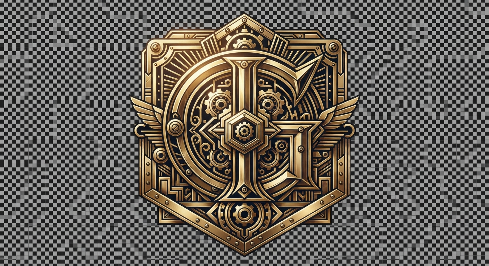
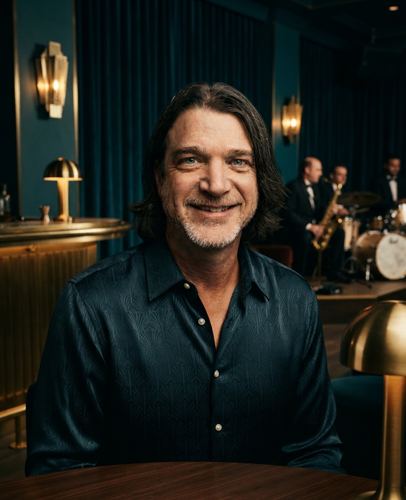

# Design System

## section:css

```css
@import url('https://fonts.googleapis.com/css2?family=Forum&family=JetBrains+Mono:wght@300;400;500;700&display=swap'); :root { --abyssal-teal: #030f13; --lacquered-panel: #071d24; --spun-brass: #c5a059; --burnished-gold: #eac072; --ambient-glow: #d48c3f; --parchment-glass: #f4ede2; --font-display: 'Forum', 'Cinzel', Georgia, serif; --font-mono: 'JetBrains Mono', 'Fira Code', monospace; --double-brass: 4px double var(--spun-brass); --thin-gold: 1px solid rgba(197, 160, 89, 0.4); --step-transition: all 0.35s cubic-bezier(0.25, 1, 0.5, 1); } * { box-sizing: border-box; margin: 0; padding: 0; } body { background-color: var(--abyssal-teal); color: var(--parchment-glass); font-family: var(--font-mono); font-size: 14px; line-height: 1.6; overflow-x: hidden; letter-spacing: -0.01em; background-image: radial-gradient(circle at 10% 20%, rgba(7, 29, 36, 0.8) 0%, transparent 50%), radial-gradient(circle at 90% 80%, rgba(197, 160, 89, 0.04) 0%, transparent 60%), linear-gradient(180deg, rgba(3, 15, 19, 0.9) 0%, rgba(3, 15, 19, 1) 100%); background-attachment: fixed; } .lounge-container { max-width: 1400px; margin: 0 auto; padding: 16px; min-height: 100vh; display: flex; flex-direction: column; position: relative; } @media (min-width: 768px) { .lounge-container { padding: 40px; } .lounge-container::before { content: ''; position: absolute; inset: 20px; border: 1px solid rgba(197, 160, 89, 0.08); pointer-events: none; z-index: 1; } } .dual-rail-header { border-top: var(--double-brass); border-bottom: var(--double-brass); padding: 16px 0; margin-bottom: 32px; display: flex; flex-direction: column; gap: 20px; align-items: center; position: relative; background: linear-gradient(90deg, transparent, rgba(7, 29, 36, 0.4) 50%, transparent); } @media (min-width: 768px) { .dual-rail-header { flex-direction: row; justify-content: space-between; padding: 20px 32px; margin-bottom: 56px; } } .logo-wrapper { height: 52px; display: flex; align-items: center; } .logo-img { height: 100%; width: auto; filter: sepia(1) saturate(1.2) hue-rotate(5deg) contrast(1.2) brightness(0.9); } .nav-links-container { display: flex; flex-wrap: wrap; gap: 12px; justify-content: center; } .nav-link-item { font-family: var(--font-mono); font-size: 11px; text-transform: uppercase; letter-spacing: 0.2em; color: var(--spun-brass); text-decoration: none; padding: 10px 20px; min-height: 44px; display: inline-flex; align-items: center; border: 1px solid transparent; transition: var(--step-transition); position: relative; } .nav-link-item::after { content: ''; position: absolute; bottom: 0; left: 50%; width: 0; height: 1px; background-color: var(--burnished-gold); transition: var(--step-transition); transform: translateX(-50%); } .nav-link-item:hover, .nav-link-item.active { color: var(--burnished-gold); background: rgba(197, 160, 89, 0.05); } .nav-link-item:hover::after, .nav-link-item.active::after { width: 60%; } .lounge-accents { display: flex; align-items: center; gap: 20px; } .rotary-dial { width: 44px; height: 44px; border-radius: 50%; border: var(--thin-gold); background: radial-gradient(circle, var(--burnished-gold) 8%, transparent 10%), radial-gradient(circle, var(--lacquered-panel) 45%, var(--spun-brass) 47%, var(--spun-brass) 50%, var(--lacquered-panel) 52%); position: relative; cursor: pointer; transition: transform 0.6s cubic-bezier(0.25, 1, 0.5, 1); box-shadow: 0 4px 15px rgba(0,0,0,0.5), inset 0 0 10px rgba(197, 160, 89, 0.2); } .rotary-dial::before { content: ''; position: absolute; inset: 4px; border-radius: 50%; border: 1px dashed rgba(197, 160, 89, 0.35); } .rotary-dial::after { content: ''; position: absolute; top: 6px; left: 50%; width: 2px; height: 10px; background: var(--ambient-glow); transform: translateX(-50%); border-radius: 1px; } .rotary-dial:active { transform: rotate(90deg); } .hero-banner { position: relative; background-image: linear-gradient(rgba(7, 29, 36, 0.8), rgba(3, 15, 19, 0.95)), url('assets/hero.jpg'); background-size: cover; background-position: center; border: var(--thin-gold); padding: 40px 24px; margin-bottom: 32px; box-shadow: 0 20px 40px rgba(0,0,0,0.6); } @media (min-width: 768px) { .hero-banner { padding: 80px 48px; } } .ziggurat-panel { background: var(--lacquered-panel); border: var(--thin-gold); position: relative; padding: 24px; margin-bottom: 32px; box-shadow: 0 20px 40px rgba(0,0,0,0.6), inset 0 0 30px rgba(197, 160, 89, 0.03); overflow: hidden; clip-path: polygon( 0 24px, 24px 24px, 24px 0, calc(100% - 24px) 0, calc(100% - 24px) 24px, 100% 24px, 100% calc(100% - 24px), calc(100% - 24px) calc(100% - 24px), calc(100% - 24px) 100%, 24px 100%, 24px calc(100% - 24px), 0 calc(100% - 24px) ); } .ziggurat-panel::before { content: ''; position: absolute; inset: 4px; border: 1px solid rgba(197, 160, 89, 0.15); pointer-events: none; clip-path: inherit; } @media (min-width: 768px) { .ziggurat-panel { padding: 48px; margin-bottom: 56px; } } .brass-interactive { position: relative; transition: var(--step-transition); } .brass-interactive::before { content: ''; position: absolute; inset: 0; border: 1px solid transparent; pointer-events: none; transition: var(--step-transition); } .brass-interactive:hover { box-shadow: 0 0 30px rgba(197, 160, 89, 0.12), inset 0 0 20px rgba(197, 160, 89, 0.05); border-color: var(--burnished-gold); background-color: rgba(7, 29, 36, 0.6); } .brass-interactive:hover::before { border-color: var(--burnished-gold); opacity: 0.4; transform: scale(0.98); } .deco-headline { font-family: var(--font-display); font-size: clamp(2.2rem, 5.5vw, 5rem); font-weight: 400; line-height: 1.05; text-transform: uppercase; letter-spacing: 0.08em; color: var(--burnished-gold); margin-bottom: 20px; text-shadow: 0 2px 10px rgba(0,0,0,0.5); } .deco-tagline { font-size: clamp(1rem, 2vw, 1.35rem); color: var(--parchment-glass); max-width: 800px; margin-bottom: 32px; font-weight: 300; opacity: 0.95; border-left: 3px double var(--spun-brass); padding-left: 20px; } .panel-eyebrow { font-family: var(--font-mono); font-size: 11px; text-transform: uppercase; letter-spacing: 0.25em; color: var(--ambient-glow); margin-bottom: 16px; display: flex; align-items: center; gap: 12px; } .panel-eyebrow::after { content: ''; flex-grow: 1; height: 6px; background-image: repeating-linear-gradient(135deg, transparent, transparent 4px, var(--spun-brass) 4px, var(--spun-brass) 6px, transparent 6px, transparent 10px); opacity: 0.5; } .lounge-grid { display: grid; grid-template-columns: 1fr; gap: 32px; } @media (min-width: 992px) { .lounge-grid { grid-template-columns: 2fr 1fr; gap: 56px; } } .project-list-wrapper { display: grid; grid-template-columns: 1fr; gap: 32px; } .designs-grid-container { display: grid; grid-template-columns: 1fr; gap: 32px; } @media (min-width: 768px) { .designs-grid-container { grid-template-columns: repeat(2, 1fr); } } @media (min-width: 1200px) { .designs-grid-container { grid-template-columns: repeat(3, 1fr); } } .project-card { background: rgba(3, 15, 19, 0.75); border: var(--thin-gold); padding: 28px; transition: var(--step-transition); display: flex; flex-direction: column; justify-content: space-between; min-height: 260px; position: relative; } .project-card::after { content: ''; position: absolute; top: 0; right: 0; width: 16px; height: 16px; border-top: 1px solid var(--spun-brass); border-right: 1px solid var(--spun-brass); opacity: 0.5; transition: var(--step-transition); } .project-card:hover::after { width: 30px; height: 30px; opacity: 1; } .project-card-header { display: flex; justify-content: space-between; align-items: flex-start; margin-bottom: 20px; gap: 16px; } .project-card-title { font-family: var(--font-display); font-size: 1.95rem; line-height: 1.15; text-transform: uppercase; margin-top: 4px; letter-spacing: 0.02em; } .project-card-title a { color: var(--burnished-gold); text-decoration: none; transition: var(--step-transition); } .project-card-title a:hover { color: var(--parchment-glass); text-shadow: 0 0 10px rgba(234, 192, 114, 0.25); } .project-card-meta { font-family: var(--font-mono); font-size: 11px; color: var(--spun-brass); display: block; letter-spacing: 0.1em; } .project-card-desc { font-size: 13px; color: var(--parchment-glass); opacity: 0.85; margin-bottom: 28px; flex-grow: 1; line-height: 1.6; } .project-card-footer { display: flex; flex-direction: column; gap: 14px; border-top: 1px solid rgba(197, 160, 89, 0.15); padding-top: 20px; } .project-item-logo-wrapper img { max-height: 40px; width: auto; filter: sepia(1) saturate(1.3) contrast(1.1); } .lounge-link-action { color: var(--ambient-glow); text-decoration: none; font-size: 11px; letter-spacing: 0.1em; text-transform: uppercase; transition: var(--step-transition); word-break: break-all; font-weight: 500; } .lounge-link-action:hover { color: var(--burnished-gold); text-shadow: 0 0 8px rgba(212, 140, 63, 0.3); } .design-card { background: rgba(7, 29, 36, 0.8); border: var(--thin-gold); display: flex; flex-direction: column; overflow: hidden; transition: var(--step-transition); position: relative; } .design-card-preview { aspect-ratio: 16/10; overflow: hidden; border-bottom: var(--thin-gold); position: relative; background: var(--abyssal-teal); } .design-preview-img { width: 100%; height: 100%; object-fit: cover; filter: sepia(0.3) brightness(0.85) contrast(1.15); transition: var(--step-transition); } .design-card:hover .design-preview-img { filter: sepia(0.1) brightness(0.95) contrast(1.05); transform: scale(1.03); } .design-card-body { padding: 24px; display: flex; flex-direction: column; gap: 14px; flex-grow: 1; } .design-card-meta { display: flex; justify-content: space-between; font-size: 11px; color: var(--spun-brass); text-transform: uppercase; letter-spacing: 0.1em; } .design-card-title { font-family: var(--font-display); font-size: 1.6rem; text-transform: uppercase; letter-spacing: 0.02em; } .design-card-title a { color: var(--burnished-gold); text-decoration: none; } .design-card-desc { font-size: 13px; opacity: 0.8; line-height: 1.6; flex-grow: 1; } .backlink-container { margin-bottom: 32px; } .backlink-container a { font-size: 11px; color: var(--spun-brass); text-transform: uppercase; letter-spacing: 0.15em; text-decoration: none; padding: 12px 20px; border: var(--thin-gold); display: inline-flex; align-items: center; min-height: 44px; background: rgba(7, 29, 36, 0.9); clip-path: polygon(0 0, calc(100% - 10px) 0, 100% 10px, 100% 100%, 10px 100%, 0 calc(100% - 10px)); transition: var(--step-transition); } .backlink-container a:hover { color: var(--burnished-gold); border-color: var(--burnished-gold); background: rgba(197, 160, 89, 0.05); box-shadow: 0 0 15px rgba(234, 192, 114, 0.15); } .detail-hero-block { display: flex; flex-direction: column; gap: 20px; margin-bottom: 40px; } .detail-logo-container img { max-height: 72px; width: auto; filter: sepia(0.8) saturate(1.2); } .detail-metadata-strip { display: grid; grid-template-columns: 1fr; gap: 20px; border-top: var(--double-brass); padding-top: 28px; } @media (min-width: 768px) { .detail-metadata-strip { grid-template-columns: repeat(4, 1fr); } } .metadata-item { display: flex; flex-direction: column; gap: 6px; } .metadata-item.actions { justify-content: flex-end; gap: 10px; } .metadata-label { font-size: 10px; color: var(--ambient-glow); letter-spacing: 0.15em; text-transform: uppercase; } .metadata-value { font-size: 13px; color: var(--parchment-glass); font-weight: 500; } .tech-badge-container, .tag-badge-container { display: flex; flex-wrap: wrap; gap: 8px; } .tech-badge-container span, .tag-badge-container span, .tech-badge-container a, .tag-badge-container a { font-size: 10px; color: var(--spun-brass); background: rgba(3, 15, 19, 0.8); padding: 5px 10px; border: 1px solid rgba(197, 160, 89, 0.25); text-decoration: none; text-transform: uppercase; letter-spacing: 0.05em; transition: var(--step-transition); } .tech-badge-container a:hover, .tag-badge-container a:hover { border-color: var(--burnished-gold); color: var(--burnished-gold); } .design-preview-hero-container { margin-bottom: 40px; border: var(--double-brass); padding: 12px; background: var(--lacquered-panel); box-shadow: 0 20px 45px rgba(0,0,0,0.7); } .design-preview-main { width: 100%; height: auto; display: block; filter: sepia(0.15) contrast(1.05); } .author-portrait { width: 120px; height: 120px; border-radius: 50%; border: 2px solid var(--spun-brass); background-image: url('assets/portrait.jpg'); background-size: cover; background-position: center; filter: sepia(0.3) contrast(1.1); margin-bottom: 20px; box-shadow: 0 10px 20px rgba(0,0,0,0.5); } .prose-content { font-size: 15px; line-height: 1.8; color: var(--parchment-glass); } .prose-content p { margin-bottom: 24px; } .prose-content h2, .prose-content h3, .prose-content h4 { font-family: var(--font-display); color: var(--burnished-gold); text-transform: uppercase; margin-top: 40px; margin-bottom: 20px; letter-spacing: 0.08em; line-height: 1.2; } .prose-content ul, .prose-content ol { margin-bottom: 28px; padding-left: 24px; } .prose-content li { margin-bottom: 10px; } .prose-content img, .prose-content .md-img { max-width: 100%; height: auto; border: var(--double-brass); padding: 12px; background: var(--lacquered-panel); filter: sepia(0.25) contrast(1.08) brightness(0.92); transition: var(--step-transition); display: block; margin: 40px 0; } .prose-content img:hover, .prose-content .md-img:hover { filter: none; box-shadow: 0 0 30px rgba(197, 160, 89, 0.2); } .detail-source-footer { margin-top: 56px; border-top: 1px solid rgba(197, 160, 89, 0.15); padding-top: 32px; } .lounge-form { display: flex; flex-direction: column; gap: 20px; } .lounge-input { background: var(--abyssal-teal); border: var(--thin-gold); color: var(--parchment-glass); font-family: var(--font-mono); padding: 12px 18px; outline: none; min-height: 46px; transition: var(--step-transition); clip-path: polygon(0 0, calc(100% - 12px) 0, 100% 12px, 100% 100%, 12px 100%, 0 calc(100% - 12px)); } .lounge-input:focus { border-color: var(--burnished-gold); box-shadow: 0 0 15px rgba(197, 160, 89, 0.15); } .lounge-btn { background: var(--spun-brass); color: var(--abyssal-teal); border: none; font-family: var(--font-mono); font-weight: 700; text-transform: uppercase; letter-spacing: 0.18em; padding: 14px 28px; min-height: 46px; cursor: pointer; transition: var(--step-transition); display: inline-flex; align-items: center; justify-content: center; text-decoration: none; clip-path: polygon(12px 0, 100% 0, 100% calc(100% - 12px), calc(100% - 12px) 100%, 0 100%, 0 12px); } .lounge-btn:hover { background: var(--burnished-gold); color: var(--abyssal-teal); box-shadow: 0 0 20px rgba(234, 192, 114, 0.35); } .deco-ornament { display: flex; flex-direction: column; align-items: center; justify-content: center; border: var(--thin-gold); padding: 28px; background: linear-gradient(180deg, rgba(7, 29, 36, 0.8) 0%, rgba(3, 15, 19, 0.9) 100%); position: relative; clip-path: polygon(50% 0%, 100% 20%, 100% 100%, 0% 100%, 0% 20%); } .deco-ornament::before { content: ''; position: absolute; inset: 4px; border: 1px solid rgba(197, 160, 89, 0.15); pointer-events: none; clip-path: inherit; } .ornament-svg { width: 120px; height: 120px; stroke: var(--burnished-gold); fill: none; stroke-width: 1.5; } .ornament-wave { transform-origin: bottom center; animation: pulseFan 2.4s infinite ease-in-out; } .ornament-wave-2 { animation-delay: 0.8s; } .ornament-wave-3 { animation-delay: 1.6s; } @keyframes pulseFan { 0%, 100% { transform: scaleY(0.7) scaleX(0.85); opacity: 0.35; } 50% { transform: scaleY(1.15) scaleX(1.05); opacity: 1; filter: drop-shadow(0 0 4px var(--burnished-gold)); } } .lounge-footer { margin-top: auto; border-top: var(--double-brass); padding: 32px 0; display: flex; flex-direction: column; gap: 20px; align-items: center; background: linear-gradient(180deg, transparent, rgba(7, 29, 36, 0.3)); } @media (min-width: 768px) { .lounge-footer { flex-direction: row; justify-content: space-between; } } .colophon-display { font-family: var(--font-mono); font-size: 11px; color: var(--spun-brass); background: rgba(7, 29, 36, 0.8); padding: 8px 16px; border: var(--thin-gold); clip-path: polygon(0 0, calc(100% - 8px) 0, 100% 8px, 100% 100%, 8px 100%, 0 calc(100% - 8px)); } .theme-pills-container { display: flex; gap: 8px; }
```

## section:layout:shell

```html
<!DOCTYPE html><html lang='en'><head><meta charset='UTF-8'><meta name='viewport' content='width=device-width, initial-scale=1.0'><link rel='icon' href='assets/favicon.png'><link rel='stylesheet' href='theme.css'><link rel='preconnect' href='https://fonts.googleapis.com'><link rel='preconnect' href='https://fonts.gstatic.com' crossorigin><link href='https://fonts.googleapis.com/css2?family=Forum&family=JetBrains+Mono:wght@300;400;500&display=swap' rel='stylesheet'><style>:root { --midnight-teal: #061e22; --deep-teal: #092c32; --brass-accent: #c5a059; --brass-dim: #997a3f; --brass-light: #e6cb94; --text-gold: #e2d2b5; --font-serif: 'Forum', Georgia, serif; --font-mono: 'JetBrains Mono', monospace; } body { background-color: var(--midnight-teal); color: var(--text-gold); font-family: var(--font-serif); margin: 0; padding: 0; min-height: 100vh; display: flex; flex-direction: column; align-items: center; box-sizing: border-box; } .deco-lounge-frame { width: 100%; max-width: 1400px; min-height: 100vh; margin: 0 auto; display: flex; flex-direction: column; box-sizing: border-box; position: relative; padding: 24px; border: 2px solid var(--brass-accent); box-shadow: inset 0 0 0 6px var(--midnight-teal), inset 0 0 0 8px var(--brass-dim), 0 20px 50px rgba(0,0,0,0.8); background-image: radial-gradient(circle at 50% 15%, var(--deep-teal) 0%, var(--midnight-teal) 70%); } .deco-lounge-frame::before, .deco-lounge-frame::after { content: ''; position: absolute; width: 40px; height: 40px; border: 3px solid var(--brass-light); pointer-events: none; z-index: 5; } .deco-lounge-frame::before { top: 12px; left: 12px; border-right: none; border-bottom: none; } .deco-lounge-frame::after { bottom: 12px; right: 12px; border-left: none; border-top: none; } .stepped-deco-header { display: flex; justify-content: space-between; align-items: center; padding: 25px 40px; border-bottom: 4px double var(--brass-accent); position: relative; margin-bottom: 40px; } .stepped-deco-header::after { content: ''; position: absolute; bottom: -15px; left: 50%; transform: translateX(-50%); width: 60px; height: 15px; background: var(--brass-accent); clip-path: polygon(0 0, 50% 100%, 100% 0); } .logo-wrapper { display: flex; align-items: center; } .logo-img { height: 45px; filter: drop-shadow(0 2px 4px rgba(0,0,0,0.5)); } .nav-links-container { display: flex; gap: 24px; font-family: var(--font-serif); text-transform: uppercase; letter-spacing: 0.15em; } .nav-link-item { color: var(--text-gold); text-decoration: none; font-size: 1.1rem; transition: all 0.3s ease; position: relative; padding: 5px 10px; } .nav-link-item::before { content: ''; position: absolute; bottom: -4px; left: 50%; transform: translateX(-50%); width: 0; height: 2px; background-color: var(--brass-light); transition: width 0.3s ease; } .nav-link-item:hover::before, .nav-link-item.active::before { width: 100%; } .nav-link-item:hover, .nav-link-item.active { color: var(--brass-light); text-shadow: 0 0 10px rgba(197, 160, 89, 0.6); } .deco-interactive-accent { width: 44px; height: 44px; border-radius: 50%; border: 2px solid var(--brass-accent); background: radial-gradient(circle, var(--brass-light) 0%, var(--brass-dim) 100%); cursor: pointer; position: relative; transition: transform 0.6s cubic-bezier(0.25, 1, 0.5, 1); box-shadow: 0 0 10px rgba(197, 160, 89, 0.4); display: flex; align-items: center; justify-content: center; } .deco-interactive-accent:hover { transform: rotate(90deg); } .deco-interactive-accent::before { content: ''; width: 70%; height: 70%; border: 1px dashed var(--midnight-teal); border-radius: 50%; } .deco-interactive-accent::after { content: ''; position: absolute; top: 0; left: 50%; width: 2px; height: 15px; background-color: var(--midnight-teal); transform: translateX(-50%); } main { flex: 1; padding: 0 40px; display: flex; flex-direction: column; } .deco-lounge-footer { margin-top: 60px; padding: 30px 40px; border-top: 1px solid var(--brass-dim); display: flex; justify-content: space-between; align-items: center; font-family: var(--font-mono); font-size: 0.85rem; letter-spacing: 0.05em; position: relative; } .deco-lounge-footer::before { content: ''; position: absolute; top: 3px; left: 0; width: 100%; height: 1px; background-color: var(--brass-accent); opacity: 0.5; } .jazz-pills-container { display: flex; gap: 12px; } .jazz-pills-container > * { background: rgba(197, 160, 89, 0.1); border: 1px solid var(--brass-dim); color: var(--brass-light); padding: 4px 12px; border-radius: 0; font-size: 0.75rem; text-transform: uppercase; letter-spacing: 0.1em; transition: background 0.3s ease; } .jazz-pills-container > *:hover { background: rgba(197, 160, 89, 0.25); border-color: var(--brass-accent); } .brass-path-display { color: var(--brass-dim); } .hero-banner { background-image: url('assets/hero.jpg'); background-size: cover; background-position: center; background-repeat: no-repeat; } .portrait-display { background-image: url('assets/portrait.jpg'); background-size: cover; background-position: center; background-repeat: no-repeat; } @media (max-width: 768px) { .deco-lounge-frame { padding: 12px; } .stepped-deco-header { flex-direction: column; gap: 20px; padding: 20px; } .deco-lounge-footer { flex-direction: column; gap: 20px; text-align: center; } }</style></head><body><div class='deco-lounge-frame'><header class='stepped-deco-header'><div class='logo-wrapper'></div><nav class='nav-links-container'>{{NAV_LINKS}}</nav><div class='deco-controls'><div class='deco-interactive-accent' id='themeDecoMedallion'></div></div></header><main>{{CONTENT}}</main><footer class='deco-lounge-footer'><div class='jazz-pills-container'>{{THEME_PILLS}}</div><div class='brass-path-display'>{{SOURCE_PATH}}</div></footer></div></body></html>
```

## section:layout:home

```html
<section class="lounge-hero-stage ziggurat-panel stepped-frame-header" style="background-image: url('assets/hero.jpg'); background-size: cover; background-position: center;"><div class="deco-chevron-accent"></div><div class="hero-content"><h1 class="deco-headline">{{HEADLINE}}</h1><p class="deco-tagline">{{TAGLINE}}</p></div></section><div class="deco-layout-grid"><div class="main-panel-stack"><div class="ziggurat-panel brass-accented-panel"><div class="deco-chevron-accent"></div><div class="intro-layout" style="display: flex; gap: 20px; align-items: center;"><p class="intro-prose">{{INTRO}}</p></div></div><div class="ziggurat-panel brass-accented-panel"><div class="deco-chevron-accent"></div><div class="project-list-wrapper">{{FEATURED_PROJECTS}}</div></div></div><div class="sidebar-panel-stack"><div class="ziggurat-panel geometric-motif-panel"><div class="deco-chevron-accent"></div><div class="deco-grill-work"><svg class="deco-chevron-divider" viewBox="0 0 100 100" fill="none" stroke="#c5a059" stroke-width="2"><path d="M10,20 L50,50 L90,20" /><path d="M20,30 L50,52.5 L80,30" /><path d="M30,40 L50,55 L70,40" /><line x1="50" y1="10" x2="50" y2="90" /><path d="M10,80 L50,50 L90,80" /><path d="M20,70 L50,47.5 L80,70" /><path d="M30,60 L50,45 L70,60" /></svg></div></div><div class="ziggurat-panel brass-accented-panel"><div class="deco-chevron-accent"></div><div class="stepped-form-container">{{GENERATOR_FORM}}</div></div></div></div>
```

## section:layout:projects_index

```html
<style>@import url('https://fonts.googleapis.com/css2?family=Forum&family=JetBrains+Mono:wght@300;400;500&display=swap'); .art-deco-jazz-lounge { --color-teal-midnight: #03141a; --color-teal-lounge: #06222c; --color-brass-primary: #c5a059; --color-brass-glow: rgba(197, 160, 89, 0.35); --color-brass-faint: rgba(197, 160, 89, 0.15); --font-serif-forum: 'Forum', serif; --font-mono-jetbrains: 'JetBrains Mono', monospace; background-color: var(--color-teal-midnight); padding: 3rem 1.5rem; box-sizing: border-box; min-height: 100vh; } .ziggurat-panel { background-color: var(--color-teal-lounge); border: 1px solid var(--color-brass-primary); position: relative; padding: 2.5rem; margin: 0 auto; max-width: 1200px; box-shadow: inset 0 0 30px rgba(0, 0, 0, 0.8), 0 10px 30px rgba(0, 0, 0, 0.5); } .ziggurat-panel::after { content: ''; position: absolute; top: 6px; left: 6px; right: 6px; bottom: 6px; border: 1px solid var(--color-brass-faint); pointer-events: none; } .panel-eyebrow { position: absolute; top: -1px; left: 50%; transform: translateX(-50%); background-color: var(--color-teal-midnight); border-left: 1px solid var(--color-brass-primary); border-right: 1px solid var(--color-brass-primary); border-bottom: 1px solid var(--color-brass-primary); padding: 4px 20px; height: 12px; display: flex; align-items: center; justify-content: center; z-index: 10; } .panel-eyebrow::before { content: ''; width: 6px; height: 6px; border-bottom: 1px solid var(--color-brass-primary); border-right: 1px solid var(--color-brass-primary); transform: rotate(45deg); margin-bottom: 2px; } .project-list-wrapper { position: relative; font-family: var(--font-mono-jetbrains); z-index: 2; color: #fff; } .corner-step { position: absolute; width: 16px; height: 16px; border: 1px solid var(--color-brass-primary); background-color: var(--color-teal-lounge); z-index: 5; } .step-tl { top: -6px; left: -6px; border-right: none; border-bottom: none; } .step-tr { top: -6px; right: -6px; border-left: none; border-bottom: none; } .step-bl { bottom: -6px; left: -6px; border-right: none; border-top: none; } .step-br { bottom: -6px; right: -6px; border-left: none; border-top: none; }</style><div class="art-deco-jazz-lounge"><div class="ziggurat-panel"><div class="corner-step step-tl"></div><div class="corner-step step-tr"></div><div class="corner-step step-bl"></div><div class="corner-step step-br"></div><div class="panel-eyebrow"></div><div class="project-list-wrapper">{{PROJECT_LIST}}</div></div></div>
```

## section:layout:designs_index

```html
<section class="deco-lounge-container lounge-designs-index">
  <header class="deco-stepped-frame lounge-index-header">
    <div class="deco-corner-brass top-left"></div>
    <div class="deco-corner-brass top-right"></div>
    <div class="deco-corner-brass bottom-left"></div>
    <div class="deco-corner-brass bottom-right"></div>
    <div class="panel-eyebrow-brass"></div>
    <div class="panel-sub-brass"></div>
  </header>
  <div class="deco-chevron-divider">
    <span class="chevron-line"></span>
    <span class="chevron-center-gem"></span>
    <span class="chevron-line"></span>
  </div>
  <main class="designs-grid-container stepped-grid-border">
    {{DESIGN_CARDS}}
  </main>
</section>
```

## section:layout:project_detail

```html
<div class="deco-stepped-frame art-deco-glow"><div class="deco-corner-accent top-left"></div><div class="deco-corner-accent top-right"></div><div class="deco-corner-accent bottom-left"></div><div class="deco-corner-accent bottom-right"></div><div class="detail-hero-block"><div class="detail-logo-container"></div><h1 class="deco-headline-serif">{{NAME}}</h1></div><div class="deco-chevron-separator"></div></div><div class="deco-stepped-frame deco-content-panel"><div class="deco-chevron-separator reversed"></div><article class="prose-content jazz-lounge-typography">{{CONTENT}}</article><div class="deco-chevron-separator"></div></div>
```

## section:layout:design_detail

```html
<div class="lounge-chassis"><div class="ziggurat-panel deco-stepped-frame"><div class="deco-corner-accent top-left"></div><div class="deco-corner-accent top-right"></div><div class="detail-hero-block"><h1 class="deco-headline">{{NAME}}</h1><div class="deco-chevron-divider"></div></div></div><div class="ziggurat-panel deco-lounge-panel"><div class="deco-corner-accent top-left"></div><div class="deco-corner-accent top-right"></div><article class="prose-content">{{CONTENT}}</article></div></div>
```

## section:layout:page

```html
<main class="lounge-wrapper"><header class="deco-stepped-frame lounge-header"><div class="deco-corner-accent"></div><h1 class="deco-headline">{{NAME}}</h1><div class="deco-chevron-divider"></div></header><section class="deco-stepped-frame lounge-content"><div class="deco-corner-accent"></div><article class="prose-content">{{CONTENT}}</article><div class="deco-chevron-divider footer-divider"></div></section></main>
```

## section:layout:project_item

```html
<article class="project-card deco-stepped-frame"><div class="deco-corner top-left"></div><div class="deco-corner top-right"></div><div class="deco-corner bottom-left"></div><div class="deco-corner bottom-right"></div><header class="project-card-header"><div class="project-card-meta-group"><span class="project-card-meta">{{INDEX}} &mdash; {{YEAR}}</span><h3 class="project-card-title"><a href="{{URL}}" class="deco-title-link">{{NAME}}</a></h3></div><div class="project-item-logo-wrapper deco-logo-frame">{{LOGO}}</div></header><div class="deco-divider-chevron"></div><p class="project-card-desc">{{DESCRIPTION}}</p><footer class="project-card-footer"><div class="tech-badge-container">{{TECH_BADGES}}</div><div class="project-card-actions"><a href="{{REPO_URL}}" class="deco-action-link">{{REPO_URL}}</a></div></footer></article>
```

## section:layout:design_item

```html
<div class="lounge-card deco-card-interactive" style="background: #0a1e24; border: 1px solid rgba(197, 160, 89, 0.3); padding: 24px; position: relative; display: flex; flex-direction: column; justify-content: center; align-items: center; text-align: center; gap: 16px; transition: transform 0.3s ease, border-color 0.3s ease; border-radius: 0; min-height: 120px;"><div class="deco-corner-top-left" style="position: absolute; top: -1px; left: -1px; width: 12px; height: 12px; border-top: 2px solid #c5a059; border-left: 2px solid #c5a059; transition: all 0.3s ease;"></div><div class="deco-corner-bottom-right" style="position: absolute; bottom: -1px; right: -1px; width: 12px; height: 12px; border-bottom: 2px solid #c5a059; border-right: 2px solid #c5a059; transition: all 0.3s ease;"></div><div class="lounge-card-body" style="display: flex; flex-direction: column; align-items: center; gap: 12px; width: 100%;"><h3 class="lounge-card-title" style="margin: 0; font-family: 'Forum', serif; font-size: 1.6rem; line-height: 1.2; letter-spacing: 0.05em; text-transform: uppercase;"><a href="{{URL}}" style="color: #ffffff; text-decoration: none; transition: color 0.3s ease; display: inline-block;">{{NAME}}</a></h3><svg class="deco-divider" viewBox="0 0 100 6" fill="none" xmlns="http://www.w3.org/2000/svg" style="width: 60px; height: 6px; margin: 0 auto;"><path d="M0 3H42L46 6H54L58 3H100" stroke="#c5a059" stroke-width="1.5" stroke-opacity="0.8"/></svg></div><style>.deco-card-interactive:hover { transform: translateY(-4px); border-color: #c5a059 !important; box-shadow: 0 8px 24px rgba(197, 160, 89, 0.2) !important; } .deco-card-interactive:hover .deco-corner-top-left { width: 24px; height: 24px; } .deco-card-interactive:hover .deco-corner-bottom-right { width: 24px; height: 24px; } .deco-card-interactive h3 a:hover { color: #c5a059 !important; }</style></div>
```

## section:layout:nav_item

```html
<style>.lounge-nav-item { position: relative; display: inline-flex; align-items: center; justify-content: center; padding: 0.6rem 1.6rem; color: #c5a059; font-family: 'Forum', serif; font-size: 0.95rem; text-transform: uppercase; text-decoration: none; letter-spacing: 0.15em; transition: all 0.4s ease; background: rgba(13, 35, 41, 0.6); border: 1px solid rgba(197, 160, 89, 0.3); } .lounge-nav-item::before { content: ""; position: absolute; inset: 3px; border: 1px solid rgba(197, 160, 89, 0.15); transition: all 0.4s ease; } .lounge-nav-item:hover { color: #fdfbf7; background: rgba(13, 35, 41, 0.9); border-color: #c5a059; box-shadow: 0 0 10px rgba(197, 160, 89, 0.2), inset 0 0 15px rgba(197, 160, 89, 0.1); } .lounge-nav-item:hover::before { border-color: rgba(197, 160, 89, 0.6); inset: 4px; } .lounge-deco-cnr { position: absolute; width: 6px; height: 6px; border: 1px solid #c5a059; opacity: 0.5; transition: all 0.4s ease; } .lounge-nav-item:hover .lounge-deco-cnr { opacity: 1; width: 8px; height: 8px; border-color: #fdfbf7; } .ldc-tl { top: 1px; left: 1px; border-right: none; border-bottom: none; } .ldc-tr { top: 1px; right: 1px; border-left: none; border-bottom: none; } .ldc-bl { bottom: 1px; left: 1px; border-right: none; border-top: none; } .ldc-br { bottom: 1px; right: 1px; border-left: none; border-top: none; } .lounge-nav-txt { position: relative; z-index: 2; }</style><a href="{{NAV_URL}}" class="lounge-nav-item"><span class="lounge-deco-cnr ldc-tl"></span><span class="lounge-deco-cnr ldc-tr"></span><span class="lounge-nav-txt">{{NAV_NAME}}</span><span class="lounge-deco-cnr ldc-bl"></span><span class="lounge-deco-cnr ldc-br"></span></a>
```
