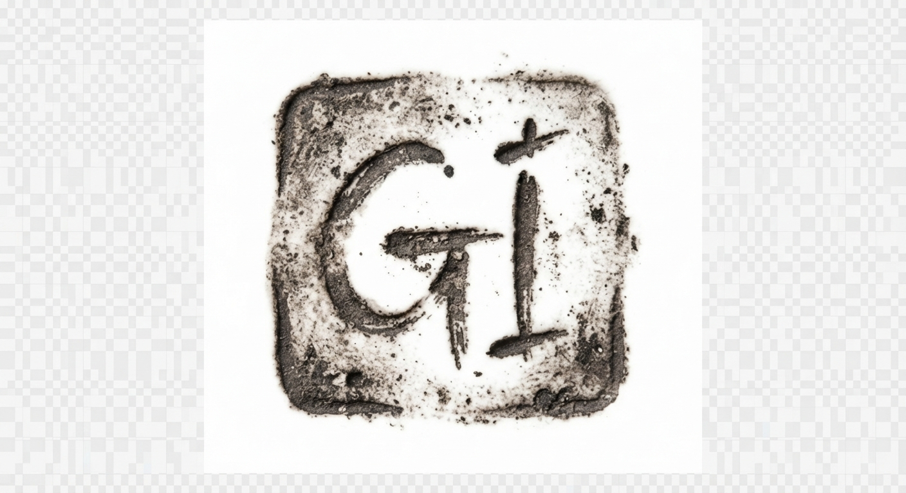

# Design System

## section:css

```css
:root{--bg-oatmeal:#F5F2EB;--bg-slip-white:#FAF8F5;--text-charcoal:#1F2020;--text-iron-oxide:#3A3C3B;--accent-glaze:#5A6E68;--font-display:'Playfair Display',Georgia,serif;--font-mono:'JetBrains Mono',monospace;--border-radius-organic:6px 4px 7px 5px;--transition-tactile:cubic-bezier(0.25,1,0.5,1)0.6s;--text-xs:clamp(0.75rem,0.7rem + 0.25vw,0.875rem);--text-sm:clamp(0.875rem,0.8vw + 0.6rem,1rem);--text-base:clamp(1rem,1vw + 0.75rem,1.125rem);--text-lg:clamp(1.25rem,1.5vw + 1rem,1.5rem);--text-xl:clamp(1.75rem,2.5vw + 1.25rem,2.5rem);--text-xxl:clamp(2.5rem,4.5vw + 1.5rem,4rem);--space-xs:clamp(0.5rem,0.6vw + 0.3rem,0.75rem);--space-sm:clamp(0.75rem,1vw + 0.5rem,1.25rem);--space-md:clamp(1.25rem,2vw + 0.75rem,2.25rem);--space-lg:clamp(2.25rem,4vw + 1.25rem,4.5rem);--space-xl:clamp(4.5rem,8vw + 2rem,9rem);--shadow-tactile:0 4px 20px -2px rgba(31,32,32,0.04),0 2px 6px -1px rgba(31,32,32,0.02);--shadow-inset-clay:inset 0 2px 4px rgba(31,32,32,0.03);--max-width-editorial:1440px;--border-thin:1px solid rgba(58,60,59,0.15);--border-tactile:1px solid rgba(58,60,59,0.25)}*,*::before,*::after{box-sizing:border-box;margin:0;padding:0}html{font-size:16px;-webkit-text-size-adjust:100%;-moz-osx-font-smoothing:grayscale;-webkit-font-smoothing:antialiased;background-color:var(--bg-oatmeal);color:var(--text-charcoal)}body{min-height:100vh;line-height:1.7;font-family:var(--font-mono);padding:var(--space-md)}@media (min-width:768px){body{padding:var(--space-lg) var(--space-md)}}h1,h2,h3,h4,h5,h6{font-family:var(--font-display);font-weight:400;line-height:1.15;color:var(--text-charcoal);margin-bottom:var(--space-sm);letter-spacing:-0.02em}h1{font-size:var(--text-xxl)}h2{font-size:var(--text-xl)}h3{font-size:var(--text-lg)}p{font-family:var(--font-mono);font-size:var(--text-sm);color:var(--text-iron-oxide);margin-bottom:var(--space-md);max-width:60ch;line-height:1.75}a{color:var(--accent-glaze);text-decoration:none;transition:color var(--transition-tactile),border-color var(--transition-tactile);border-bottom:1px solid transparent}a:hover,a:focus{color:var(--text-charcoal);border-bottom-color:var(--accent-glaze);outline:none}img{max-width:100%;height:auto;display:block;border-radius:var(--border-radius-organic);filter:grayscale(1) sepia(0.05);transition:filter var(--transition-tactile)}img:hover{filter:none}.md-img{width:100%;height:auto;aspect-ratio:4/5;object-fit:cover;filter:grayscale(1) sepia(0.1) contrast(0.95);mix-blend-mode:multiply;border:var(--border-thin)}ul,ol{margin-bottom:var(--space-md);padding-left:1.25rem}li{font-family:var(--font-mono);font-size:var(--text-sm);color:var(--text-iron-oxide);margin-bottom:0.5rem}hr{border:none;border-top:var(--border-thin);margin:var(--space-lg)0}blockquote{font-family:var(--font-display);font-style:italic;font-size:var(--text-lg);line-height:1.5;color:var(--text-charcoal);padding-left:var(--space-sm);border-left:2px solid var(--accent-glaze);margin:var(--space-md)0;max-width:55ch}button,input,select,textarea{font-family:inherit;font-size:inherit;color:inherit;background:none;border:none}.theme-wabi-sabi{background-color:var(--bg-oatmeal);color:var(--text-charcoal);font-family:var(--font-display);min-height:100vh;display:flex;flex-direction:column;box-sizing:border-box;padding:0;margin:0;line-height:1.75;-webkit-font-smoothing:antialiased;-moz-osx-font-smoothing:grayscale}.theme-wabi-sabi *{box-sizing:inherit}.theme-wabi-sabi .layout-wrapper{width:100%;max-width:var(--max-width-editorial);margin-left:auto;margin-right:auto;padding-left:var(--space-md);padding-right:var(--space-md)}.theme-wabi-sabi header{border-bottom:var(--border-thin);padding:var(--space-sm) 0;margin-bottom:var(--space-md)}.theme-wabi-sabi .header-container{display:flex;flex-direction:column;gap:var(--space-xs)}@media (min-width:768px){.theme-wabi-sabi .header-container{flex-direction:row;justify-content:space-between;align-items:center}}.theme-wabi-sabi nav{display:flex;flex-wrap:wrap;gap:var(--space-xs)}.theme-wabi-sabi nav a,.theme-wabi-sabi .nav-link{min-height:44px;min-width:44px;display:inline-flex;align-items:center;padding:0.5rem 1rem;text-decoration:none;font-family:var(--font-mono);color:var(--text-iron-oxide);transition:color var(--transition-tactile)}.theme-wabi-sabi nav a:hover,.theme-wabi-sabi nav a.active,.theme-wabi-sabi .nav-link:hover{color:var(--accent-glaze)}.theme-wabi-sabi main{flex:1 0 auto}.theme-wabi-sabi .shelf-grid{display:grid;grid-template-columns:1fr;gap:var(--space-md);align-items:start}@media (min-width:768px){.theme-wabi-sabi .shelf-grid{grid-template-columns:1.2fr 0.8fr;gap:var(--space-lg)}.theme-wabi-sabi .shelf-grid.reversed{grid-template-columns:0.8fr 1.2fr}.theme-wabi-sabi .shelf-grid.three-col{grid-template-columns:repeat(3,1fr)}}.theme-wabi-sabi .organic-card{background-color:var(--bg-slip-white);border:var(--border-thin);border-radius:var(--border-radius-organic);padding:var(--space-md);box-shadow:var(--shadow-tactile);transition:transform var(--transition-tactile),box-shadow var(--transition-tactile),border-color var(--transition-tactile);display:flex;flex-direction:column;justify-content:space-between;min-height:220px;text-decoration:none;color:inherit}.theme-wabi-sabi .organic-card:hover{transform:translateY(-3px) rotate(0.2deg);box-shadow:0 16px 32px rgba(31,32,32,0.06);border-color:var(--accent-glaze)}.theme-wabi-sabi .organic-card::after{content:'';position:absolute;bottom:8px;right:8px;width:6px;height:6px;background-color:var(--text-iron-oxide);opacity:0.15;border-radius:50%}.theme-wabi-sabi .dry-margin{margin-top:var(--space-lg);margin-bottom:var(--space-lg)}@media (min-width:768px){.theme-wabi-sabi .dry-margin{margin-top:var(--space-xl);margin-bottom:var(--space-xl)}}.theme-wabi-sabi footer{border-top:var(--border-thin);padding:var(--space-md) 0;margin-top:var(--space-lg);font-family:var(--font-mono);font-size:var(--text-xs)}.theme-wabi-sabi .footer-container{display:flex;flex-direction:column;gap:var(--space-sm)}@media (min-width:768px){.theme-wabi-sabi .footer-container{flex-direction:row;justify-content:space-between;align-items:center}}.text-display{font-family:var(--font-display);color:var(--text-charcoal);font-weight:400;line-height:1.2;letter-spacing:-0.02em}.text-mono{font-family:var(--font-mono);color:var(--text-iron-oxide);font-size:var(--text-xs);text-transform:uppercase;letter-spacing:0.08em;line-height:1.5}.kiln-stamp{display:inline-flex;align-items:center;justify-content:center;font-family:var(--font-mono);font-size:0.7rem;color:var(--text-iron-oxide);border:1px solid var(--text-iron-oxide);padding:0.35rem 0.65rem;border-radius:1px;letter-spacing:0.15em;text-transform:uppercase;background-color:transparent;width:fit-content;margin-top:1rem;transition:transform var(--transition-tactile),opacity var(--transition-tactile)}.kiln-stamp:hover{transform:scale(0.95) rotate(-5deg);color:var(--accent-glaze);border-color:var(--accent-glaze)}.glaze-button{display:inline-flex;align-items:center;justify-content:center;min-height:44px;min-width:44px;padding:0.75rem 1.75rem;font-family:var(--font-mono);font-size:var(--text-xs);font-weight:500;text-transform:uppercase;letter-spacing:0.1em;color:var(--text-charcoal);background-color:transparent;border:var(--border-tactile);border-radius:var(--border-radius-organic);cursor:pointer;transition:background-color var(--transition-tactile),color var(--transition-tactile),border-color var(--transition-tactile),transform var(--transition-tactile);text-decoration:none}.glaze-button:hover,.glaze-button:focus{background-color:var(--accent-glaze);color:var(--bg-slip-white);border-color:var(--accent-glaze);transform:translateY(-1px);outline:none}.theme-wabi-sabi input,.theme-wabi-sabi textarea,.theme-wabi-sabi select{width:100%;min-height:44px;padding:0.85rem 1.2rem;background-color:var(--bg-slip-white);border:var(--border-thin);border-radius:var(--border-radius-organic);font-family:var(--font-mono);font-size:var(--text-sm);color:var(--text-charcoal);transition:border-color var(--transition-tactile),box-shadow var(--transition-tactile);box-sizing:border-box}.theme-wabi-sabi input:focus,.theme-wabi-sabi textarea:focus,.theme-wabi-sabi select:focus{outline:none;border-color:var(--accent-glaze);box-shadow:0 0 0 3px rgba(90,110,104,0.15)}.theme-wabi-sabi form label{display:block;margin-bottom:0.5rem;font-family:var(--font-mono);font-size:var(--text-xs);color:var(--text-iron-oxide);text-transform:uppercase;letter-spacing:0.05em}.hero,.hero-section,.hero-banner,.home-hero,.studio-hero{background-image:url('assets/hero.jpg');background-size:cover;background-position:center;border-radius:var(--border-radius-organic);padding:var(--space-xl) var(--space-md);margin-bottom:var(--space-lg);border:var(--border-tactile);display:flex;flex-direction:column;justify-content:center;align-items:flex-start;min-height:450px;position:relative;overflow:hidden}.hero::before,.hero-section::before,.hero-banner::before,.home-hero::before,.studio-hero::before{content:"";position:absolute;top:0;left:0;right:0;bottom:0;background:rgba(31,32,32,0.15);mix-blend-mode:multiply;pointer-events:none;z-index:1}.hero > *,.hero-section > *,.hero-banner > *,.home-hero > *,.studio-hero > *{position:relative;z-index:2}
```

## section:layout:shell

```html
<!DOCTYPE html>
<html lang="en">
<head>
  <meta charset="UTF-8">
  <meta name="viewport" content="width=device-width, initial-scale=1.0">
  <link rel="icon" type="image/png" href="assets/favicon.png">
  <style>
    :root {
      --bg-oatmeal: #F5F2EB;
      --bg-slip-white: #FAF8F5;
      --text-charcoal: #1F2020;
      --text-iron-oxide: #3A3C3B;
      --accent-glaze: #5A6E68;
      --font-display: 'Playfair Display', Georgia, serif;
      --font-mono: 'JetBrains Mono', monospace;
      --border-radius-organic: 12px 18px 14px 20px;
      --border-radius-stamp: 55% 45% 60% 40% / 50% 60% 40% 50%;
      --transition-tactile: cubic-bezier(0.25, 1, 0.5, 1) 0.6s;
      
      /* Fluid variables to scale organically across viewports without overlap */
      --step-0: clamp(0.8rem, 0.76rem + 0.2vw, 0.95rem);
      --step-1: clamp(0.95rem, 0.88rem + 0.35vw, 1.2rem);
      --step-2: clamp(1.35rem, 1.2rem + 0.75vw, 1.95rem);
      --step-3: clamp(1.8rem, 1.5rem + 1.5vw, 3rem);
      --space-s: clamp(1rem, 0.8rem + 1vw, 2rem);
      --space-m: clamp(2rem, 1.6rem + 2vw, 4rem);
      --space-l: clamp(3rem, 2.4rem + 3vw, 6rem);
    }

    * {
      box-sizing: border-box;
      margin: 0;
      padding: 0;
    }

    body {
      background-color: var(--bg-oatmeal);
      color: var(--text-charcoal);
      font-family: var(--font-mono);
      font-size: var(--step-1);
      line-height: 1.65;
      -webkit-font-smoothing: antialiased;
      -moz-osx-font-smoothing: grayscale;
      position: relative;
    }

    /* Subtle tactile grain overlay to mimic handmade stoneware */
    body::before {
      content: "";
      position: fixed;
      top: 0;
      left: 0;
      width: 100vw;
      height: 100vh;
      opacity: 0.035;
      pointer-events: none;
      z-index: 1000;
      background-image: url("data:image/svg+xml,%3Csvg viewBox='0 0 200 200' xmlns='http://www.w3.org/2000/svg'%3E%3Cfilter id='clayNoise'%3E%3CfeTurbulence type='fractalNoise' baseFrequency='0.75' numOctaves='3' stitchTiles='stitch'/%3E%3C/filter%3E%3Crect width='100%25' height='100%25' filter='url(%23clayNoise)'/%3E%3C/svg%3E");
    }

    .theme-wabi-sabi {
      display: flex;
      flex-direction: column;
      min-height: 100vh;
      padding: var(--space-s);
      max-width: 1300px;
      margin: 0 auto;
    }

    header {
      border-bottom: 1px solid rgba(58, 60, 59, 0.15);
      padding-bottom: var(--space-s);
      margin-bottom: var(--space-m);
      display: flex;
      flex-direction: column;
      gap: 16px;
    }

    .logo-container {
      display: inline-block;
      width: 52px;
      height: 52px;
      transition: transform var(--transition-tactile);
    }

    .logo-container:hover {
      transform: rotate(-5deg) scale(1.05);
    }

    .logo-container img {
      width: 100%;
      height: 100%;
      object-fit: contain;
    }

    /* Interactive link and navigation adjustments */
    a {
      color: inherit;
      text-decoration: none;
    }

    nav {
      display: flex;
      flex-wrap: wrap;
      gap: 8px;
    }

    /* Restrict touch target min-height and min-width to primary navigation & button elements only */
    nav a,
    .nav-link {
      font-family: var(--font-mono);
      color: var(--text-iron-oxide);
      text-decoration: none;
      font-size: var(--step-0);
      letter-spacing: -0.01em;
      padding: 10px 18px;
      min-height: 44px;
      min-width: 44px;
      display: inline-flex;
      align-items: center;
      justify-content: center;
      border-radius: var(--border-radius-organic);
      transition: var(--transition-tactile);
      background-color: transparent;
      border: 1px solid rgba(58, 60, 59, 0.15);
    }

    nav a:hover,
    nav a:focus,
    .nav-link:hover,
    .nav-link:focus {
      background-color: var(--bg-slip-white);
      color: var(--text-charcoal);
      border-color: var(--text-iron-oxide);
      transform: translateY(-1px);
    }

    /* Clean inline typography rules to let standard page paragraph links wrap and render naturally */
    p a,
    .inline-link {
      display: inline;
      min-height: auto;
      min-width: auto;
      padding: 0;
      color: var(--text-iron-oxide);
      border-bottom: 1.5px solid var(--accent-glaze);
      transition: color 0.3s ease, border-color 0.3s ease;
    }

    p a:hover,
    .inline-link:hover {
      color: var(--text-charcoal);
      border-bottom-color: var(--text-charcoal);
    }

    .theme-control-panel {
      margin-top: 16px;
      display: flex;
      flex-wrap: wrap;
      gap: 8px;
    }

    /* Core Editorial Classes */
    .text-display {
      font-family: var(--font-display);
      font-weight: 400;
      color: var(--text-charcoal);
      letter-spacing: -0.02em;
      line-height: 1.2;
    }

    .text-mono {
      font-family: var(--font-mono);
      color: var(--text-iron-oxide);
      font-size: var(--step-0);
      letter-spacing: -0.01em;
    }

    .shelf-grid {
      display: grid;
      grid-template-columns: 1fr;
      gap: var(--space-m);
    }

    .organic-card {
      background-color: var(--bg-slip-white);
      border: 1px dashed rgba(58, 60, 59, 0.2);
      border-radius: var(--border-radius-organic);
      padding: var(--space-s);
      transition: var(--transition-tactile);
      position: relative;
    }

    .organic-card::before {
      content: "";
      position: absolute;
      inset: -1px;
      border-radius: var(--border-radius-organic);
      border: 1px solid transparent;
      pointer-events: none;
      transition: var(--transition-tactile);
    }

    .organic-card:hover {
      transform: translateY(-4px) rotate(0.5deg);
      box-shadow: 0 12px 32px rgba(58, 60, 59, 0.04);
    }

    .organic-card:hover::before {
      border-color: var(--text-iron-oxide);
    }

    /* studio-hero-bg supports the studio hero image directly in the background */
    .studio-hero-bg {
      background-image: url('assets/hero.jpg');
      background-size: cover;
      background-position: center;
      background-repeat: no-repeat;
      filter: sepia(0.15) contrast(0.96) brightness(0.94);
      border-radius: var(--border-radius-organic);
      transition: filter var(--transition-tactile);
    }

    .studio-hero-bg:hover {
      filter: sepia(0.05) contrast(1) brightness(1);
    }

    /* Creative photography styles applied cleanly */
    img:not(.logo-container img) {
      filter: sepia(0.15) contrast(0.95) brightness(0.98);
      border-radius: var(--border-radius-organic);
      transition: filter var(--transition-tactile), transform var(--transition-tactile);
    }

    img:not(.logo-container img):hover {
      filter: none;
      transform: scale(1.005);
    }

    .glaze-button {
      background-color: var(--accent-glaze);
      color: var(--bg-slip-white);
      border: 1px solid transparent;
      border-radius: var(--border-radius-organic);
      font-family: var(--font-mono);
      font-size: var(--step-0);
      padding: 12px 24px;
      min-height: 44px;
      cursor: pointer;
      display: inline-flex;
      align-items: center;
      justify-content: center;
      transition: var(--transition-tactile);
      text-decoration: none;
    }

    .glaze-button:hover {
      background-color: var(--bg-slip-white);
      color: var(--accent-glaze);
      border-color: var(--accent-glaze);
      transform: translateY(-2px);
    }

    .dry-margin {
      margin-top: var(--space-m);
      margin-bottom: var(--space-m);
    }

    .kiln-stamp {
      display: inline-flex;
      align-items: center;
      justify-content: center;
      width: 40px;
      height: 40px;
      border: 1.5px solid var(--text-iron-oxide);
      border-radius: var(--border-radius-stamp);
      font-family: var(--font-display);
      font-size: var(--step-2);
      font-weight: bold;
      color: var(--text-iron-oxide);
      opacity: 0.7;
      margin-bottom: 16px;
      user-select: none;
      transition: transform var(--transition-tactile), opacity 0.3s ease;
    }

    .kiln-stamp:hover {
      opacity: 1;
      transform: rotate(12deg);
    }

    footer {
      margin-top: auto;
      border-top: 1px solid rgba(58, 60, 59, 0.15);
      padding-top: var(--space-m);
      padding-bottom: var(--space-s);
    }

    .footer-meta {
      display: flex;
      flex-direction: column;
      gap: 20px;
    }

    /* Media Queries for Tablet and Desktop scaling */
    @media (min-width: 768px) {
      .theme-wabi-sabi {
        padding: var(--space-m);
      }

      header {
        flex-direction: row;
        align-items: center;
        justify-content: space-between;
        padding-bottom: var(--space-s);
        margin-bottom: var(--space-m);
      }

      nav {
        gap: 12px;
      }

      .shelf-grid {
        grid-template-columns: repeat(12, 1fr);
        gap: var(--space-s);
      }

      .main-content-area {
        grid-column: span 12;
      }

      .footer-meta {
        flex-direction: row;
        justify-content: space-between;
        align-items: flex-end;
      }
    }
  </style>
</head>
<body class="theme-wabi-sabi">

  <header>
    <a href="/" class="logo-container">
      
    </a>
    
    <nav>
      {{NAV_LINKS}}
    </nav>
  </header>

  <main class="main-content-area dry-margin">
    {{CONTENT}}
  </main>

  <footer class="dry-margin">
    <div class="footer-meta">
      <div>
        <div class="kiln-stamp">G</div>
        <div class="text-mono">{{SOURCE_PATH}}</div>
      </div>
      <div class="theme-control-panel">
        {{THEME_PILLS}}
      </div>
    </div>
  </footer>

</body>
</html>
```

## section:layout:home

```html
<div class="theme-wabi-sabi"><style>@import url('https://fonts.googleapis.com/css2?family=JetBrains+Mono:wght@300;400;500&family=Playfair+Display:ital,wght@0,400;0,600;1,400&display=swap'); .theme-wabi-sabi { --bg-oatmeal: #F3EFEB; --color-charcoal: #3A3C3B; --color-muted: #7E7B78; --font-display: 'Playfair Display', Georgia, serif; --font-mono: 'JetBrains Mono', monospace; --radius-organic-1: 60% 40% 70% 30% / 40% 60% 40% 60%; --radius-organic-2: 40% 60% 30% 70% / 60% 40% 60% 40%; --radius-organic-3: 50% 50% 60% 40% / 45% 55% 45% 55%; --transition-gentle: all 0.6s cubic-bezier(0.25, 1, 0.5, 1); background-color: var(--bg-oatmeal); color: var(--color-charcoal); font-family: var(--font-mono); font-size: 15px; line-height: 1.6; padding: clamp(1.5rem, 5vw, 4rem); min-height: 100vh; box-sizing: border-box; } .theme-wabi-sabi * { box-sizing: border-box; } .theme-wabi-sabi a { color: var(--color-charcoal); transition: var(--transition-gentle); text-underline-offset: 4px; } .theme-wabi-sabi a:hover { color: var(--color-muted); } .theme-wabi-sabi .btn-touch, .theme-wabi-sabi .nav-link { display: inline-flex; align-items: center; justify-content: center; min-width: 44px; min-height: 44px; padding: 8px 16px; text-decoration: none; border: 1px solid var(--color-charcoal); border-radius: 20px; transition: var(--transition-gentle); } .theme-wabi-sabi .btn-touch:hover, .theme-wabi-sabi .nav-link:hover { background-color: var(--color-charcoal); color: var(--bg-oatmeal); } .hero-banner-image { background-image: url('assets/hero.jpg'); background-size: cover; background-position: center; width: 100%; aspect-ratio: 1.333; border-radius: var(--radius-organic-1); filter: grayscale(20%) sepia(15%) contrast(95%); transition: var(--transition-gentle); } .hero-banner-image:hover { border-radius: var(--radius-organic-2); filter: grayscale(0%) sepia(5%) contrast(100%); } .dry-margin { margin-bottom: clamp(2rem, 8vw, 6rem); } .shelf-grid { display: grid; grid-template-columns: 1fr; gap: clamp(1.5rem, 5vw, 4rem); align-items: center; } @media (min-width: 768px) { .shelf-grid { grid-template-columns: repeat(2, 1fr); } } .organic-card { padding: clamp(1.5rem, 4vw, 3rem); border: 1px solid rgba(58, 60, 59, 0.15); border-radius: var(--radius-organic-3); background-color: rgba(255, 255, 255, 0.2); backdrop-filter: blur(4px); transition: var(--transition-gentle); } .organic-card:hover { border-color: var(--color-charcoal); border-radius: var(--radius-organic-1); } .text-display { font-family: var(--font-display); font-size: clamp(2.2rem, 6vw, 4.5rem); line-height: 1.1; font-weight: 400; margin: 0 0 1.5rem 0; color: var(--color-charcoal); } .text-mono { font-family: var(--font-mono); font-size: 0.9rem; text-transform: uppercase; letter-spacing: 0.12em; color: var(--color-muted); margin-bottom: 1rem; } .text-intro { font-family: var(--font-display); font-size: clamp(1.1rem, 2vw, 1.4rem); line-height: 1.6; color: var(--color-charcoal); font-style: italic; } .kiln-stamp { width: 54px; height: 54px; object-fit: contain; opacity: 0.85; filter: grayscale(100%); transition: var(--transition-gentle); } .kiln-stamp:hover { opacity: 1; transform: rotate(5deg); } header .shelf-grid { grid-template-columns: auto auto; justify-content: space-between; align-items: center; } footer { border-top: 1px solid rgba(58, 60, 59, 0.15); padding-top: 2rem; } .generator-wrapper { max-width: 700px; margin: 0 auto; }</style><header class="dry-margin"><div class="shelf-grid"><div class="logo-wrapper"></div><div class="text-mono" style="text-align: right;">{{FEATURED_COUNT}}</div></div></header><main><section class="shelf-grid dry-margin"><div class="hero-wrapper"><div class="hero-banner-image"></div></div><div class="organic-card"><h1 class="text-display">{{HEADLINE}}</h1><p class="text-mono">{{TAGLINE}}</p><div class="text-intro">{{INTRO}}</div></div></section><section class="dry-margin generator-wrapper"><div class="organic-card">{{GENERATOR_FORM}}</div></section><section class="dry-margin"><div class="shelf-grid">{{FEATURED_PROJECTS}}</div></section></main><footer class="dry-margin"><div class="shelf-grid" style="grid-template-columns: auto auto; justify-content: space-between; align-items: center;"><div class="kiln-stamp-wrapper"></div><div class="text-mono" style="font-size: 0.75rem;">WABI-SABI KILN</div></div></footer></div>
```

## section:layout:projects_index

```html
<div class="theme-wabi-sabi dry-margin"><style>.theme-wabi-sabi { --color-oatmeal: #F3EFE9; --color-charcoal: #2B2A29; --color-iron-oxide: #3A3C3B; --color-sand: #E3DDD3; --font-display: 'Playfair Display', Georgia, serif; --font-mono: 'JetBrains Mono', Courier, monospace; --fluid-space-md: clamp(1.5rem, 3vw, 3rem); --border-radius-organic: 32px 12px 24px 16px; background-color: var(--color-oatmeal); color: var(--color-charcoal); font-family: var(--font-display); padding: var(--fluid-space-md); min-height: 100vh; box-sizing: border-box; } .theme-wabi-sabi * { box-sizing: border-box; } .kiln-header { display: flex; flex-direction: column; gap: 1.5rem; border-bottom: 1px solid var(--color-iron-oxide); padding-bottom: 2rem; margin-bottom: var(--fluid-space-md); } .kiln-header-meta { display: flex; justify-content: space-between; align-items: flex-end; } .kiln-stamp { font-family: var(--font-display); font-size: clamp(2.5rem, 6vw, 4.5rem); line-height: 0.9; font-weight: 400; color: var(--color-charcoal); } .kiln-icon { display: inline-flex; align-items: center; justify-content: center; width: 44px; height: 44px; border: 1px dashed var(--color-iron-oxide); border-radius: 50%; color: var(--color-iron-oxide); } .shelf-grid { display: grid; grid-template-columns: repeat(auto-fill, minmax(300px, 1fr)); gap: var(--fluid-space-md); } .shelf-grid img { width: 100%; height: auto; aspect-ratio: 4/5; object-fit: cover; border-radius: var(--border-radius-organic); filter: sepia(0.15) contrast(0.95) saturate(0.85); transition: filter 0.4s cubic-bezier(0.16, 1, 0.3, 1), transform 0.4s cubic-bezier(0.16, 1, 0.3, 1); } .shelf-grid img:hover { filter: sepia(0) contrast(1) saturate(1); transform: scale(1.02); } .theme-wabi-sabi a { color: inherit; text-decoration: underline; text-decoration-color: var(--color-iron-oxide); text-underline-offset: 4px; } .theme-wabi-sabi .nav-link, .theme-wabi-sabi .btn, .theme-wabi-sabi .touch-target { min-width: 44px; min-height: 44px; display: inline-flex; align-items: center; justify-content: center; }</style><div class="kiln-header"><div class="kiln-header-meta"><div class="kiln-stamp">{{PROJECT_COUNT}}</div><div class="kiln-icon" aria-hidden="true"><svg width='24' height='24' viewBox='0 0 32 32' fill='none' xmlns='http://www.w3.org/2000/svg' style='stroke: currentColor; stroke-width: 1.5;'><circle cx='16' cy='16' r='12' stroke-dasharray='2 2'/><path d='M16 8v16M8 16h16'/></svg></div></div></div><div class="shelf-grid">{{PROJECT_LIST}}</div></div>
```

## section:layout:designs_index

```html
<div class="theme-wabi-sabi dry-margin"><style>.theme-wabi-sabi { --bg-oatmeal: #EFEBE4; --text-charcoal: #2C2D2C; --accent-oxide: #3A3C3B; --border-clay: #DFDAD0; --fluid-gap: clamp(1.5rem, 4vw, 3.5rem); --fluid-padding: clamp(1.5rem, 5vw, 4rem); --font-serif: "Playfair Display", Georgia, serif; --font-mono: "JetBrains Mono", monospace; background-color: var(--bg-oatmeal); color: var(--text-charcoal); font-family: var(--font-serif); min-height: 100vh; padding: var(--fluid-padding); box-sizing: border-box; line-height: 1.6; } .theme-wabi-sabi a { color: var(--accent-oxide); text-decoration: none; transition: opacity 0.2s ease; } .theme-wabi-sabi .nav-link, .theme-wabi-sabi .btn, .theme-wabi-sabi .interactive-target { min-width: 44px; min-height: 44px; display: inline-flex; align-items: center; justify-content: center; } .theme-wabi-sabi header { margin-bottom: clamp(2rem, 8vw, 5rem); display: flex; align-items: baseline; justify-content: space-between; border-bottom: 1px solid var(--accent-oxide); padding-bottom: 1rem; } .theme-wabi-sabi .kiln-stamp { width: 32px; height: 32px; background-color: var(--accent-oxide); border-radius: 43% 57% 41% 59% / 47% 44% 56% 53%; display: inline-block; transition: transform 0.6s ease; } .theme-wabi-sabi .kiln-stamp:hover { transform: rotate(12deg) scale(1.05); } .theme-wabi-sabi .text-mono { font-family: var(--font-mono); font-size: 0.875rem; letter-spacing: 0.05em; } .theme-wabi-sabi .shelf-grid { display: grid; grid-template-columns: repeat(auto-fill, minmax(280px, 1fr)); gap: var(--fluid-gap); } .theme-wabi-sabi .shelf-grid img { width: 100%; height: auto; aspect-ratio: 4/5; object-fit: cover; filter: grayscale(0.25) sepia(0.2) contrast(0.95); border-radius: 8px 24px 12px 18px / 12px 16px 24px 8px; transition: filter 0.4s ease, border-radius 0.4s ease, transform 0.4s ease; } .theme-wabi-sabi .shelf-grid img:hover { filter: sepia(0.05) contrast(1.0); border-radius: 16px 12px 20px 14px / 16px 20px 12px 18px; transform: translateY(-2px); } .theme-wabi-sabi footer { margin-top: clamp(4rem, 12vw, 8rem); display: flex; justify-content: center; align-items: center; } .theme-wabi-sabi footer .kiln-stamp { width: 48px; height: 48px; opacity: 0.3; }</style><header><div class="kiln-stamp"></div><div class="text-mono">{{DESIGN_COUNT}}</div></header><main class="shelf-grid">{{DESIGN_CARDS}}</main><footer><div class="kiln-stamp"></div></footer></div>
```

## section:layout:page

```html
<div class="theme-wabi-sabi dry-margin"><style>@import url('https://fonts.googleapis.com/css2?family=JetBrains+Mono:ital,wght@0,300;0,400;1,300&family=Playfair+Display:ital,wght@0,400;0,600;1,400&display=swap'); .theme-wabi-sabi { --wabi-bg: #eae3d8; --wabi-clay: #f5f1eb; --wabi-ink: #2b2b2a; --wabi-accent: #3A3C3B; --wabi-border: rgba(58, 60, 59, 0.18); --font-display: 'Playfair Display', Georgia, serif; --font-mono: 'JetBrains Mono', monospace; --fluid-pad: clamp(1.5rem, 5vw, 3.5rem); --organic-radius: 30px 15px 40px 20px / 20px 30px 15px 40px; --organic-radius-sm: 15px 8px 20px 10px / 10px 15px 8px 20px; background-color: var(--wabi-bg); color: var(--wabi-ink); font-family: var(--font-display); min-height: 100vh; padding: var(--fluid-pad); box-sizing: border-box; display: flex; flex-direction: column; align-items: center; justify-content: center; } .shelf-grid { display: grid; grid-template-columns: 1fr; gap: 2rem; width: 100%; max-width: 800px; margin: 0 auto; } .organic-card { background: var(--wabi-clay); border: 1px solid var(--wabi-border); border-radius: var(--organic-radius); padding: var(--fluid-pad); box-shadow: inset 0 0 40px rgba(0,0,0,0.02), 0 10px 30px rgba(0,0,0,0.03); position: relative; overflow: hidden; } .organic-card::before { content: ''; position: absolute; inset: 0; border-radius: inherit; pointer-events: none; border: 1px dashed rgba(58, 60, 59, 0.08); margin: 4px; } header.organic-card { border-radius: var(--organic-radius-sm); padding: calc(var(--fluid-pad) * 0.8) var(--fluid-pad); } .text-mono { font-family: var(--font-mono); font-size: 0.8rem; text-transform: uppercase; letter-spacing: 0.15em; color: var(--wabi-accent); opacity: 0.7; margin-bottom: 0.75rem; } .text-display { font-family: var(--font-display); font-weight: 400; font-size: clamp(2rem, 5vw, 3.5rem); line-height: 1.15; margin: 0; color: var(--wabi-ink); letter-spacing: -0.02em; } .page-body { font-family: var(--font-display); font-size: clamp(1.1rem, 2vw, 1.25rem); line-height: 1.65; color: rgba(43, 43, 42, 0.9); } .page-body a { color: var(--wabi-ink); text-decoration: underline; text-underline-offset: 4px; text-decoration-color: var(--wabi-accent); transition: text-decoration-color 0.3s ease, color 0.3s ease; } .page-body a:hover { color: var(--wabi-accent); text-decoration-color: var(--wabi-ink); } .touch-target, .btn, .nav-link-item { min-width: 44px; min-height: 44px; display: inline-flex; align-items: center; justify-content: center; } .kiln-stamp { display: flex; justify-content: flex-end; margin-top: 2rem; padding-top: 1.5rem; border-top: 1px solid var(--wabi-border); } .kiln-stamp::after { content: '窯'; font-family: var(--font-mono); font-size: 1.2rem; color: var(--wabi-accent); border: 1.5px solid var(--wabi-accent); padding: 4px 6px; border-radius: 4px; opacity: 0.6; display: inline-block; line-height: 1; } img { filter: grayscale(0.2) sepia(0.15) contrast(0.95); border-radius: var(--organic-radius-sm); transition: filter 0.5s ease; max-width: 100%; height: auto; } img:hover { filter: none; }</style><div class="shelf-grid"><header class="organic-card"><div class="text-mono">{{SOURCE_PATH}}</div><h1 class="text-display">{{NAME}}</h1></header><main class="organic-card"><div class="page-body">{{CONTENT}}</div><footer class="kiln-stamp"></footer></main></div>
```

## section:layout:project_item

```html
<style>@import url('https://fonts.googleapis.com/css2?family=JetBrains+Mono:wght@300;400;500&family=Playfair+Display:ital,wght@0,400;0,600;1,400&display=swap'); :root { --color-oatmeal: #f5f2eb; --color-clay-dark: #2b2a29; --color-accent: #3A3C3B; --color-sand: #e8e2d5; --color-glaze-raw: rgba(58, 60, 59, 0.08); --color-glaze-active: rgba(58, 60, 59, 0.15); --font-serif: 'Playfair Display', Georgia, serif; --font-mono: 'JetBrains Mono', monospace; --radius-organic: 255px 15px 225px 15px/15px 225px 15px 255px; --transition-soft: all 0.4s cubic-bezier(0.25, 1, 0.5, 1); } .organic-card { background-color: var(--color-oatmeal); color: var(--color-clay-dark); border: 1px solid rgba(58, 60, 59, 0.18); border-radius: 12px; padding: 2.5rem; margin-bottom: 2.5rem; transition: var(--transition-soft); position: relative; box-shadow: 0 4px 20px rgba(0, 0, 0, 0.02); } .organic-card:hover { transform: translateY(-4px); border-color: var(--color-accent); box-shadow: 0 10px 30px rgba(58, 60, 59, 0.06); } .shelf-grid { display: grid; grid-template-columns: 80px 1fr; gap: 2.5rem; align-items: start; } @media (max-width: 768px) { .shelf-grid { grid-template-columns: 1fr; gap: 1.5rem; } } .meta-column { display: flex; flex-direction: column; gap: 1rem; font-family: var(--font-mono); font-size: 0.85rem; color: rgba(43, 42, 41, 0.7); border-right: 1px solid rgba(58, 60, 59, 0.1); padding-right: 1.5rem; } @media (max-width: 768px) { .meta-column { flex-direction: row; align-items: center; border-right: none; border-bottom: 1px solid rgba(58, 60, 59, 0.1); padding-right: 0; padding-bottom: 1rem; gap: 1.5rem; } } .kiln-stamp { display: inline-flex; align-items: center; justify-content: center; width: 44px; height: 44px; background: var(--color-accent); color: var(--color-oatmeal); font-weight: 500; font-family: var(--font-mono); font-size: 0.9rem; border-radius: 45% 55% 50% 50% / 50% 45% 55% 50%; transition: var(--transition-soft); } .organic-card:hover .kiln-stamp { border-radius: 55% 45% 45% 55% / 45% 55% 50% 50%; transform: rotate(5deg); } .year-stamp { font-family: var(--font-mono); font-size: 0.85rem; letter-spacing: 0.05em; text-transform: uppercase; } .logo-stamp img, .logo-stamp svg { max-width: 32px; height: auto; opacity: 0.8; filter: grayscale(1); transition: var(--transition-soft); } .organic-card:hover .logo-stamp img { opacity: 1; filter: none; } .content-column { display: flex; flex-direction: column; gap: 1.25rem; } .project-title { font-family: var(--font-serif); font-size: 2rem; font-weight: 400; margin: 0; line-height: 1.2; } .project-title a { color: var(--color-clay-dark); text-decoration: none; position: relative; transition: var(--transition-soft); } .project-title a::after { content: ''; position: absolute; bottom: -2px; left: 0; width: 100%; height: 1px; background-color: var(--color-accent); transform: scaleX(0); transform-origin: right; transition: transform 0.4s cubic-bezier(0.25, 1, 0.5, 1); } .project-title a:hover::after { transform: scaleX(1); transform-origin: left; } .project-desc { font-family: var(--font-serif); font-size: 1.1rem; line-height: 1.6; color: rgba(43, 42, 41, 0.85); margin: 0; font-style: italic; } .tech-badges-wrapper { display: flex; flex-wrap: wrap; gap: 0.5rem; margin-top: 0.5rem; } .tech-badges-wrapper span, .tech-badges-wrapper div { font-family: var(--font-mono); font-size: 0.75rem; color: var(--color-accent); background: var(--color-glaze-raw); padding: 0.25rem 0.75rem; border-radius: 12px 4px 12px 4px; border: 1px solid rgba(58, 60, 59, 0.1); transition: var(--transition-soft); } .organic-card:hover .tech-badges-wrapper span { background: var(--color-glaze-active); border-color: rgba(58, 60, 59, 0.2); } .glaze-button { display: inline-flex; align-items: center; justify-content: center; min-height: 44px; min-width: 120px; padding: 0.5rem 1.5rem; background-color: transparent; color: var(--color-clay-dark); border: 1px solid var(--color-accent); font-family: var(--font-mono); font-size: 0.8rem; letter-spacing: 0.05em; text-transform: uppercase; text-decoration: none; border-radius: var(--radius-organic); transition: var(--transition-soft); margin-top: 1rem; align-self: flex-start; } .glaze-button:hover, .glaze-button:focus { background-color: var(--color-accent); color: var(--color-oatmeal); outline: none; box-shadow: 0 4px 12px rgba(58, 60, 59, 0.15); } .repo-link { font-family: var(--font-mono); font-size: 0.8rem; color: rgba(43, 42, 41, 0.6); text-decoration: underline; text-underline-offset: 4px; transition: var(--transition-soft); word-break: break-all; display: inline-block; margin-top: 0.5rem; } .repo-link:hover { color: var(--color-accent); }</style><div class="organic-card"><div class="shelf-grid"><div class="meta-column"><div class="kiln-stamp">{{INDEX}}</div><div class="year-stamp">{{YEAR}}</div><div class="logo-stamp">{{LOGO}}</div></div><div class="content-column"><h3 class="project-title"><a href="{{URL}}">{{NAME}}</a></h3><p class="project-desc">{{DESCRIPTION}}</p><div class="tech-badges-wrapper">{{TECH_BADGES}}</div><div><a href="{{REPO_URL}}" class="repo-link">{{REPO_URL}}</a></div></div></div></div>
```

## section:layout:design_item

```html
<style>@import url('https://fonts.googleapis.com/css2?family=JetBrains+Mono:wght@300;400&family=Playfair+Display:ital,wght@0,400;0,600;1,400&display=swap'); .theme-wabi-sabi-card { --color-oatmeal: #f5f2eb; --color-oatmeal-dark: #e6dfd3; --color-charcoal: #3A3C3B; --color-charcoal-muted: #5A5C5B; --font-display: 'Playfair Display', serif; --font-mono: 'JetBrains Mono', monospace; --organic-radius: 32px 16px 24px 12px / 16px 28px 14px 32px; --transition-gentle: all 0.5s cubic-bezier(0.25, 1, 0.5, 1); } a { min-width: auto; } .theme-wabi-sabi-card.organic-card { display: flex; flex-direction: column; background: var(--color-oatmeal); border: 1px solid var(--color-oatmeal-dark); border-radius: var(--organic-radius); padding: 2rem; text-decoration: none; color: var(--color-charcoal); transition: var(--transition-gentle); position: relative; overflow: hidden; margin-bottom: 2rem; min-height: 44px; box-shadow: 0 4px 20px rgba(58, 60, 59, 0.02); } .theme-wabi-sabi-card.organic-card:hover { transform: translateY(-4px) rotate(0.5deg); border-color: var(--color-charcoal); box-shadow: 0 12px 30px rgba(58, 60, 59, 0.06); } .organic-card .preview-wrapper { width: 100%; border-radius: calc(var(--organic-radius) * 0.8); overflow: hidden; margin-bottom: 1.5rem; background: var(--color-oatmeal-dark); aspect-ratio: 4/3; display: flex; align-items: center; justify-content: center; } .organic-card .preview-wrapper img, .organic-card .preview-wrapper > * { width: 100%; height: 100%; object-fit: cover; filter: grayscale(0.3) sepia(0.15) contrast(0.95); transition: var(--transition-gentle); } .theme-wabi-sabi-card.organic-card:hover .preview-wrapper img, .theme-wabi-sabi-card.organic-card:hover .preview-wrapper > * { filter: grayscale(0) sepia(0.05) contrast(1); transform: scale(1.03); } .shelf-grid { display: grid; grid-template-columns: 1fr auto; gap: 1rem; align-items: start; margin-bottom: 1rem; border-bottom: 1px dashed var(--color-oatmeal-dark); padding-bottom: 1rem; } .text-display { font-family: var(--font-display); font-size: 1.6rem; font-weight: 400; line-height: 1.2; margin: 0 0 0.25rem 0; color: var(--color-charcoal); font-style: italic; } .text-mono { font-family: var(--font-mono); font-size: 0.8rem; text-transform: uppercase; letter-spacing: 0.08em; color: var(--color-charcoal-muted); margin: 0; } .kiln-stamp { border: 1px solid var(--color-charcoal); padding: 0.25rem 0.6rem; font-size: 0.75rem; border-radius: 50% 40% 45% 35% / 40% 45% 35% 50%; display: inline-block; white-space: nowrap; color: var(--color-charcoal); align-self: start; } .description-text { font-family: var(--font-display); font-size: 1rem; line-height: 1.6; color: var(--color-charcoal-muted); margin: 0 0 1.5rem 0; } .card-footer { margin-top: auto; display: flex; flex-wrap: wrap; gap: 0.5rem; } .card-footer .tag-badge, .card-footer > * { font-family: var(--font-mono); font-size: 0.7rem; background: var(--color-oatmeal-dark); color: var(--color-charcoal-muted); padding: 0.35rem 0.75rem; border-radius: 12px; text-transform: uppercase; letter-spacing: 0.05em; }</style><a href="{{URL}}" class="organic-card theme-wabi-sabi theme-wabi-sabi-card dry-margin"><div class="preview-wrapper">{{PREVIEW}}</div><div class="shelf-grid"><div><h3 class="text-display">{{NAME}}</h3><p class="text-mono">{{CLIENT}}</p></div><div class="text-mono kiln-stamp">{{YEAR}}</div></div><p class="description-text">{{DESCRIPTION}}</p><footer class="card-footer text-mono">{{TAG_BADGES}}</footer></a>
```

## section:layout:nav_item

```html
<style>.glaze-nav-item{font-family:"JetBrains Mono",monospace;font-size:0.875rem;letter-spacing:-0.01em;text-transform:lowercase;text-decoration:none;color:#3A3C3B;background-color:transparent;display:inline-flex;align-items:center;justify-content:center;min-height:44px;padding:0 1.25rem;box-sizing:border-box;transition:all 0.3s cubic-bezier(0.25,0.8,0.25,1);border:1px solid transparent;border-radius:12px 24px 16px 20px / 20px 16px 24px 12px;position:relative;margin:0 0.25rem}.glaze-nav-item::after{content:"";position:absolute;bottom:8px;left:50%;width:0;height:1px;background-color:#3A3C3B;transition:width 0.3s ease,left 0.3s ease}.glaze-nav-item:hover::after,.glaze-nav-item.active::after{width:calc(100% - 2.5rem);left:1.25rem}.glaze-nav-item:hover{background-color:rgba(58,60,59,0.05);color:#1E1E1E}.glaze-nav-item.active{background-color:#EFE9E1;border-color:#3A3C3B;color:#1E1E1E}.glaze-nav-item:focus-visible{outline:2px solid #3A3C3B;outline-offset:2px}</style><a href="{{NAV_URL}}" class="glaze-nav-item {{NAV_ACTIVE_CLASS}}">{{NAV_NAME}}</a>
```
