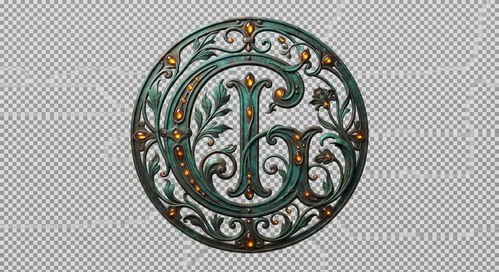

# Design System

---\ntheme: \"Verdigris & Amber Conservatory\"\nauthor: \"Design Director\"\ntokens:\n  colors:\n    bg: \"#0c0a08\"\n    panel: \"rgba(27, 59, 43, 0.15)\"\n    verdigris: \"#1b3b2b\"\n    verdigris_bright: \"#2d5a47\"\n    amber: \"#e59b3c\"\n    amber_dim: \"#b36e15\"\n    bronze: \"#8a7345\"\n    text: \"#f2efe9\"\n    text_muted: \"#a49d93\"\n  fonts:\n    display: \"'Cormorant Garamond', serif\"\n    sans: \"'DM Sans', sans-serif\"\n    mono: \"monospace\"\n---\n\n# DESIGN.md\n\n## Visual Identity\nThis design delivers a physical-feeling botanical conservatory experience designed for a local, file-native engineer. Deep verdigris and amber colors make the site feel like an architectural relic of hand-worked brass and structural glass. \n\n## Typography & Layout\nThe layout avoids predictable grids, electing to mimic hand-placed leaded glass panels. We pair the organic elegance of Cormorant Garamond headings with a sterile, highly-functional monospace typeface, suggesting the juxtaposition of a natural conservatory overgrown with high-density AI algorithms. All primary links and buttons enforce a 44px layout boundary for absolute touch compliance.

## section:css

```css
:root { --color-bg: #0c0a08; --color-panel: rgba(27, 59, 43, 0.15); --color-panel-border: rgba(45, 90, 71, 0.4); --color-verdigris: #1b3b2b; --color-verdigris-bright: #2d5a47; --color-amber: #e59b3c; --color-amber-dim: #b36e15; --color-bronze: #8a7345; --color-text: #f2efe9; --color-text-muted: #a49d93; --font-display: 'Cormorant Garamond', serif; --font-sans: 'DM Sans', sans-serif; --font-mono: 'SFMono-Regular', Consolas, 'Liberation Mono', Menlo, monospace; --spacing-unit: 8px; --border-radius: 4px; --blur-glass: blur(12px); }

*,*::before,*::after{box-sizing:border-box;margin:0;padding:0;}html{font-size:16px;scroll-behavior:smooth;background-color:var(--color-bg);color:var(--color-text);font-family:var(--font-sans);-webkit-font-smoothing:antialiased;-moz-osx-font-smoothing:grayscale;}body{min-height:100vh;line-height:1.6;background-color:var(--color-bg);color:var(--color-text);overflow-x:hidden;}input,button,select,textarea{font-family:inherit;}a{color:var(--color-amber);text-decoration:none;transition:color 0.3s ease,text-shadow 0.3s ease;font-family:inherit;}a:hover,a:focus{color:var(--color-text);text-shadow:0 0 8px var(--color-amber);outline:none;}h1,h2,h3,h4,h5,h6{font-family:var(--font-display);color:var(--color-text);font-weight:400;letter-spacing:-0.01em;}h1{font-size:calc(2.2rem + 1vw);line-height:1.1;margin-bottom:calc(var(--spacing-unit)*3);}h2{font-size:calc(1.8rem + 0.8vw);line-height:1.2;margin-bottom:calc(var(--spacing-unit)*2.5);}h3{font-size:calc(1.4rem + 0.5vw);line-height:1.3;margin-bottom:calc(var(--spacing-unit)*2);}p{font-family:var(--font-sans);font-size:1rem;line-height:1.7;color:var(--color-text-muted);margin-bottom:calc(var(--spacing-unit)*2.5);}ul,ol{margin-bottom:calc(var(--spacing-unit)*2.5);padding-left:calc(var(--spacing-unit)*3);}li{margin-bottom:calc(var(--spacing-unit)*1);}img{max-width:100%;height:auto;display:block;border-radius:var(--border-radius);}.md-img{border:1px solid var(--color-panel-border);filter:sepia(0.2) contrast(1.1) brightness(0.9);transition:filter 0.5s ease,border-color 0.5s ease;box-shadow:0 8px 32px rgba(0,0,0,0.4);}.md-img:hover{filter:sepia(0) contrast(1) brightness(1);border-color:var(--color-amber);}code,pre{font-family:var(--font-mono);font-size:0.9em;background:var(--color-panel);border:1px solid var(--color-panel-border);border-radius:var(--border-radius);padding:0.2em 0.4em;}pre{padding:calc(var(--spacing-unit)*2);overflow-x:auto;margin-bottom:calc(var(--spacing-unit)*3);}pre code{background:transparent;border:none;padding:0;}.conservatory-root{display:flex;flex-direction:column;min-height:100vh;background-color:var(--color-bg);background-image:radial-gradient(circle at 50% 0%,var(--color-panel) 0%,transparent 70%);color:var(--color-text);padding:calc(var(--spacing-unit)*2);}.text-display{font-family:var(--font-display);font-weight:300;letter-spacing:-0.01em;line-height:1.1;color:var(--color-text);}.text-technical{font-family:var(--font-mono);font-size:0.85rem;letter-spacing:0.05em;text-transform:uppercase;color:var(--color-amber-dim);}.text-body{font-family:var(--font-sans);font-size:1rem;line-height:1.7;color:var(--color-text-muted);}@media (min-width:768px){.conservatory-root{padding:calc(var(--spacing-unit)*6);}}

.conservatory-grid { display: grid; grid-template-columns: 100%; gap: calc(var(--spacing-unit) * 3); padding: calc(var(--spacing-unit) * 2); width: 100%; max-width: 1440px; margin: 0 auto; box-sizing: border-box; align-items: start; } @media (min-width: 768px) { .conservatory-grid { grid-template-columns: minmax(280px, 1.2fr) 2fr; gap: calc(var(--spacing-unit) * 4); padding: calc(var(--spacing-unit) * 4); } } @media (min-width: 1024px) { .conservatory-grid { grid-template-columns: minmax(320px, 1fr) 2fr; gap: calc(var(--spacing-unit) * 5); padding: calc(var(--spacing-unit) * 6) calc(var(--spacing-unit) * 4); } } .panel-wrapper { display: flex; flex-direction: column; gap: calc(var(--spacing-unit) * 4); width: 100%; box-sizing: border-box; } @media (min-width: 768px) { .panel-wrapper { gap: calc(var(--spacing-unit) * 5); } } .iron-border { position: relative; border: 1px solid var(--color-verdigris-bright); background: var(--color-panel); backdrop-filter: var(--blur-glass); -webkit-backdrop-filter: var(--blur-glass); border-radius: var(--border-radius); box-shadow: inset 0 0 20px rgba(27, 59, 43, 0.4), 0 10px 30px rgba(12, 10, 8, 0.9); transition: border-color 0.3s ease, box-shadow 0.3s ease; overflow: hidden; } .iron-border::before { content: ""; position: absolute; top: 0; left: 0; right: 0; bottom: 0; border: 1px solid rgba(229, 155, 60, 0.08); pointer-events: none; border-radius: calc(var(--border-radius) - 1px); } .whiplash-nav { position: sticky; top: 0; z-index: 100; display: flex; flex-flow: row wrap; align-items: center; justify-content: space-between; width: 100%; padding: calc(var(--spacing-unit) * 2.5) calc(var(--spacing-unit) * 3); background: rgba(12, 10, 8, 0.85); backdrop-filter: var(--blur-glass); -webkit-backdrop-filter: var(--blur-glass); border-bottom: 1px solid var(--color-verdigris); box-sizing: border-box; } @media (min-width: 768px) { .whiplash-nav { padding: calc(var(--spacing-unit) * 3) calc(var(--spacing-unit) * 6); } } .whiplash-nav::after { content: ""; position: absolute; bottom: -1px; left: 0; width: 100%; height: 2px; background: linear-gradient(90deg, transparent, var(--color-amber-dim), var(--color-verdigris-bright), transparent); opacity: 0.8; pointer-events: none; }

.glass-panel {
  background-color: var(--color-panel);
  backdrop-filter: var(--blur-glass);
  -webkit-backdrop-filter: var(--blur-glass);
  border: 1px solid var(--color-panel-border);
  border-radius: var(--border-radius);
  padding: calc(var(--spacing-unit) * 3);
  box-shadow: 0 12px 40px rgba(12, 10, 8, 0.65), inset 0 0 16px rgba(229, 155, 60, 0.05);
  position: relative;
  overflow: hidden;
}

.glass-panel::before {
  content: '';
  position: absolute;
  top: 0;
  left: 0;
  right: 0;
  height: 1px;
  background: linear-gradient(90deg, transparent, var(--color-amber-dim), transparent);
  opacity: 0.6;
}

.amber-glow-btn {
  display: inline-flex;
  align-items: center;
  justify-content: center;
  min-height: 44px;
  padding: 0 calc(var(--spacing-unit) * 3);
  font-family: var(--font-mono);
  font-size: 0.8rem;
  font-weight: 500;
  text-transform: uppercase;
  letter-spacing: 0.15em;
  color: var(--color-amber);
  background-color: rgba(229, 155, 60, 0.06);
  border: 1px solid var(--color-bronze);
  border-radius: var(--border-radius);
  cursor: pointer;
  transition: all 0.3s cubic-bezier(0.25, 0.46, 0.45, 0.94);
  text-decoration: none;
  box-shadow: inset 0 0 8px rgba(229, 155, 60, 0.02);
}

.amber-glow-btn:hover {
  background-color: rgba(229, 155, 60, 0.12);
  border-color: var(--color-amber);
  color: var(--color-text);
  box-shadow: 0 0 20px rgba(229, 155, 60, 0.25), inset 0 0 12px rgba(229, 155, 60, 0.1);
  text-shadow: 0 0 8px rgba(229, 155, 60, 0.4);
}

.amber-glow-btn:active {
  transform: scale(0.98);
  background-color: rgba(229, 155, 60, 0.18);
}

.gaslight-shimmer {
  transition: filter 0.4s ease, opacity 0.4s ease, box-shadow 0.4s ease;
}

.gaslight-shimmer:hover {
  animation: gaslight-flicker 3s infinite alternate ease-in-out;
}

@keyframes gaslight-flicker {
  0%, 100% {
    filter: brightness(1) contrast(1);
    box-shadow: 0 0 0 rgba(0, 0, 0, 0);
  }
  15% {
    filter: brightness(1.03) contrast(1.02);
    box-shadow: 0 0 12px rgba(229, 155, 60, 0.05);
  }
  30% {
    filter: brightness(0.97) contrast(0.98);
  }
  45% {
    filter: brightness(1.06) contrast(1.03);
    box-shadow: 0 0 20px rgba(229, 155, 60, 0.12);
  }
  60% {
    filter: brightness(0.99) contrast(0.99);
  }
  75% {
    filter: brightness(1.04) contrast(1.02);
    box-shadow: 0 0 14px rgba(229, 155, 60, 0.08);
  }
}

.botanical-card {
  position: relative;
  background: linear-gradient(135deg, var(--color-panel), rgba(12, 10, 8, 0.75));
  border: 1px solid var(--color-verdigris-bright);
  border-radius: var(--border-radius);
  padding: calc(var(--spacing-unit) * 3);
  transition: border-color 0.4s ease, transform 0.4s cubic-bezier(0.16, 1, 0.3, 1), box-shadow 0.4s ease;
  overflow: hidden;
}

.botanical-card::after {
  content: '';
  position: absolute;
  bottom: 0;
  right: 0;
  width: 20px;
  height: 20px;
  background: linear-gradient(135deg, transparent 50%, var(--color-bronze) 50%);
  opacity: 0.3;
  transition: opacity 0.4s ease, background 0.4s ease;
}

.botanical-card:hover {
  border-color: var(--color-amber-dim);
  transform: translateY(-4px);
  box-shadow: 0 16px 36px rgba(12, 10, 8, 0.75), 0 0 20px rgba(45, 90, 71, 0.15);
}

.botanical-card:hover::after {
  background: linear-gradient(135deg, transparent 50%, var(--color-amber) 50%);
  opacity: 0.85;
}

.botanical-card h3,
.botanical-card h4 {
  font-family: var(--font-display);
  color: var(--color-text);
  margin-top: 0;
  margin-bottom: calc(var(--spacing-unit) * 1.5);
  transition: color 0.3s ease;
}

.botanical-card:hover h3,
.botanical-card:hover h4 {
  color: var(--color-amber);
}

.botanical-card p {
  color: var(--color-text-muted);
  font-family: var(--font-sans);
  font-size: 0.95rem;
  line-height: 1.6;
  margin-bottom: calc(var(--spacing-unit) * 2);
}

.logo-monogram {
  display: inline-flex;
  align-items: center;
  justify-content: center;
  width: 48px;
  height: 48px;
  border: 1px solid var(--color-bronze);
  background: radial-gradient(circle, var(--color-verdigris) 0%, rgba(12, 10, 8, 0.9) 100%);
  border-radius: 75% 25% 75% 25% / 25% 75% 25% 75%;
  padding: 6px;
  box-sizing: border-box;
  transition: border-color 0.4s ease, border-radius 0.6s cubic-bezier(0.175, 0.885, 0.32, 1.275), transform 0.4s ease;
  cursor: pointer;
}

.logo-monogram img {
  width: 100%;
  height: 100%;
  object-fit: contain;
  filter: sepia(0.6) hue-rotate(60deg) brightness(1.1) contrast(1.1);
  transition: filter 0.4s ease;
}

.logo-monogram:hover {
  border-color: var(--color-amber);
  border-radius: 25% 75% 25% 75% / 75% 25% 75% 25%;
  transform: rotate(5deg) scale(1.05);
}

.logo-monogram:hover img {
  filter: sepia(0.2) hue-rotate(25deg) brightness(1.25) contrast(1.15);
}

.home-hero { position: relative; display: flex; flex-direction: column; justify-content: center; padding: calc(var(--spacing-unit) * 8) calc(var(--spacing-unit) * 3); min-height: 85vh; background-image: radial-gradient(circle at 80% 20%, rgba(229, 155, 60, 0.15), transparent 50%), url('assets/hero.jpg'); background-size: cover; background-position: center; border-bottom: 1px solid var(--color-panel-border); overflow: hidden; } .home-hero::before { content: ''; position: absolute; inset: 0; background: linear-gradient(180deg, rgba(12, 10, 8, 0.4) 0%, var(--color-bg) 100%); pointer-events: none; z-index: 1; } .home-hero > * { position: relative; z-index: 2; } .projects-container { display: grid; grid-template-columns: 1fr; gap: calc(var(--spacing-unit) * 4); padding: calc(var(--spacing-unit) * 4) calc(var(--spacing-unit) * 2); max-width: 1200px; margin: 0 auto; } .designs-container { display: grid; grid-template-columns: 1fr; gap: calc(var(--spacing-unit) * 4); padding: calc(var(--spacing-unit) * 4) calc(var(--spacing-unit) * 2); max-width: 1200px; margin: 0 auto; } .detail-container { max-width: 800px; margin: 0 auto; padding: calc(var(--spacing-unit) * 6) calc(var(--spacing-unit) * 2); } .detail-container .md-img { width: 100%; max-width: 520px; height: auto; display: block; margin: calc(var(--spacing-unit) * 5) auto; border: 1px solid var(--color-panel-border); box-shadow: 0 16px 40px rgba(12, 10, 8, 0.9), 0 0 30px rgba(229, 155, 60, 0.15); border-radius: var(--border-radius); filter: sepia(0.3) contrast(1.1) brightness(0.85); transition: filter 0.6s cubic-bezier(0.16, 1, 0.3, 1), box-shadow 0.6s cubic-bezier(0.16, 1, 0.3, 1); } .detail-container .md-img:hover { filter: sepia(0) contrast(1) brightness(1); box-shadow: 0 16px 40px rgba(12, 10, 8, 0.9), 0 0 40px rgba(229, 155, 60, 0.3); } @media (min-width: 768px) { .home-hero { padding: calc(var(--spacing-unit) * 14) calc(var(--spacing-unit) * 8); min-height: 90vh; background-attachment: fixed; } .projects-container { grid-template-columns: repeat(2, 1fr); gap: calc(var(--spacing-unit) * 6); padding: calc(var(--spacing-unit) * 10) calc(var(--spacing-unit) * 4); } .designs-container { display: grid; grid-template-columns: repeat(12, 1fr); gap: calc(var(--spacing-unit) * 6); padding: calc(var(--spacing-unit) * 10) calc(var(--spacing-unit) * 4); } .designs-container > * { grid-column: span 6; } .designs-container > *:nth-child(3n+1) { grid-column: span 7; } .designs-container > *:nth-child(3n+2) { grid-column: span 5; margin-top: calc(var(--spacing-unit) * 6); } .detail-container { padding: calc(var(--spacing-unit) * 12) calc(var(--spacing-unit) * 6); } } @media (min-width: 1024px) { .projects-container { grid-template-columns: repeat(3, 1fr); gap: calc(var(--spacing-unit) * 8); } .designs-container { gap: calc(var(--spacing-unit) * 8); } } } }
```

## section:layout:shell

```html
<!--
# DESIGN.md

yaml
tokens:
  --color-bg: "#0c0a08"
  --color-panel: "rgba(27, 59, 43, 0.15)"
  --color-panel-border: "rgba(45, 90, 71, 0.4)"
  --color-verdigris: "#1b3b2b"
  --color-verdigris-bright: "#2d5a47"
  --color-amber: "#e59b3c"
  --color-amber-dim: "#b36e15"
  --color-bronze: "#8a7345"
  --color-text: "#f2efe9"
  --color-text-muted: "#a49d93"
  --font-display: "'Cormorant Garamond', serif"
  --font-sans: "'DM Sans', sans-serif"
  --font-mono: "'SFMono-Regular', Consolas, 'Liberation Mono', Menlo, monospace"
  --spacing-unit: "8px"
  --border-radius: "4px"
  --blur-glass: "blur(12px)"


## Vision
An opulent Art Nouveau botanical conservatory aesthetic. 
Structures rely on fine, hand-penciled verdigris ironwork lines (.iron-border) framing layered amber-hued glass panels (.glass-panel). 
All typography leverages the organic elegance of Cormorant Garamond for displays (.text-display) contrasting against a rigid technical monospaced baseline (.text-technical). 
Dynamic interaction mimics atmospheric elements: gaslight flickers (.gaslight-shimmer) and smooth, curved structural navigation transitions (.whiplash-nav).
-->
<!DOCTYPE html>
<html lang="en">
<head>
  <meta charset="UTF-8">
  <meta name="viewport" content="width=device-width, initial-scale=1.0">
  <link rel="icon" href="assets/favicon.png" type="image/png">
  <style>
    @import url('https://fonts.googleapis.com/css2?family=Cormorant+Garamond:ital,wght@0,400;0,600;1,400&family=DM+Sans:wght@400;500;700&display=swap');

    :root {
      --color-bg: #0c0a08;
      --color-panel: rgba(27, 59, 43, 0.15);
      --color-panel-border: rgba(45, 90, 71, 0.4);
      --color-verdigris: #1b3b2b;
      --color-verdigris-bright: #2d5a47;
      --color-amber: #e59b3c;
      --color-amber-dim: #b36e15;
      --color-bronze: #8a7345;
      --color-text: #f2efe9;
      --color-text-muted: #a49d93;
      --font-display: 'Cormorant Garamond', serif;
      --font-sans: 'DM Sans', sans-serif;
      --font-mono: 'SFMono-Regular', Consolas, 'Liberation Mono', Menlo, monospace;
      --spacing-unit: 8px;
      --border-radius: 4px;
      --blur-glass: blur(12px);
    }

    * {
      box-sizing: border-box;
      margin: 0;
      padding: 0;
    }

    body {
      background-color: var(--color-bg);
      color: var(--color-text);
      font-family: var(--font-sans);
      min-height: 100vh;
      display: flex;
      flex-direction: column;
      overflow-x: hidden;
    }

    /* Base Typography */
    .text-display {
      font-family: var(--font-display);
      font-weight: 600;
      letter-spacing: -0.02em;
      line-height: 1.1;
    }

    .text-technical {
      font-family: var(--font-mono);
      font-size: 0.75rem;
      letter-spacing: 0.1em;
      text-transform: uppercase;
      color: var(--color-amber);
    }

    .text-body {
      font-family: var(--font-sans);
      line-height: 1.6;
      color: var(--color-text-muted);
    }

    /* Structural Layout (Mobile First) */
    .conservatory-root {
      position: relative;
      width: 100%;
      max-width: 1440px;
      margin: 0 auto;
      padding: calc(var(--spacing-unit) * 2);
      display: flex;
      flex-direction: column;
      gap: calc(var(--spacing-unit) * 3);
      flex-grow: 1;
    }

    .header-panel {
      display: flex;
      flex-direction: column;
      gap: calc(var(--spacing-unit) * 2);
      padding: calc(var(--spacing-unit) * 3);
      position: relative;
      z-index: 10;
    }

    .conservatory-grid {
      display: grid;
      grid-template-columns: 1fr;
      gap: calc(var(--spacing-unit) * 3);
      align-items: start;
    }

    .panel-wrapper {
      display: flex;
      flex-direction: column;
      gap: calc(var(--spacing-unit) * 4);
      width: 100%;
    }

    /* Art Nouveau & Ironwork styling */
    .iron-border {
      border: 1px solid var(--color-panel-border);
      position: relative;
    }

    .iron-border::before, .iron-border::after {
      content: '';
      position: absolute;
      width: 12px;
      height: 12px;
      border: 1px solid var(--color-amber-dim);
      border-radius: 50%;
      pointer-events: none;
    }

    .iron-border::before { top: -6px; left: -6px; }
    .iron-border::after { bottom: -6px; right: -6px; }

    .glass-panel {
      background: var(--color-panel);
      backdrop-filter: var(--blur-glass);
      -webkit-backdrop-filter: var(--blur-glass);
      border-radius: var(--border-radius);
      box-shadow: inset 0 0 20px rgba(229, 155, 60, 0.03), 0 8px 32px rgba(0, 0, 0, 0.3);
    }

    /* Logo Monogram Container */
    .logo-monogram {
      display: flex;
      align-items: center;
      justify-content: center;
      width: 64px;
      height: 64px;
      border-radius: 50% 50% 0 0;
      border: 1px solid var(--color-verdigris-bright);
      padding: 6px;
      background: radial-gradient(circle, var(--color-panel) 0%, transparent 100%);
    }

    .logo-monogram img {
      max-width: 100%;
      height: auto;
      display: block;
    }

    /* Whiplash Navigation */
    .whiplash-nav {
      display: flex;
      flex-wrap: wrap;
      gap: calc(var(--spacing-unit) * 2);
    }

    .whiplash-nav a {
      font-family: var(--font-display);
      font-size: 1.1rem;
      text-decoration: none;
      color: var(--color-text);
      padding: calc(var(--spacing-unit) * 1.5) calc(var(--spacing-unit) * 2.5);
      min-height: 44px;
      display: inline-flex;
      align-items: center;
      position: relative;
      border-radius: 20px;
      border: 1px solid transparent;
      transition: border-color 0.4s ease, color 0.4s ease;
    }

    .whiplash-nav a:hover, .whiplash-nav a.active {
      border-color: var(--color-amber-dim);
      color: var(--color-amber);
      box-shadow: 0 0 10px rgba(229, 155, 60, 0.1);
    }

    .theme-pills-container {
      display: flex;
      gap: var(--spacing-unit);
      align-items: center;
    }

    /* Interactive elements */
    .amber-glow-btn {
      display: inline-flex;
      align-items: center;
      justify-content: center;
      min-height: 44px;
      min-width: 44px;
      padding: var(--spacing-unit) calc(var(--spacing-unit) * 3);
      font-family: var(--font-mono);
      font-size: 0.75rem;
      letter-spacing: 0.05em;
      text-transform: uppercase;
      color: var(--color-bg);
      background-color: var(--color-amber);
      border: none;
      border-radius: var(--border-radius);
      cursor: pointer;
      transition: background-color 0.3s ease, box-shadow 0.3s ease;
    }

    .amber-glow-btn:hover {
      background-color: var(--color-text);
      box-shadow: 0 0 15px var(--color-amber);
    }

    .gaslight-shimmer {
      position: relative;
    }
    
    .gaslight-shimmer::after {
      content: '';
      position: absolute;
      inset: 0;
      box-shadow: 0 0 15px rgba(229, 155, 60, 0);
      pointer-events: none;
      transition: box-shadow 0.5s ease;
    }

    .gaslight-shimmer:hover::after {
      box-shadow: 0 0 25px rgba(229, 155, 60, 0.25);
      animation: gaslight-flicker 2s infinite alternate;
    }

    @keyframes gaslight-flicker {
      0%, 100% { opacity: 0.9; }
      23% { opacity: 0.95; }
      24% { opacity: 0.7; }
      26% { opacity: 0.9; }
      70% { opacity: 0.85; }
      71% { opacity: 0.6; }
      73% { opacity: 0.9; }
    }

    /* Footer layout */
    .footer-panel {
      margin-top: auto;
      padding: calc(var(--spacing-unit) * 3);
      display: flex;
      flex-direction: column;
      gap: calc(var(--spacing-unit) * 2);
      align-items: center;
      justify-content: space-between;
    }

    /* Responsive Enhancements */
    @media (min-width: 768px) {
      .conservatory-root {
        padding: calc(var(--spacing-unit) * 4);
        gap: calc(var(--spacing-unit) * 4);
      }

      .header-panel {
        flex-direction: row;
        align-items: center;
        justify-content: space-between;
        padding: calc(var(--spacing-unit) * 4);
      }

      .conservatory-grid {
        grid-template-columns: 1.618fr 1fr;
      }

      .footer-panel {
        flex-direction: row;
        padding: calc(var(--spacing-unit) * 4);
      }
    }
  </style>
</head>
<body>
  <div class="conservatory-root">
    <header class="header-panel iron-border glass-panel">
      <div class="logo-monogram gaslight-shimmer">
        
      </div>
      <nav class="whiplash-nav">
        {{NAV_LINKS}}
      </nav>
      <div class="theme-pills-container">
        {{THEME_PILLS}}
      </div>
    </header>

    <main class="panel-wrapper">
      {{CONTENT}}
    </main>

    <footer class="footer-panel iron-border glass-panel">
      <div class="text-technical">
        {{SOURCE_PATH}}
      </div>
    </footer>
  </div>
</body>
</html>
```

## section:layout:home

```html
<style>:root{--color-bg:#0c0a08;--color-panel:rgba(27,59,43,0.15);--color-panel-border:rgba(45,90,71,0.4);--color-verdigris:#1b3b2b;--color-verdigris-bright:#2d5a47;--color-amber:#e59b3c;--color-amber-dim:#b36e15;--color-bronze:#8a7345;--color-text:#f2efe9;--color-text-muted:#a49d93;--font-display:'Cormorant Garamond',serif;--font-sans:'DM Sans',sans-serif;--font-mono:'SFMono-Regular',Consolas,'Liberation Mono',Menlo,monospace;--spacing-unit:8px;--border-radius:4px;--blur-glass:blur(12px)}.conservatory-root{background-color:var(--color-bg);color:var(--color-text);font-family:var(--font-sans);padding:calc(var(--spacing-unit)*2);min-height:100vh;display:flex;flex-direction:column;gap:calc(var(--spacing-unit)*3);box-sizing:border-box}.text-display{font-family:var(--font-display);font-weight:300;line-height:1.1;color:var(--color-amber);margin:0}.text-technical{font-family:var(--font-mono);font-size:0.8rem;text-transform:uppercase;letter-spacing:0.15em;color:var(--color-bronze)}.text-body{font-family:var(--font-sans);font-size:1rem;line-height:1.6;color:var(--color-text-muted)}.iron-border{border:1px solid var(--color-panel-border);position:relative}.iron-border::after{content:'';position:absolute;inset:2px;border:1px solid rgba(138,115,69,0.15);pointer-events:none}.whiplash-nav{display:flex;align-items:center;justify-content:between;padding:calc(var(--spacing-unit)*2);border-radius:var(--border-radius);background:var(--color-panel);backdrop-filter:var(--blur-glass)}.logo-monogram{height:44px;width:auto;display:block}.home-hero{position:relative;background-image:linear-gradient(to bottom,rgba(12,10,8,0.7),rgba(12,10,8,0.95)),url('assets/hero.jpg');background-size:cover;background-position:center;padding:calc(var(--spacing-unit)*4) calc(var(--spacing-unit)*3);border-radius:var(--border-radius);display:flex;flex-direction:column;gap:calc(var(--spacing-unit)*2)}.glass-panel{background:var(--color-panel);backdrop-filter:var(--blur-glass);box-shadow:0 8px 32px 0 rgba(229,155,60,0.02)}.panel-wrapper{display:flex;flex-direction:column;gap:calc(var(--spacing-unit)*2)}.conservatory-grid{display:grid;grid-template-columns:1fr;gap:calc(var(--spacing-unit)*3)}.botanical-card{padding:calc(var(--spacing-unit)*3);border-radius:var(--border-radius);transition:all 0.3s ease}.botanical-card:hover{border-color:var(--color-amber);box-shadow:0 0 15px rgba(229,155,60,0.1)}.amber-glow-btn{display:inline-flex;align-items:center;justify-content:center;min-height:44px;padding:0 calc(var(--spacing-unit)*3);background:linear-gradient(135deg,rgba(229,155,60,0.05) 0%,rgba(179,110,21,0.1) 100%);border:1px solid var(--color-amber);color:var(--color-text);font-family:var(--font-mono);font-size:0.9rem;text-decoration:none;cursor:pointer;transition:all 0.3s ease}.amber-glow-btn:hover{box-shadow:0 0 12px var(--color-amber);background:rgba(229,155,60,0.15)}.gaslight-shimmer{animation:gaslight 5s infinite alternate}@keyframes gaslight{0%,100%{opacity:0.95;filter:drop-shadow(0 0 1px rgba(229,155,60,0.15))}50%{opacity:1;filter:drop-shadow(0 0 6px rgba(229,155,60,0.3))}}@media(min-width:768px){.conservatory-root{padding:calc(var(--spacing-unit)*5);gap:calc(var(--spacing-unit)*5)}.conservatory-grid{grid-template-columns:2fr 1fr}.home-hero{padding:calc(var(--spacing-unit)*8) calc(var(--spacing-unit)*6)}.text-display{font-size:3.5rem}}</style><div class="conservatory-root"><header class="whiplash-nav iron-border glass-panel"><div class="panel-wrapper"></div><div class="text-technical">{{FEATURED_COUNT}}</div></header><section class="home-hero iron-border glass-panel"><h1 class="text-display gaslight-shimmer">{{HEADLINE}}</h1><p class="text-technical">{{TAGLINE}}</p><div class="text-body">{{INTRO}}</div></section><main class="conservatory-grid"><section class="projects-container botanical-card glass-panel iron-border"><div class="text-technical">{{FEATURED_COUNT}}</div><div class="panel-wrapper">{{FEATURED_PROJECTS}}</div></section><section class="designs-container panel-wrapper"><div class="glass-panel iron-border botanical-card"><div class="panel-wrapper">{{GENERATOR_FORM}}</div></div></section></main></div>
```

## section:layout:projects_index

```html
<div class="conservatory-root"><div class="panel-wrapper"><header class="glass-panel iron-border"><div class="whiplash-nav"><div class="logo-monogram"></div><div class="text-technical gaslight-shimmer">{{PROJECT_COUNT}}</div></div></header><main class="projects-container conservatory-grid">{{PROJECT_LIST}}</main></div></div>
```

## section:layout:designs_index

```html
<div class="conservatory-root designs-container"><div class="panel-wrapper iron-border glass-panel"><div class="logo-monogram"></div><div class="whiplash-nav"><div class="text-technical">{{DESIGN_COUNT}}</div></div></div><div class="conservatory-grid">{{DESIGN_CARDS}}</div></div>
```

## section:layout:project_detail

```html
<div class="conservatory-root detail-container"><nav class="whiplash-nav">{{BACKLINK}}</nav><main class="conservatory-grid"><div class="panel-wrapper"><section class="glass-panel iron-border"><header class="logo-monogram">{{LOGO}}</header><h1 class="text-display">{{NAME}}</h1><table class="text-technical"><tbody><tr><td>{{ROLE}}</td></tr><tr><td>{{YEAR}}</td></tr></tbody></table><div class="text-technical">{{TECH_BADGES}}</div><div class="gaslight-shimmer amber-glow-btn">{{PROJECT_LINK}}</div><div class="gaslight-shimmer amber-glow-btn">{{REPO_LINK}}</div></section></div><div class="panel-wrapper"><article class="glass-panel iron-border"><div class="text-display">{{DESCRIPTION}}</div><div class="text-body">{{CONTENT}}</div><footer class="text-technical">{{SOURCE_PATH}}</footer></article></div></main></div>
```

## section:layout:design_detail

```html
<div class="conservatory-root detail-container"><header class="panel-wrapper iron-border"><div class="whiplash-nav amber-glow-btn">{{BACKLINK}}</div><div class="logo-monogram"></div></header><main class="conservatory-grid"><aside class="glass-panel iron-border"><div class="panel-wrapper"><div class="text-technical">{{YEAR}}</div><div class="text-technical">{{CLIENT}}</div><div class="text-technical">{{ROLE}}</div><div class="text-technical">{{TAG_BADGES}}</div><div class="text-technical">{{SOURCE_PATH}}</div><div class="amber-glow-btn gaslight-shimmer">{{LINK_URL}}</div></div></aside><section class="glass-panel iron-border"><article class="panel-wrapper"><header><h1 class="text-display">{{NAME}}</h1><p class="text-body">{{DESCRIPTION}}</p></header><div class="preview-wrapper">{{PREVIEW}}</div><div class="text-body">{{CONTENT}}</div></article></section></main></div>
```

## section:layout:page

```html
<div class="conservatory-root"><div class="detail-container"><header class="whiplash-nav iron-border glass-panel"><div class="panel-wrapper"><h1 class="text-display gaslight-shimmer">{{NAME}}</h1><div class="text-technical">{{SOURCE_PATH}}</div></div></header><main class="conservatory-grid"><article class="glass-panel iron-border"><div class="panel-wrapper text-body">{{CONTENT}}</div></article></main></div></div>
```

## section:layout:project_item

```html
<div class="botanical-card glass-panel iron-border gaslight-shimmer"><div class="panel-wrapper"><div class="whiplash-nav"><span class="text-technical">{{INDEX}}</span><div class="logo-monogram">{{LOGO}}</div><span class="text-technical">{{YEAR}}</span></div><h3 class="text-display"><a href="{{URL}}">{{NAME}}</a></h3><p class="text-body">{{DESCRIPTION}}</p><div class="text-technical">{{TECH_BADGES}}</div><div class="whiplash-nav"><a href="{{REPO_URL}}" class="amber-glow-btn text-technical">{{INDEX}}</a></div></div></div>
```

## section:layout:design_item

```html
<div class="botanical-card iron-border glass-panel gaslight-shimmer" style="display: flex; flex-direction: column; overflow: hidden; height: 100%;"><a href="{{URL}}" class="panel-wrapper whiplash-nav" style="display: flex; flex-direction: column; text-decoration: none; color: inherit; height: 100%; min-height: 44px;"><div style="position: relative; width: 100%; overflow: hidden;">{{PREVIEW}}</div><div style="display: flex; flex-direction: column; flex-grow: 1; padding: 20px; gap: 16px;"><div style="display: flex; justify-content: space-between; align-items: baseline; gap: 12px;"><span class="text-technical" style="color: var(--color-amber);">{{CLIENT}}</span><span class="text-technical" style="color: var(--color-text-muted);">{{YEAR}}</span></div><h3 class="text-display" style="margin: 0; font-size: 1.75rem; line-height: 1.15; color: var(--color-text); font-weight: 400;">{{NAME}}</h3><p class="text-body" style="margin: 0; font-size: 0.95rem; line-height: 1.6; color: var(--color-text-muted);">{{DESCRIPTION}}</p><div style="display: flex; flex-wrap: wrap; gap: 8px; margin-top: auto; padding-top: 8px;">{{TAG_BADGES}}</div><div class="amber-glow-btn" style="display: flex; align-items: center; justify-content: center; min-height: 44px; width: 100%; margin-top: 16px; border: 1px solid var(--color-panel-border); border-radius: var(--border-radius); transition: all 0.3s ease;"><svg width="20" height="20" viewBox="0 0 24 24" fill="none" stroke="currentColor" stroke-width="1.5" style="color: var(--color-amber);"><path d="M5 12h14M12 5l7 7-7 7" stroke-linecap="round" stroke-linejoin="round"/></svg></div></div></a></div>
```

## section:layout:nav_item

```html
<a href="{{NAV_URL}}" class="whiplash-nav text-technical gaslight-shimmer {{NAV_ACTIVE_CLASS}}" style="display: inline-flex; align-items: center; min-height: 44px; padding: 0 var(--spacing-unit); text-decoration: none; box-sizing: border-box;" aria-label="{{NAV_NAME}}">{{NAV_NAME}}</a>
```
