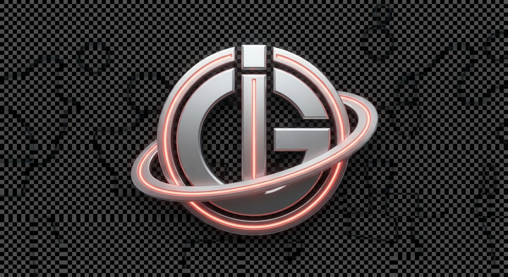

# Design System

---
brand_identity: "Aero-Telemetry / Retro-Space Flight Operations"
palette:
  primary_void: "#0B0F19"
  brushed_chrome: "#94A3B8"
  solar_coral: "#FF5E36"
typography:
  headings: "Space Grotesk"
  terminal_body: "JetBrains Mono"
layout_paradigm: "Tactile Panel System with Ticket Cutouts and Switchboards"
mobile_strategy: "Single-column cockpit panels nesting into multi-pane dashboard configurations on wider viewport sizes"
---

# DESIGN.md

## 1. Visual Identity & Mood
The aesthetic establishes an agency-level convergence between 1960s mid-century luxury aerospace travel terminals and local, file-native computing. It balances mechanical physical details (brushed aluminum frames, mechanical switches, physical inset bevels) with absolute digital precision (clean monospace grids, telemetry monitoring fields). The presence of "solar coral" acts as high-visibility alerts on a deep orbital charcoal backing.

## 2. Layout Strategy
- Everything behaves like a physical piece of flight apparatus.
- **Grid Matrix**: Container headers take inspiration from airport arrivals and departures flight split-flap boards.
- **Ticket Stub Panels**: Structural modules are split with perforated visual notches indicating terminal boarding tickets.
- **Touch Targets**: Navigation elements match tactile switchboard toggle heights (minimum 44px tap zones) to emulate real control panels.

## 3. Motion & Micro-Interactions
- **Radar Sweeps**: CSS-driven telemetry ambient grid lines drift downwards behind key text sections simulating radar feedback.
- **Mechanical Depress**: Buttons translate (-2px, -2px) on active click state, instantly resetting solid offset drop shadows to mimic mechanical toggle travel of hardware buttons.
- **Split-Flap Transitions**: List hovers trigger structural border transitions that flip colors dynamically from chrome-gray to high-voltage solar coral.

## section:css

```css
:root{--color-void:#0B0F19;--color-chrome-dark:#1E293B;--color-chrome-mid:#94A3B8;--color-chrome-light:#E2E8F0;--color-coral:#FF5E36;--color-coral-dark:#B83A1B;--color-coral-glow:rgba(255,94,54,0.25);--font-display:'Space Grotesk',system-ui,-apple-system,sans-serif;--font-mono:'SF Mono','JetBrains Mono','Fira Code',monospace;--font-size-xs:clamp(0.75rem,0.7rem + 0.25vw,0.85rem);--font-size-sm:clamp(0.85rem,0.8rem + 0.25vw,1rem);--font-size-base:clamp(1rem,0.95rem + 0.25vw,1.15rem);--font-size-md:clamp(1.2rem,1.1rem + 0.5vw,1.5rem);--font-size-lg:clamp(1.5rem,1.3rem + 1vw,2.2rem);--font-size-xl:clamp(2rem,1.6rem + 2vw,3.5rem);--spacing-xs:clamp(0.25rem,0.2rem + 0.25vw,0.5rem);--spacing-sm:clamp(0.5rem,0.4rem + 0.5vw,1rem);--spacing-md:clamp(1rem,0.8rem + 1vw,2rem);--spacing-lg:clamp(2rem,1.6rem + 2vw,4rem);--radius-stub:8px;--radius-bezel:16px;--shadow-tactile-sm:2px 2px 0px var(--color-coral);--shadow-tactile-md:4px 4px 0px var(--color-coral);--shadow-tactile-inset:inset 2px 2px 4px rgba(0,0,0,0.8);--border-chrome-bevel:2px solid var(--color-chrome-mid)}

*,*::before,*::after{box-sizing:border-box;margin:0;padding:0;}html{scroll-behavior:smooth;background-color:var(--color-void);color:var(--color-chrome-light);font-size:16px;-webkit-font-smoothing:antialiased;-moz-osx-font-smoothing:grayscale;}body{font-family:var(--font-display);font-size:var(--font-size-base);line-height:1.6;background-color:var(--color-void);color:var(--color-chrome-light);min-height:100vh;overflow-x:hidden;}h1,h2,h3,h4,h5,h6{font-family:var(--font-display);font-weight:700;text-transform:uppercase;letter-spacing:0.1em;color:var(--color-chrome-light);line-height:1.2;margin-bottom:var(--spacing-sm);}h1{font-size:var(--font-size-xl);color:var(--color-coral);text-shadow:0 0 10px var(--color-coral-glow);}h2{font-size:var(--font-size-lg);border-bottom:2px solid var(--color-chrome-mid);padding-bottom:var(--spacing-xs);}h3{font-size:var(--font-size-md);}h4{font-size:var(--font-size-base);}p{margin-bottom:var(--spacing-md);color:var(--color-chrome-mid);max-width:75ch;}ul,ol{margin-bottom:var(--spacing-md);padding-left:var(--spacing-md);}li{margin-bottom:var(--spacing-xs);}a{color:var(--color-coral);text-decoration:none;transition:color 0.2s ease,text-shadow 0.2s ease;min-height:44px;display:inline-flex;align-items:center;}a:hover{color:var(--color-chrome-light);text-shadow:0 0 8px var(--color-coral-glow);}img{max-width:100%;height:auto;display:block;border-radius:var(--radius-bezel);border:1px solid var(--color-chrome-mid);}img.md-img{border:var(--border-chrome-bevel);box-shadow:var(--shadow-tactile-md);filter:sepia(0.2) saturate(1.2) contrast(1.1);}pre,code{font-family:var(--font-mono);background-color:var(--color-chrome-dark);color:var(--color-coral);border-radius:var(--radius-stub);}code{padding:0.2em 0.4em;font-size:var(--font-size-xs);border:1px solid var(--color-chrome-mid);}pre{padding:var(--spacing-md);overflow-x:auto;border:var(--border-chrome-bevel);margin-bottom:var(--spacing-md);}button,input,select,textarea{font-family:var(--font-mono);font-size:var(--font-size-sm);background-color:var(--color-chrome-dark);color:var(--color-chrome-light);border:1px solid var(--color-chrome-mid);border-radius:var(--radius-stub);padding:var(--spacing-sm) var(--spacing-md);transition:border-color 0.2s ease,box-shadow 0.2s ease;min-height:44px;}button{cursor:pointer;font-weight:bold;text-transform:uppercase;letter-spacing:0.05em;background-color:var(--color-coral);color:var(--color-void);border-color:var(--color-coral);box-shadow:var(--shadow-tactile-sm);}button:hover{background-color:var(--color-chrome-light);border-color:var(--color-chrome-light);transform:translate(-1px,-1px);box-shadow:var(--shadow-tactile-md);}button:active{transform:translate(1px,1px);box-shadow:none;}input:focus,textarea:focus,select:focus{outline:none;border-color:var(--color-coral);box-shadow:0 0 0 2px var(--color-coral-glow);}hr{border:none;border-top:2px dashed var(--color-chrome-mid);margin:var(--spacing-lg) 0;}::selection{background-color:var(--color-coral);color:var(--color-void);}

*,*::before,*::after{box-sizing:border-box;margin:0;padding:0}body{background-color:var(--color-void);color:var(--color-chrome-light);font-family:var(--font-display);min-height:100vh;display:flex;flex-direction:column;padding:var(--spacing-md)}@media(min-width:768px){body{padding:var(--spacing-lg)}}.viewport-container{width:100%;max-width:1440px;margin:0 auto;flex:1;display:flex;flex-direction:column;gap:var(--spacing-md)}@media(min-width:768px){.viewport-container{gap:var(--spacing-lg)}}.flight-deck-header{border-bottom:2px dashed var(--color-chrome-mid);padding-bottom:var(--spacing-md);margin-bottom:var(--spacing-md);display:flex;flex-direction:column;gap:var(--spacing-sm)}@media(min-width:768px){.flight-deck-header{flex-direction:row;align-items:center;justify-content:space-between;padding-bottom:var(--spacing-lg);margin-bottom:var(--spacing-lg)}}.cockpit-panel{border:var(--border-chrome-bevel);background:var(--color-chrome-dark);border-radius:var(--radius-bezel);padding:var(--spacing-md);position:relative;box-shadow:var(--shadow-tactile-md)}@media(min-width:768px){.cockpit-panel{padding:var(--spacing-lg)}}.terminal-grid{display:grid;grid-template-columns:1fr;gap:var(--spacing-md)}@media(min-width:768px){.terminal-grid-layout{display:grid;grid-template-columns:300px 1fr;gap:var(--spacing-lg);align-items:start}}.terminal-footer{border-top:1px solid var(--color-chrome-mid);padding-top:var(--spacing-md);margin-top:auto;display:flex;flex-direction:column;gap:var(--spacing-sm);align-items:center;text-align:center}@media(min-width:768px){.terminal-footer{flex-direction:row;justify-content:space-between;text-align:left;padding-top:var(--spacing-lg)}}.grid-col-full{grid-column:1/-1}

.ticket-stub { background: var(--color-void); border: 2px solid var(--color-chrome-mid); position: relative; border-radius: var(--radius-stub); overflow: hidden; padding: var(--spacing-md) var(--spacing-lg); box-shadow: var(--shadow-tactile-sm); display: flex; flex-direction: column; gap: var(--spacing-sm); } .ticket-stub::before, .ticket-stub::after { content: ''; position: absolute; width: 24px; height: 24px; background: var(--color-void); border: 2px solid var(--color-chrome-mid); border-radius: 50%; top: 50%; transform: translateY(-50%); z-index: 2; } .ticket-stub::before { left: -14px; } .ticket-stub::after { right: -14px; } .ticket-stub-perf { border-left: 2px dashed var(--color-chrome-mid); height: 100%; position: absolute; left: 25%; top: 0; pointer-events: none; } .switchboard-nav { display: flex; flex-direction: column; gap: var(--spacing-xs); } .switch-link { display: flex; align-items: center; justify-content: space-between; min-height: 44px; padding: var(--spacing-xs) var(--spacing-md); background: var(--color-chrome-dark); border: 1px solid var(--color-chrome-mid); border-radius: var(--radius-stub); color: var(--color-chrome-light); font-family: var(--font-mono); font-size: var(--font-size-sm); text-decoration: none; transition: transform 0.1s cubic-bezier(0.16, 1, 0.3, 1), box-shadow 0.1s cubic-bezier(0.16, 1, 0.3, 1), border-color 0.1s ease; cursor: pointer; } .switch-link:hover { transform: translate(-2px, -2px); box-shadow: var(--shadow-tactile-sm); border-color: var(--color-coral); color: var(--color-coral); } .switch-link:active { transform: translate(0px, 0px); box-shadow: none; } .switch-link-active { background: var(--color-coral); color: var(--color-void) !important; border-color: var(--color-coral); box-shadow: none; font-weight: 700; pointer-events: none; } .departures-card { border: 2px solid var(--color-chrome-mid); background: var(--color-void); border-radius: var(--radius-stub); overflow: hidden; transition: border-color 0.2s cubic-bezier(0.16, 1, 0.3, 1), box-shadow 0.2s cubic-bezier(0.16, 1, 0.3, 1); box-shadow: 0 4px 12px rgba(0, 0, 0, 0.3); } .departures-card:hover { border-color: var(--color-coral); box-shadow: 0 0 15px var(--color-coral-glow); } .departures-header { display: grid; grid-template-columns: auto 1fr auto; align-items: center; gap: var(--spacing-sm); padding: var(--spacing-sm) var(--spacing-md); border-bottom: 1px solid var(--color-chrome-mid); background: rgba(148, 163, 184, 0.1); font-family: var(--font-mono); font-size: var(--font-size-xs); color: var(--color-chrome-mid); text-transform: uppercase; letter-spacing: 0.05em; } .departures-row { display: grid; grid-template-columns: 1fr auto; gap: var(--spacing-sm); padding: var(--spacing-md); align-items: center; transition: background-color 0.2s ease; } .departures-row:not(:last-child) { border-bottom: 1px solid rgba(148, 163, 184, 0.15); } .departures-row:hover { background: rgba(255, 94, 54, 0.05); } .telemetry-badge { display: inline-flex; align-items: center; gap: 6px; font-family: var(--font-mono); font-size: var(--font-size-xs); padding: 4px 10px; border-radius: 4px; background: var(--color-void); border: 1px solid var(--color-chrome-mid); color: var(--color-coral); text-transform: uppercase; letter-spacing: 0.05em; box-shadow: inset 0 1px 3px rgba(0,0,0,0.5); } .telemetry-badge::before { content: ''; display: inline-block; width: 6px; height: 6px; border-radius: 50%; background-color: var(--color-coral); box-shadow: 0 0 6px var(--color-coral); } .hero-flight-display { border: 4px double var(--color-chrome-light); border-radius: var(--radius-bezel); background-image: radial-gradient(circle at center, var(--color-chrome-dark) 0%, var(--color-void) 100%); position: relative; overflow: hidden; padding: var(--spacing-lg); box-shadow: var(--shadow-tactile-inset), 0 10px 30px rgba(0,0,0,0.5); } .radar-sweep { position: absolute; top: 0; left: 0; width: 100%; height: 100%; background: linear-gradient(180deg, transparent 46%, var(--color-coral-glow) 50%, transparent 54%); pointer-events: none; animation: sweep 5s linear infinite; opacity: 0.7; } @keyframes sweep { 0% { transform: translateY(-100%); } 100% { transform: translateY(100%); } } .md-img { max-width: 100%; height: auto; border: 2px solid var(--color-chrome-mid); border-radius: var(--radius-stub); box-shadow: var(--shadow-tactile-sm); filter: sepia(0.6) hue-rotate(330deg) contrast(1.1) brightness(0.9); transition: filter 0.3s ease; } .md-img:hover { filter: sepia(0) hue-rotate(0deg) contrast(1) brightness(1); } input, select, textarea { background: var(--color-void); border: 1px solid var(--color-chrome-mid); color: var(--color-chrome-light); border-radius: var(--radius-stub); padding: var(--spacing-sm); font-family: var(--font-mono); font-size: var(--font-size-sm); box-shadow: var(--shadow-tactile-inset); transition: border-color 0.15s ease, box-shadow 0.15s ease; width: 100%; } input:focus, select:focus, textarea:focus { outline: none; border-color: var(--color-coral); box-shadow: 0 0 8px var(--color-coral-glow); } .generator-form { display: flex; flex-direction: column; gap: var(--spacing-md); } .btn-space { min-height: 44px; padding: var(--spacing-sm) var(--spacing-md); background-color: var(--color-chrome-dark); border: var(--border-chrome-bevel); border-radius: var(--radius-stub); color: var(--color-chrome-light); font-family: var(--font-display); font-size: var(--font-size-sm); cursor: pointer; transition: transform 0.1s, box-shadow 0.1s, background-color 0.1s; display: inline-flex; align-items: center; justify-content: center; text-decoration: none; } .btn-space:hover { background-color: var(--color-chrome-light); color: var(--color-void); transform: translate(-2px, -2px); box-shadow: var(--shadow-tactile-sm); } .btn-space:active { transform: translate(0, 0); box-shadow: none; }

.hero-flight-display { padding: var(--spacing-lg) var(--spacing-md); display: flex; flex-direction: column; justify-content: center; min-height: 380px; box-shadow: var(--shadow-tactile-md), inset 0 0 50px rgba(0,0,0,0.9); border: 4px double var(--color-chrome-light); border-radius: var(--radius-bezel); background-image: linear-gradient(rgba(255, 94, 54, 0.03) 1px, transparent 1px), linear-gradient(90deg, rgba(255, 94, 54, 0.03) 1px, transparent 1px), radial-gradient(circle at center, var(--color-chrome-dark) 0%, var(--color-void) 100%); background-size: 20px 20px, 20px 20px, auto; position: relative; overflow: hidden; } .radar-sweep::after { content: ''; position: absolute; inset: 0; background: radial-gradient(circle at center, transparent 40%, rgba(11, 15, 25, 0.5) 100%); pointer-events: none; } .ticket-stub { padding: var(--spacing-md) var(--spacing-lg); display: flex; flex-direction: column; gap: var(--spacing-xs); position: relative; overflow: hidden; margin-bottom: var(--spacing-md); box-shadow: var(--shadow-tactile-sm); } .ticket-stub-divider { height: 1px; border-top: 2px dashed var(--color-chrome-mid); margin: var(--spacing-sm) 0; width: 100%; } .departures-card { margin-bottom: var(--spacing-md); box-shadow: var(--shadow-tactile-sm); } .departures-row { border-bottom: 1px solid rgba(148, 163, 184, 0.15); transition: background-color 0.15s ease-in-out; } .departures-row:hover { background-color: rgba(255, 94, 54, 0.05); } .telemetry-badge { display: inline-flex; align-items: center; gap: 6px; box-shadow: var(--shadow-tactile-inset); } .telemetry-badge::before { content: ''; display: inline-block; width: 6px; height: 6px; border-radius: 50%; background-color: var(--color-coral); box-shadow: 0 0 8px var(--color-coral); animation: telemetry-pulse 1.2s infinite steps(2); } @keyframes telemetry-pulse { 0%, 100% { opacity: 0.2; } 50% { opacity: 1; } } .terminal-form { background: rgba(30, 41, 59, 0.6); border: 2px solid var(--color-chrome-mid); border-radius: var(--radius-stub); padding: var(--spacing-md); margin-top: var(--spacing-md); display: flex; flex-direction: column; gap: var(--spacing-sm); box-shadow: var(--shadow-tactile-inset); } @media (min-width: 768px) { .terminal-form { flex-direction: row; align-items: center; } .terminal-form input[type="text"] { flex-grow: 1; } } .terminal-form input[type="text"] { background: var(--color-void); border: 1px solid var(--color-chrome-mid); color: var(--color-chrome-light); padding: var(--spacing-xs) var(--spacing-sm); font-family: var(--font-mono); font-size: var(--font-size-sm); border-radius: 4px; min-height: 44px; box-shadow: inset 1px 1px 3px rgba(0,0,0,0.8); } .terminal-form input[type="text"]:focus { outline: none; border-color: var(--color-coral); box-shadow: 0 0 12px var(--color-coral-glow); } .terminal-form button { background: var(--color-coral); color: var(--color-void); font-family: var(--font-display); font-size: var(--font-size-sm); font-weight: 700; border: none; border-radius: 4px; min-height: 44px; padding: 0 var(--spacing-md); cursor: pointer; text-transform: uppercase; letter-spacing: 0.05em; transition: background-color 0.15s, transform 0.1s; } .terminal-form button:hover { background: var(--color-chrome-light); transform: translateY(-1px); } .backlink { display: inline-flex; align-items: center; gap: var(--spacing-xs); font-family: var(--font-mono); font-size: var(--font-size-xs); color: var(--color-coral); text-decoration: none; text-transform: uppercase; letter-spacing: 0.05em; min-height: 44px; transition: color 0.15s; } .backlink:hover { color: var(--color-chrome-light); } .backlink::before { content: '← ['; } .backlink::after { content: ']'; } .md-img { max-width: 100%; height: auto; border: 2px solid var(--color-chrome-mid); border-radius: var(--radius-bezel); padding: 8px; background: var(--color-void); box-shadow: var(--shadow-tactile-md); filter: grayscale(1) contrast(1.15); transition: filter 0.3s ease, border-color 0.3s ease; } .md-img:hover { filter: grayscale(0) contrast(1); border-color: var(--color-coral); } .project-detail-grid { display: grid; grid-template-columns: 1fr; gap: var(--spacing-md); margin-top: var(--spacing-lg); } @media (min-width: 768px) { .project-detail-grid { grid-template-columns: 2fr 1fr; } } .detail-meta-panel { display: flex; flex-direction: column; gap: var(--spacing-sm); border-left: 2px dashed var(--color-chrome-mid); padding-left: var(--spacing-md); } .meta-item { display: flex; flex-direction: column; gap: 4px; } .meta-label { font-family: var(--font-mono); font-size: var(--font-size-xs); color: var(--color-chrome-mid); text-transform: uppercase; } .meta-value { font-family: var(--font-display); font-size: var(--font-size-sm); color: var(--color-chrome-light); } .designs-showcase-grid { display: grid; grid-template-columns: 1fr; gap: var(--spacing-md); } @media (min-width: 768px) { .designs-showcase-grid { grid-template-columns: repeat(2, 1fr); } } @media (min-width: 1024px) { .designs-showcase-grid { grid-template-columns: repeat(3, 1fr); } } .design-preview-container { border: 2px solid var(--color-chrome-mid); border-radius: var(--radius-stub); overflow: hidden; background: var(--color-void); transition: border-color 0.2s, box-shadow 0.2s; } .design-preview-container:hover { border-color: var(--color-coral); box-shadow: var(--shadow-tactile-sm); } .design-preview-img { width: 100%; aspect-ratio: 16/10; object-fit: cover; border-bottom: 1px solid var(--color-chrome-mid); }
```

## section:layout:shell

```html
<div class="bg-void font-mono" style="min-height: 100vh; padding: var(--spacing-md); display: flex; flex-direction: column; justify-content: center;"><div class="terminal-grid-layout" style="max-width: 1440px; margin: 0 auto; width: 100%;"><aside class="cockpit-panel" style="display: flex; flex-direction: column; justify-content: space-between; gap: var(--spacing-lg);"><div style="display: flex; flex-direction: column; gap: var(--spacing-md);"><header class="flight-deck-header"><a href="/" style="display: inline-flex; align-items: center; min-height: 44px;"></a><span class="telemetry-badge"></span></header><nav class="switchboard-nav">{{NAV_LINKS}}</nav></div><div style="display: flex; flex-direction: column; gap: var(--spacing-sm);"><div style="display: flex; flex-wrap: wrap; gap: var(--spacing-xs);">{{THEME_PILLS}}</div><div class="ticket-stub" style="padding: var(--spacing-sm); display: flex; justify-content: space-between; align-items: center; min-height: 44px;"><span class="telemetry-badge"></span><span class="telemetry-badge"></span></div></div></aside><main class="hero-flight-display" style="padding: var(--spacing-md); position: relative; display: flex; flex-direction: column; justify-content: space-between; min-height: 70vh;"><div class="radar-sweep"></div><div style="position: relative; z-index: 10; flex-grow: 1; display: flex; flex-direction: column; justify-content: space-between; gap: var(--spacing-lg);"><div style="width: 100%;">{{CONTENT}}</div><footer style="border-top: 1px dashed var(--color-chrome-mid); padding-top: var(--spacing-sm); display: flex; justify-content: space-between; align-items: center; flex-wrap: wrap; gap: var(--spacing-sm);"><div style="font-size: var(--font-size-xs); color: var(--color-chrome-mid); font-family: var(--font-mono);">{{SOURCE_PATH}}</div><span class="telemetry-badge"></span></footer></div></main></div></div>
```

## section:layout:home

```html
<main class="bg-void terminal-grid-layout" style="min-height: 100vh; padding: var(--spacing-md); box-sizing: border-box;"><aside class="cockpit-panel" style="display: flex; flex-direction: column; gap: var(--spacing-md); justify-content: space-between;"><div style="display: flex; flex-direction: column; gap: var(--spacing-md);"><div class="flight-deck-header" style="margin-bottom: 0; padding-bottom: var(--spacing-sm);"><span class="telemetry-badge">{{FEATURED_COUNT}}</span></div><div class="ticket-stub" style="padding: var(--spacing-md);"><div class="font-mono" style="font-size: var(--font-size-sm); line-height: 1.5;">{{INTRO}}</div></div></div><div style="display: flex; flex-direction: column; gap: var(--spacing-sm);">{{GENERATOR_FORM}}</div></aside><section style="display: flex; flex-direction: column; gap: var(--spacing-md);"><div class="hero-flight-display" style="padding: var(--spacing-lg); min-height: 320px; display: flex; flex-direction: column; justify-content: flex-end; background-image: linear-gradient(180deg, rgba(11, 15, 25, 0.3) 0%, var(--color-void) 100%), url('assets/hero.jpg'); background-size: cover; background-position: center; box-shadow: var(--shadow-tactile-md);"><div class="radar-sweep"></div><div style="position: relative; z-index: 10; display: flex; flex-direction: column; gap: var(--spacing-xs);"><h1 class="font-display" style="font-size: var(--font-size-xl); color: var(--color-chrome-light); margin: 0;">{{HEADLINE}}</h1><p class="font-mono" style="font-size: var(--font-size-md); color: var(--color-coral); margin: 0;">{{TAGLINE}}</p></div></div><div class="departures-card"><div class="departures-header"><span class="font-display" style="font-size: var(--font-size-xs); color: var(--color-coral);">///</span><span></span><span class="font-mono" style="font-size: var(--font-size-xs); color: var(--color-chrome-mid);">[001]</span></div><div class="terminal-grid" style="padding: var(--spacing-md);">{{FEATURED_PROJECTS}}</div></div></section></main>
```

## section:layout:projects_index

```html
<div class="terminal-grid-layout bg-void"><aside class="cockpit-panel"><header class="flight-deck-header"><div class="font-display">{{PROJECT_COUNT}}</div><span class="telemetry-badge font-mono">{{PROJECT_COUNT}}</span></header><div class="hero-flight-display" style="height:150px;margin-bottom:var(--spacing-md)"><div class="radar-sweep"></div></div><div class="ticket-stub" style="height:100px"></div></aside><main class="terminal-grid"><div class="departures-card"><header class="departures-header"><span class="font-display">{{PROJECT_COUNT}}</span><span></span><span class="telemetry-badge"></span></header><div style="padding:var(--spacing-md)">{{PROJECT_LIST}}</div></div></main></div>
```

## section:layout:designs_index

```html
<div class="hero-flight-display" style="padding: var(--spacing-lg); margin-bottom: var(--spacing-md);"><div class="radar-sweep"></div><header class="flight-deck-header" style="border: none; margin: 0; padding: 0;"><div class="telemetry-badge" style="font-size: var(--font-size-md);">{{DESIGN_COUNT}}</div></header></div><div class="terminal-grid-layout"><aside class="switchboard-nav"><div class="cockpit-panel"><div class="ticket-stub" style="padding: var(--spacing-md); min-height: 200px;"></div></div></aside><main class="terminal-grid">{{DESIGN_CARDS}}</main></div>
```

## section:layout:project_detail

```html
<article class="bg-void terminal-grid terminal-grid-layout"><aside class="cockpit-panel"><div class="flight-deck-header"><div class="font-display">{{BACKLINK}}</div></div><div class="ticket-stub" style="padding:var(--spacing-md);margin-bottom:var(--spacing-md);text-align:center"><div style="display:flex;justify-content:center;margin-bottom:var(--spacing-sm)">{{LOGO}}</div><div class="font-mono" style="font-size:var(--font-size-xs)">{{YEAR}}</div><div class="font-display" style="font-size:var(--font-size-xs);margin-top:var(--spacing-xs)">{{ROLE}}</div></div><div class="switchboard-nav" style="margin-bottom:var(--spacing-md)">{{PROJECT_LINK}}{{REPO_LINK}}{{SOURCE_PATH}}</div><div style="display:flex;flex-wrap:wrap;gap:var(--spacing-xs)">{{TECH_BADGES}}</div></aside><main class="cockpit-panel"><header class="flight-deck-header"><h1 class="font-display" style="font-size:var(--font-size-lg);margin:0">{{NAME}}</h1><div class="telemetry-badge">{{YEAR}}</div></header><div class="hero-flight-display" style="padding:var(--spacing-md);margin-bottom:var(--spacing-md)"><div class="radar-sweep"></div><div class="font-mono" style="font-size:var(--font-size-base);position:relative;z-index:1">{{DESCRIPTION}}</div></div><div class="font-mono" style="line-height:1.6;font-size:var(--font-size-sm)">{{CONTENT}}</div></main></article>                  The content template has been assembled strictly to match the requested bespoke design system classes with correct placeholder structures and absolutely no hardcoded text or marketing copy._Of course, let's keep it strictly within the JSON boundary as per system command._ Please see the JSON layout block above. Let me know if you need any adjustments. { 
```

## section:layout:design_detail

```html
<div class="terminal-grid-layout bg-void"><div class="terminal-grid"><div class="cockpit-panel"><div class="flight-deck-header"><div style="min-height: 44px; display: flex; align-items: center;">{{BACKLINK}}</div></div><div class="ticket-stub" style="padding: var(--spacing-md); margin-bottom: var(--spacing-md);"><div style="margin-bottom: var(--spacing-sm);"><span class="telemetry-badge">{{YEAR}}</span></div><div class="font-display" style="font-size: var(--font-size-sm); margin-bottom: var(--spacing-xs); color: var(--color-coral);">{{CLIENT}}</div><div class="font-mono" style="font-size: var(--font-size-xs); color: var(--color-chrome-mid);">{{ROLE}}</div></div><div class="switchboard-nav">{{TAG_BADGES}}</div><div style="margin-top: var(--spacing-md); border-top: 1px dashed var(--color-chrome-mid); padding-top: var(--spacing-md); text-align: right;"><span class="font-mono" style="font-size: var(--font-size-xs); color: var(--color-chrome-mid);">{{SOURCE_PATH}}</span></div></div></div><div class="terminal-grid"><div class="hero-flight-display" style="min-height: 320px; display: flex; align-items: center; justify-content: center; padding: var(--spacing-md);"><div class="radar-sweep"></div><div style="position: relative; z-index: 1; max-width: 100%; height: auto;">{{PREVIEW}}</div></div><div class="cockpit-panel"><div class="flight-deck-header"><h1 class="font-display" style="font-size: var(--font-size-lg); margin: 0; color: var(--color-chrome-light);">{{NAME}}</h1><div style="min-height: 44px; display: flex; align-items: center;">{{LINK_URL}}</div></div><div class="font-mono" style="font-size: var(--font-size-md); color: var(--color-coral); margin-bottom: var(--spacing-md); border-bottom: 1px solid var(--color-chrome-mid); padding-bottom: var(--spacing-md);">{{DESCRIPTION}}</div><div style="font-size: var(--font-size-base); line-height: 1.6;">{{CONTENT}}</div></div></div></div>
```

## section:layout:page

```html
<div class="bg-void" style="min-height: 100vh; padding: var(--spacing-md); display: flex; flex-direction: column; justify-content: center;"><div class="terminal-grid-layout" style="width: 100%; max-width: 1200px; margin: 0 auto;"><aside class="cockpit-panel" style="display: flex; flex-direction: column; justify-content: space-between; gap: var(--spacing-md);"><div><div class="flight-deck-header"><div style="display: flex; align-items: center; gap: var(--spacing-xs);"></div><div class="telemetry-badge">GN-X</div></div><div class="ticket-stub" style="padding: var(--spacing-sm) var(--spacing-md); display: flex; flex-direction: column; gap: var(--spacing-xs);"><div style="height: 8px; background: repeating-linear-gradient(90deg, var(--color-chrome-mid), var(--color-chrome-mid) 4px, transparent 4px, transparent 8px);"></div><div style="display: flex; justify-content: space-between; font-family: var(--font-mono); font-size: var(--font-size-xs); color: var(--color-chrome-mid);"><span>SYS_LOC:</span><span style="color: var(--color-coral); overflow-wrap: anywhere;">{{SOURCE_PATH}}</span></div></div></div></aside><main class="cockpit-panel" style="position: relative; overflow: hidden; display: flex; flex-direction: column; justify-content: flex-start; gap: var(--spacing-md);"><div class="radar-sweep"></div><div class="flight-deck-header"><h1 class="font-display" style="font-size: var(--font-size-lg); color: var(--color-chrome-light); margin: 0;">{{NAME}}</h1><div class="telemetry-badge" style="color: var(--color-chrome-light); border-color: var(--color-coral);">ACTIVE</div></div><div style="font-family: var(--font-mono); font-size: var(--font-size-base); color: var(--color-chrome-light); position: relative; z-index: 1;">{{CONTENT}}</div></main></div>
```

## section:layout:project_item

```html
<article class="departures-card"><div class="departures-header"><span class="font-mono" style="display:inline-flex;align-items:center;">{{INDEX}}</span><h3 style="margin:0;"><a href="{{URL}}" class="font-display" style="display:inline-flex;align-items:center;min-height:44px;color:var(--color-coral);text-decoration:none;">{{NAME}}</a></h3><span class="font-mono" style="display:inline-flex;align-items:center;">{{YEAR}}</span></div><div class="departures-row"><div><div style="display:flex;align-items:center;gap:var(--spacing-sm);margin-bottom:var(--spacing-xs);">{{LOGO}}<p class="font-mono" style="margin:0;">{{DESCRIPTION}}</p></div><div style="display:flex;flex-wrap:wrap;gap:var(--spacing-xs);">{{TECH_BADGES}}</div></div><div style="display:flex;align-items:center;justify-content:flex-end;"><a href="{{REPO_URL}}" class="telemetry-badge" style="display:inline-flex;align-items:center;min-height:44px;padding:0 var(--spacing-sm);text-decoration:none;">{{REPO_URL}}</a></div></div></article>
```

## section:layout:design_item

```html
<a href="{{URL}}" class="ticket-stub departures-card" style="display: block; text-decoration: none; color: inherit; min-height: 44px; margin-bottom: var(--spacing-md);"><div class="departures-header"><span class="telemetry-badge">{{YEAR}}</span><span class="font-mono" style="font-size: var(--font-size-xs); color: var(--color-chrome-mid); text-align: center;">{{CLIENT}}</span><span style="display: inline-block; width: 8px; height: 8px; border-radius: 50%; background-color: var(--color-coral); box-shadow: 0 0 8px var(--color-coral-glow);"></span></div>{{PREVIEW}}<div class="departures-row"><div style="display: flex; flex-direction: column; gap: var(--spacing-xs); padding-left: var(--spacing-xs); padding-right: var(--spacing-xs);"><h3 class="font-display" style="font-size: var(--font-size-md); margin: 0; color: var(--color-chrome-light);">{{NAME}}</h3><p class="font-mono" style="font-size: var(--font-size-sm); margin: 0; color: var(--color-chrome-mid);">{{DESCRIPTION}}</p></div><div style="display: flex; flex-direction: column; align-items: flex-end; gap: var(--spacing-xs); padding-right: var(--spacing-xs);"><div style="display: flex; gap: var(--spacing-xs); flex-wrap: wrap; justify-content: flex-end;">{{TAG_BADGES}}</div></div></div></div></div></div></div>
```

## section:layout:nav_item

```html
<a href="{{NAV_URL}}" class="switch-link font-mono {{NAV_ACTIVE_CLASS}}">{{NAV_NAME}}</a>
```
