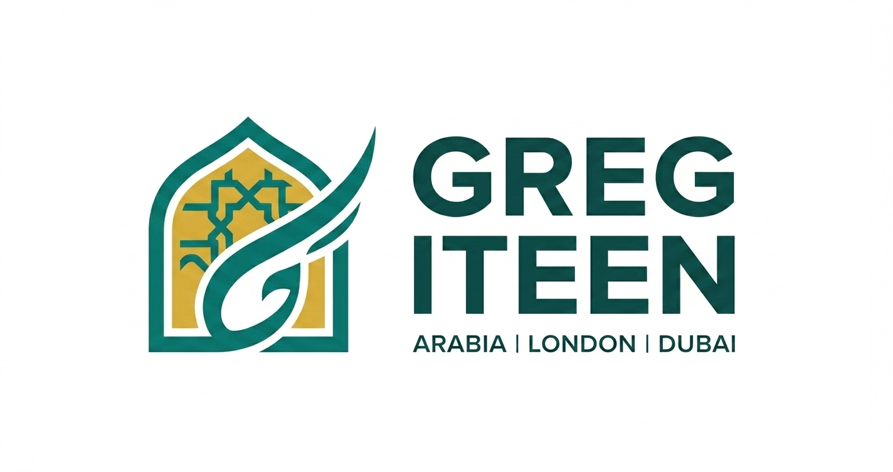

# Design System

A dark, premium visual system evoking the Arabian desert under a starry night. The architecture uses strict, high-density Bento Grids (native CSS Grid and subgrid) for portfolio items, contrasted against expansive, sweeping hero sections. Typography relies on a sophisticated hierarchy to guide the reader through dense technical case studies. Emojis and buzzwords are strictly forbidden; copy is austere and precise.

## Locked Design Constitution

```json
{
  "name": "Dune & Code",
  "accent": "Lapis & Brass",
  "signatureGesture": "A scroll-driven 'shifting sands' reveal. As the user scrolls, portfolio items and case study sections emerge from the deep background color, utilizing `animation-timeline: view()` and `@starting-style` for GPU-accelerated, staggered fade-ups.",
  "mobileStrategy": "Strictly mobile-first. The shell navigation is a compact, wrap-friendly horizontal list on mobile, avoiding hidden hamburger menus. Bento grids degrade gracefully to single-column vertical flows. Touch targets are rigorously padded to a minimum of 44x44px.",
  "imageTreatment": "Images feature deep contrast, heavy shadows, and subtle gold/brass color grading. The hero image will evoke a vast desert landscape fused with subtle technical motifs. Portraits will place the subject in a cinematic, low-key lighting environment with a hint of warm sand tones.",
  "tokens": {
    "colors": "--bg-base: oklch(20% 0.05 260); --bg-surface: oklch(25% 0.06 260); --text-main: oklch(90% 0.02 80); --text-muted: oklch(70% 0.03 260); --accent-brass: oklch(75% 0.15 80);",
    "typography": "--font-display: 'Cinzel Decorative', 'Optima', sans-serif; --font-body: 'JetBrains Mono', monospace; --text-scale-hero: clamp(2.5rem, 6vw, 5rem); --text-scale-h2: clamp(1.5rem, 4vw, 3rem);",
    "spacing": "--space-xs: 0.5rem; --space-sm: 1rem; --space-md: 2rem; --space-lg: 4rem; --space-xl: 8rem; --radius-bento: 2px;",
    "shape": "Strict rectangular bento grids with 2px corner radii, offset by occasional full-width sweeping curved dividers utilizing SVG masks.",
    "motion": "--easing-sand: cubic-bezier(0.25, 1, 0.5, 1); --duration-reveal: 0.8s;"
  },
  "classVocabulary": [
    {
      "name": "badge",
      "owner": "css",
      "purpose": "Injected runtime class for technology tags"
    },
    {
      "name": "src",
      "owner": "css",
      "purpose": "Injected runtime class for source links"
    },
    {
      "name": "backlink",
      "owner": "css",
      "purpose": "Injected runtime class for return navigation"
    },
    {
      "name": "btn",
      "owner": "css",
      "purpose": "Injected runtime class for buttons"
    },
    {
      "name": "md-img",
      "owner": "css",
      "purpose": "Injected runtime class for markdown images"
    },
    {
      "name": "layout-shell",
      "owner": "shell",
      "purpose": "Root layout container"
    },
    {
      "name": "global-nav",
      "owner": "shell",
      "purpose": "Main navigation wrapper"
    },
    {
      "name": "nav-list",
      "owner": "shell",
      "purpose": "Navigation item list"
    },
    {
      "name": "view-home",
      "owner": "home",
      "purpose": "Home page root"
    },
    {
      "name": "hero-vista",
      "owner": "home",
      "purpose": "Full bleed hero image container"
    },
    {
      "name": "featured-grid",
      "owner": "home",
      "purpose": "Bento grid for featured work"
    },
    {
      "name": "view-projects",
      "owner": "projects_index",
      "purpose": "Projects index root"
    },
    {
      "name": "masonry-grid",
      "owner": "projects_index",
      "purpose": "Native masonry container"
    },
    {
      "name": "view-designs",
      "owner": "designs_index",
      "purpose": "Designs index root"
    },
    {
      "name": "design-gallery",
      "owner": "designs_index",
      "purpose": "Gallery container"
    },
    {
      "name": "view-project-detail",
      "owner": "project_detail",
      "purpose": "Project detail root"
    },
    {
      "name": "article-body",
      "owner": "project_detail",
      "purpose": "Main content column"
    },
    {
      "name": "view-design-detail",
      "owner": "design_detail",
      "purpose": "Design detail root"
    },
    {
      "name": "media-showcase",
      "owner": "design_detail",
      "purpose": "Media container"
    },
    {
      "name": "view-page",
      "owner": "page",
      "purpose": "Generic page root"
    },
    {
      "name": "content-flow",
      "owner": "page",
      "purpose": "Text content flow container"
    },
    {
      "name": "project-card",
      "owner": "project_item",
      "purpose": "Individual project list item"
    },
    {
      "name": "design-card",
      "owner": "design_item",
      "purpose": "Individual design list item"
    },
    {
      "name": "nav-link",
      "owner": "nav_item",
      "purpose": "Individual navigation link"
    }
  ],
  "layoutBlueprints": {
    "shell": {
      "rootClass": "layout-shell",
      "composition": "A persistent, dark lapis blue header containing a 'global-nav' that wraps 'nav-list' cleanly on mobile and flexes horizontally on desktop. Main content is injected below in a standard document flow."
    },
    "home": {
      "rootClass": "view-home",
      "composition": "Opens with 'hero-vista', a vast, full-bleed section featuring a dark desert landscape background and bold display typography. Followed by 'featured-grid', a tight bento grid of highlight projects."
    },
    "projects_index": {
      "rootClass": "view-projects",
      "composition": "A clean, technical list view using 'masonry-grid' to display projects dynamically. Emphasizes typography and tags over heavy imagery."
    },
    "designs_index": {
      "rootClass": "view-designs",
      "composition": "A highly visual 'design-gallery' utilizing dense bento grid arrangements. Images take priority, with minimal overlaid text on hover."
    },
    "project_detail": {
      "rootClass": "view-project-detail",
      "composition": "An editorial layout featuring a prominent title header, followed by a constrained, single-column 'article-body' for optimal readability of technical case studies."
    },
    "design_detail": {
      "rootClass": "view-design-detail",
      "composition": "Focuses on large, high-resolution imagery within a 'media-showcase', with technical metadata and brief context tucked to the side or below on mobile."
    },
    "page": {
      "rootClass": "view-page",
      "composition": "A simple, elegant 'content-flow' layout for About and Contact pages, utilizing strict max-widths and expansive vertical rhythm."
    },
    "project_item": {
      "rootClass": "project-card",
      "composition": "A surface-colored card within the grid, featuring high-contrast brass accents for titles and a dense cluster of 'badge' elements for technologies."
    },
    "design_item": {
      "rootClass": "design-card",
      "composition": "An image-heavy card with a subtle lapis blue overlay that fades on hover, revealing the raw image."
    },
    "nav_item": {
      "rootClass": "nav-link",
      "composition": "A heavily padded (min 44px) anchor element, featuring a subtle brass underline on hover."
    }
  }
}
```

## section:css

```css
:root{--bg-base:oklch(20% 0.05 260);--bg-surface:oklch(25% 0.06 260);--text-main:oklch(90% 0.02 80);--text-muted:oklch(70% 0.03 260);--accent-brass:oklch(75% 0.15 80);--font-display:'Cinzel Decorative','Optima',sans-serif;--font-body:'JetBrains Mono',monospace;--text-scale-hero:clamp(2.5rem,6vw,5rem);--text-scale-h2:clamp(1.5rem,4vw,3rem);--space-xs:0.5rem;--space-sm:1rem;--space-md:2rem;--space-lg:4rem;--space-xl:8rem;--radius-bento:2px;--easing-sand:cubic-bezier(0.25,1,0.5,1);--duration-reveal:0.8s}*{box-sizing:border-box;margin:0;padding:0}body{background-color:var(--bg-base);color:var(--text-main);font-family:var(--font-body);line-height:1.6;overflow-x:hidden}h1,h2,h3,h4,h5,h6{font-family:var(--font-display);font-weight:400;color:var(--text-main);line-height:1.2}a{color:inherit;text-decoration:none}.badge{display:inline-block;padding:0.25rem 0.5rem;font-size:0.875rem;background:var(--bg-surface);color:var(--text-main);border-radius:var(--radius-bento);border:1px solid var(--text-muted);white-space:nowrap}.src,.backlink{display:inline-flex;align-items:center;min-height:44px;color:var(--text-muted);font-size:0.875rem;transition:color 0.2s ease}.src:hover,.backlink:hover{color:var(--accent-brass)}.btn{display:inline-flex;align-items:center;justify-content:center;min-height:44px;padding:0 var(--space-md);background:var(--accent-brass);color:var(--bg-base);font-family:var(--font-display);text-transform:uppercase;border-radius:var(--radius-bento);font-weight:bold;transition:opacity 0.2s ease}.btn:hover{opacity:0.9}.md-img{display:block;max-width:100%;height:auto;border-radius:var(--radius-bento);margin:var(--space-md) 0;box-shadow:0 12px 40px rgba(0,0,0,0.6)}.gi-reveal{opacity:0;transform:translateY(30px);transition:opacity var(--duration-reveal) var(--easing-sand), transform var(--duration-reveal) var(--easing-sand)}.gi-reveal.gi-in{opacity:1;transform:translateY(0)}.layout-shell{display:flex;flex-direction:column;min-height:100vh}.global-nav{background:var(--bg-surface);padding:var(--space-sm) var(--space-md);display:flex;flex-direction:column;gap:var(--space-sm);border-bottom:1px solid rgba(255,255,255,0.05)}.global-nav img[src*="logo.png"]{max-height:44px;width:auto;object-fit:contain}@media(min-width:768px){.global-nav{flex-direction:row;align-items:center;justify-content:space-between}}.nav-list{display:flex;flex-wrap:wrap;gap:var(--space-sm);list-style:none}.nav-link{display:inline-flex;align-items:center;min-height:44px;padding:0 var(--space-xs);color:var(--text-muted);font-family:var(--font-display);text-transform:uppercase;position:relative}.nav-link:hover{color:var(--accent-brass)}.nav-link::after{content:'';position:absolute;bottom:8px;left:var(--space-xs);right:var(--space-xs);height:1px;background:var(--accent-brass);transform:scaleX(0);transition:transform 0.3s var(--easing-sand);transform-origin:right}.nav-link:hover::after{transform:scaleX(1);transform-origin:left}.view-home{display:flex;flex-direction:column;flex-grow:1}.hero-vista{min-height:80vh;background-color:var(--bg-base);background-image:linear-gradient(to bottom, rgba(14,14,24,0.6), var(--bg-base)), url('assets/hero.jpg');background-size:cover;background-position:center;display:flex;flex-direction:column;justify-content:center;padding:var(--space-md)}.hero-vista h1{font-size:var(--text-scale-hero);color:var(--accent-brass);text-shadow:0 8px 24px rgba(0,0,0,0.8);max-width:800px}.featured-grid{display:grid;grid-template-columns:minmax(0,1fr);gap:var(--space-md);padding:var(--space-md)}@media(min-width:768px){.featured-grid{grid-template-columns:repeat(auto-fit,minmax(320px,1fr));padding:var(--space-lg)}}.view-projects,.view-designs{padding:var(--space-md);flex-grow:1}@media(min-width:768px){.view-projects,.view-designs{padding:var(--space-lg)}}.masonry-grid,.design-gallery{display:grid;grid-template-columns:minmax(0,1fr);gap:var(--space-md)}@media(min-width:768px){.masonry-grid,.design-gallery{grid-template-columns:repeat(auto-fill,minmax(320px,1fr))}}.project-card{background:var(--bg-surface);padding:var(--space-md);border-radius:var(--radius-bento);display:flex;flex-direction:column;gap:var(--space-sm);border:1px solid rgba(255,255,255,0.02);box-shadow:0 4px 12px rgba(0,0,0,0.2)}.project-card h2{font-size:1.5rem;color:var(--accent-brass)}.design-card{position:relative;border-radius:var(--radius-bento);overflow:hidden;background:var(--bg-surface);aspect-ratio:4/3;display:block}.design-card::before{content:'';position:absolute;inset:0;background:var(--bg-surface);opacity:0.6;transition:opacity 0.5s var(--easing-sand);z-index:1;mix-blend-mode:multiply}.design-card:hover::before{opacity:0}.design-card img{width:100%;height:100%;object-fit:cover}.design-card h3{position:absolute;bottom:var(--space-md);left:var(--space-md);z-index:2;opacity:0;transition:opacity 0.4s var(--easing-sand);color:var(--accent-brass);font-family:var(--font-display);margin:0}.design-card:hover h3{opacity:1}.view-project-detail,.view-page{padding:var(--space-md);display:flex;flex-direction:column;align-items:center;flex-grow:1}.article-body,.content-flow{width:100%;max-width:800px;display:flex;flex-direction:column;gap:var(--space-md)}.view-design-detail{padding:var(--space-md);flex-grow:1}.media-showcase{max-width:1200px;margin:0 auto;display:flex;flex-direction:column;gap:var(--space-md)}.media-showcase img{width:100%;height:auto;border-radius:var(--radius-bento);box-shadow:0 12px 40px rgba(0,0,0,0.7)}@supports(animation-timeline: view()){.project-card,.design-card,.article-body > *,.media-showcase > *{opacity:0;transform:translateY(40px) scale(0.98);animation:shifting-sands var(--duration-reveal) both var(--easing-sand);animation-timeline:view();animation-range:entry 5% cover 25%}}@keyframes shifting-sands{to{opacity:1;transform:translateY(0) scale(1)}}@media(prefers-reduced-motion: reduce){*,::before,::after{animation:none !important;transition:none !important}}

/* Release invariant: a generated skin may not let an untrusted logo asset take over the viewport. */
.nav-bar img[src*="gi-logo-transparent"], header img[src*="gi-logo-transparent"],
.nav-bar img[src*="assets/logo"], header img[src*="assets/logo"] {
  display: block;
  inline-size: min(11.25rem, 48vw) !important;
  block-size: 3.5rem !important;
  max-inline-size: 100% !important;
  max-block-size: 3.5rem !important;
  object-fit: contain !important;
  object-position: left center !important;
}
.verified-brand-mark {
  inline-size: min(11.25rem, 48vw) !important;
  block-size: 3.5rem !important;
  max-inline-size: 100% !important;
  max-block-size: 3.5rem !important;
  object-fit: contain !important;
}
/* Vault-injected project marks have their own stable wrapper regardless of
   the generated layout vocabulary. Bound them mechanically so intrinsic
   source dimensions can never escape a card or grid track. */
.logo-tile {
  display: flex !important;
  align-items: center !important;
  justify-content: center !important;
  inline-size: 100% !important;
  min-inline-size: 0 !important;
  max-inline-size: 100% !important;
  overflow: hidden !important;
}
.logo-tile img {
  display: block !important;
  inline-size: 100% !important;
  min-inline-size: 0 !important;
  max-inline-size: 100% !important;
  block-size: auto !important;
  max-block-size: 18rem !important;
  object-fit: contain !important;
}
/* Build-owned navigation wrapper and badge fragments need invariant spacing;
   aesthetic styling remains theme-owned. */
.nav-links {
  display: flex !important;
  flex-wrap: wrap !important;
  align-items: center !important;
  gap: .25rem 1rem !important;
  min-inline-size: 0 !important;
}
.nav-links a {
  display: inline-flex !important;
  align-items: center !important;
  min-block-size: 44px !important;
  white-space: nowrap !important;
}
.badge {
  margin: .2rem !important;
}
/* build-site emits both navigation layers; generated skins own the custom one. */
.tl-default { display: none !important; }
.tl-custom { display: flex; flex-wrap: wrap; align-items: center; }
```

## section:layout:shell

```html
<div class="layout-shell"><nav class="global-nav"><a href="/"></a><div class="nav-list">{{NAV_LINKS}}</div></nav><main>{{CONTENT}}</main><aside>{{THEME_PILLS}}{{SOURCE_PATH}}</aside></div>
```

## section:layout:home

```html
<section class="view-home"><div class="hero-vista"><h1>{{HEADLINE}}</h1><p>{{TAGLINE}}</p><p>{{INTRO}}</p></div><div class="featured-grid">{{FEATURED_PROJECTS}}</div></section>
```

## section:layout:projects_index

```html
<section class="view-projects"><div class="masonry-grid">{{PROJECT_LIST}}</div></section>
```

## section:layout:designs_index

```html
<div class="view-designs">
  {{DESIGN_CARDS}}
</div>
```

## section:layout:project_detail

```html
<article class="view-project-detail"><nav class="backlink">{{BACKLINK}}</nav><header><figure>{{LOGO}}</figure><h1>{{NAME}}</h1><p>{{DESCRIPTION}}</p><div><span>{{ROLE}}</span><span>{{YEAR}}</span></div><div>{{TECH_BADGES}}</div><div>{{PROJECT_LINK}}{{REPO_LINK}}</div><div class="src">{{SOURCE_PATH}}</div></header><div class="article-body">{{CONTENT}}</div></article>
```

## section:layout:design_detail

```html
<section class="view-design-detail"><header><h1>{{NAME}}</h1><div class="backlink">{{BACKLINK}}</div><p>{{DESCRIPTION}}</p></header><figure class="media-showcase"></figure><div>{{CONTENT}}</div><footer><a class="btn" href="{{LINK_URL}}">{{YEAR}}</a><span class="src">{{SOURCE_PATH}}</span></footer></section>
```

## section:layout:page

```html
<section class="view-page"><div class="content-flow"><h1>{{NAME}}</h1><div class="src">{{SOURCE_PATH}}</div><div>{{CONTENT}}</div></div></section>
```

## section:layout:project_item

```html
<article class="project-card"><figure>{{LOGO}}</figure><div><header><span>{{INDEX}}</span><time>{{YEAR}}</time></header><h3><a href="{{URL}}">{{NAME}}</a></h3><p>{{DESCRIPTION}}</p><div>{{TECH_BADGES}}</div><a href="{{REPO_URL}}" class="src"></a></div></article>
```

## section:layout:design_item

```html
<section class="design-card"><a href="{{URL}}"></a><div><h3>{{NAME}}</h3><span>{{YEAR}}</span><span>{{CLIENT}}</span><p>{{DESCRIPTION}}</p><div>{{TAG_BADGES}}</div></div></section>
```

## section:layout:nav_item

```html
<a href="{{NAV_URL}}" class="nav-link {{NAV_ACTIVE_CLASS}}">{{NAV_NAME}}</a>
```
