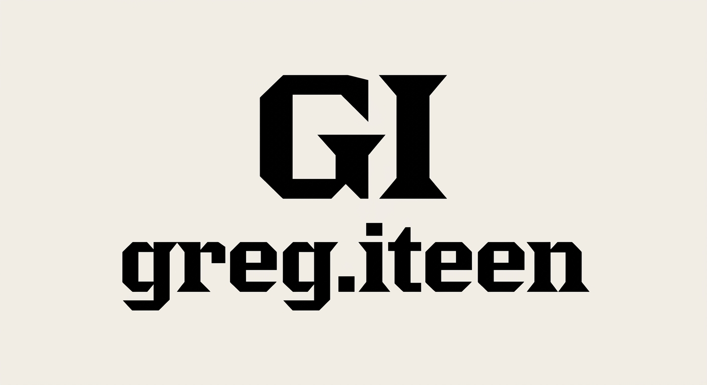

# Design System

---
bg-paper: "#F4F0EA"
text-carbon: "#0F0F0F"
text-muted: "#5A5854"
accent-red: "#E34234"
font-display: "'Playfair Display', Georgia, serif"
font-sans: "'Univers', -apple-system, sans-serif"
font-mono: "'SF Mono', Monaco, monospace"
grid-gap: "1.5rem"
border-thick: "3px solid #0F0F0F"
border-thin: "1px solid #0F0F0F"
transition-snappy: "0.15s cubic-bezier(0.25, 1, 0.5, 1)"
---

# DESIGN.md

## Visual Identity & Mood
The visual landscape of Greg Iteen's portfolio rejects transient modern UI trends in favor of Archival Constructivism. This system grounds modern local AI architecture in the tactical, historical permanence of printed broadsheets, editorial grids, and letterpress ink. The primary canvas is a heavy, raw unbleached paper background (#F4F0EA) paired with high-carbon black typography and highlighted by a singular, authoritative red-orange accent (#E34234). Solid lines replace soft shadows, and rigid alignments replace organic shapes.

## Mobile-First Architecture
- **Responsive Strategy**: Single-column vertical stacks are configured as the baseline mobile layout. Complex multi-column grid layouts activate strictly via @media (min-width: 768px) and refine at @media (min-width: 1200px).
- **Touch Target Integrity**: All interactive items, including menu nav links and portfolio metadata buttons, are designed with a minimum clickable surface area of 44x44px. Generous top/bottom padding preserves structural grid alignment while ensuring fluid mobile interaction.

## Typography & Visual Hierarchy
Headlines command immediate attention, rendered in an uncompromisingly sharp display serif (such as Playfair Display) which replicates the physical bleeding of wet ink on raw paper. Secondary information, tabular project indexes, and technical tags adopt a clean, structural sans-serif (such as Univers) or raw monospaced system font block. Grid structures are clearly defined with physical solid rules, organizing content like an index system.

## Motion & Kinetics
- **Letterpress Hover Mechanic**: All primary buttons and cards use a custom CSS animation: upon hover or focus, the card offsets -2px on the X and Y axes while generating a flat, deep carbon black drop shadow, simulating a physical letterpress print plate being released from paper.
- **Ink-Roll Reveal**: Elements with the `.gi-reveal` class utilize a hardware-accelerated clip-path vertical sweep, shifting from `clip-path: inset(100% 0% 0% 0%)` to `clip-path: inset(0% 0% 0% 0%)` upon entering the viewport to evoke the visual of structural printing presses.
- **Interactive Underlines**: Links inside editorial text build a solid underline that expands from zero-width to 100% from left-to-right using a crisp, high-velocity transition.

## section:css

```css
:root { --color-bg: #F4F0EA; --color-fg: #0F0F0F; --color-muted: #5A5854; --color-accent: #E34234; --color-accent-dim: #C23225; --font-display: "Playfair Display", Georgia, "Times New Roman", serif; --font-sans: "Univers", "Helvetica Neue", Arial, sans-serif; --font-mono: "SF Mono", Monaco, "Andale Mono", monospace; --text-xs: clamp(0.75rem, 0.7rem + 0.25vw, 0.875rem); --text-sm: clamp(0.875rem, 0.825rem + 0.25vw, 1rem); --text-base: clamp(1rem, 0.95rem + 0.25vw, 1.125rem); --text-lg: clamp(1.125rem, 1.05rem + 0.375vw, 1.3125rem); --text-xl: clamp(1.3125rem, 1.15rem + 0.8vw, 1.75rem); --text-2xl: clamp(1.5rem, 1.25rem + 1.25vw, 2.25rem); --text-3xl: clamp(1.75rem, 1.25rem + 2.5vw, 3rem); --text-4xl: clamp(2rem, 1.25rem + 4vw, 4rem); --spacing-base: 4px; --spacing-1: var(--spacing-base); --spacing-2: calc(var(--spacing-base) * 2); --spacing-4: calc(var(--spacing-base) * 4); --spacing-8: calc(var(--spacing-base) * 8); --spacing-12: calc(var(--spacing-base) * 12); --spacing-16: calc(var(--spacing-base) * 16); --spacing-24: calc(var(--spacing-base) * 24); --border-heavy: 3px solid var(--color-fg); --border-thin: 1px solid var(--color-fg); --border-accent: 2px solid var(--color-accent); --radius-none: 0px; --transition-snappy: 0.15s cubic-bezier(0.25, 1, 0.5, 1); --transition-smooth: 0.4s cubic-bezier(0.16, 1, 0.3, 1); --gi-stagger: 0.1s; }

*, *::before, *::after { box-sizing: border-box; margin: 0; padding: 0; }

html {
  font-size: 16px;
  -webkit-text-size-adjust: 100%;
}

body {
  background-color: var(--color-bg);
  color: var(--color-fg);
  font-family: var(--font-sans);
  line-height: 1.6;
  -webkit-font-smoothing: antialiased;
  -moz-osx-font-smoothing: grayscale;
  display: grid;
  grid-template-columns: 1fr;
}

@media (min-width: 768px) {
  body {
    grid-template-columns: repeat(12, 1fr);
  }
}

h1, h2, h3, h4, h5, h6 {
  font-family: var(--font-display);
  font-weight: 800;
  letter-spacing: -0.02em;
  line-height: 1.1;
  margin-top: 2.5rem;
  margin-bottom: 1rem;
  color: var(--color-fg);
}

h1 {
  font-size: clamp(2.5rem, 5vw, 4.5rem);
}

h2 {
  font-size: clamp(2rem, 4vw, 3.5rem);
}

h3 {
  font-size: clamp(1.5rem, 3vw, 2.5rem);
}

p, ul, ol {
  margin-bottom: 1.5rem;
  font-family: var(--font-sans);
  line-height: 1.6;
}

ul, ol {
  padding-left: 1.5rem;
}

li {
  margin-bottom: 0.5rem;
}

a {
  color: inherit;
  text-decoration: underline;
  text-decoration-thickness: 1px;
  text-underline-offset: 3px;
  transition: color var(--transition-snappy), text-decoration-color var(--transition-snappy), text-decoration-thickness var(--transition-snappy);
}

a:hover, a:focus {
  color: var(--color-accent);
  text-decoration-color: var(--color-accent);
  text-decoration-thickness: 2px;
  outline: none;
}

code, pre {
  font-family: var(--font-mono);
  font-size: 0.85em;
}

code {
  background-color: rgba(15, 15, 15, 0.05);
  padding: 0.2em 0.4em;
  border: var(--border-thin);
  white-space: nowrap;
}

pre {
  background-color: var(--color-fg);
  color: var(--color-bg);
  padding: 1.5rem;
  overflow-x: auto;
  margin: 2rem 0;
  border: var(--border-heavy);
}

pre code {
  background-color: transparent;
  border: none;
  padding: 0;
  color: inherit;
  white-space: pre;
}

blockquote {
  border-left: var(--border-accent);
  padding-left: 1.5rem;
  margin: 2.5rem 0;
  font-family: var(--font-display);
  font-style: italic;
  font-size: clamp(1.25rem, 2vw, 1.75rem);
  line-height: 1.4;
  color: var(--color-muted);
}

img, video, svg {
  max-width: 100%;
  height: auto;
  display: block;
}

.md-img {
  width: 100%;
  max-width: 800px;
  margin: 3rem auto;
  border: var(--border-heavy);
  filter: grayscale(100%) contrast(140%) sepia(20%) hue-rotate(330deg);
  mix-blend-mode: multiply;
}

.site-shell{display:flex;flex-direction:column;min-height:100vh;width:100%;border-top:var(--border-heavy);background-color:var(--color-bg);color:var(--color-fg);position:relative}.shell-header{position:sticky;top:0;z-index:100;display:flex;flex-direction:column;border-bottom:var(--border-heavy);background-color:var(--color-bg);padding:calc(var(--spacing-base) * 2) calc(var(--spacing-base) * 4)}.shell-header::after{content:'';position:absolute;bottom:4px;left:0;right:0;border-bottom:var(--border-thin)}@media (min-width:768px){.shell-header{flex-direction:row;justify-content:space-between;align-items:center}}.shell-nav{display:flex;flex-wrap:wrap;list-style:none;padding:0;margin:calc(var(--spacing-base) * 2) 0 0 0;gap:calc(var(--spacing-base) * 2)}@media (min-width:768px){.shell-nav{margin:0;gap:calc(var(--spacing-base) * 6)}}.shell-nav>*{min-width:44px;min-height:44px;display:inline-flex;align-items:center;justify-content:center}.editorial-grid{display:grid;grid-template-columns:1fr;gap:2px;background-color:var(--color-fg);border:var(--border-heavy)}@media (min-width:768px){.editorial-grid{grid-template-columns:repeat(12,1fr)}}.grid-cell{background-color:var(--color-bg);padding:calc(var(--spacing-base) * 4);display:flex;flex-direction:column}@media (min-width:768px){.grid-cell.span-3{grid-column:span 3}.grid-cell.span-4{grid-column:span 4}.grid-cell.span-6{grid-column:span 6}.grid-cell.span-8{grid-column:span 8}.grid-cell.span-9{grid-column:span 9}.grid-cell.span-12{grid-column:span 12}}.content-container{width:100%;max-width:1200px;margin:0 auto;padding:calc(var(--spacing-base) * 4);display:flex;flex-direction:column;flex:1}@media (min-width:768px){.content-container{padding:calc(var(--spacing-base) * 8)}}

.logo-container {
  display: flex;
  align-items: center;
  min-height: 44px;
  padding: 4px 0;
}
.logo-container img {
  height: 36px;
  width: auto;
  display: block;
}
.badge {
  display: inline-flex;
  align-items: center;
  justify-content: center;
  font-family: var(--font-mono);
  text-transform: uppercase;
  border: var(--border-thin);
  padding: 4px 8px;
  margin: 0 4px 4px 0;
  font-size: 0.75rem;
  color: var(--color-fg);
  background: var(--color-bg);
  border-radius: 0;
  white-space: nowrap;
}
a.badge, button.badge {
  min-height: 44px;
  padding: 0 16px;
  transition: background var(--transition-snappy), color var(--transition-snappy);
  text-decoration: none;
  cursor: pointer;
}
a.badge:hover, button.badge:hover, a.badge:focus, button.badge:focus {
  background: var(--color-fg);
  color: var(--color-bg);
}
.btn {
  display: inline-flex;
  align-items: center;
  justify-content: center;
  min-height: 44px;
  padding: 0 24px;
  background: var(--color-fg);
  color: var(--color-bg);
  font-family: var(--font-sans);
  text-transform: uppercase;
  font-weight: 700;
  letter-spacing: 0.05em;
  border: var(--border-heavy);
  text-decoration: none;
  transition: background var(--transition-snappy), color var(--transition-snappy), border-color var(--transition-snappy);
  cursor: pointer;
}
.btn:hover, .btn:focus {
  background: var(--color-accent);
  color: var(--color-bg);
  border-color: var(--color-accent);
}
.src {
  display: inline-flex;
  align-items: center;
  min-height: 44px;
  font-family: var(--font-mono);
  color: var(--color-fg);
  text-decoration: none;
  border-bottom: var(--border-thin);
  transition: color var(--transition-snappy), border-color var(--transition-snappy);
}
.src::after {
  content: '\2197';
  display: inline-block;
  margin-left: 8px;
  transition: transform var(--transition-snappy);
}
.src:hover, .src:focus {
  color: var(--color-accent);
  border-color: var(--color-accent);
}
.src:hover::after, .src:focus::after {
  transform: rotate(45deg);
}
.backlink {
  display: inline-flex;
  align-items: center;
  min-height: 44px;
  font-family: var(--font-mono);
  color: var(--color-muted);
  text-decoration: none;
  transition: color var(--transition-snappy);
}
.backlink:hover, .backlink:focus {
  color: var(--color-accent);
}
.project-card {
  display: block;
  position: relative;
  padding: 24px;
  border: var(--border-thin);
  background: var(--color-bg);
  color: var(--color-fg);
  text-decoration: none;
  min-height: 44px;
  transition: box-shadow var(--transition-smooth), transform var(--transition-smooth), border-color var(--transition-smooth);
  box-shadow: inset 0 0 0 transparent;
}
.project-card:hover, .project-card:focus {
  border-color: var(--color-accent-dim);
  box-shadow: inset 3px 3px 6px rgba(0, 0, 0, 0.15), inset -2px -2px 4px rgba(255, 255, 255, 0.6);
  transform: translateY(2px);
}
.design-card {
  display: block;
  position: relative;
  padding: 16px;
  border: var(--border-thin);
  background: var(--color-bg);
  color: var(--color-fg);
  text-decoration: none;
  min-height: 44px;
  transition: border-color var(--transition-snappy);
}
.design-card::before, .design-card::after {
  content: '';
  position: absolute;
  width: 16px;
  height: 16px;
  border: var(--border-accent);
  pointer-events: none;
  transition: transform var(--transition-snappy);
}
.design-card::before {
  top: -6px;
  left: -6px;
  border-right: none;
  border-bottom: none;
}
.design-card::after {
  bottom: -6px;
  right: -6px;
  border-left: none;
  border-top: none;
}
.design-card:hover, .design-card:focus {
  border-color: var(--color-fg);
}
.design-card:hover::before, .design-card:focus::before {
  transform: translate(-4px, -4px);
}
.design-card:hover::after, .design-card:focus::after {
  transform: translate(4px, 4px);
}
.preview-image {
  display: block;
  width: 100%;
  border: var(--border-heavy);
  overflow: hidden;
  background: var(--color-fg);
  margin-bottom: 16px;
}
.preview-image img {
  display: block;
  width: 100%;
  height: auto;
  filter: grayscale(100%) contrast(1.2);
  transition: filter var(--transition-smooth), transform var(--transition-smooth);
  transform: scale(1);
}
.design-card:hover .preview-image img, .project-card:hover .preview-image img {
  filter: grayscale(0%) contrast(1);
  transform: scale(1.02);
}
@media (min-width: 768px) {
  .project-card {
    padding: 32px;
  }
  .design-card {
    padding: 24px;
  }
}

.hero{background-image:url('assets/hero.jpg');background-size:cover;background-position:center;filter:grayscale(100%) contrast(1.2);position:relative;min-height:70vh;border-bottom:var(--border-heavy);display:flex;align-items:flex-end;padding:2rem 1rem}.hero::after{content:'';position:absolute;inset:0;background:repeating-linear-gradient(0deg,transparent,transparent 1px,rgba(15,15,15,0.1) 1px,rgba(15,15,15,0.1) 2px);pointer-events:none}@media (min-width: 768px){.hero{padding:4rem 2rem}}.page-home{display:flex;flex-direction:column;gap:2rem}.page-projects{display:grid;grid-template-columns:1fr;border-top:var(--border-heavy)}@media (min-width: 768px){.page-projects{grid-template-columns:repeat(2,1fr)}}.page-designs{display:grid;gap:1rem;grid-template-columns:1fr;padding:1rem 0}@media (min-width: 768px){.page-designs{grid-template-columns:repeat(auto-fill,minmax(300px,1fr));gap:2rem}}.page-detail{display:grid;grid-template-columns:1fr;gap:2rem;padding:2rem 1rem}@media (min-width: 768px){.page-detail{grid-template-columns:1fr 3fr;padding:4rem 2rem}}.gi-reveal{clip-path:polygon(0 0,100% 0,100% 0,0 0);transform:translateY(20px);opacity:0;transition:clip-path 0.8s cubic-bezier(0.16,1,0.3,1),transform 0.8s cubic-bezier(0.16,1,0.3,1),opacity 0.8s ease-out;transition-delay:var(--gi-stagger,0s)}.gi-reveal.gi-in{clip-path:polygon(0 0,100% 0,100% 100%,0 100%);transform:translateY(0);opacity:1}@media (prefers-reduced-motion: reduce){.gi-reveal{clip-path:none!important;transform:none!important;opacity:1!important;transition:none!important}}

/* Release invariant: a generated skin may not let an untrusted logo asset take over the viewport. */
.nav-bar img[src*="gi-logo-transparent"], header img[src*="gi-logo-transparent"],
.nav-bar img[src*="assets/logo"], header img[src*="assets/logo"] {
  display: block;
  inline-size: min(11.25rem, 48vw) !important;
  block-size: 3.5rem !important;
  max-inline-size: 100% !important;
  max-block-size: 3.5rem !important;
  object-fit: contain !important;
  object-position: left center !important;
}
.verified-brand-mark {
  inline-size: min(11.25rem, 48vw) !important;
  block-size: 3.5rem !important;
  max-inline-size: 100% !important;
  max-block-size: 3.5rem !important;
  object-fit: contain !important;
}
/* build-site emits both navigation layers; generated skins own the custom one. */
.tl-default { display: none !important; }
.tl-custom { display: flex; flex-wrap: wrap; align-items: center; }


/* review-board fix layer (pass 1) */
.shell-nav, .tl-custom { display: flex !important; flex-wrap: wrap !important; gap: 1.5rem !important; list-style: none !important; padding: 0 !important; margin: 0 !important; align-items: center !important; } .shell-nav a, .tl-custom a { display: inline-flex !important; align-items: center !important; justify-content: center !important; min-width: 44px !important; min-height: 44px !important; padding: 0 0.5rem !important; text-decoration: none !important; } .shell-nav a:hover, .tl-custom a:hover { text-decoration: underline !important; } body, .site-shell, .content-container { max-width: 100% !important; overflow-x: hidden !important; } .editorial-grid { width: 100% !important; max-width: 100% !important; grid-template-columns: 1fr !important; } @media (min-width: 768px) { .editorial-grid { grid-template-columns: repeat(12, 1fr) !important; } .editorial-grid .span-3 { grid-column: span 6 !important; } .editorial-grid .span-4 { grid-column: span 6 !important; } } @media (min-width: 1200px) { .editorial-grid .span-3 { grid-column: span 6 !important; } } .page-projects { grid-template-columns: 1fr !important; width: 100% !important; } @media (min-width: 768px) { .page-projects { grid-template-columns: repeat(2, 1fr) !important; } } .preview-image { background: var(--color-bg) !important; background-color: var(--color-bg) !important; } .design-card::before, .design-card::after, .design-card:first-child::before, .design-card:first-child::after { content: '' !important; position: absolute !important; width: 16px !important; height: 16px !important; border: var(--border-accent) !important; pointer-events: none !important; transition: transform var(--transition-snappy) !important; } .design-card::before, .design-card:first-child::before { top: -6px !important; left: -6px !important; right: auto !important; bottom: auto !important; border-right: none !important; border-bottom: none !important; border-left: var(--border-accent) !important; border-top: var(--border-accent) !important; } .design-card::after, .design-card:first-child::after { bottom: -6px !important; right: -6px !important; left: auto !important; top: auto !important; border-left: none !important; border-top: none !important; border-right: var(--border-accent) !important; border-bottom: var(--border-accent) !important; }

/* review-board fix layer (pass 2) */
body { display: block !important; } @media (min-width: 768px) { .site-shell { width: 100% !important; max-width: 100% !important; } } html, body { max-width: 100% !important; overflow-x: hidden !important; } .site-shell, .content-container, .editorial-grid, .grid-cell, .page-projects, .page-designs, .page-detail, .project-card, .design-card, .hero { box-sizing: border-box !important; max-width: 100% !important; min-width: 0 !important; } h1, h2, h3, h4, h5, h6, p, li, blockquote, a { overflow-wrap: break-word !important; word-break: break-word !important; } h1 { font-size: clamp(2rem, 8vw, 4rem) !important; } h2 { font-size: clamp(1.6rem, 6vw, 3rem) !important; } h3 { font-size: clamp(1.3rem, 5vw, 2.2rem) !important; } pre, code { max-width: 100% !important; white-space: pre-wrap !important; word-break: break-all !important; } @media (max-width: 767px) { .editorial-grid, .page-projects, .page-designs, .page-detail { grid-template-columns: 1fr !important; width: 100% !important; } .page-projects, .page-designs { padding-left: 12px !important; padding-right: 12px !important; } .project-card, .design-card { margin-left: 0 !important; margin-right: 0 !important; width: 100% !important; } }

/* review-board fix layer (pass 3) */
/* review-board fix layer (pass 3) */
@media (min-width: 768px) {
  .editorial-grid {
    display: grid !important;
    grid-template-columns: repeat(12, 1fr) !important;
    width: 100% !important;
  }
  /* Force any unspanned grid cell to span the full 12 columns so it is not crushed to 1/12th width */
  .editorial-grid > * {
    grid-column: span 12 !important;
  }
  /* Re-apply valid spans safely */
  .editorial-grid > .span-3 {
    grid-column: span 6 !important;
  }
  .editorial-grid > .span-4 {
    grid-column: span 6 !important;
  }
  .editorial-grid > .span-6 {
    grid-column: span 6 !important;
  }
  .editorial-grid > .span-8 {
    grid-column: span 8 !important;
  }
  .editorial-grid > .span-9 {
    grid-column: span 12 !important;
  }
  .editorial-grid > .span-12 {
    grid-column: span 12 !important;
  }
}

/* Ensure the projects index is full width on desktop and does not collapse */
.page-projects {
  width: 100% !important;
  max-width: 100% !important;
  display: grid !important;
  gap: 2rem !important;
}
@media (min-width: 768px) {
  .page-projects {
    grid-template-columns: repeat(2, 1fr) !important;
  }
}

/* Ensure designs gallery doesn\'t squeeze cards */
.page-designs {
  width: 100% !important;
  max-width: 100% !important;
  display: grid !important;
  gap: 2rem !important;
}
@media (min-width: 768px) {
  .page-designs {
    grid-template-columns: repeat(auto-fill, minmax(320px, 1fr)) !important;
  }
}

/* Fix letter-by-letter wrapping inside project and design cards */
.project-card, .design-card {
  display: flex !important;
  flex-direction: column !important;
  width: 100% !important;
  min-width: 0 !important;
  box-sizing: border-box !important;
}

.project-card * , .design-card * {
  min-width: 0 !important;
  word-break: normal !important;
  overflow-wrap: break-word !important;
  white-space: normal !important;
}

/* Clean wrap for badge arrays to prevent horizontal blowout or crushing */
.badge {
  display: inline-block !important;
  white-space: nowrap !important;
  margin-right: 6px !important;
  margin-bottom: 6px !important;
}

/* Reset flex wrapping for technical details and badges */
.project-card p, .design-card p, .page-detail p {
  display: block !important;
  width: 100% !important;
}
```

## section:layout:shell

```html
<div class="site-shell"><header class="shell-header"><div class="logo-container"></div><nav class="shell-nav">{{NAV_LINKS}}</nav></header><main class="content-container">{{CONTENT}}</main><footer class="editorial-grid"><div class="grid-cell">{{THEME_PILLS}}</div><div class="grid-cell">{{SOURCE_PATH}}</div></footer></div>
```

## section:layout:home

```html
<section class="page-home hero gi-reveal"><div class="editorial-grid"><div class="grid-cell content-container"><h1>{{HEADLINE}}</h1><h2>{{TAGLINE}}</h2><p>{{INTRO}}</p></div><div class="grid-cell"><h3>{{FEATURED_COUNT}}</h3></div><div class="grid-cell editorial-grid">{{FEATURED_PROJECTS}}</div></div></section>
```

## section:layout:projects_index

```html
<section class="page-projects gi-reveal"><header class="grid-cell"><span class="badge">{{PROJECT_COUNT}}</span></header><div class="editorial-grid">{{PROJECT_LIST}}</div></section>
```

## section:layout:designs_index

```html
<section class="page-designs gi-reveal"><div class="grid-cell"><span class="badge">{{DESIGN_COUNT}}</span></div><div class="editorial-grid">{{DESIGN_CARDS}}</div></section>
```

## section:layout:project_detail

```html
<article class="page-detail gi-reveal"><div class="editorial-grid"><div class="grid-cell">{{BACKLINK}}</div></div><header class="editorial-grid"><div class="grid-cell logo-container">{{LOGO}}</div><div class="grid-cell"><h1 class="gi-reveal">{{NAME}}</h1><p class="gi-reveal">{{DESCRIPTION}}</p></div><div class="grid-cell"><p class="gi-reveal">{{ROLE}}</p><p class="gi-reveal">{{YEAR}}</p></div></header><div class="editorial-grid"><div class="grid-cell gi-reveal">{{TECH_BADGES}}</div><div class="grid-cell gi-reveal">{{PROJECT_LINK}}{{REPO_LINK}}</div></div><div class="content-container gi-reveal">{{CONTENT}}</div><div class="editorial-grid"><div class="grid-cell gi-reveal">{{SOURCE_PATH}}</div></div></article>
```

## section:layout:design_detail

```html
<section class="page-detail content-container gi-reveal"><div class="editorial-grid"><header class="grid-cell">{{BACKLINK}}<h1>{{NAME}}</h1></header><div class="grid-cell"><p>{{DESCRIPTION}}</p></div><aside class="editorial-grid"><div class="grid-cell">{{CLIENT}}</div><div class="grid-cell">{{ROLE}}</div><div class="grid-cell">{{YEAR}}</div><div class="grid-cell">{{SOURCE_PATH}}</div><div class="grid-cell">{{TAG_BADGES}}</div></aside><figure class="grid-cell preview-image"></figure><div class="grid-cell"><a href="{{LINK_URL}}" class="btn">{{LINK_URL}}</a></div><article class="grid-cell">{{CONTENT}}</article></div></section>
```

## section:layout:page

```html
<article class="editorial-grid gi-reveal"><header class="grid-cell"><h1>{{NAME}}</h1><div class="badge">{{SOURCE_PATH}}</div></header><div class="grid-cell content-container">{{CONTENT}}</div></article>
```

## section:layout:project_item

```html
<article class="project-card grid-cell gi-reveal"><div class="editorial-grid"><div class="grid-cell"><span class="badge">{{INDEX}}</span><span class="badge">{{YEAR}}</span></div><div class="grid-cell logo-container">{{LOGO}}</div></div><div class="grid-cell"><h3><a href="{{URL}}">{{NAME}}</a></h3><p>{{DESCRIPTION}}</p></div><div class="editorial-grid"><div class="grid-cell">{{TECH_BADGES}}</div><div class="grid-cell"><a href="{{REPO_URL}}" class="src">{{REPO_URL}}</a></div></div></article>
```

## section:layout:design_item

```html
<a href="{{URL}}" class="design-card grid-cell gi-reveal"><div class="preview-image"></div><div class="grid-cell"><h3>{{NAME}}</h3><p>{{DESCRIPTION}}</p></div><div class="grid-cell"><span class="badge">{{YEAR}}</span><span class="badge">{{CLIENT}}</span></div><div class="grid-cell">{{TAG_BADGES}}</div></a>
```

## section:layout:nav_item

```html
<a href="{{NAV_URL}}" class="{{NAV_ACTIVE_CLASS}}">{{NAV_NAME}}</a>
```
