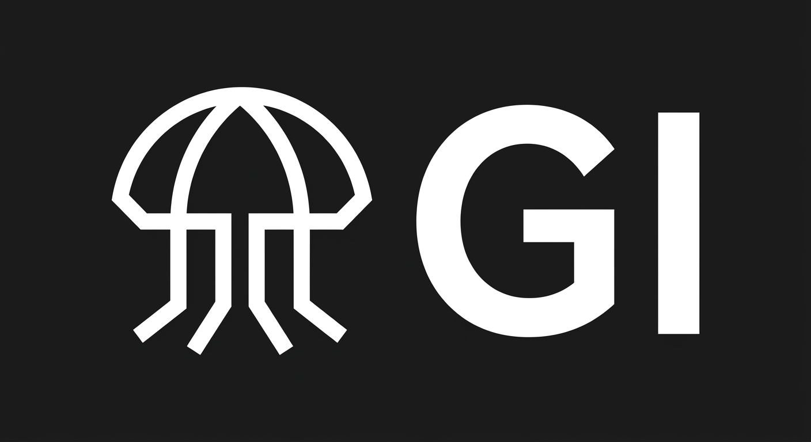

# Design System

---
name: biolume-local
description: An abyssal, editorial approach to local AI systems, blending strict technical grids with organic bioluminescent aesthetics.
tokens:
  color:
    bg-abyss: 'oklch(15% 0.02 240)'
    bg-surface: 'oklch(22% 0.03 240)'
    text-bone: 'oklch(90% 0.01 240)'
    text-muted: 'oklch(70% 0.02 240)'
    glow-flora: 'oklch(85% 0.15 160)'
  typography:
    display: '"Cormorant Upright", serif'
    body: '"Sora", sans-serif'
  spacing:
    gap-tight: '0.5rem'
    gap-bento: '1.5rem'
    section-pad: 'clamp(4rem, 10vw, 8rem)'
  shape:
    rad-soft: '12px'
    rad-pill: '100px'
---

# Design Intent
This design represents local AI models as localized biological ecosystems operating in the deep. We strictly avoid brutalism or cyberpunk tropes, opting instead for a highly polished, editorial presentation. Grid systems are mathematically precise, utilizing native masonry and subgrid features to maintain extreme information density. Visual interest is generated through high-contrast OKLCH glowing accents against deep, desaturated oceanic darks. Typography provides a deliberate contrast: a highly organic, sweeping serif for thesis statements, grounded by a geometric sans-serif for technical data.

## Locked Design Constitution

```json
{
  "name": "Biolume Local",
  "accent": "Abyssal Glow",
  "signatureGesture": "Project cards and list items emerge from the dark with a slow, scroll-driven fade-up (`animation-timeline: view(); animation-range: entry 5% cover 25%;`), mimicking deep-sea organisms entering the light of a submersible. Hovering over a bento grid card utilizes `:has()` on the parent to slightly dim sibling cards, while the hovered card's border illuminates with a soft, glowing OKLCH bioluminescent green hue, achieved without JavaScript.",
  "mobileStrategy": "Strict mobile-first bento grids. The core layout collapses to a single column, utilizing fluid typography to maintain readability. Touch targets are strictly enforced to 48px minimums via padding, maintaining the visual density without compromising usability. Navigation remains visible and wraps cleanly, expanding into a horizontal alignment at the 768px min-width breakpoint.",
  "imageTreatment": "Imagery must be high-contrast and deeply shadowed. Bioluminescent subjects (glowing hydrozoa, deep-sea flora) act as visual metaphors for local AI nodes. Backgrounds in images should melt seamlessly into the `--bg-abyss` base color to prevent hard visual borders.",
  "tokens": {
    "colors": "--bg-abyss: oklch(15% 0.02 240); --bg-surface: oklch(22% 0.03 240); --text-bone: oklch(90% 0.01 240); --text-muted: oklch(70% 0.02 240); --glow-flora: oklch(85% 0.15 160); --surface-border: oklch(35% 0.04 240);",
    "typography": "--font-display: 'Cormorant Upright', serif; --font-body: 'Sora', sans-serif; --weight-regular: 400; --weight-bold: 600;",
    "spacing": "--gap-tight: 0.5rem; --gap-bento: 1.5rem; --section-pad: clamp(4rem, 10vw, 8rem); --nav-height: 80px;",
    "shape": "--rad-soft: 12px; --rad-pill: 100px;",
    "motion": "--spring-slow: 0.8s cubic-bezier(0.2, 0.8, 0.2, 1); --fade-up: fade-up linear both;"
  },
  "classVocabulary": [
    {
      "name": "app-shell",
      "owner": "shell",
      "purpose": "Root layout container managing global grid and background"
    },
    {
      "name": "nav-header",
      "owner": "shell",
      "purpose": "Global navigation wrapper"
    },
    {
      "name": "logo-img",
      "owner": "shell",
      "purpose": "Brand logo image container"
    },
    {
      "name": "nav-links-container",
      "owner": "shell",
      "purpose": "Flex container for primary navigation links"
    },
    {
      "name": "nav-item",
      "owner": "nav_item",
      "purpose": "Individual navigation link styling"
    },
    {
      "name": "page-layout",
      "owner": "page",
      "purpose": "Standard page wrapper for prose content"
    },
    {
      "name": "hero-section",
      "owner": "home",
      "purpose": "Home hero block with background imagery"
    },
    {
      "name": "hero-headline",
      "owner": "home",
      "purpose": "Display typography for the hero thesis"
    },
    {
      "name": "bento-grid",
      "owner": "projects_index",
      "purpose": "Native masonry grid for collection lists"
    },
    {
      "name": "design-grid",
      "owner": "designs_index",
      "purpose": "Grid container for visual assets"
    },
    {
      "name": "card-item",
      "owner": "project_item",
      "purpose": "Bento grid item shell with hover state orchestration"
    },
    {
      "name": "card-title",
      "owner": "project_item",
      "purpose": "Project card heading"
    },
    {
      "name": "card-media",
      "owner": "project_item",
      "purpose": "Image wrapper for project previews"
    },
    {
      "name": "card-meta",
      "owner": "project_item",
      "purpose": "Metadata text container inside cards"
    },
    {
      "name": "design-card",
      "owner": "design_item",
      "purpose": "Container for design grid items"
    },
    {
      "name": "content-container",
      "owner": "project_detail",
      "purpose": "Max-width container for detail pages"
    },
    {
      "name": "design-content",
      "owner": "design_detail",
      "purpose": "Container for design detail views"
    },
    {
      "name": "prose-body",
      "owner": "project_detail",
      "purpose": "Typography rules for article content"
    },
    {
      "name": "badge",
      "owner": "css",
      "purpose": "Injected runtime class for taxonomy tags"
    },
    {
      "name": "src",
      "owner": "css",
      "purpose": "Injected runtime class for source links"
    },
    {
      "name": "backlink",
      "owner": "css",
      "purpose": "Injected runtime class for navigation return links"
    },
    {
      "name": "btn",
      "owner": "css",
      "purpose": "Injected runtime class for interactive buttons"
    },
    {
      "name": "md-img",
      "owner": "css",
      "purpose": "Injected runtime class for markdown images"
    },
    {
      "name": "overlay-noise",
      "owner": "css",
      "purpose": "Decorative texture layer, pointer-events: none"
    }
  ],
  "layoutBlueprints": {
    "shell": {
      "rootClass": "app-shell",
      "composition": "<div class=\"app-shell\"><div class=\"overlay-noise\"></div><header class=\"nav-header\"><a href=\"/\"></a><nav class=\"nav-links-container\">{{NAV_LINKS}}</nav></header><main>{{CONTENT}}</main></div>"
    },
    "home": {
      "rootClass": "hero-section",
      "composition": "<section class=\"hero-section\"><div class=\"content-container\"><h1 class=\"hero-headline\">Local AI ecosystems. Designed for the deep.</h1><p class=\"prose-body\">High-end technical architecture with bioluminescent specificity.</p></div></section><section class=\"content-container\"><div class=\"bento-grid\">{{FEATURED_PROJECTS}}</div></section>"
    },
    "projects_index": {
      "rootClass": "bento-grid",
      "composition": "<div class=\"content-container\"><h1 class=\"hero-headline\">Systems</h1><div class=\"bento-grid\">{{PROJECTS}}</div></div>"
    },
    "designs_index": {
      "rootClass": "design-grid",
      "composition": "<div class=\"content-container\"><h1 class=\"hero-headline\">Visual Output</h1><div class=\"design-grid\">{{DESIGNS}}</div></div>"
    },
    "project_detail": {
      "rootClass": "content-container",
      "composition": "<article class=\"content-container\"><header><h1 class=\"hero-headline\">{{TITLE}}</h1><div class=\"card-meta\">{{DATE}}</div></header><div class=\"prose-body\">{{CONTENT}}</div>{{PROJECT_LINK}}{{REPO_LINK}}</article>"
    },
    "design_detail": {
      "rootClass": "design-content",
      "composition": "<article class=\"design-content\"><header><h1 class=\"hero-headline\">{{TITLE}}</h1></header><figure class=\"card-media\">{{PREVIEW}}</figure><div class=\"prose-body\">{{CONTENT}}</div></article>"
    },
    "page": {
      "rootClass": "page-layout",
      "composition": "<div class=\"page-layout content-container\"><h1 class=\"hero-headline\">{{TITLE}}</h1><div class=\"prose-body\">{{CONTENT}}</div></div>"
    },
    "project_item": {
      "rootClass": "card-item",
      "composition": "<a href=\"{{URL}}\" class=\"card-item\"><div class=\"card-media\">{{PREVIEW}}</div><h2 class=\"card-title\">{{TITLE}}</h2><p class=\"card-meta\">{{DESCRIPTION}}</p></a>"
    },
    "design_item": {
      "rootClass": "design-card",
      "composition": "<a href=\"{{URL}}\" class=\"design-card\"><div class=\"card-media\">{{PREVIEW}}</div><h2 class=\"card-title\">{{TITLE}}</h2></a>"
    },
    "nav_item": {
      "rootClass": "nav-item",
      "composition": "<a href=\"{{URL}}\" class=\"nav-item\">{{LABEL}}</a>"
    }
  }
}
```

## section:css

```css
@import url('https://fonts.googleapis.com/css2?family=Cormorant+Upright:wght@400;600&family=Sora:wght@400;600&display=swap'); :root { --bg-abyss: oklch(15% 0.02 240); --bg-surface: oklch(22% 0.03 240); --text-bone: oklch(90% 0.01 240); --text-muted: oklch(70% 0.02 240); --glow-flora: oklch(85% 0.15 160); --surface-border: oklch(35% 0.04 240); --font-display: 'Cormorant Upright', serif; --font-body: 'Sora', sans-serif; --weight-regular: 400; --weight-bold: 600; --gap-tight: 0.5rem; --gap-bento: 1.5rem; --section-pad: clamp(4rem, 10vw, 8rem); --nav-height: 80px; --rad-soft: 12px; --rad-pill: 100px; --spring-slow: 0.8s cubic-bezier(0.2, 0.8, 0.2, 1); --fade-up: fade-up linear both; } *, *::before, *::after { box-sizing: border-box; } body { margin: 0; padding: 0; background-color: var(--bg-abyss); color: var(--text-bone); font-family: var(--font-body); font-weight: var(--weight-regular); line-height: 1.6; font-size: 16px; overflow-x: hidden; } h1, h2, h3, h4, h5, h6 { margin: 0; font-family: var(--font-display); font-weight: var(--weight-bold); line-height: 1.2; } a { color: inherit; text-decoration: none; transition: color 0.3s ease; } img, picture, svg, video { display: block; max-width: 100%; height: auto; } .app-shell { display: flex; flex-direction: column; min-height: 100vh; position: relative; } .overlay-noise { position: fixed; inset: 0; background-image: url('data:image/svg+xml;utf8,%3Csvg viewBox=%220 0 200 200%22 xmlns=%22http://www.w3.org/2000/svg%22%3E%3Cfilter id=%22noiseFilter%22%3E%3CfeTurbulence type=%22fractalNoise%22 baseFrequency=%220.8%22 numOctaves=%223%22 stitchTiles=%22stitch%22/%3E%3C/filter%3E%3Crect width=%22100%25%22 height=%22100%25%22 filter=%22url(%23noiseFilter)%22/%3E%3C/svg%3E'); opacity: 0.03; pointer-events: none; z-index: 9999; } .nav-header { display: flex; flex-direction: column; align-items: flex-start; gap: var(--gap-tight); padding: var(--gap-bento); min-height: var(--nav-height); border-bottom: 1px solid var(--surface-border); background-color: var(--bg-abyss); position: sticky; top: 0; z-index: 100; } @media (min-width: 768px) { .nav-header { flex-direction: row; align-items: center; justify-content: space-between; } } .logo-img { height: 32px; width: auto; display: block; } .nav-links-container { display: flex; flex-wrap: wrap; gap: var(--gap-tight); align-items: center; } .nav-item { font-size: 0.875rem; padding: 12px 16px; min-width: 44px; min-height: 44px; display: inline-flex; align-items: center; justify-content: center; color: var(--text-muted); border-radius: var(--rad-pill); transition: color var(--spring-slow), background-color var(--spring-slow); } .nav-item:hover { color: var(--text-bone); background-color: var(--bg-surface); } .content-container { width: 100%; max-width: 1200px; margin: 0 auto; padding: var(--section-pad) var(--gap-bento); display: flex; flex-direction: column; gap: var(--gap-bento); } .hero-section { position: relative; display: flex; flex-direction: column; align-items: flex-start; min-height: 60vh; background-color: var(--bg-abyss); background-image: linear-gradient(to bottom, transparent, var(--bg-abyss)), url('assets/hero.jpg'); background-size: cover; background-position: center; border-bottom: 1px solid var(--surface-border); } .hero-headline { font-size: clamp(2.5rem, 6vw, 5rem); letter-spacing: -0.02em; max-width: 14ch; color: var(--glow-flora); text-shadow: 0 4px 24px rgba(0,0,0,0.8); } .prose-body { max-width: 65ch; color: var(--text-muted); font-size: 1.125rem; } .bento-grid, .design-grid { display: grid; grid-template-columns: minmax(0, 1fr); gap: var(--gap-bento); width: 100%; } @media (min-width: 768px) { .bento-grid, .design-grid { grid-template-columns: repeat(auto-fit, minmax(320px, 1fr)); } } .card-item, .design-card { display: flex; flex-direction: column; background-color: var(--bg-surface); border: 1px solid var(--surface-border); border-radius: var(--rad-soft); overflow: hidden; position: relative; transition: border-color var(--spring-slow), box-shadow var(--spring-slow), transform var(--spring-slow); text-decoration: none; min-height: 44px; } .card-media { width: 100%; aspect-ratio: 16/9; overflow: hidden; background-color: var(--bg-abyss); border-bottom: 1px solid var(--surface-border); } .card-media img { width: 100%; height: 100%; object-fit: cover; transition: transform var(--spring-slow); filter: brightness(0.8) contrast(1.2); } .card-item:hover .card-media img, .design-card:hover .card-media img { transform: scale(1.05); } .card-title { font-size: 1.5rem; padding: var(--gap-bento) var(--gap-bento) 0 var(--gap-bento); color: var(--text-bone); } .card-meta { font-size: 0.875rem; color: var(--text-muted); padding: var(--gap-tight) var(--gap-bento) var(--gap-bento) var(--gap-bento); } .bento-grid:has(.card-item:hover) .card-item:not(:hover), .design-grid:has(.design-card:hover) .design-card:not(:hover) { opacity: 0.4; filter: saturate(0); } .card-item:hover, .design-card:hover { border-color: var(--glow-flora); box-shadow: 0 0 30px -10px var(--glow-flora); transform: translateY(-4px); z-index: 10; } @supports (animation-timeline: view()) { .card-item, .design-card { opacity: 0; animation: var(--fade-up); animation-timeline: view(); animation-range: entry 5% cover 25%; } } @keyframes fade-up { from { opacity: 0; transform: translateY(40px) scale(0.98); } to { opacity: 1; transform: translateY(0) scale(1); } } .page-layout, .design-content { max-width: 800px; margin: 0 auto; } .badge { display: inline-flex; align-items: center; justify-content: center; padding: 4px 12px; font-size: 0.75rem; text-transform: uppercase; letter-spacing: 0.05em; background-color: var(--bg-abyss); border: 1px solid var(--surface-border); border-radius: var(--rad-pill); color: var(--glow-flora); font-weight: var(--weight-bold); white-space: nowrap; } .btn { display: inline-flex; align-items: center; justify-content: center; padding: 12px 24px; min-width: 44px; min-height: 44px; font-size: 0.875rem; font-weight: var(--weight-bold); text-transform: uppercase; letter-spacing: 0.05em; background-color: var(--glow-flora); color: var(--bg-abyss); border-radius: var(--rad-pill); transition: background-color var(--spring-slow), transform var(--spring-slow); border: none; cursor: pointer; } .btn:hover { background-color: var(--text-bone); transform: scale(1.02); } .src, .backlink { display: inline-flex; align-items: center; min-height: 44px; font-size: 0.875rem; color: var(--text-muted); text-decoration: underline; text-decoration-color: var(--surface-border); text-underline-offset: 4px; transition: color var(--spring-slow), text-decoration-color var(--spring-slow); } .src:hover, .backlink:hover { color: var(--glow-flora); text-decoration-color: var(--glow-flora); } .md-img { border-radius: var(--rad-soft); border: 1px solid var(--surface-border); margin: var(--gap-bento) 0; box-shadow: 0 10px 30px rgba(0,0,0,0.5); } .gi-reveal { opacity: 0; transform: translateY(20px); transition: opacity var(--spring-slow), transform var(--spring-slow); } .gi-reveal.gi-in { opacity: 1; transform: translateY(0); }

/* Release invariant: a generated skin may not let an untrusted logo asset take over the viewport. */
.nav-bar img[src*="gi-logo-transparent"], header img[src*="gi-logo-transparent"],
.nav-bar img[src*="assets/logo"], header img[src*="assets/logo"] {
  display: block;
  inline-size: min(11.25rem, 48vw) !important;
  block-size: 3.5rem !important;
  max-inline-size: 100% !important;
  max-block-size: 3.5rem !important;
  object-fit: contain !important;
  object-position: left center !important;
}
.verified-brand-mark {
  inline-size: min(11.25rem, 48vw) !important;
  block-size: 3.5rem !important;
  max-inline-size: 100% !important;
  max-block-size: 3.5rem !important;
  object-fit: contain !important;
}
/* Vault-injected project marks have their own stable wrapper regardless of
   the generated layout vocabulary. Bound them mechanically so intrinsic
   source dimensions can never escape a card or grid track. */
.logo-tile {
  display: flex !important;
  align-items: center !important;
  justify-content: center !important;
  inline-size: 100% !important;
  min-inline-size: 0 !important;
  max-inline-size: 100% !important;
  overflow: hidden !important;
}
.logo-tile img {
  display: block !important;
  inline-size: 100% !important;
  min-inline-size: 0 !important;
  max-inline-size: 100% !important;
  block-size: auto !important;
  max-block-size: 18rem !important;
  object-fit: contain !important;
}
/* Build-owned navigation wrapper and badge fragments need invariant spacing;
   aesthetic styling remains theme-owned. */
.nav-links {
  display: flex !important;
  flex-wrap: wrap !important;
  align-items: center !important;
  gap: .25rem 1rem !important;
  min-inline-size: 0 !important;
}
.nav-links a {
  display: inline-flex !important;
  align-items: center !important;
  min-block-size: 44px !important;
  white-space: nowrap !important;
}
.badge {
  margin: .2rem !important;
}
/* build-site emits both navigation layers; generated skins own the custom one. */
.tl-default { display: none !important; }
.tl-custom { display: flex; flex-wrap: wrap; align-items: center; }


/* review-board fix layer (pass 1) */
.logo-img { filter: brightness(0) invert(0.95); opacity: 0.95; transition: filter 0.3s ease, opacity 0.3s ease; } .logo-img:hover { filter: brightness(0) invert(1) drop-shadow(0 0 8px var(--glow-flora, oklch(85% 0.15 160))); opacity: 1; } .bento-grid:has(.card-item:hover) .card-item:not(:hover) { opacity: 0.65 !important; } .card-item .card-title { color: var(--text-bone, oklch(90% 0.01 240)) !important; } .card-item .card-meta { color: oklch(80% 0.02 240) !important; } .bento-grid:has(.card-item:hover) .card-item:not(:hover) .card-title { color: var(--text-bone, oklch(90% 0.01 240)) !important; } .bento-grid:has(.card-item:hover) .card-item:not(:hover) .card-meta { color: oklch(75% 0.02 240) !important; }
```

## section:layout:shell

```html
<section class="app-shell"><style></style><div class="overlay-noise"></div><header class="nav-header"><nav class="nav-links-container">{{NAV_LINKS}}{{THEME_PILLS}}</nav></header><main>{{CONTENT}}</main><footer>{{SOURCE_PATH}}</footer></section>
```

## section:layout:home

```html
<section class="hero-section"><div class="content-container"><h1 class="hero-headline">{{HEADLINE}}</h1><div class="prose-body">{{TAGLINE}}{{INTRO}}</div></div></section><section class="content-container"><div class="badge">{{FEATURED_COUNT}}</div><div class="bento-grid">{{FEATURED_PROJECTS}}</div></section>
```

## section:layout:projects_index

```html
<section class="bento-grid"><div class="card-meta">{{PROJECT_COUNT}}</div>{{PROJECT_LIST}}</section>
```

## section:layout:designs_index

```html
<section class="design-grid">{{DESIGN_CARDS}}</section>
```

## section:layout:project_detail

```html
<article class="content-container">{{BACKLINK}}<header><h1 class="hero-headline">{{NAME}}</h1><div class="prose-body">{{DESCRIPTION}}</div><div class="card-meta"><span>{{ROLE}}</span><span>{{YEAR}}</span></div>{{TECH_BADGES}}</header><figure class="card-media">{{LOGO}}</figure><div class="prose-body">{{CONTENT}}</div><div class="card-meta">{{PROJECT_LINK}}{{REPO_LINK}}{{SOURCE_PATH}}</div></article>
```

## section:layout:design_detail

```html
<article class="design-content">{{BACKLINK}}<header><h1 class="hero-headline">{{NAME}}</h1><div class="card-meta">{{YEAR}} {{CLIENT}} {{ROLE}}</div><div class="badge">{{TAG_BADGES}}</div><div class="prose-body">{{DESCRIPTION}}</div></header><figure class="card-media"></figure><div class="prose-body">{{CONTENT}}</div><a href="{{LINK_URL}}" class="btn src">{{SOURCE_PATH}}</a></article>
```

## section:layout:page

```html
<div class="page-layout content-container"><h1 class="hero-headline">{{NAME}}</h1><div class="prose-body">{{CONTENT}}</div>{{SOURCE_PATH}}</div>
```

## section:layout:project_item

```html
<a href="{{URL}}" class="card-item"><div class="card-media">{{LOGO}}</div><h2 class="card-title">{{NAME}}</h2><div class="card-meta">{{YEAR}} {{DESCRIPTION}}</div>{{TECH_BADGES}}</a>
```

## section:layout:design_item

```html
<section class="design-card"><a href="{{URL}}"><h2 class="card-title">{{NAME}}</h2></a></section>
```

## section:layout:nav_item

```html
<a href="{{NAV_URL}}" class="nav-item {{NAV_ACTIVE_CLASS}}">{{NAV_NAME}}</a>
```
