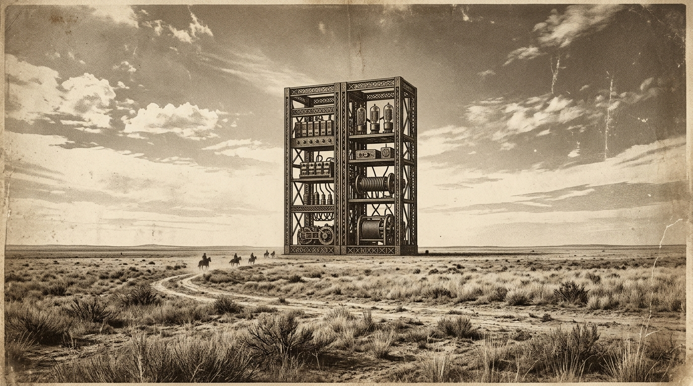

# Design System

Design Constitution: Mercantile Ledger AI. Typography: Primary display is 'Playfair Display' or a similar high-contrast vintage serif, scaled massively for the hero thesis. Body copy and technical data utilize 'JetBrains Mono' to ground the antique aesthetic in the reality of software engineering. Color Palette: Built strictly on OKLCH. Backgrounds are an aged parchment tone oklch(92% 0.02 90), text is a faded iron-gall ink oklch(25% 0.02 260), and the accent is a muted oxblood oklch(40% 0.1 20). Layout Strategy: The ledger. Every container is bounded by 1px solid borders resembling ruled paper. We use CSS Grid heavily, allowing nested elements to align perfectly across parent tracks using subgrid. Motion: Subdued and physical. Cards fade up and borders 'draw' themselves in via scroll-driven animations, anchored entirely on the compositor thread. There is no bouncy, elastic movement; only the heavy, deliberate placement of archived materials.

## Locked Design Constitution

```json
{
  "name": "Mercantile Ledger AI",
  "accent": "oklch(35% 0.05 45)",
  "signatureGesture": "Ledger Entry Reveal: As the user scrolls, new projects and designs are revealed using a view() timeline that animates their opacity and applies a subtle sepia filter transition, simulating the uncovering of a historical document from an archive.",
  "mobileStrategy": "The multi-column ledger collapses into a continuous vertical scroll, reminiscent of an adding-machine tape. Borders remain prominent to distinguish individual entries, and touch targets are expanded to 44px minimum by padding out the 'cells' of the ledger rather than scaling up text.",
  "imageTreatment": "All imagery is processed with a high-contrast, sepia-toned filter and overlaid with a subtle CSS-generated SVG static grain to emulate 19th-century tintypes or woodcut engravings.",
  "tokens": {
    "colors": "bg: oklch(94% 0.015 85); text: oklch(20% 0.01 250); accent: oklch(35% 0.08 30); border: oklch(50% 0.02 250); surface: oklch(90% 0.02 85)",
    "typography": "display: 'Playfair Display', serif; body: 'JetBrains Mono', monospace; scale: 1.15; weight-display: 700; weight-body: 400",
    "spacing": "base: 1rem; ledger-padding: clamp(1rem, 3vw, 2rem); section-gap: clamp(4rem, 8vw, 8rem); border-width: 1px",
    "shape": "radius-none: 0px; radius-subtle: 2px; ledger-border: 1px solid var(--border)",
    "motion": "easing-heavy: cubic-bezier(0.2, 0, 0, 1); duration-slow: 600ms; transition-opacity: opacity 400ms ease-in-out"
  },
  "classVocabulary": [
    {
      "name": "ledger-shell",
      "owner": "shell",
      "purpose": "Root container establishing the vintage document canvas and SVG grain"
    },
    {
      "name": "ledger-header",
      "owner": "shell",
      "purpose": "Global navigation wrapper styled as a mercantile invoice header"
    },
    {
      "name": "nav-list",
      "owner": "shell",
      "purpose": "Unordered list wrapping navigation items"
    },
    {
      "name": "nav-item",
      "owner": "nav_item",
      "purpose": "Individual navigation link with 44px tap target"
    },
    {
      "name": "home-hero",
      "owner": "home",
      "purpose": "Massive typography and vintage landscape hero section"
    },
    {
      "name": "home-grid",
      "owner": "home",
      "purpose": "Bento grid for featured archival projects"
    },
    {
      "name": "projects-archive",
      "owner": "projects_index",
      "purpose": "Index container for all engineering works"
    },
    {
      "name": "project-row",
      "owner": "project_item",
      "purpose": "Individual project entry in the ledger"
    },
    {
      "name": "project-title",
      "owner": "project_item",
      "purpose": "Serif heading for the project name"
    },
    {
      "name": "project-meta",
      "owner": "project_item",
      "purpose": "Monospace technical details for the project"
    },
    {
      "name": "designs-catalog",
      "owner": "designs_index",
      "purpose": "Masonry grid for visual and architectural works"
    },
    {
      "name": "design-card",
      "owner": "design_item",
      "purpose": "Container for a single design preview"
    },
    {
      "name": "design-preview",
      "owner": "design_item",
      "purpose": "Sepia-toned image thumbnail"
    },
    {
      "name": "detail-canvas",
      "owner": "project_detail",
      "purpose": "Main content wrapper for full project readouts"
    },
    {
      "name": "detail-header",
      "owner": "project_detail",
      "purpose": "Title and metadata lockup for the project detail"
    },
    {
      "name": "detail-body",
      "owner": "project_detail",
      "purpose": "Monospace rich text container for engineering prose"
    },
    {
      "name": "design-detail-canvas",
      "owner": "design_detail",
      "purpose": "Wrapper for high-resolution visual work"
    },
    {
      "name": "design-detail-hero",
      "owner": "design_detail",
      "purpose": "Full bleed container for the primary design artifact"
    },
    {
      "name": "page-canvas",
      "owner": "page",
      "purpose": "Standard text page container for about or contact"
    },
    {
      "name": "badge",
      "owner": "css",
      "purpose": "Small technical indicator tag"
    },
    {
      "name": "src",
      "owner": "css",
      "purpose": "Source code link or reference"
    },
    {
      "name": "backlink",
      "owner": "css",
      "purpose": "Navigation link returning to previous ledger index"
    },
    {
      "name": "btn",
      "owner": "css",
      "purpose": "Primary interaction target styled as a vintage stamp or seal"
    },
    {
      "name": "md-img",
      "owner": "css",
      "purpose": "Injected markdown image with sepia styling"
    }
  ],
  "layoutBlueprints": {
    "shell": {
      "rootClass": "ledger-shell",
      "composition": "A full-viewport flex column with a fixed top border. The ledger-header sits at the top, containing a wordmark and the nav-list. Main content area fills the remaining space. An SVG grain filter is applied to the pseudo-element of the ledger-shell to texture the entire application."
    },
    "home": {
      "rootClass": "home-hero",
      "composition": "A striking two-part layout. The top half features massive, tightly kerned serif typography overlaying a faded 19th-century landscape image. The bottom half transitions into the home-grid, a 3-column subgrid displaying featured project-row items."
    },
    "projects_index": {
      "rootClass": "projects-archive",
      "composition": "A strict vertical stack. Each child is a project-row with heavy top and bottom borders, acting like an itemized list in an old general store catalog. Metadata aligns to right-hand columns on desktop."
    },
    "designs_index": {
      "rootClass": "designs-catalog",
      "composition": "A native CSS masonry layout of design-card items. Each card has a thick ruled border and contains a design-preview image, scaled and filtered to look like a vintage archive."
    },
    "project_detail": {
      "rootClass": "detail-canvas",
      "composition": "A single-column reading experience centered on the page. The detail-header displays the title in massive serif font, followed by a metadata block. The detail-body contains the project description with strict monospace formatting and sepia-toned md-img elements."
    },
    "design_detail": {
      "rootClass": "design-detail-canvas",
      "composition": "A wide, immersive layout. The design-detail-hero takes up the majority of the viewport, styled with heavy frame borders, followed by a smaller text description area below."
    },
    "page": {
      "rootClass": "page-canvas",
      "composition": "A centered, narrow reading column for text-heavy pages, utilizing the body monospace typography for a raw, typed-document feel."
    },
    "project_item": {
      "rootClass": "project-row",
      "composition": "A horizontal flex container (or grid on desktop) containing the project-title and project-meta. It has 44px minimum height and uses :has() to darken the background subtly when hovered or focused."
    },
    "design_item": {
      "rootClass": "design-card",
      "composition": "A vertical card holding the design-preview image and a small caption area. Uses native starting-style for smooth scale-in animations when entering the viewport."
    },
    "nav_item": {
      "rootClass": "nav-item",
      "composition": "A simple anchor link with generous padding to ensure a 44px tap target, styled with uppercase monospace text and a subtle underline on hover."
    }
  }
}
```

## section:css

```css
:root{--bg: oklch(94% 0.015 85);--text: oklch(20% 0.01 250);--accent: oklch(35% 0.08 30);--border: oklch(50% 0.02 250);--surface: oklch(90% 0.02 85);--font-display: 'Playfair Display', serif;--font-body: 'JetBrains Mono', monospace;--ledger-pad: clamp(1rem, 3vw, 2rem);--section-gap: clamp(4rem, 8vw, 8rem)}*,*::before,*::after{box-sizing:border-box}body{margin:0;padding:0;background:var(--bg);color:var(--text);font-family:var(--font-body);font-size:1.15rem;font-weight:400;line-height:1.5;overflow-x:hidden}h1,h2,h3,h4,h5,h6{font-family:var(--font-display);font-weight:700;margin:0 0 1rem}.ledger-shell{position:relative;min-height:100vh;display:flex;flex-direction:column}.ledger-shell::after{content:'';position:fixed;inset:0;pointer-events:none;z-index:9999;background-image:url('data:image/svg+xml;utf8,%3Csvg viewBox=%220 0 200 200%22 xmlns=%22http://www.w3.org/2000/svg%22%3E%3Cfilter id=%22n%22%3E%3CfeTurbulence type=%22fractalNoise%22 baseFrequency=%220.85%22 numOctaves=%223%22 stitchTiles=%22stitch%22/%3E%3C/filter%3E%3Crect width=%22100%25%22 height=%22100%25%22 filter=%22url(%23n)%22 opacity=%220.06%22/%3E%3C/svg%3E')}.ledger-header{display:flex;flex-direction:column;border-bottom:1px solid var(--border);padding:var(--ledger-pad);background:var(--bg);z-index:10}.nav-list{display:flex;flex-wrap:wrap;gap:1rem;list-style:none;margin:1rem 0 0;padding:0}.nav-item{display:inline-flex;align-items:center;min-height:44px;min-width:44px;font-family:var(--font-body);text-transform:uppercase;text-decoration:none;color:inherit;padding:0.5rem;font-size:0.9rem;transition:background 0.2s}.nav-item:hover{background:var(--surface)}.home-hero{display:flex;flex-direction:column;justify-content:center;min-height:60vh;background-image:url('assets/hero.jpg');background-size:cover;background-position:center;background-blend-mode:luminosity;background-color:var(--surface);border-bottom:1px solid var(--border);padding:var(--ledger-pad)}.home-hero h1{font-size:clamp(2.5rem, 8vw, 6rem);line-height:1;margin:0;color:var(--text);text-transform:uppercase;letter-spacing:-0.02em;background:rgba(240, 240, 235, 0.8);display:inline-block;padding:0.5rem 1rem}.home-grid{display:grid;grid-template-columns:minmax(0,1fr);border-bottom:1px solid var(--border)}.projects-archive{display:flex;flex-direction:column;width:100%}.project-row{display:flex;flex-direction:column;padding:var(--ledger-pad);border-bottom:1px solid var(--border);text-decoration:none;color:inherit;min-height:44px;transition:background 0.2s}.project-row:hover,.project-row:focus-within{background:var(--surface)}.project-title{font-family:var(--font-display);font-size:1.5rem;margin:0 0 0.5rem}.project-meta{font-family:var(--font-body);font-size:0.85rem;color:var(--accent);margin:0}.designs-catalog{display:grid;grid-template-columns:minmax(0,1fr);gap:var(--ledger-pad);padding:var(--ledger-pad)}.design-card{display:flex;flex-direction:column;border:1px solid var(--border);background:var(--bg);padding:0.5rem;text-decoration:none;color:inherit}.design-preview{width:100%;height:auto;filter:sepia(0.8) contrast(1.2) grayscale(0.2);border:1px solid var(--border);display:block}.detail-canvas,.page-canvas{padding:var(--ledger-pad);max-width:800px;margin:0 auto;width:100%}.detail-header{border-bottom:2px double var(--border);margin-bottom:2rem;padding-bottom:1.5rem}.detail-header h1{font-size:clamp(2rem, 5vw, 4rem)}.detail-body{font-family:var(--font-body);font-size:1rem;line-height:1.7}.design-detail-canvas{padding:var(--ledger-pad);width:100%;max-width:1200px;margin:0 auto}.design-detail-hero{width:100%;border:1rem solid var(--surface);padding:0.5rem;background:var(--border);margin-bottom:2rem}.design-detail-hero img{width:100%;height:auto;display:block;filter:sepia(0.4)}.badge{display:inline-flex;align-items:center;min-height:24px;padding:0 0.5rem;border:1px solid var(--text);font-size:0.75rem;text-transform:uppercase;margin:0.25rem 0.25rem 0.25rem 0;background:var(--surface)}.src,.backlink{display:inline-flex;align-items:center;min-height:44px;min-width:44px;padding:0.5rem 1rem;border:1px solid var(--border);text-decoration:none;color:var(--text);font-size:0.875rem;text-transform:uppercase;margin-top:1rem}.src:hover,.backlink:hover{background:var(--surface)}.btn{display:inline-flex;align-items:center;justify-content:center;min-height:44px;min-width:44px;padding:0.5rem 2rem;background:var(--text);color:var(--bg);font-family:var(--font-body);font-size:0.9rem;text-transform:uppercase;border:none;cursor:pointer;font-weight:700}.btn:hover{background:var(--accent)}.md-img{max-width:100%;height:auto;border:1px solid var(--border);filter:sepia(0.5);margin:1.5rem 0}.gi-reveal{opacity:0;transform:translateY(20px);filter:sepia(1);transition:opacity 600ms cubic-bezier(0.2,0,0,1), transform 600ms cubic-bezier(0.2,0,0,1), filter 600ms ease}.gi-reveal.gi-in{opacity:1;transform:translateY(0);filter:sepia(0)}@media (min-width:768px){.ledger-header{flex-direction:row;justify-content:space-between;align-items:center}.nav-list{margin:0}.home-grid{grid-template-columns:repeat(3, minmax(0,1fr))}.project-row{flex-direction:row;justify-content:space-between;align-items:baseline}.project-title{margin:0}.designs-catalog{grid-template-columns:repeat(auto-fit, minmax(320px, 1fr))}}@supports (animation-timeline: view()){.project-row, .design-card{opacity:0;animation:reveal-ledger linear both;animation-timeline:view();animation-range:entry 5% cover 25%}@keyframes reveal-ledger{0%{opacity:0;filter:sepia(1)}100%{opacity:1;filter:sepia(0)}}}

/* Release invariant: a generated skin may not let an untrusted logo asset take over the viewport. */
.nav-bar img[src*="gi-logo-transparent"], header img[src*="gi-logo-transparent"],
.nav-bar img[src*="assets/logo"], header img[src*="assets/logo"] {
  display: block;
  inline-size: min(11.25rem, 48vw) !important;
  block-size: 3.5rem !important;
  max-inline-size: 100% !important;
  max-block-size: 3.5rem !important;
  object-fit: contain !important;
  object-position: left center !important;
}
.verified-brand-mark {
  inline-size: min(11.25rem, 48vw) !important;
  block-size: 3.5rem !important;
  max-inline-size: 100% !important;
  max-block-size: 3.5rem !important;
  object-fit: contain !important;
}
/* Vault-injected project marks have their own stable wrapper regardless of
   the generated layout vocabulary. Bound them mechanically so intrinsic
   source dimensions can never escape a card or grid track. */
.logo-tile {
  display: flex !important;
  align-items: center !important;
  justify-content: center !important;
  inline-size: 100% !important;
  min-inline-size: 0 !important;
  max-inline-size: 100% !important;
  overflow: hidden !important;
}
.logo-tile img {
  display: block !important;
  inline-size: 100% !important;
  min-inline-size: 0 !important;
  max-inline-size: 100% !important;
  block-size: auto !important;
  max-block-size: 18rem !important;
  object-fit: contain !important;
}
/* Build-owned navigation wrapper and badge fragments need invariant spacing;
   aesthetic styling remains theme-owned. */
.nav-links {
  display: flex !important;
  flex-wrap: wrap !important;
  align-items: center !important;
  gap: .25rem 1rem !important;
  min-inline-size: 0 !important;
}
.nav-links a {
  display: inline-flex !important;
  align-items: center !important;
  min-block-size: 44px !important;
  white-space: nowrap !important;
}
.badge {
  margin: .2rem !important;
}
/* build-site emits both navigation layers; generated skins own the custom one. */
.tl-default { display: none !important; }
.tl-custom { display: flex; flex-wrap: wrap; align-items: center; }


/* review-board fix layer (pass 1) */
.nav-item, .btn, .backlink, .src { min-height: 44px; display: inline-flex; align-items: center; padding: 0.5rem 1rem; box-sizing: border-box; } .home-hero { position: relative; background-image: url('assets/hero.jpg'); background-size: cover; background-position: center; background-repeat: no-repeat; padding: clamp(3rem, 8vw, 8rem) var(--ledger-padding, 1rem); box-sizing: border-box; overflow: hidden; } .home-hero::before { content: ''; position: absolute; inset: 0; background: linear-gradient(180deg, oklch(94% 0.015 85 / 0.95) 0%, oklch(94% 0.015 85 / 0.85) 50%, oklch(94% 0.015 85 / 0.95) 100%); backdrop-filter: sepia(30%); z-index: 1; } .home-hero > * { position: relative; z-index: 2; } .projects-archive { display: flex; flex-direction: column; width: 100%; max-width: 100%; box-sizing: border-box; } .project-row { display: flex; flex-direction: column; gap: 1rem; padding: 1.5rem var(--ledger-padding, 1rem); border-bottom: 1px solid oklch(50% 0.02 250); box-sizing: border-box; width: 100%; align-items: stretch; } @media (min-width: 768px) { .project-row { flex-direction: row; justify-content: space-between; align-items: baseline; gap: 2.5rem; } } .project-title { font-family: 'Playfair Display', serif; font-weight: 700; font-size: clamp(1.25rem, 2.5vw, 1.75rem); line-height: 1.2; margin: 0; flex: 1 1 auto; color: oklch(20% 0.01 250); } .project-meta { font-family: 'JetBrains Mono', monospace; font-size: 0.875rem; line-height: 1.6; margin: 0; display: flex; flex-wrap: wrap; gap: 0.5rem 1rem; align-items: center; flex-shrink: 0; color: oklch(35% 0.08 30); } .designs-catalog { display: grid; grid-template-columns: repeat(auto-fill, minmax(min(100%, 280px), 1fr)); gap: 2rem; width: 100%; max-width: 100%; box-sizing: border-box; padding: var(--ledger-padding, 1rem); } .design-card { display: flex; flex-direction: column; width: 100%; max-width: 100%; box-sizing: border-box; overflow: hidden; border: 1px solid oklch(50% 0.02 250); background: oklch(90% 0.02 85); position: relative; } .design-preview { width: 100%; max-width: 100%; height: auto; aspect-ratio: 4 / 3; object-fit: cover; filter: sepia(0.7) contrast(1.15) brightness(0.9); display: block; } .badge { display: inline-block; padding: 0.25rem 0.5rem; font-family: 'JetBrains Mono', monospace; font-size: 0.75rem; background-color: oklch(35% 0.08 30); color: oklch(94% 0.015 85); border-radius: 2px; } .md-img { max-width: 100%; height: auto; display: block; filter: sepia(0.7) contrast(1.15); border: 1px solid oklch(50% 0.02 250); margin: 1.5rem 0; }

/* review-board fix layer (pass 2) */
@media(min-width:768px){.home-grid{display:grid;grid-template-columns:repeat(3,minmax(0,1fr));gap:var(--spacing-base,1rem)}.home-grid .project-row{display:flex;flex-direction:column;overflow:hidden;height:auto}.home-grid .project-row img,.home-grid .project-row .md-img{max-width:100%!important;max-height:180px!important;width:100%!important;height:auto!important;object-fit:cover!important;position:static!important;margin-top:1rem}.projects-archive .project-row{display:grid;grid-template-columns:minmax(0,2fr) minmax(0,1fr);align-items:center;gap:1rem;overflow:hidden}.projects-archive .project-row img,.projects-archive .project-row .md-img{max-width:100%!important;max-height:120px!important;object-fit:contain!important;position:static!important;display:block!important}} .designs-catalog .design-card{display:flex;flex-direction:column;overflow:hidden}.designs-catalog .design-preview,.designs-catalog .design-preview img{width:100%!important;height:auto!important;aspect-ratio:4/3!important;object-fit:cover!important;display:block!important;background:none!important;opacity:1!important;filter:sepia(0.5) contrast(1.1) brightness(1)!important;mix-blend-mode:normal!important}
```

## section:layout:shell

```html
<div class="ledger-shell"><header class="ledger-header"><nav class="nav-list">{{NAV_LINKS}}</nav>{{THEME_PILLS}}</header><main>{{CONTENT}}</main><footer class="src">{{SOURCE_PATH}}</footer></div>
```

## section:layout:home

```html
<section class="home-hero"><h1>{{HEADLINE}}</h1><h2>{{TAGLINE}}</h2><p>{{INTRO}}</p><div>{{FEATURED_COUNT}}</div><div class="home-grid">{{FEATURED_PROJECTS}}</div></section>
```

## section:layout:projects_index

```html
<section class="projects-archive"><header><span class="badge">{{PROJECT_COUNT}}</span></header><div>{{PROJECT_LIST}}</div></section>
```

## section:layout:designs_index

```html
<section class="designs-catalog"><span class="badge">{{DESIGN_COUNT}}</span>{{DESIGN_CARDS}}</section>
```

## section:layout:project_detail

```html
<article class="detail-canvas"><nav class="backlink">{{BACKLINK}}</nav><header class="detail-header"><figure>{{LOGO}}</figure><h1>{{NAME}}</h1><p>{{DESCRIPTION}}</p><div><span>{{ROLE}}</span><span>{{YEAR}}</span></div><div class="badge">{{TECH_BADGES}}</div><div><span class="btn">{{PROJECT_LINK}}</span><span class="src">{{REPO_LINK}}</span><span class="src">{{SOURCE_PATH}}</span></div></header><div class="detail-body">{{CONTENT}}</div></article>
```

## section:layout:design_detail

```html
<section class="design-detail-canvas"><div class="backlink">{{BACKLINK}}</div><figure class="design-detail-hero"></figure><header class="detail-header"><h1 class="project-title">{{NAME}}</h1><div class="project-meta">{{YEAR}}{{CLIENT}}{{ROLE}}{{TAG_BADGES}}</div></header><div class="detail-body">{{DESCRIPTION}}{{CONTENT}}</div><a href="{{LINK_URL}}" class="btn">{{NAME}}</a><div class="src">{{SOURCE_PATH}}</div></section>
```

## section:layout:page

```html
<article class="page-canvas"><h1>{{NAME}}</h1><div>{{CONTENT}}</div><div class="src">{{SOURCE_PATH}}</div></article>
```

## section:layout:project_item

```html
<article class="project-row">{{LOGO}}<div class="project-meta">{{INDEX}}</div><h3 class="project-title"><a href="{{URL}}">{{NAME}}</a></h3><div class="project-meta">{{YEAR}}{{DESCRIPTION}}{{TECH_BADGES}}</div></article>
```

## section:layout:design_item

```html
<section class="design-card"><a href="{{URL}}" class="design-preview"></a><a href="{{URL}}">{{NAME}}</a></section>
```

## section:layout:nav_item

```html
<section class="nav-item {{NAV_ACTIVE_CLASS}}"><a href="{{NAV_URL}}">{{NAV_NAME}}</a></section>
```
