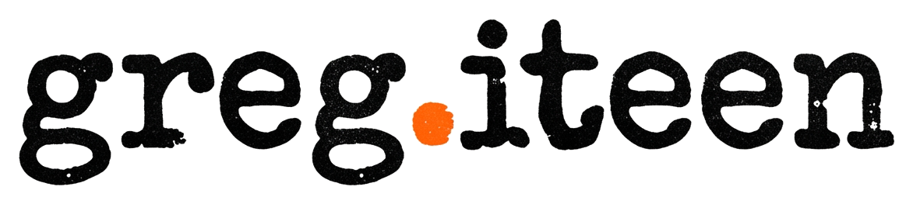

# Design System

--- 
author: "Structural HTML Layout Engineer"
theta: "Patent Leather Blue Suede"
tokens:
  primary: "#0047FF"
  secondary: "#0F1322"
  dark: "#030408"
  light: "#FFFFFF"
  fontDisplay: "Playfair Display"
  fontMono: "Space Mono"
---

# DESIGN.md

## Visual Identity & Architecture
This design leverages the visceral texture clash between patent leather (high-gloss, synthetic, reflective, ultra-saturated cobalt) and blue suede (matte, absorbing, deep-indigo, soft yet brutalist). 

## Grid & Geometry
The layouts strictly reject generic templates. We employ structuralism: visible hairline borders, severe alignments, and offset columns that scale flawlessly from mobile-first single columns to desktop asymmetric grids. Horizontal and vertical boundaries are explicitly drawn to mimic the construction lines of physical garments.

## Micro-Interactivity
- Tactical Snapping: Elements do not lazily fade. On hover, `.project-card` and `.btn` components snap instantly from matte dark blue (`--color-suede-card`) to vibrant, high-gloss cobalt (`--color-patent-gloss`) with a stark white outline.
- Kinetic Flourish: An infinite subtle vertical scanline drift overlay simulating retro-reflective technical archives.
- Touch Integrity: All interactive items guarantee a 48px minimum target boundary using structural padding, prioritizing mobile accessibility while retaining high visual density.

## section:css

```css
:root { --color-suede-bg: #090B11; --color-suede-card: #0F1322; --color-patent-gloss: #0047FF; --color-patent-deep: #001242; --color-ink-black: #030408; --color-stark-white: #FFFFFF; --color-muted-blue: #6375A1; --border-hairline: 1px solid rgba(99, 117, 161, 0.2); --border-patent: 2px solid #FFFFFF; --font-display: 'Playfair Display', 'Didot', 'Times New Roman', serif; --font-tech: 'Space Mono', 'Andale Mono', monospace; --transition-snap: cubic-bezier(0.19, 1, 0.22, 1) 0.15s; --transition-smooth: cubic-bezier(0.25, 1, 0.5, 1) 0.4s; --spacing-unit: 8px; --touch-target: 48px; --spacing-1: 8px; --spacing-2: 16px; --spacing-3: 24px; --spacing-4: 32px; --spacing-6: 48px; --spacing-8: 64px; --spacing-12: 96px; --spacing-16: 128px; --text-xs: 0.75rem; --text-sm: 0.875rem; --text-base: 1rem; --text-md: 1.25rem; --text-lg: 1.5rem; --text-xl: 2rem; --text-xxl: 3rem; --text-fluid: clamp(2.5rem, 8vw, 6rem); --radius-sm: 2px; --radius-md: 4px; --radius-lg: 8px; --radius-round: 9999px; --shadow-suede: 0 8px 32px rgba(3, 4, 8, 0.6); --shadow-patent: 0 4px 24px rgba(0, 71, 255, 0.25), inset 0 0 0 1px rgba(255, 255, 255, 0.1); --shadow-patent-hover: 0 12px 48px rgba(0, 71, 255, 0.5), inset 0 0 0 2px rgba(255, 255, 255, 1); }

:root { --color-suede-bg: #090B11; --color-suede-card: #0F1322; --color-patent-gloss: #0047FF; --color-patent-deep: #001242; --color-ink-black: #030408; --color-stark-white: #FFFFFF; --color-muted-blue: #6375A1; --border-hairline: 1px solid rgba(99, 117, 161, 0.2); --border-patent: 2px solid #FFFFFF; --font-display: 'Playfair Display', 'Didot', 'Times New Roman', serif; --font-tech: 'Space Mono', 'Andale Mono', monospace; --transition-snap: cubic-bezier(0.19, 1, 0.22, 1) 0.15s; --transition-smooth: cubic-bezier(0.25, 1, 0.5, 1) 0.4s; --spacing-unit: 8px; --touch-target: 48px; } *, *::before, *::after { box-sizing: border-box; } html, body { margin: 0; padding: 0; background-color: var(--color-suede-bg); color: var(--color-stark-white); font-family: var(--font-tech); font-size: 16px; -webkit-font-smoothing: antialiased; } h1, h2, h3, h4, h5, h6 { font-family: var(--font-display); font-weight: 400; margin-top: calc(var(--spacing-unit) * 6); margin-bottom: calc(var(--spacing-unit) * 3); color: var(--color-stark-white); line-height: 1.1; letter-spacing: -0.02em; } h1 { font-size: 2.5rem; } h2 { font-size: 2rem; } h3 { font-size: 1.5rem; } p { font-family: var(--font-tech); color: var(--color-muted-blue); line-height: 1.7; margin-top: 0; margin-bottom: calc(var(--spacing-unit) * 3); font-size: 0.875rem; } a { color: var(--color-patent-gloss); text-decoration: none; transition: color var(--transition-snap), text-shadow var(--transition-snap); cursor: pointer; } a:hover, a:focus { color: var(--color-stark-white); text-shadow: 0 0 8px var(--color-patent-gloss); outline: none; } ul, ol { font-family: var(--font-tech); color: var(--color-muted-blue); padding-left: calc(var(--spacing-unit) * 3); margin-top: 0; margin-bottom: calc(var(--spacing-unit) * 3); line-height: 1.7; font-size: 0.875rem; } li { margin-bottom: calc(var(--spacing-unit) * 1.5); } blockquote { border-left: var(--border-patent); margin: calc(var(--spacing-unit) * 4) 0; padding: calc(var(--spacing-unit) * 1) calc(var(--spacing-unit) * 3); color: var(--color-stark-white); font-family: var(--font-display); font-size: 1.25rem; font-style: italic; background: linear-gradient(90deg, var(--color-patent-deep), transparent); } code { font-family: var(--font-tech); background: var(--color-ink-black); color: var(--color-patent-gloss); padding: 0.2em 0.4em; font-size: 0.8em; border: var(--border-hairline); } pre { background: var(--color-ink-black); padding: calc(var(--spacing-unit) * 3); overflow-x: auto; border: var(--border-hairline); margin-bottom: calc(var(--spacing-unit) * 3); } pre code { background: transparent; border: none; padding: 0; color: var(--color-muted-blue); font-size: 0.75rem; } img { max-width: 100%; height: auto; display: block; } .md-img { border: var(--border-hairline); padding: calc(var(--spacing-unit) * 2); background: var(--color-suede-card); box-shadow: inset 0 0 0 1px var(--color-ink-black), 0 8px 24px rgba(3, 4, 8, 0.8); margin: calc(var(--spacing-unit) * 4) 0; }

.shell-container{display:flex;flex-direction:column;min-height:100vh;background-color:var(--color-suede-bg);color:var(--color-stark-white);position:relative;overflow-x:hidden}@media (min-width:1024px){.shell-container{display:grid;grid-template-columns:280px 1fr;grid-template-rows:auto 1fr auto}}.grid-stripes{position:absolute;top:0;left:0;right:0;bottom:0;pointer-events:none;z-index:0;background-image:linear-gradient(to right,var(--color-ink-black) 1px,transparent 1px);background-size:calc(var(--spacing-unit) * 10) 100%;opacity:0.4}.header-nav{position:relative;z-index:10;display:flex;flex-direction:column;padding:calc(var(--spacing-unit) * 3);border-bottom:var(--border-hairline);background-color:var(--color-ink-black)}@media (min-width:1024px){.header-nav{grid-column:1 / 2;grid-row:1 / 4;border-bottom:none;border-right:var(--border-hairline);height:100vh;position:sticky;top:0}}.header-nav a,.header-nav button{min-height:var(--touch-target);min-width:var(--touch-target);display:inline-flex;align-items:center}.main-grid{position:relative;z-index:5;display:flex;flex-direction:column;flex:1;padding:calc(var(--spacing-unit) * 3);gap:calc(var(--spacing-unit) * 4)}@media (min-width:768px){.main-grid{padding:calc(var(--spacing-unit) * 5)}}@media (min-width:1024px){.main-grid{display:grid;grid-template-columns:1fr 1fr;grid-column:2 / 3;grid-row:2 / 3;padding:calc(var(--spacing-unit) * 8);align-items:start}}.footer-nav{position:relative;z-index:10;padding:calc(var(--spacing-unit) * 3);border-top:var(--border-hairline);background-color:var(--color-suede-card);display:flex;flex-direction:column;gap:calc(var(--spacing-unit) * 2)}@media (min-width:1024px){.footer-nav{grid-column:2 / 3;grid-row:3 / 4;flex-direction:row;justify-content:space-between;align-items:center}}

.brand-container{display:flex;align-items:center;min-height:var(--touch-target)}.brand-container img{max-height:32px;width:auto;display:block}.badge{display:inline-block;padding:4px 8px;margin:0 4px 4px 0;font-family:var(--font-tech);font-size:0.75rem;text-transform:uppercase;letter-spacing:0.05em;background:var(--color-patent-deep);color:var(--color-stark-white);border:var(--border-hairline)}.src{display:inline-flex;align-items:center;min-height:var(--touch-target);font-family:var(--font-tech);font-size:0.85rem;color:var(--color-patent-gloss);text-decoration:none;transition:color var(--transition-snap)}.src:focus,.src:hover{color:var(--color-stark-white)}.backlink{display:inline-flex;align-items:center;min-height:var(--touch-target);font-family:var(--font-tech);font-size:0.85rem;color:var(--color-muted-blue);text-decoration:underline;text-decoration-color:var(--color-muted-blue);text-underline-offset:4px;transition:all var(--transition-snap)}.backlink:focus,.backlink:hover{color:var(--color-stark-white);text-decoration-color:var(--color-stark-white)}.btn{display:inline-flex;align-items:center;justify-content:center;min-height:var(--touch-target);padding:0 calc(var(--spacing-unit) * 3);font-family:var(--font-tech);font-weight:700;text-transform:uppercase;color:var(--color-stark-white);background:var(--color-suede-card);border:var(--border-hairline);text-decoration:none;transition:all var(--transition-smooth);cursor:pointer}.btn:focus,.btn:hover{background:var(--color-patent-gloss);border-color:var(--color-patent-gloss);box-shadow:0 0 15px rgba(0,71,255,0.5),inset 0 0 10px rgba(255,255,255,0.2)}.project-card{display:flex;flex-direction:column;gap:var(--spacing-unit);padding:calc(var(--spacing-unit) * 3);background:var(--color-suede-card);border:2px solid transparent;border-bottom:var(--border-hairline);text-decoration:none;transition:all var(--transition-snap)}.project-card:focus,.project-card:hover{border:var(--border-patent);background:var(--color-ink-black)}.design-card{display:block;position:relative;overflow:hidden;background:var(--color-suede-card);border:2px solid transparent;text-decoration:none;transition:border var(--transition-snap)}.design-card:focus,.design-card:hover{border:var(--border-patent)}.item-media img{max-height:56px;width:auto;display:block}

.gi-reveal { opacity: 0; transform: translateY(24px) scale(0.98); filter: blur(4px); transition: opacity var(--transition-smooth), transform var(--transition-smooth), filter var(--transition-smooth); transition-delay: calc(var(--gi-stagger, 0) * 50ms); } .gi-reveal.gi-in { opacity: 1; transform: translateY(0) scale(1); filter: blur(0); } .home-hero { position: relative; min-height: 80vh; display: flex; flex-direction: column; justify-content: flex-end; padding: calc(var(--spacing-unit) * 4); background-image: linear-gradient(rgba(3, 4, 8, 0.7), rgba(3, 4, 8, 0.7)), url('assets/hero.jpg'); background-size: cover; background-position: center; border-bottom: var(--border-patent); overflow: hidden; } .home-hero::before { content: ''; position: absolute; top: 0; left: 0; width: 100%; height: 4px; background: var(--color-patent-gloss); z-index: 10; box-shadow: 0 0 12px var(--color-patent-gloss); } @media (min-width: 768px) { .home-hero { padding: calc(var(--spacing-unit) * 8); min-height: 90vh; } } .projects-index-view { display: grid; grid-template-columns: 1fr; gap: calc(var(--spacing-unit) * 4); padding: calc(var(--spacing-unit) * 4) 0; } @media (min-width: 768px) { .projects-index-view { grid-template-columns: repeat(2, 1fr); } } @media (min-width: 1024px) { .projects-index-view { grid-template-columns: repeat(3, 1fr); } } .designs-index-view { display: grid; grid-template-columns: 1fr; gap: calc(var(--spacing-unit) * 3); padding: calc(var(--spacing-unit) * 4) 0; } @media (min-width: 768px) { .designs-index-view { grid-template-columns: repeat(auto-fill, minmax(280px, 1fr)); gap: calc(var(--spacing-unit) * 6); } } .project-detail-view { display: flex; flex-direction: column; gap: calc(var(--spacing-unit) * 6); padding: calc(var(--spacing-unit) * 4) 0; } @media (min-width: 1024px) { .project-detail-view { display: grid; grid-template-columns: 1fr 2fr; gap: calc(var(--spacing-unit) * 12); align-items: start; } } .design-detail-view { display: flex; flex-direction: column; gap: calc(var(--spacing-unit) * 6); padding: calc(var(--spacing-unit) * 4) 0; } .design-detail-view .preview-container { box-shadow: 0 0 0 2px var(--color-ink-black), 0 0 0 4px var(--color-patent-gloss); border-radius: 0; } @media (min-width: 1024px) { .design-detail-view { display: grid; grid-template-columns: 3fr 1fr; gap: calc(var(--spacing-unit) * 8); } }

/* Release invariant: a generated skin may not let an untrusted logo asset take over the viewport. */
.nav-bar img[src*="gi-logo-transparent"], header img[src*="gi-logo-transparent"],
.nav-bar img[src*="assets/logo"], header img[src*="assets/logo"] {
  display: block;
  inline-size: min(11.25rem, 48vw) !important;
  block-size: 3.5rem !important;
  max-inline-size: 100% !important;
  max-block-size: 3.5rem !important;
  object-fit: contain !important;
  object-position: left center !important;
}
.verified-brand-mark {
  inline-size: min(11.25rem, 48vw) !important;
  block-size: 3.5rem !important;
  max-inline-size: 100% !important;
  max-block-size: 3.5rem !important;
  object-fit: contain !important;
}
/* build-site emits both navigation layers; generated skins own the custom one. */
.tl-default { display: none !important; }
.tl-custom { display: flex; flex-wrap: wrap; align-items: center; }


/* review-board fix layer (pass 1) */
@media (prefers-reduced-motion: no-preference) { @keyframes patent-drift { 0% { background-position: 0% 0%; } 100% { background-position: 40px 100%; } } @keyframes gloss-sweep { 0% { transform: translate(-100%, -100%) rotate(45deg); } 100% { transform: translate(100%, 100%) rotate(45deg); } } .grid-stripes { animation: patent-drift 30s linear infinite; } .btn::after, .project-card::after, .design-card::after { content: ''; position: absolute; top: -50%; left: -50%; width: 200%; height: 200%; background: linear-gradient(to bottom right, rgba(255,255,255,0) 0%, rgba(255,255,255,0) 40%, rgba(255,255,255,0.15) 50%, rgba(255,255,255,0) 60%, rgba(255,255,255,0) 100%); transform: translate(-100%, -100%) rotate(45deg); transition: none; pointer-events: none; } .btn:hover::after, .project-card:hover::after, .design-card:hover::after { animation: gloss-sweep 0.8s cubic-bezier(0.19, 1, 0.22, 1) forwards; } } .tl-custom { display: flex !important; flex-direction: column !important; align-items: flex-start !important; gap: calc(var(--spacing-unit) * 3.5) !important; width: 100% !important; margin-top: calc(var(--spacing-unit) * 6) !important; padding: 0 !important; } .tl-custom a { display: inline-flex !important; align-items: center !important; min-height: var(--touch-target) !important; color: var(--color-muted-blue) !important; font-family: var(--font-tech) !important; font-size: 0.875rem !important; text-transform: uppercase !important; letter-spacing: 0.15em !important; transition: color var(--transition-snap), transform var(--transition-snap) !important; width: 100% !important; } .tl-custom a:hover, .tl-custom a:focus { color: var(--color-stark-white) !important; transform: translateX(8px) !important; text-shadow: 0 0 12px var(--color-patent-gloss) !important; } @media (min-width: 1024px) { .shell-container { grid-template-rows: 1fr auto !important; height: auto !important; min-height: 100vh !important; } .main-grid { display: grid !important; grid-template-columns: 1fr !important; align-items: stretch !important; min-height: calc(100vh - 120px) !important; padding: calc(var(--spacing-unit) * 8) !important; } .home-hero { min-height: 70vh !important; justify-content: center !important; } } .designs-index-view { display: grid !important; grid-template-columns: 1fr !important; gap: calc(var(--spacing-unit) * 6) !important; width: 100% !important; position: relative !important; z-index: 10 !important; } @media (min-width: 768px) { .designs-index-view { grid-template-columns: repeat(2, 1fr) !important; } } @media (min-width: 1200px) { .designs-index-view { grid-template-columns: repeat(3, 1fr) !important; } } .design-card { display: flex !important; flex-direction: column !important; position: relative !important; width: 100% !important; height: auto !important; min-height: 420px !important; background-color: var(--color-suede-card) !important; border: var(--border-hairline) !important; box-shadow: var(--shadow-suede) !important; overflow: hidden !important; z-index: 1 !important; transition: border var(--transition-snap), box-shadow var(--transition-snap) !important; } .design-card:hover, .design-card:focus { border: var(--border-patent) !important; box-shadow: 0 12px 32px rgba(0, 71, 255, 0.3) !important; } .design-card img { width: 100% !important; height: 280px !important; object-fit: cover !important; border-bottom: var(--border-hairline) !important; } .design-card [class*="index"], .design-card .index, .project-card [class*="index"], .project-card .index { position: absolute !important; top: calc(var(--spacing-unit) * 2) !important; right: calc(var(--spacing-unit) * 2) !important; font-family: var(--font-tech) !important; font-size: 0.75rem !important; color: var(--color-patent-gloss) !important; background: var(--color-ink-black) !important; padding: 4px 8px !important; border: var(--border-hairline) !important; font-weight: bold !important; letter-spacing: 0.05em !important; z-index: 20 !important; pointer-events: none !important; }
```

## section:layout:shell

```html
<div class="shell-container"><div class="grid-stripes"></div><header class="header-nav"><div class="brand-container"></div><nav>{{NAV_LINKS}}</nav><div>{{THEME_PILLS}}</div></header><main>{{CONTENT}}</main><footer class="footer-nav"><div>{{SOURCE_PATH}}</div></footer></div>
```

## section:layout:home

```html
<div class="grid-stripes"><section class="home-hero gi-reveal"><h2>{{HEADLINE}}</h2><h3>{{TAGLINE}}</h3><div>{{INTRO}}</div></section><section class="gi-reveal"><p>{{FEATURED_COUNT}}</p><div class="main-grid">{{FEATURED_PROJECTS}}</div></section></div>
```

## section:layout:projects_index

```html
<section class="projects-index-view gi-reveal"><div class="grid-stripes"></div><h2>{{PROJECT_COUNT}}</h2><div class="main-grid">{{PROJECT_LIST}}</div></section>
```

## section:layout:designs_index

```html
<section class="designs-index-view"><div class="grid-stripes"></div><h2>{{DESIGN_COUNT}}</h2><div class="main-grid">{{DESIGN_CARDS}}</div></section>
```

## section:layout:project_detail

```html
<article class="project-detail-view grid-stripes"><nav>{{BACKLINK}}</nav><div class="main-grid"><div><div class="brand-container">{{LOGO}}</div><h1>{{NAME}}</h1><h2>{{DESCRIPTION}}</h2><div>{{ROLE}}</div><div>{{YEAR}}</div><div>{{TECH_BADGES}}</div><div>{{PROJECT_LINK}}</div><div>{{REPO_LINK}}</div><div>{{SOURCE_PATH}}</div></div><div>{{CONTENT}}</div></div></article>
```

## section:layout:design_detail

```html
<article class="design-detail-view main-grid"><header class="gi-reveal">{{BACKLINK}}<h1>{{NAME}}</h1><p>{{DESCRIPTION}}</p><div class="grid-stripes"><ul><li>{{CLIENT}}</li><li>{{ROLE}}</li><li>{{YEAR}}</li></ul><div>{{TAG_BADGES}}</div></div></header><figure class="preview-container gi-reveal"></figure><div class="gi-reveal">{{CONTENT}}<a href="{{LINK_URL}}" class="btn">{{LINK_URL}}</a><div>{{SOURCE_PATH}}</div></div></article>
```

## section:layout:page

```html
<section class="project-detail-view"><div class="grid-stripes"><h1>{{NAME}}</h1><div class="src">{{SOURCE_PATH}}</div></div><div class="gi-reveal">{{CONTENT}}</div></section>
```

## section:layout:project_item

```html
<article class="project-card"><header><div class="brand-container">{{LOGO}}</div><h2><a href="{{URL}}">{{NAME}}</a></h2><code>{{INDEX}}</code><code>{{YEAR}}</code></header><p>{{DESCRIPTION}}</p><div>{{TECH_BADGES}}</div></article>
```

## section:layout:design_item

```html
<a href="{{URL}}" class="design-card"><div><h3>{{NAME}}</h3><div><span>{{CLIENT}}</span><span>{{YEAR}}</span></div><p>{{DESCRIPTION}}</p><div>{{TAG_BADGES}}</div></div></a>
```

## section:layout:nav_item

```html
<a href="{{NAV_URL}}" class="{{NAV_ACTIVE_CLASS}}">{{NAV_NAME}}</a>
```
