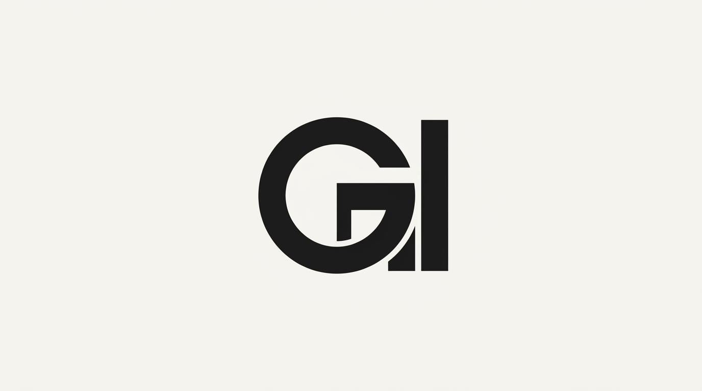

# Design System

```yaml
tokens:
  color:
    bg_base: '#0A0A0A'
    bg_elevated: '#141414'
    text_primary: '#E8E8E4'
    text_muted: '#8C8C81'
    accent_primary: '#DC2626'  # Apollo telemetry red, high-contrast alert
    accent_secondary: '#F5A623' # Flight plan yellow, precision UI states
    border_subtle: '#2E2E2A'
  typography:
    display: '"Space Grotesk", sans-serif'  # Exists on fonts.google.com, sharp geometric aerospace precision
    body: '"Inter", sans-serif' # Exists on fonts.google.com, technical readability
    # Strictly avoiding Fraunces, Archivo, IBM Plex Mono
  spacing:
    section_y: 'clamp(80px, 12vw, 160px)'
    grid_gap: 'clamp(16px, 2vw, 32px)'
    content_max: '1400px'
  motion:
    reveal_range: 'entry 5% cover 25%'
```

## Locked Design Constitution

```json
{
  "name": "SELENE-1",
  "accent": "#F5A623",
  "signatureGesture": "On the home hero, the display title 'Greg Iteen' uses `font-variation-settings: 'wght' 900` and scales down slightly via `transform: scale(0.98)` on viewport scroll-triggered exit, creating the optical illusion of being physically pulled deeper into the lunar horizon. The entire page is draped in a physical silver-gelatin grain overlay built with `<feTurbulence>`.",
  "mobileStrategy": "Mobile-first architecture. Base CSS defines a fluid single-column layout. The persistent global chrome (nav-cluster) wraps gracefully into a clean textual stack at narrow widths; no hidden menus or hamburger icons. Content grids collapse to linear sequences with generous 44px+ tap targets. All expansions occur via min-width: 768px and min-width: 1024px for bento and multi-column layout states.",
  "imageTreatment": "Ultra-high contrast greyscale photographic treatment with heavy film grain (SVG feTurbulence), mimicking silver gelatin prints. Sharp, directional hard light casting deep absolute-black shadows. The hero portrait is maintained but re-lit with a single harsh space-side key light, wearing a classic NASA-era military-style jumpsuit with subtle mission patches.",
  "tokens": {
    "colors": "OKLCH-defined absolute monochromatic spectrum. Base: oklch(15% 0 0). Elevated: oklch(22% 0 0). Text: oklch(95% 0 0). Accent (Red): oklch(65% 0.22 25). Accent (Yellow): oklch(85% 0.12 85).",
    "motion": "All reveals use `animation-timeline: view(); animation-range: entry 5% cover 30%;`. Transitions for interactive elements are strictly `opacity` and `filter` animation at 200ms duration.",
    "shape": "Sharp corners (0px), 1px hairline OKLCH borders, rationalist orthogonal divisions mirroring lunar module telemetry panels.",
    "spacing": "Fluid gaps based on 8px unit grid. `gap: clamp(16px, 2vw, 32px)`.",
    "typography": "Display: 'Space Grotesk', weight 300-700. Body: 'Inter', weight 400-500. Strictly no serif text; the geometric sans-serif supports the astronautical instrumentation theme."
  },
  "classVocabulary": [
    {
      "name": "shell",
      "owner": "shell",
      "purpose": "global site wrapper"
    },
    {
      "name": "primary-navigation",
      "owner": "shell",
      "purpose": "persistent visible top nav"
    },
    {
      "name": "nav-cluster",
      "owner": "shell",
      "purpose": "left-side logo + right-side links grouping"
    },
    {
      "name": "nav-links",
      "owner": "shell",
      "purpose": "list of navigation anchors"
    },
    {
      "name": "nav-item",
      "owner": "shell",
      "purpose": "single navigation entry"
    },
    {
      "name": "nav-link",
      "owner": "shell",
      "purpose": "anchor element for navigation"
    },
    {
      "name": "nav-toggle",
      "owner": "shell",
      "purpose": "mobile menu toggle button (visible only on mobile)"
    },
    {
      "name": "main-content",
      "owner": "shell",
      "purpose": "primary content region"
    },
    {
      "name": "content-container",
      "owner": "shell",
      "purpose": "centered max-width flow container"
    },
    {
      "name": "footer",
      "owner": "shell",
      "purpose": "global footer"
    },
    {
      "name": "home-hero",
      "owner": "home",
      "purpose": "hero section of home page"
    },
    {
      "name": "hero-grid",
      "owner": "home",
      "purpose": "two-column hero layout"
    },
    {
      "name": "hero-title",
      "owner": "home",
      "purpose": "large display heading"
    },
    {
      "name": "hero-tagline",
      "owner": "home",
      "purpose": "supporting subtitle / description"
    },
    {
      "name": "hero-cta",
      "owner": "home",
      "purpose": "call to action link"
    },
    {
      "name": "bento-grid",
      "owner": "home",
      "purpose": "featured projects masonry bento container"
    },
    {
      "name": "bento-item",
      "owner": "home",
      "purpose": "single bento card"
    },
    {
      "name": "projects-index",
      "owner": "projects_index",
      "purpose": "projects listing page wrapper"
    },
    {
      "name": "project-grid",
      "owner": "projects_index",
      "purpose": "grid of project items"
    },
    {
      "name": "project-item",
      "owner": "project_item",
      "purpose": "single project preview card"
    },
    {
      "name": "project-detail",
      "owner": "project_detail",
      "purpose": "project detail page layout"
    },
    {
      "name": "designs-index",
      "owner": "designs_index",
      "purpose": "designs listing page wrapper"
    },
    {
      "name": "design-grid",
      "owner": "designs_index",
      "purpose": "grid of design previews"
    },
    {
      "name": "design-item",
      "owner": "design_item",
      "purpose": "single design preview card"
    },
    {
      "name": "design-detail",
      "owner": "design_detail",
      "purpose": "design detail page layout"
    },
    {
      "name": "about-page",
      "owner": "page",
      "purpose": "about page layout structure"
    },
    {
      "name": "contact-page",
      "owner": "page",
      "purpose": "contact page layout structure"
    },
    {
      "name": "card-media",
      "owner": "css",
      "purpose": "image container for cards"
    },
    {
      "name": "card-body",
      "owner": "css",
      "purpose": "text content container for cards"
    },
    {
      "name": "card-title",
      "owner": "css",
      "purpose": "card heading"
    },
    {
      "name": "card-subtitle",
      "owner": "css",
      "purpose": "card supporting text"
    },
    {
      "name": "typography-portrait",
      "owner": "css",
      "purpose": "about page portrait container"
    },
    {
      "name": "grain-overlay",
      "owner": "css",
      "purpose": "fixed dimension non-interactive texture overlay"
    },
    {
      "name": "badge",
      "owner": "css",
      "purpose": "injected runtime badge styling"
    },
    {
      "name": "src",
      "owner": "css",
      "purpose": "injected code block styling"
    },
    {
      "name": "backlink",
      "owner": "css",
      "purpose": "injected back link styling"
    },
    {
      "name": "btn",
      "owner": "css",
      "purpose": "injected button styling"
    },
    {
      "name": "md-img",
      "owner": "css",
      "purpose": "injected markdown image styling"
    },
    {
      "name": "sr-only",
      "owner": "css",
      "purpose": "screen reader only accessible element"
    }
  ],
  "layoutBlueprints": {
    "design_detail": {
      "composition": "stack",
      "rootClass": "design-detail"
    },
    "design_item": {
      "composition": "stack",
      "rootClass": "design-item"
    },
    "designs_index": {
      "composition": "stack",
      "rootClass": "designs-index"
    },
    "home": {
      "composition": "stack",
      "rootClass": "home-hero",
      "regions": [
        {
          "role": "hero",
          "method": "split"
        },
        {
          "role": "index",
          "method": "bento",
          "class": "bento-grid"
        }
      ]
    },
    "nav_item": {
      "composition": "list-item",
      "rootClass": "nav-item"
    },
    "page": {
      "composition": "stack",
      "rootClass": "content-container"
    },
    "project_detail": {
      "composition": "stack",
      "rootClass": "project-detail"
    },
    "project_item": {
      "composition": "stack",
      "rootClass": "project-item"
    },
    "projects_index": {
      "composition": "stack",
      "rootClass": "projects-index"
    },
    "shell": {
      "composition": "stack",
      "rootClass": "shell"
    }
  }
}
```

## section:css

```css
@import url('https://fonts.googleapis.com/css2?family=Space+Grotesk:wght@300..700&family=Inter:wght@400;500&display=swap');

:root {
  --font-display: 'Space Grotesk', sans-serif;
  --font-body: 'Inter', sans-serif;

  --color-base: oklch(15% 0 0);
  --color-elevated: oklch(22% 0 0);
  --color-text: oklch(95% 0 0);
  --color-text-muted: oklch(70% 0 0);
  --color-accent-red: oklch(65% 0.22 25);
  --color-accent-yellow: oklch(85% 0.12 85);
  --color-border: oklch(35% 0 0);

  --spacing-unit: clamp(16px, 2vw, 32px);
  --hairline: 1px solid var(--color-border);
  --radius-sharp: 0px;

  --transition-fast: 200ms ease;
}

*, *::before, *::after {
  box-sizing: border-box;
  margin: 0;
  padding: 0;
}

html {
  font-size: 100%;
  background-color: var(--color-base);
  color: var(--color-text);
  scroll-behavior: smooth;
}

body {
  font-family: var(--font-body);
  font-weight: 400;
  line-height: 1.6;
  background-color: var(--color-base);
  color: var(--color-text);
  -webkit-font-smoothing: antialiased;
  -moz-osx-font-smoothing: grayscale;
}

img, svg {
  max-width: 100%;
  height: auto;
  display: block;
}

a {
  color: var(--color-accent-yellow);
  text-decoration: none;
  transition: opacity var(--transition-fast), filter var(--transition-fast);
  min-height: 44px;
  display: inline-flex;
  align-items: center;
}

a:hover, a:focus-visible {
  opacity: 0.8;
  filter: brightness(1.2);
  outline: none;
}

a:focus-visible {
  box-shadow: 0 0 0 2px var(--color-base), 0 0 0 4px var(--color-accent-yellow);
}

button {
  font-family: inherit;
  background: none;
  border: var(--hairline);
  color: var(--color-text);
  cursor: pointer;
  min-height: 44px;
  min-width: 44px;
  display: inline-flex;
  align-items: center;
  justify-content: center;
  padding: 0.5rem 1rem;
  transition: opacity var(--transition-fast), filter var(--transition-fast), background-color var(--transition-fast);
}

button:hover, button:focus-visible {
  background-color: var(--color-elevated);
  outline: none;
}

button:focus-visible {
  box-shadow: 0 0 0 2px var(--color-base), 0 0 0 4px var(--color-accent-yellow);
}

h1, h2, h3, h4, h5, h6 {
  font-family: var(--font-display);
  font-weight: 500;
  line-height: 1.2;
  color: var(--color-text);
}

p {
  margin-bottom: 1rem;
  color: var(--color-text-muted);
}

.sr-only {
  position: absolute;
  width: 1px;
  height: 1px;
  padding: 0;
  margin: -1px;
  overflow: hidden;
  clip: rect(0, 0, 0, 0);
  white-space: nowrap;
  border-width: 0;
}

.grain-overlay {
  position: fixed;
  inset: 0;
  width: 100%;
  height: 100%;
  z-index: 9999;
  pointer-events: none;
  opacity: 0.15;
  mix-blend-mode: overlay;
}

.grain-overlay::after {
  content: '';
  position: absolute;
  inset: 0;
  background-color: var(--color-base);
  filter: url(#grain-filter);
}

.shell {
  display: flex;
  flex-direction: column;
  min-height: 100vh;
  position: relative;
}

.primary-navigation {
  position: sticky;
  top: 0;
  z-index: 100;
  background-color: var(--color-base);
  border-bottom: var(--hairline);
  padding: 0.75rem 1rem;
}

.nav-cluster {
  display: flex;
  align-items: center;
  justify-content: space-between;
  flex-wrap: wrap;
  gap: var(--spacing-unit);
  max-width: 1440px;
  margin: 0 auto;
  width: 100%;
}

.nav-links {
  list-style: none;
  display: flex;
  flex-wrap: wrap;
  align-items: center;
  gap: var(--spacing-unit);
  width: 100%;
  justify-content: center;
  order: 3;
}

.nav-toggle {
  display: flex;
  order: 2;
}

.nav-item {
  display: flex;
}

.nav-link {
  font-family: var(--font-display);
  font-weight: 400;
  text-transform: uppercase;
  letter-spacing: 0.05em;
  color: var(--color-text-muted);
  padding: 0.5rem 0.25rem;
  border-bottom: 1px solid transparent;
  font-size: 0.875rem;
  min-height: 44px;
  display: flex;
  align-items: center;
  transition: color var(--transition-fast), border-color var(--transition-fast);
}

.nav-link:hover {
  color: var(--color-text);
  border-bottom-color: var(--color-accent-yellow);
  opacity: 1;
  filter: none;
}

.main-content {
  flex: 1;
  display: flex;
  flex-direction: column;
}

.content-container {
  max-width: 1440px;
  margin: 0 auto;
  padding: var(--spacing-unit);
  width: 100%;
  flex: 1;
}

.footer {
  border-top: var(--hairline);
  padding: var(--spacing-unit);
  color: var(--color-text-muted);
  font-size: 0.75rem;
  text-align: center;
  font-family: var(--font-display);
  letter-spacing: 0.05em;
  text-transform: uppercase;
}

.home-hero {
  display: flex;
  flex-direction: column;
  width: 100%;
}

.hero-grid {
  display: grid;
  grid-template-columns: 1fr;
  gap: 0;
  width: 100%;
  position: relative;
  background-color: var(--color-base);
  background-image: url(assets/hero.jpg);
  background-size: cover;
  background-position: center;
  background-repeat: no-repeat;
  min-height: 90vh;
  display: flex;
  align-items: flex-end;
  padding: var(--spacing-unit);
}

.hero-grid::before {
  content: '';
  position: absolute;
  inset: 0;
  background: linear-gradient(to top, oklch(0% 0 0 / 0.8) 0%, oklch(0% 0 0 / 0.2) 50%);
  z-index: 1;
}

.hero-title {
  font-family: var(--font-display);
  font-weight: 700;
  font-variation-settings: 'wght' 900;
  font-size: clamp(3rem, 10vw, 7rem);
  line-height: 1;
  text-transform: uppercase;
  letter-spacing: -0.02em;
  color: var(--color-text);
  position: relative;
  z-index: 2;
  animation: hero-pull linear both;
  animation-timeline: view();
  animation-range: exit 5% exit 100%;
  transform-origin: center center;
  margin-bottom: 0.5rem;
}

.hero-tagline {
  font-family: var(--font-body);
  font-size: 1.125rem;
  font-weight: 400;
  color: var(--color-text-muted);
  position: relative;
  z-index: 2;
  max-width: 30ch;
  margin-bottom: 1.5rem;
}

.hero-cta {
  display: inline-flex;
  align-items: center;
  background-color: transparent;
  border: 1px solid var(--color-accent-yellow);
  color: var(--color-accent-yellow);
  font-family: var(--font-display);
  font-weight: 500;
  text-transform: uppercase;
  letter-spacing: 0.1em;
  padding: 0.75rem 2rem;
  font-size: 0.875rem;
  position: relative;
  z-index: 2;
  transition: background-color var(--transition-fast), color var(--transition-fast);
  min-height: 44px;
  min-width: 44px;
}

.hero-cta:hover {
  background-color: var(--color-accent-yellow);
  color: var(--color-base);
  opacity: 1;
  filter: none;
}

.bento-grid {
  display: grid;
  grid-template-columns: 1fr;
  gap: var(--spacing-unit);
  padding: var(--spacing-unit);
  width: 100%;
}

.bento-item {
  border: var(--hairline);
  position: relative;
  overflow: hidden;
  background-color: var(--color-elevated);
  transition: transform var(--transition-fast), border-color var(--transition-fast);
  display: flex;
  flex-direction: column;
}

.bento-item a {
  flex: 1;
  display: flex;
  flex-direction: column;
  color: inherit;
  text-decoration: none;
  padding: var(--spacing-unit);
  min-height: auto;
}

.bento-item:hover {
  border-color: var(--color-accent-yellow);
  transform: translateY(-2px);
}

.bento-item .card-media {
  width: 100%;
  height: 200px;
  object-fit: cover;
  filter: grayscale(100%) contrast(1.2);
  border-bottom: var(--hairline);
  margin-bottom: var(--spacing-unit);
}

.bento-item .card-body {
  display: flex;
  flex-direction: column;
  flex: 1;
}

.bento-item .card-title {
  font-family: var(--font-display);
  font-size: 1.5rem;
  font-weight: 500;
  color: var(--color-text);
  line-height: 1.2;
  margin-bottom: 0.25rem;
}

.bento-item .card-subtitle {
  font-family: var(--font-body);
  font-size: 0.875rem;
  color: var(--color-text-muted);
  line-height: 1.5;
  margin-bottom: 1rem;
  flex: 1;
}

.bento-item .badge {
  display: inline-block;
  font-family: var(--font-display);
  font-size: 0.75rem;
  font-weight: 400;
  text-transform: uppercase;
  letter-spacing: 0.05em;
  padding: 0.25rem 0.75rem;
  border: var(--hairline);
  color: var(--color-text-muted);
  margin-right: 0.5rem;
  margin-bottom: 0.5rem;
}

.badge {
  display: inline-block;
  font-family: var(--font-display);
  font-size: 0.75rem;
  font-weight: 400;
  text-transform: uppercase;
  letter-spacing: 0.05em;
  padding: 0.25rem 0.75rem;
  border: 1px solid var(--color-border);
  color: var(--color-text-muted);
  background-color: transparent;
  line-height: 1.4;
}

.src {
  background-color: var(--color-elevated);
  border: var(--hairline);
  padding: var(--spacing-unit);
  font-family: monospace;
  font-size: 0.875rem;
  color: var(--color-text-muted);
  overflow-x: auto;
  white-space: pre-wrap;
  word-break: break-word;
  margin: var(--spacing-unit) 0;
}

.backlink {
  display: inline-flex;
  align-items: center;
  font-family: var(--font-display);
  font-size: 0.75rem;
  font-weight: 500;
  text-transform: uppercase;
  letter-spacing: 0.1em;
  color: var(--color-text-muted);
  border: var(--hairline);
  padding: 0.5rem 1rem;
  margin-bottom: var(--spacing-unit);
  transition: color var(--transition-fast), border-color var(--transition-fast);
  min-height: 44px;
  min-width: 44px;
}

.backlink:hover {
  color: var(--color-accent-yellow);
  border-color: var(--color-accent-yellow);
  opacity: 1;
  filter: none;
}

.btn {
  display: inline-flex;
  align-items: center;
  justify-content: center;
  font-family: var(--font-display);
  font-weight: 500;
  text-transform: uppercase;
  letter-spacing: 0.1em;
  font-size: 0.875rem;
  padding: 0.75rem 2rem;
  background-color: transparent;
  border: var(--hairline);
  color: var(--color-text);
  cursor: pointer;
  transition: background-color var(--transition-fast), color var(--transition-fast), border-color var(--transition-fast);
  min-height: 44px;
  min-width: 44px;
  text-decoration: none;
}

.btn:hover {
  background-color: var(--color-accent-yellow);
  border-color: var(--color-accent-yellow);
  color: var(--color-base);
  opacity: 1;
  filter: none;
}

.md-img {
  max-width: 100%;
  height: auto;
  display: block;
  border: var(--hairline);
  filter: grayscale(100%) contrast(1.2);
  margin: var(--spacing-unit) 0;
}

.typography-portrait {
  width: 100%;
  max-width: 300px;
  aspect-ratio: 1 / 1;
  object-fit: cover;
  filter: grayscale(100%) contrast(1.3);
  border: var(--hairline);
  margin-bottom: var(--spacing-unit);
}

.projects-index, .designs-index {
  padding: var(--spacing-unit);
  width: 100%;
}

.project-grid, .design-grid {
  display: grid;
  grid-template-columns: 1fr;
  gap: var(--spacing-unit);
  width: 100%;
}

.project-item, .design-item {
  border: var(--hairline);
  background-color: var(--color-elevated);
  transition: transform var(--transition-fast), border-color var(--transition-fast);
  display: flex;
  flex-direction: column;
}

.project-item a, .design-item a {
  display: flex;
  flex-direction: column;
  color: inherit;
  text-decoration: none;
  padding: var(--spacing-unit);
  flex: 1;
  min-height: auto;
}

.project-item:hover, .design-item:hover {
  border-color: var(--color-accent-yellow);
  transform: translateY(-2px);
}

.project-item .card-media, .design-item .card-media {
  width: 100%;
  height: 200px;
  object-fit: cover;
  filter: grayscale(100%) contrast(1.2);
  border-bottom: var(--hairline);
  margin-bottom: var(--spacing-unit);
}

.project-item .card-body, .design-item .card-body {
  display: flex;
  flex-direction: column;
  flex: 1;
}

.project-item .card-title, .design-item .card-title {
  font-family: var(--font-display);
  font-size: 1.5rem;
  font-weight: 500;
  color: var(--color-text);
  margin-bottom: 0.25rem;
}

.project-item .card-subtitle, .design-item .card-subtitle {
  font-family: var(--font-body);
  font-size: 0.875rem;
  color: var(--color-text-muted);
  margin-bottom: 1rem;
  flex: 1;
}

.project-item .badge, .design-item .badge {
  margin-right: 0.5rem;
  margin-bottom: 0.5rem;
}

.project-detail, .design-detail, .about-page, .contact-page {
  padding: var(--spacing-unit);
  display: flex;
  flex-direction: column;
  gap: var(--spacing-unit);
  width: 100%;
}

.project-detail h1, .design-detail h1, .about-page h1, .contact-page h1 {
  font-family: var(--font-display);
  font-size: clamp(2rem, 6vw, 3.5rem);
  font-weight: 700;
  line-height: 1.2;
  text-transform: uppercase;
  letter-spacing: -0.02em;
  border-bottom: var(--hairline);
  padding-bottom: var(--spacing-unit);
}

.project-detail .badge, .design-detail .badge {
  margin-right: 0.25rem;
  margin-bottom: 0.25rem;
}

.card-media img, .card-media video {
  width: 100%;
  height: 100%;
  object-fit: cover;
  display: block;
}

@keyframes hero-pull {
  from {
    transform: scale(1);
    opacity: 1;
  }
  to {
    transform: scale(0.98);
    opacity: 0.9;
  }
}

@media (prefers-reduced-motion: reduce) {
  *, *::before, *::after {
    animation-duration: 0.01ms !important;
    animation-iteration-count: 1 !important;
    transition-duration: 0.01ms !important;
    scroll-behavior: auto !important;
  }
  .hero-title {
    animation: none;
    transform: scale(1);
    opacity: 1;
  }
}

@media (min-width: 768px) {
  .nav-cluster {
    flex-wrap: nowrap;
  }
  .nav-links {
    order: 0;
    width: auto;
    justify-content: flex-end;
  }
  .nav-toggle {
    display: none;
  }
  .hero-grid {
    display: grid;
    grid-template-columns: 1fr 1fr;
    align-items: center;
    padding: var(--spacing-unit) calc(var(--spacing-unit) * 2);
  }
  .hero-grid::before {
    background: linear-gradient(to right, oklch(0% 0 0 / 0.8) 0%, oklch(0% 0 0 / 0.2) 50%, oklch(0% 0 0 / 0.4) 100%);
  }
  .hero-title {
    font-size: clamp(4rem, 8vw, 8rem);
    margin-bottom: 1rem;
  }
  .hero-tagline {
    font-size: 1.25rem;
  }
  .bento-grid {
    grid-template-columns: repeat(2, 1fr);
    padding: var(--spacing-unit) calc(var(--spacing-unit) * 2);
  }
  .project-grid, .design-grid {
    grid-template-columns: repeat(2, 1fr);
  }
  .project-detail, .design-detail, .about-page, .contact-page {
    padding: var(--spacing-unit) calc(var(--spacing-unit) * 2);
  }
  .content-container {
    padding: var(--spacing-unit) calc(var(--spacing-unit) * 2);
  }
}

@media (min-width: 1024px) {
  .nav-cluster {
    padding: 0.75rem calc(var(--spacing-unit) * 2);
  }
  .bento-grid {
    grid-template-columns: repeat(3, 1fr);
    padding: var(--spacing-unit) calc(var(--spacing-unit) * 4);
  }
  .project-grid, .design-grid {
    grid-template-columns: repeat(3, 1fr);
  }
  .project-detail, .design-detail, .about-page, .contact-page {
    flex-direction: column;
    padding: var(--spacing-unit) calc(var(--spacing-unit) * 4);
    max-width: 1200px;
    margin: 0 auto;
    width: 100%;
  }
  .content-container {
    padding: var(--spacing-unit) calc(var(--spacing-unit) * 4);
  }
  .hero-grid {
    padding: var(--spacing-unit) calc(var(--spacing-unit) * 4);
  }
  .typography-portrait {
    max-width: 400px;
  }
}

/* Release invariant: a generated skin may not let an untrusted logo asset take over the viewport. */
.nav-bar img[src*="gi-logo-transparent"], header img[src*="gi-logo-transparent"],
.nav-bar img[src*="assets/logo"], header img[src*="assets/logo"] {
  display: block;
  inline-size: min(11.25rem, 48vw) !important;
  block-size: 3.5rem !important;
  max-inline-size: 100% !important;
  max-block-size: 3.5rem !important;
  object-fit: contain !important;
  object-position: left center !important;
}
.verified-brand-mark {
  inline-size: min(11.25rem, 48vw) !important;
  block-size: 3.5rem !important;
  max-inline-size: 100% !important;
  max-block-size: 3.5rem !important;
  object-fit: contain !important;
}
/* Vault-injected project marks have their own stable wrapper regardless of
   the generated layout vocabulary. Bound them mechanically so intrinsic
   source dimensions can never escape a card or grid track. */
.logo-tile {
  display: flex !important;
  align-items: center !important;
  justify-content: center !important;
  inline-size: 100% !important;
  min-inline-size: 0 !important;
  max-inline-size: 100% !important;
  overflow: hidden !important;
}
.logo-tile img {
  display: block !important;
  inline-size: 100% !important;
  min-inline-size: 0 !important;
  max-inline-size: 100% !important;
  block-size: auto !important;
  max-block-size: 18rem !important;
  object-fit: contain !important;
}
/* Build-owned navigation wrapper and badge fragments need invariant spacing;
   aesthetic styling remains theme-owned. */
.nav-links {
  display: flex !important;
  flex-wrap: wrap !important;
  align-items: center !important;
  gap: .25rem 1rem !important;
  min-inline-size: 0 !important;
}
.nav-links a {
  display: inline-flex !important;
  align-items: center !important;
  min-block-size: 44px !important;
  white-space: nowrap !important;
}
.badge {
  margin: .2rem !important;
}
/* build-site emits both navigation layers; generated skins own the custom one. */
.tl-default { display: none !important; }
.tl-custom { display: flex; flex-wrap: wrap; align-items: center; }


@media (prefers-reduced-motion: no-preference) {
  .gi-reveal { opacity: 0; transform: translateY(28px); transition: opacity .7s ease, transform .7s cubic-bezier(.2,.7,.2,1); transition-delay: var(--gi-stagger, 0s); }
  .gi-reveal.gi-in { opacity: 1; transform: none; }
}


/* review-board fix layer (pass 2) */
/* Fix: Prevent text overlap in home hero two-column intro box */
@media (min-width: 768px) {
  .hero-grid .hero-tagline {
    line-height: 1.5;
    max-width: 35ch;
    column-gap: clamp(24px, 4vw, 48px);
  }
}

/* Fix: Add horizontal spacing between headline and subheading to prevent visual collision */
.hero-grid .hero-title {
  margin-bottom: clamp(16px, 3vw, 32px);
}

@media (min-width: 768px) {
  .hero-grid .hero-title {
    margin-bottom: clamp(24px, 4vw, 48px);
    grid-column: 1;
  }
  .hero-grid .hero-tagline {
    grid-column: 1;
    margin-bottom: 1.5rem;
  }
  .hero-grid .hero-cta {
    grid-column: 1;
  }
  .hero-grid {
    display: grid;
    grid-template-columns: 1fr 1fr;
    align-items: end;
  }
}

/* Fix: Constrain project card images so "Total Recall" and similar logos render fully */
.project-item .card-media,
.bento-item .card-media {
  height: auto;
  max-height: 200px;
  aspect-ratio: 3 / 2;
  overflow: hidden;
  display: flex;
  align-items: center;
  justify-content: center;
  background-color: var(--color-elevated);
}

.project-item .card-media img,
.project-item .card-media svg,
.bento-item .card-media img,
.bento-item .card-media svg,
.project-item .logo-tile img,
.bento-item .logo-tile img {
  width: 100%;
  height: 100%;
  object-fit: contain;
  padding: var(--spacing-unit);
  background-color: var(--color-elevated);
}

.project-item .card-media .logo-tile,
.bento-item .card-media .logo-tile {
  display: flex;
  align-items: center;
  justify-content: center;
  width: 100%;
  height: 100%;
  padding: var(--spacing-unit);
}


/* review-board fix layer (pass 3) */
/* Fix: Mobile home hero - prevent two-column text squeeze */
.hero-grid {
  display: flex !important;
  flex-direction: column !important;
  justify-content: flex-end !important;
  align-items: flex-start !important;
  padding: var(--spacing-unit) !important;
  min-height: 90vh !important;
}

.hero-grid .hero-tagline {
  width: 100% !important;
  max-width: 100% !important;
  column-count: 1 !important;
  column-gap: 0 !important;
  line-height: 1.6 !important;
  word-break: normal !important;
  overflow-wrap: break-word !important;
  hyphens: auto !important;
  font-size: 0.95rem !important;
}

/* Fix: Remove empty pill/rectangle element on mobile */
.nav-toggle {
  display: none !important;
}

@media (min-width: 768px) {
  .hero-grid {
    display: grid !important;
    grid-template-columns: 1fr 1fr !important;
    align-items: end !important;
    flex-direction: row !important;
    padding: var(--spacing-unit) calc(var(--spacing-unit) * 2) !important;
    min-height: 90vh !important;
  }

  .hero-grid .hero-title {
    grid-column: 1 !important;
  }

  .hero-grid .hero-tagline {
    grid-column: 1 !important;
    max-width: 35ch !important;
    width: auto !important;
    font-size: 1.125rem !important;
  }

  .hero-grid .hero-cta {
    grid-column: 1 !important;
  }
}


/* review-board fix layer (pass 4) */
/* review-board fix layer: hero text legibility fixes */
/* Fix 1: Prevent text overlap and collision in two-column bio block */
.hero-grid .hero-tagline {
  line-height: 1.7 !important;
  max-width: 100% !important;
  width: 100% !important;
  column-count: 1 !important;
  column-gap: 0 !important;
  word-break: normal !important;
  overflow-wrap: break-word !important;
  font-size: 0.95rem !important;
  padding-right: clamp(8px, 2vw, 16px) !important;
}

@media (min-width: 768px) {
  .hero-grid .hero-tagline {
    max-width: 42ch !important;
    font-size: 1.125rem !important;
    line-height: 1.7 !important;
    grid-column: 1 !important;
    column-count: 1 !important;
    column-gap: 0 !important;
  }
  
  /* Ensure the two-column bio panel doesn't multi-column its text */
  .hero-grid .hero-tagline {
    columns: 1 !important;
    column-fill: auto !important;
  }
}

/* Fix 2: Add opaque backdrop to bio text panel for contrast against photo */
.hero-grid .hero-tagline {
  background-color: oklch(10% 0 0 / 0.85) !important;
  padding: clamp(16px, 3vw, 24px) !important;
  backdrop-filter: blur(8px) !important;
  -webkit-backdrop-filter: blur(8px) !important;
  border: 1px solid oklch(35% 0 0 / 0.5) !important;
}

@media (min-width: 768px) {
  .hero-grid .hero-tagline {
    background-color: oklch(10% 0 0 / 0.8) !important;
    padding: clamp(20px, 3vw, 32px) !important;
    margin-right: clamp(16px, 4vw, 48px) !important;
  }
}

/* Ensure hero title and CTA also have sufficient backdrop on mobile */
.hero-grid .hero-title {
  text-shadow: 0 2px 8px oklch(0% 0 0 / 0.8) !important;
  padding-left: 0 !important;
}

@media (min-width: 768px) {
  .hero-grid .hero-title {
    text-shadow: 0 2px 12px oklch(0% 0 0 / 0.9) !important;
  }
}

.hero-grid .hero-cta {
  margin-left: 0 !important;
}

@media (min-width: 768px) {
  .hero-grid .hero-cta {
    margin-left: 0 !important;
  }
}

/* Prevent any multi-column text splitting in hero */
.hero-grid .hero-tagline,
.hero-grid .hero-tagline * {
  break-inside: avoid !important;
  column-span: none !important;
}

/* review-board fix layer (pass 7) */
/* review-board fix layer (pass 5) */
/* Fix: Prevent hero headline and body copy visual collision/overlap */
.hero-grid .hero-title {
  margin-bottom: clamp(24px, 4vw, 48px) !important;
  position: relative !important;
  z-index: 3 !important;
}

.hero-grid .hero-tagline {
  position: relative !important;
  z-index: 3 !important;
  margin-top: 0 !important;
  margin-bottom: clamp(16px, 2vw, 24px) !important;
  background-color: oklch(10% 0 0 / 0.85) !important;
  padding: clamp(16px, 3vw, 24px) !important;
  border: 1px solid oklch(35% 0 0 / 0.5) !important;
  backdrop-filter: blur(8px) !important;
  -webkit-backdrop-filter: blur(8px) !important;
  line-height: 1.7 !important;
  column-count: 1 !important;
  columns: 1 !important;
  max-width: 100% !important;
  width: auto !important;
}

/* Desktop: give the bio panel explicit right margin so it never overlaps the headline */
@media (min-width: 768px) {
  .hero-grid .hero-title {
    grid-column: 1 !important;
    grid-row: 1 !important;
    margin-bottom: clamp(32px, 5vw, 64px) !important;
  }
  
  .hero-grid .hero-tagline {
    grid-column: 1 !important;
    grid-row: 2 !important;
    max-width: 48ch !important;
    margin-right: clamp(24px, 5vw, 64px) !important;
    align-self: start !important;
  }
  
  .hero-grid .hero-cta {
    grid-column: 1 !important;
    grid-row: 3 !important;
  }
  
  /* Force grid rows so title and tagline occupy distinct vertical spaces */
  .hero-grid {
    display: grid !important;
    grid-template-columns: 1fr 1fr !important;
    grid-template-rows: auto auto auto !important;
    align-items: end !important;
  }
}

/* Mobile: stack with generous gap */
@media (max-width: 767px) {
  .hero-grid {
    display: flex !important;
    flex-direction: column !important;
    justify-content: flex-end !important;
    gap: clamp(16px, 4vw, 32px) !important;
  }
  
  .hero-grid .hero-title {
    margin-bottom: clamp(16px, 3vw, 24px) !important;
  }
  
  .hero-grid .hero-tagline {
    max-width: 100% !important;
    width: 100% !important;
    margin-bottom: clamp(12px, 2vw, 20px) !important;
  }
}

/* Fix: Remove the dark translucent box from the repeated all-caps tagline if it's the same element */
.hero-grid .hero-tagline:not([class*=" "]) {
  background-color: oklch(10% 0 0 / 0.85) !important;
}

/* Ensure no pseudo-elements add extra dark boxes */
.hero-grid .hero-tagline::before,
.hero-grid .hero-tagline::after {
  display: none !important;
}

/* review-board fix layer (pass 8) */
/* review-board fix layer (pass 8): hero text overflow/width constraint */

/* Constrain hero text block and paragraph to viewport so no copy is clipped off-screen */
.hero-grid .hero-title,
.hero-grid .hero-tagline {
  max-width: 100vw !important;
  overflow-x: hidden !important;
  word-wrap: break-word !important;
  word-break: break-word !important;
  overflow-wrap: break-word !important;
  hyphens: auto !important;
  box-sizing: border-box !important;
}

/* Ensure the hero container itself does not expand beyond viewport */
.hero-grid {
  max-width: 100vw !important;
  overflow-x: hidden !important;
  box-sizing: border-box !important;
}

/* Ensure no inner elements escape through negative margins or absolute positioning */
.hero-grid * {
  max-width: 100% !important;
  box-sizing: border-box !important;
}

/* Desktop: maintain the intentional oversized treatment but bound it properly */
@media (min-width: 768px) {
  .hero-grid .hero-title {
    font-size: clamp(4rem, 7vw, 7rem) !important;
    max-width: 100% !important;
    padding-right: clamp(16px, 4vw, 48px) !important;
  }

  .hero-grid .hero-tagline {
    max-width: 48ch !important;
    padding-right: clamp(16px, 3vw, 32px) !important;
  }
}

/* review-board fix layer (pass 9) */
/* review-board fix layer (pass 9): home bio card overlapping text fix */

/* Ensure paragraphs in the bio card stack vertically without overlapping */
.hero-grid .hero-tagline {
  display: block !important;
  width: 100% !important;
  max-width: 100% !important;
  padding: clamp(16px, 3vw, 24px) !important;
  box-sizing: border-box !important;
  overflow: visible !important;
}

/* If the hero-tagline contains multiple paragraphs or block elements, force them to stack */
.hero-grid .hero-tagline > * {
  display: block !important;
  width: 100% !important;
  max-width: 100% !important;
  margin-bottom: 1em !important;
  line-height: 1.7 !important;
  position: static !important;
  top: auto !important;
  bottom: auto !important;
  left: auto !important;
  right: auto !important;
}

.hero-grid .hero-tagline > *:last-child {
  margin-bottom: 0 !important;
}

/* Prevent flex or grid children within the tagline from collapsing */
.hero-grid .hero-tagline {
  display: flex !important;
  flex-direction: column !important;
  gap: 1em !important;
  align-items: flex-start !important;
}

/* Ensure no absolute positioning inside the tagline that could cause overlap */
.hero-grid .hero-tagline * {
  position: relative !important;
}

/* Desktop adjustments */
@media (min-width: 768px) {
  .hero-grid .hero-tagline {
    display: flex !important;
    flex-direction: column !important;
    gap: 1.25em !important;
    max-width: 48ch !important;
  }

  .hero-grid .hero-tagline > * {
    width: auto !important;
    max-width: 100% !important;
  }
}

/* Override any multi-column or column-count that might break stacking */
.hero-grid .hero-tagline,
.hero-grid .hero-tagline * {
  column-count: 1 !important;
  columns: 1 !important;
  column-gap: 0 !important;
  break-inside: avoid !important;
  column-span: none !important;
}

/* Ensure background and border are applied to the container, not individual paragraphs */
.hero-grid .hero-tagline {
  background-color: oklch(10% 0 0 / 0.85) !important;
  backdrop-filter: blur(8px) !important;
  -webkit-backdrop-filter: blur(8px) !important;
  border: 1px solid oklch(35% 0 0 / 0.5) !important;
}

.hero-grid .hero-tagline > * {
  background-color: transparent !important;
  backdrop-filter: none !important;
  -webkit-backdrop-filter: none !important;
  border: none !important;
  padding: 0 !important;
}

/* Fix for the specific overlapping scenario: quote line, bio paragraph, recent obsessions */
.hero-grid .hero-tagline br + *,
.hero-grid .hero-tagline p + p {
  margin-top: 1em !important;
}

/* review-board fix layer (pass 12) */
/* review-board fix layer (hero text legibility) */
.hero-grid .hero-tagline {
  background-color: oklch(5% 0 0 / 0.92) !important;
  backdrop-filter: blur(12px) !important;
  -webkit-backdrop-filter: blur(12px) !important;
}

/* review-board fix layer (pass 13) */
/* review-board fix layer (hero text legibility + bento last-row dead zone) */

/* 1. Home hero text legibility: solid scrim + high-contrast type */
.hero-grid .hero-tagline {
  background: oklch(5% 0 0 / 0.92) !important;
  backdrop-filter: blur(12px) !important;
  -webkit-backdrop-filter: blur(12px) !important;
  color: oklch(95% 0 0) !important;
  border: 1px solid oklch(45% 0 0 / 0.6) !important;
}

.hero-grid .hero-tagline,
.hero-grid .hero-tagline * {
  color: oklch(95% 0 0) !important;
}

/* 2. Home desktop bento grid last-row dead zone: collapse to filled columns */
@media (min-width: 1024px) {
  .bento-grid {
    grid-template-columns: none !important;
    display: flex !important;
    flex-wrap: wrap !important;
    justify-content: center !important;
    gap: var(--spacing-unit) !important;
  }

  .bento-item {
    flex: 0 1 calc(33.333% - var(--spacing-unit)) !important;
    min-width: 280px !important;
  }

  /* When only one item occupies the last row, let it span center at a constrained width */
  .bento-item:last-child:nth-child(3n + 1) {
    flex: 0 1 480px !important;
    max-width: 480px !important;
    margin-left: auto !important;
    margin-right: auto !important;
  }
}


/* review-board fix layer (pass 14) */
/* review-board fix layer (pass 14): hero word-break fix */

/* Fix: Prevent mid-word break on hero headline 'REMEMBERS' */
.hero-grid .hero-title {
  word-break: normal !important;
  overflow-wrap: break-word !important;
  hyphens: manual !important;
  -webkit-hyphens: manual !important;
  -ms-hyphens: manual !important;
}

/* If the title is a single word or contains long words, allow it to scale down slightly on narrow viewports */
@supports (font-size: clamp(1rem, 2vw, 3rem)) {
  @media (max-width: 1023px) {
    .hero-grid .hero-title {
      font-size: clamp(2.5rem, 8vw, 5rem) !important;
      letter-spacing: -0.01em !important;
    }
  }
}

@media (min-width: 1024px) {
  .hero-grid .hero-title {
    font-size: clamp(4rem, 6.5vw, 7rem) !important;
    letter-spacing: -0.02em !important;
  }
}

/* review-board fix layer (pass 15) */
/* review-board fix layer – home hero text legibility against photograph */
/* 1. Strengthen the backing panel so multi-paragraph bio copy never washes out */
.hero-grid .hero-tagline {
  background-color: oklch(8% 0 0 / 0.95) !important;
  backdrop-filter: blur(16px) !important;
  -webkit-backdrop-filter: blur(16px) !important;
  border-color: oklch(45% 0 0 / 0.7) !important;
}

/* 2. Lock all immediate text descendants to the brightest step on the text scale */
.hero-grid .hero-tagline,
.hero-grid .hero-tagline * {
  color: oklch(96% 0 0) !important;
  -webkit-text-fill-color: oklch(96% 0 0) !important;
}

/* 3. Reinforce the gradient scrim behind the entire hero panel so the
   backing panel isn't the only defense against bright background detail */
.hero-grid::before {
  background: linear-gradient(
    to top,
    oklch(0% 0 0 / 0.92) 0%,
    oklch(0% 0 0 / 0.55) 50%
  ) !important;
}

@media (min-width: 768px) {
  .hero-grid::before {
    background: linear-gradient(
      to right,
      oklch(0% 0 0 / 0.92) 0%,
      oklch(0% 0 0 / 0.55) 50%,
      oklch(0% 0 0 / 0.65) 100%
    ) !important;
  }
}

/* review-board fix layer (pass 21) */
/* Fix layer: Schematic panel subdivisions for project/design cards */
.bento-item,
.project-item,
.design-item {
  position: relative;
  outline: 1px solid var(--color-border);
  outline-offset: -4px;
}

.bento-item::after,
.project-item::after,
.design-item::after {
  content: '';
  position: absolute;
  inset: 0;
  z-index: 10;
  pointer-events: none;
  background-image:
    repeating-linear-gradient(0deg, oklch(95% 0 0 / 0.1) 0px, oklch(95% 0 0 / 0.1) 1px, transparent 1px, transparent 20px),
    repeating-linear-gradient(90deg, oklch(95% 0 0 / 0.1) 0px, oklch(95% 0 0 / 0.1) 1px, transparent 1px, transparent 20px);
}
```

## section:layout:shell

```html
<section class="shell">
  <a class="sr-only" href="#main-content"></a>

  <header class="primary-navigation">
    <div class="nav-cluster">
      <div class="nav-item">
        <a href="/" class="nav-link" aria-label="Greg Iteen Home">
          
        </a>
      </div>
      <nav aria-label="Main navigation">
        <ul class="nav-links">
          {{NAV_LINKS}}
        </ul>
      </nav>
      <button class="nav-toggle btn" aria-expanded="false" aria-controls="nav-links" aria-label="Toggle navigation menu">
        <span></span>
        <span></span>
        <span></span>
      </button>
    </div>
  </header>

  <main id="main-content" class="main-content">
    <div class="content-container">
      {{CONTENT}}
    </div>
  </main>

  <footer class="footer">
    <div class="content-container">
      {{THEME_PILLS}}
      {{SOURCE_PATH}}
    </div>
  </footer>

  <div class="grain-overlay" aria-hidden="true"></div>
</section>
```

## section:layout:home

```html
<section class="home-hero">
  <div class="hero-grid">
    <div>
      <h1 class="hero-title">{{HEADLINE}}</h1>
      <p class="hero-tagline">{{TAGLINE}}</p>
      <a class="hero-cta btn" href="#featured">{{INTRO}}</a>
    </div>
    <div class="card-media">
      
    </div>
  </div>
  <div class="bento-grid" id="featured">
    <span class="sr-only">{{FEATURED_COUNT}}</span>
    {{FEATURED_PROJECTS}}
  </div>
  <div class="grain-overlay" aria-hidden="true"></div>
</section>
```

## section:layout:projects_index

```html
<section class="projects-index">
  <div class="content-container">
    <div class="project-grid">{{PROJECT_LIST}}</div>
  </div>
</section>
```

## section:layout:designs_index

```html
<section class="designs-index">
  <div class="design-grid">
    {{DESIGN_CARDS}}
  </div>
</section>
```

## section:layout:project_detail

```html
<section class="project-detail">
  <div class="backlink">{{BACKLINK}}</div>
  <header class="card-media">
    <div class="card-body">{{LOGO}}</div>
  </header>
  <div class="content-container">
    <h1 class="card-title">{{NAME}}</h1>
    <p class="card-subtitle">{{DESCRIPTION}}</p>
    <div class="card-body">
      <span class="badge">{{ROLE}}</span>
      <span class="badge">{{YEAR}}</span>
    </div>
    <div class="card-body">
      {{TECH_BADGES}}
    </div>
    <div class="card-body">
      {{REPO_LINK}}
      {{PROJECT_LINK}}
    </div>
    <div class="card-body">
      {{CONTENT}}
    </div>
    <div class="src">{{SOURCE_PATH}}</div>
  </div>
</section>
```

## section:layout:design_detail

```html
<section class="design-detail">
  {{BACKLINK}}
  
  <div class="card-body">
    <h1 class="card-title">{{NAME}}</h1>
    {{DESCRIPTION}}
    <div class="card-subtitle">
      {{CLIENT}}
      {{ROLE}}
      {{YEAR}}
    </div>
    {{TAG_BADGES}}
    <a class="btn" href="{{LINK_URL}}"></a>
    <div class="content-container">{{CONTENT}}</div>
    {{SOURCE_PATH}}
  </div>
</section>
```

## section:layout:page

```html
<section class="content-container">
  <header style="margin-bottom: clamp(24px, 3vw, 48px); border-bottom: 1px solid oklch(35% 0 0); padding-bottom: clamp(16px, 2vw, 24px);">
    <h1 style="font-family: 'Space Grotesk', sans-serif; font-size: clamp(2rem, 5vw, 3.5rem); font-weight: 700; color: oklch(95% 0 0); margin: 0; letter-spacing: -0.02em;">{{NAME}}</h1>
    {{SOURCE_PATH}}
  </header>
  <div style="font-family: 'Inter', sans-serif; font-size: 1rem; line-height: 1.7; color: oklch(85% 0 0); max-width: 65ch;">
    {{CONTENT}}
  </div>
</section>
```

## section:layout:project_item

```html
<section class="project-item">
  <a href="{{URL}}" class="card-media" aria-label="{{NAME}}">
    {{LOGO}}
  </a>
  <div class="card-body">
    <a href="{{URL}}" class="card-title">{{NAME}}</a>
    {{DESCRIPTION}}
    <div class="card-subtitle">
      {{YEAR}}
      {{TECH_BADGES}}
    </div>
  </div>
</section>
```

## section:layout:design_item

```html
<section class="design-item"><a href="{{URL}}" class="card-media"></a><div class="card-body"><a href="{{URL}}" class="card-title">{{NAME}}</a>{{DESCRIPTION}}<div class="card-subtitle">{{CLIENT}}{{YEAR}}</div>{{TAG_BADGES}}</div></section>
```

## section:layout:nav_item

```html
<li class="nav-item"><a href="{{NAV_URL}}" class="nav-link {{NAV_ACTIVE_CLASS}}">{{NAV_NAME}}</a></li>
```
