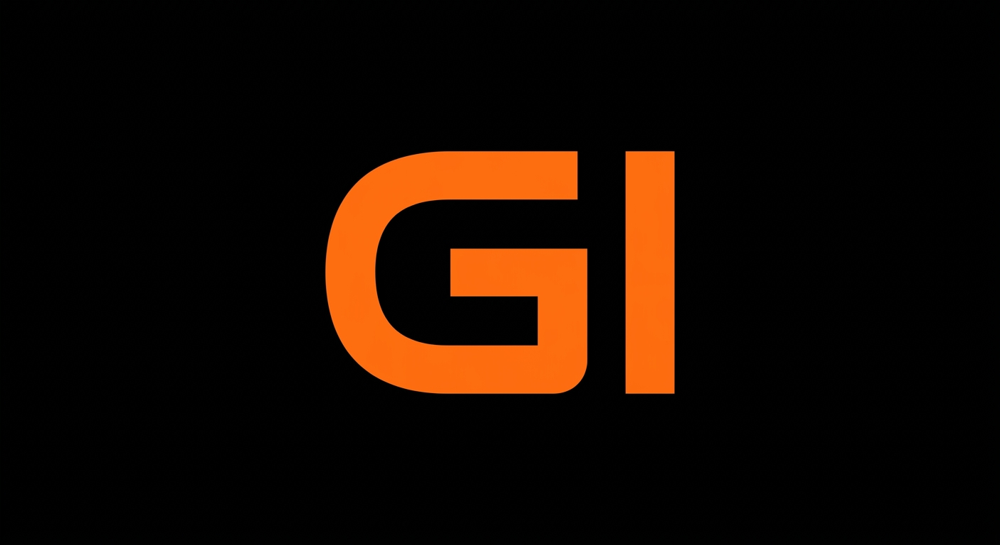
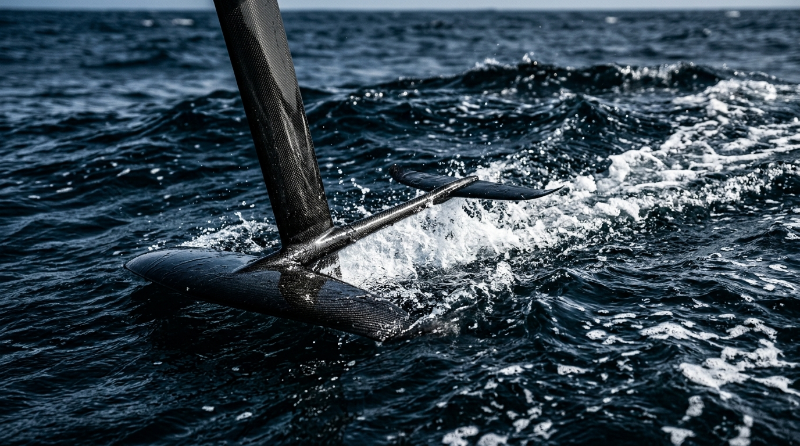

# Design System

A strict, mobile-first CSS architecture anchored in extreme technical precision and high-performance surfing motifs. Surfaces simulate wet carbon fiber using CSS gradients and low-opacity OKLCH overlays. Grids are dense, mimicking fluid dynamics software interfaces, with 1px borders denoting structural sections. All interactive elements use :has() for relational dimming, simulating a polarizing lens effect when focusing on a specific project.

## Locked Design Constitution

```json
{
  "name": "Hydrofoil AI",
  "accent": "High-Vis Orange",
  "signatureGesture": "The 'Swelling Wake' effect: Using pure CSS view() timelines, project cards and list items scale up slightly and increase in brightness as they scroll into the center of the viewport, mimicking a wave cresting, before settling back into the dark oceanic background as they exit.",
  "mobileStrategy": "Base CSS defaults to a single-column, full-bleed fluid layout. Navigation is exposed as a wrap-enabled flex container with strict 44px minimum touch targets, eliminating hidden states. Padding uses fluid vw units to maximize screen real estate, ensuring complex AI diagrams and surf imagery remain legible without horizontal overflow.",
  "imageTreatment": "Images will receive a 'Polarized Lens' treatment using CSS filters: high contrast, deep crushed shadows, saturated blues, and a slight metallic specular highlight overlay to simulate wet neoprene and fiberglass surfaces.",
  "tokens": {
    "colors": "bg: oklch(15% 0.02 250); text-primary: oklch(98% 0.01 250); text-muted: oklch(65% 0.05 250); accent: oklch(75% 0.2 45); surface: oklch(20% 0.03 250); border: oklch(25% 0.05 250);",
    "typography": "display: 'Clash Display', sans-serif, font-weight 600; body: 'JetBrains Mono', monospace, font-weight 400; text-wrap: balance for display, pretty for body.",
    "spacing": "fluid-gap: clamp(1rem, 2vw, 2rem); section-y: clamp(4rem, 8vw, 8rem); touch-target: 44px;",
    "shape": "radius-base: 2px (sharp fiberglass edges); radius-card: 8px (hydrofoil curve); border-width: 1px;",
    "motion": "easing-swell: cubic-bezier(0.25, 1, 0.5, 1); timeline-scroll: view(block);"
  },
  "classVocabulary": [
    {
      "name": "layout-shell",
      "owner": "shell",
      "purpose": "Maintains the global bounding box and application background"
    },
    {
      "name": "global-nav",
      "owner": "shell",
      "purpose": "Houses the wrap-enabled, visible mobile navigation items"
    },
    {
      "name": "nav-item",
      "owner": "nav_item",
      "purpose": "Individual navigation link with 44px hit area"
    },
    {
      "name": "hero-header",
      "owner": "home",
      "purpose": "Container for the thematic hero image and main thesis"
    },
    {
      "name": "hero-media",
      "owner": "home",
      "purpose": "Target for the background-image injection"
    },
    {
      "name": "grid-masonry",
      "owner": "projects_index",
      "purpose": "Native masonry container for project cards"
    },
    {
      "name": "grid-bento",
      "owner": "designs_index",
      "purpose": "High-density bento grid for visual design work"
    },
    {
      "name": "card-surface",
      "owner": "project_item",
      "purpose": "Individual project container with wet-gloss styling"
    },
    {
      "name": "card-meta",
      "owner": "project_item",
      "purpose": "Typographic container for project titles and dates"
    },
    {
      "name": "design-preview",
      "owner": "design_item",
      "purpose": "Image container for visual work with polarized filter"
    },
    {
      "name": "detail-header",
      "owner": "project_detail",
      "purpose": "Top-level metadata section for deep-dive case studies"
    },
    {
      "name": "detail-content",
      "owner": "project_detail",
      "purpose": "Text-heavy flow container for markdown content"
    },
    {
      "name": "page-layout",
      "owner": "page",
      "purpose": "Generic static page container (About, Contact)"
    },
    {
      "name": "badge",
      "owner": "css",
      "purpose": "Injected runtime class for technical tags"
    },
    {
      "name": "src",
      "owner": "css",
      "purpose": "Injected runtime class for source links"
    },
    {
      "name": "backlink",
      "owner": "css",
      "purpose": "Injected runtime class for return navigation"
    },
    {
      "name": "btn",
      "owner": "css",
      "purpose": "Injected runtime class for primary actions"
    },
    {
      "name": "md-img",
      "owner": "css",
      "purpose": "Injected runtime class for markdown-embedded images"
    }
  ],
  "layoutBlueprints": {
    "shell": {
      "rootClass": "layout-shell",
      "composition": "A high-level CSS grid establishing a fixed header row for 'global-nav' and a fluid main content area. Strict min-width media queries transition the navigation from a wrapped flex row on mobile to a staggered horizontal layout on desktop. No horizontal overflow permitted."
    },
    "home": {
      "rootClass": "hero-header",
      "composition": "The 'hero-header' spans full width, containing 'hero-media' which receives the injected hydrofoil asset. Below the visual thesis, a dense, subgrid-aligned section introduces the featured AI projects."
    },
    "projects_index": {
      "rootClass": "grid-masonry",
      "composition": "Implements pure CSS native masonry. Cards cascade vertically in fluid columns, leveraging scroll-driven timelines to swell into view as the user scrolls down the 'wave'."
    },
    "designs_index": {
      "rootClass": "grid-bento",
      "composition": "A rigid, mathematics-driven bento grid. Images are cropped tightly into 'design-preview' containers, forcing a dense, analytical layout contrasting with the fluid organic imagery."
    },
    "project_detail": {
      "rootClass": "detail-header",
      "composition": "Opens with massive, screen-spanning typography and metadata grid. 'detail-content' follows below with a strict reading width (max 65ch), ensuring text block legibility without multi-column collision."
    },
    "design_detail": {
      "rootClass": "detail-header",
      "composition": "Places the primary design asset front and center with edge-to-edge bleed on mobile, shrinking to a framed, polarized-glass container on desktop. Supporting text flows in a single column below."
    },
    "page": {
      "rootClass": "page-layout",
      "composition": "A clean, single-column prose container tailored for the About and Contact sections, utilizing fluid typography interpolation for seamless scaling."
    },
    "project_item": {
      "rootClass": "card-surface",
      "composition": "A layered, tactile component. The dark background receives a subtle noise texture. 'card-meta' positions typography at the very bottom, anchored to the edge for a brutalist, technical aesthetic."
    },
    "design_item": {
      "rootClass": "design-preview",
      "composition": "An interactive container that utilizes :has() to dim sibling items when hovered. The internal image uses CSS object-fit cover to ensure no grid overflow."
    },
    "nav_item": {
      "rootClass": "nav-item",
      "composition": "A structural link block enforcing a strict 44px minimum height and width. Text is center-aligned, using the monospace typeface with a high-vis orange underline on hover."
    }
  }
}
```

## section:css

```css
:root{--bg:oklch(15% 0.02 250);--text-primary:oklch(98% 0.01 250);--text-muted:oklch(65% 0.05 250);--accent:oklch(75% 0.2 45);--surface:oklch(20% 0.03 250);--border:oklch(25% 0.05 250);--font-display:'Clash Display',sans-serif;--font-body:'JetBrains Mono',monospace;--fluid-gap:clamp(1rem,2vw,2rem);--section-y:clamp(4rem,8vw,8rem);--radius-base:2px;--radius-card:8px;--border-width:1px;--ease-swell:cubic-bezier(0.25,1,0.5,1)}*{box-sizing:border-box;margin:0;padding:0}body{background:var(--bg);color:var(--text-primary);font-family:var(--font-body);font-weight:400;line-height:1.5;-webkit-font-smoothing:antialiased}h1,h2,h3,h4,.font-display{font-family:var(--font-display);font-weight:600;text-wrap:balance}p,li{text-wrap:pretty;max-width:65ch}img{max-width:100%;height:auto;display:block}a{color:inherit;text-decoration:none}.layout-shell{display:grid;grid-template-rows:auto 1fr;min-height:100vh;overflow-x:hidden;position:relative}.layout-shell::before{content:'';position:absolute;top:1rem;left:1rem;width:44px;height:44px;background:url('assets/logo.png') center/contain no-repeat;z-index:99;pointer-events:none}@media (min-width:768px){.layout-shell::before{top:2rem;left:2rem}}.global-nav{display:flex;flex-wrap:wrap;gap:1rem;padding:1rem 1rem 1rem 4rem;border-bottom:var(--border-width) solid var(--border)}@media (min-width:768px){.global-nav{padding:2rem;justify-content:flex-end}}.nav-item{min-height:44px;min-width:44px;display:inline-flex;align-items:center;justify-content:center;padding:0.5rem 1rem;position:relative;font-family:var(--font-body);transition:color 0.3s var(--ease-swell)}.nav-item:hover{color:var(--accent)}.nav-item::after{content:'';position:absolute;bottom:0;left:0;right:0;height:2px;background:var(--accent);transform:scaleX(0);transition:transform 0.3s var(--ease-swell)}.nav-item:hover::after{transform:scaleX(1)}.hero-header{width:100%;display:flex;flex-direction:column;padding:var(--section-y) 1rem;position:relative;min-height:60vh;justify-content:center}.hero-media{position:absolute;inset:0;background-image:url('assets/hero.jpg');background-size:cover;background-position:center;z-index:-1;filter:contrast(1.2) saturate(1.5) hue-rotate(-10deg) brightness(0.6);mix-blend-mode:multiply;opacity:0.7}.hero-header::after{content:'';position:absolute;inset:0;background:linear-gradient(to bottom,transparent,var(--bg));z-index:-1}@media (min-width:768px){.hero-header{padding:var(--section-y) 2rem}}.grid-masonry{display:grid;grid-template-columns:minmax(0,1fr);gap:var(--fluid-gap);padding:1rem}@media (min-width:768px){.grid-masonry{grid-template-columns:repeat(auto-fill,minmax(300px,1fr));padding:2rem}}.grid-bento{display:grid;grid-template-columns:minmax(0,1fr);gap:var(--fluid-gap);padding:1rem}@media (min-width:768px){.grid-bento{grid-template-columns:repeat(3,minmax(0,1fr));padding:2rem}}.card-surface{background:var(--surface);border:var(--border-width) solid var(--border);border-radius:var(--radius-card);padding:1rem;display:flex;flex-direction:column;justify-content:flex-end;min-height:300px;position:relative;overflow:hidden}.card-surface::before{content:'';position:absolute;inset:0;background-image:url('data:image/svg+xml,%3Csvg viewBox=%220 0 200 200%22 xmlns=%22http://www.w3.org/2000/svg%22%3E%3Cfilter id=%22noiseFilter%22%3E%3CfeTurbulence type=%22fractalNoise%22 baseFrequency=%220.65%22 numOctaves=%223%22 stitchTiles=%22stitch%22/%3E%3C/filter%3E%3Crect width=%22100%25%22 height=%22100%25%22 filter=%22url(%23noiseFilter)%22 opacity=%220.05%22/%3E%3C/svg%3E');pointer-events:none;z-index:1}.card-meta{position:relative;z-index:2;margin-top:auto;border-top:var(--border-width) solid var(--border);padding-top:1rem}@supports (animation-timeline:view()){.card-surface,.design-preview{animation:swelling-wake linear both;animation-timeline:view(block);animation-range:cover 0% cover 100%}}@keyframes swelling-wake{0%{transform:scale(0.95);filter:brightness(0.7)}50%{transform:scale(1);filter:brightness(1.1)}100%{transform:scale(0.95);filter:brightness(0.7)}}.design-preview{border-radius:var(--radius-base);overflow:hidden;position:relative;min-height:250px;background:var(--surface);border:var(--border-width) solid var(--border)}.design-preview img{width:100%;height:100%;object-fit:cover;filter:contrast(1.3) saturate(1.2) drop-shadow(0 0 10px rgba(0,150,255,0.2));transition:filter 0.3s var(--ease-swell)}.grid-bento:has(.design-preview:hover) .design-preview:not(:hover){opacity:0.5;filter:grayscale(50%)}.detail-header{padding:var(--section-y) 1rem 2rem;border-bottom:var(--border-width) solid var(--border);background:var(--bg)}.detail-content,.page-layout{padding:2rem 1rem;display:flex;flex-direction:column;gap:1.5rem}.detail-content > *,.page-layout > *{max-width:65ch;margin-inline:auto;width:100%}@media (min-width:768px){.detail-header,.detail-content,.page-layout{padding-inline:2rem}}.badge{display:inline-flex;align-items:center;justify-content:center;min-height:32px;padding:0 12px;font-size:0.75rem;text-transform:uppercase;letter-spacing:0.05em;background:rgba(255,255,255,0.05);border:var(--border-width) solid var(--border);border-radius:var(--radius-base);color:var(--accent)}.src,.backlink,.btn{min-height:44px;display:inline-flex;align-items:center;justify-content:center;padding:0 1.5rem;background:var(--surface);color:var(--text-primary);border:var(--border-width) solid var(--border);border-radius:var(--radius-base);font-family:var(--font-display);text-transform:uppercase;cursor:pointer;transition:all 0.3s var(--ease-swell)}.src:hover,.backlink:hover,.btn:hover{background:var(--accent);color:var(--bg);border-color:var(--accent)}.md-img{border-radius:var(--radius-card);border:var(--border-width) solid var(--border);margin:2rem 0;width:100%;height:auto;filter:contrast(1.2)}.gi-reveal{opacity:0;transform:translateY(20px);transition:opacity 0.6s var(--ease-swell),transform 0.6s var(--ease-swell)}.gi-reveal.gi-in{opacity:1;transform:translateY(0)}

/* Release invariant: a generated skin may not let an untrusted logo asset take over the viewport. */
.nav-bar img[src*="gi-logo-transparent"], header img[src*="gi-logo-transparent"],
.nav-bar img[src*="assets/logo"], header img[src*="assets/logo"] {
  display: block;
  inline-size: min(11.25rem, 48vw) !important;
  block-size: 3.5rem !important;
  max-inline-size: 100% !important;
  max-block-size: 3.5rem !important;
  object-fit: contain !important;
  object-position: left center !important;
}
.verified-brand-mark {
  inline-size: min(11.25rem, 48vw) !important;
  block-size: 3.5rem !important;
  max-inline-size: 100% !important;
  max-block-size: 3.5rem !important;
  object-fit: contain !important;
}
/* Vault-injected project marks have their own stable wrapper regardless of
   the generated layout vocabulary. Bound them mechanically so intrinsic
   source dimensions can never escape a card or grid track. */
.logo-tile {
  display: flex !important;
  align-items: center !important;
  justify-content: center !important;
  inline-size: 100% !important;
  min-inline-size: 0 !important;
  max-inline-size: 100% !important;
  overflow: hidden !important;
}
.logo-tile img {
  display: block !important;
  inline-size: 100% !important;
  min-inline-size: 0 !important;
  max-inline-size: 100% !important;
  block-size: auto !important;
  max-block-size: 18rem !important;
  object-fit: contain !important;
}
/* Build-owned navigation wrapper and badge fragments need invariant spacing;
   aesthetic styling remains theme-owned. */
.nav-links {
  display: flex !important;
  flex-wrap: wrap !important;
  align-items: center !important;
  gap: .25rem 1rem !important;
  min-inline-size: 0 !important;
}
.nav-links a {
  display: inline-flex !important;
  align-items: center !important;
  min-block-size: 44px !important;
  white-space: nowrap !important;
}
.badge {
  margin: .2rem !important;
}
/* build-site emits both navigation layers; generated skins own the custom one. */
.tl-default { display: none !important; }
.tl-custom { display: flex; flex-wrap: wrap; align-items: center; }


/* review-board fix layer (pass 1) */
h1,h2,h3,.hero-header h1,.detail-header h1,.card-meta h3,.page-layout h1{font-family:'Clash Display','Impact','Arial Black',sans-serif !important;font-weight:900 !important;text-transform:uppercase !important;letter-spacing:0.06em !important;font-stretch:expanded !important;line-height:1.0 !important}:root{--accent:oklch(70% 0.35 45) !important;--accent-rgb:255,75,0 !important}.badge{background-color:var(--accent) !important;color:oklch(15% 0.02 250) !important;font-weight:800 !important;border:1px solid var(--accent) !important;text-transform:uppercase !important;letter-spacing:0.05em !important}.btn,a.btn{background-color:var(--accent) !important;color:oklch(15% 0.02 250) !important;font-weight:800 !important;border-color:var(--accent) !important;text-transform:uppercase !important;letter-spacing:0.05em !important;transition:background-color 0.2s ease,transform 0.2s ease !important}.btn:hover,a.btn:hover{background-color:oklch(80% 0.35 45) !important;transform:scale(1.02) !important}.src,.backlink{color:var(--accent) !important;border-bottom:2px solid var(--accent) !important;font-weight:700 !important}.src:hover,.backlink:hover{color:oklch(80% 0.35 45) !important;border-color:oklch(80% 0.35 45) !important}.nav-item:hover,.nav-item.active{color:var(--accent) !important;border-bottom:3px solid var(--accent) !important}.card-surface:hover{border-color:var(--accent) !important;box-shadow:0 0 15px rgba(255,75,0,0.25) !important}

/* review-board fix layer (pass 2) */
:root { --bg: oklch(15% 0.02 250); --text-primary: oklch(98% 0.01 250); --text-muted: oklch(65% 0.05 250); --accent: oklch(75% 0.2 45); --surface: oklch(20% 0.03 250); --border: oklch(25% 0.05 250); --font-display: "Clash Display", sans-serif; --font-body: "JetBrains Mono", monospace; --radius-base: 2px; --radius-card: 8px; --fluid-gap: clamp(1rem, 2vw, 2rem); --section-y: clamp(4rem, 8vw, 8rem); } .layout-shell { background-color: var(--bg); color: var(--text-primary); font-family: var(--font-body); background-image: radial-gradient(circle at 50% 0%, oklch(20% 0.04 240 / 0.5), transparent 70%), linear-gradient(to bottom, transparent, oklch(12% 0.02 250)); background-attachment: fixed; min-height: 100vh; } .global-nav { border-bottom: 1px solid var(--border); background: oklch(15% 0.02 250 / 0.9); -webkit-backdrop-filter: blur(12px); backdrop-filter: blur(12px); } .nav-item { font-family: var(--font-body); font-weight: 500; color: var(--text-muted); text-transform: uppercase; letter-spacing: 0.05em; min-height: 44px; min-width: 44px; display: inline-flex; align-items: center; justify-content: center; padding: 0.5rem 1rem; transition: color 0.2s ease, text-shadow 0.2s ease; position: relative; } .nav-item::after { content: ""; position: absolute; bottom: 0; left: 50%; width: 0; height: 2px; background-color: var(--accent); transition: width 0.2s ease, left 0.2s ease; } .nav-item:hover, .nav-item[class*="active"] { color: var(--text-primary); text-shadow: 0 0 8px oklch(75% 0.2 45 / 0.4); } .nav-item:hover::after, .nav-item[class*="active"]::after { width: 100%; left: 0; } .hero-header { position: relative; overflow: hidden; padding: var(--section-y) var(--fluid-gap); border-bottom: 1px solid var(--border); background: linear-gradient(180deg, oklch(18% 0.03 250), var(--bg)); } .hero-media { border-radius: var(--radius-card); overflow: hidden; position: relative; border: 1px solid var(--border); box-shadow: 0 20px 40px oklch(10% 0.02 250 / 0.8); } .hero-media img, .design-preview img, .md-img { filter: contrast(1.15) brightness(0.85) saturate(1.3) hue-rotate(-5deg); transition: filter 0.3s ease, transform 0.5s cubic-bezier(0.25, 1, 0.5, 1); } .hero-media::before, .design-preview::before { content: ""; position: absolute; inset: 0; background: linear-gradient(135deg, oklch(100% 0 0 / 0.15) 0%, transparent 50%, oklch(0% 0 0 / 0.4) 100%); pointer-events: none; z-index: 2; mix-blend-mode: overlay; } @keyframes swelling-wake { 0% { transform: scale(0.95) translateY(20px); opacity: 0.6; border-color: var(--border); box-shadow: 0 5px 15px oklch(10% 0.02 250 / 0.3); } 50% { transform: scale(1.02) translateY(0); opacity: 1; border-color: var(--accent); box-shadow: 0 25px 50px oklch(75% 0.2 45 / 0.15), 0 0 1px 1px var(--accent); } 100% { transform: scale(0.95) translateY(-20px); opacity: 0.6; border-color: var(--border); box-shadow: 0 5px 15px oklch(10% 0.02 250 / 0.3); } } .card-surface { background: var(--surface); border: 1px solid var(--border); border-radius: var(--radius-card); padding: 1.5rem; transition: transform 0.4s cubic-bezier(0.25, 1, 0.5, 1), border-color 0.4s, box-shadow 0.4s; display: flex; flex-direction: column; justify-content: space-between; position: relative; overflow: hidden; } .card-surface::after { content: ""; position: absolute; top: 0; left: -150%; width: 200%; height: 100%; background: linear-gradient(115deg, transparent 0%, oklch(100% 0 0 / 0.03) 30%, oklch(100% 0 0 / 0.08) 40%, transparent 60%); transition: transform 0.6s ease; pointer-events: none; } .card-surface:hover::after { transform: translateX(100%); } .card-surface:hover { border-color: var(--accent); transform: translateY(-4px) scale(1.01); box-shadow: 0 15px 30px oklch(10% 0.02 250 / 0.5), 0 0 0 1px var(--accent); } @supports (animation-timeline: view()) { .card-surface, .design-preview { animation: swelling-wake linear both; animation-timeline: view(); animation-range: entry 5% exit 95%; } } .card-meta { margin-top: auto; font-family: var(--font-body); } .card-meta h3, .card-meta h4 { font-family: var(--font-display); font-size: clamp(1.25rem, 4vw, 1.75rem); color: var(--text-primary); margin-bottom: 0.5rem; font-weight: 600; letter-spacing: -0.02em; } .grid-bento { display: grid; gap: var(--fluid-gap); } .design-preview { position: relative; overflow: hidden; border-radius: var(--radius-card); border: 1px solid var(--border); transition: opacity 0.3s ease, border-color 0.3s ease, transform 0.3s ease; } .grid-bento:has(.design-preview:hover) .design-preview:not(:hover) { opacity: 0.4; filter: grayscale(0.5); } .design-preview:hover { border-color: var(--accent); transform: scale(1.02); } .detail-header { padding: calc(var(--section-y) * 1.5) var(--fluid-gap) var(--section-y); border-bottom: 1px solid var(--border); } .detail-header h1 { font-family: var(--font-display); font-size: clamp(2.5rem, 8vw, 5rem); line-height: 1; letter-spacing: -0.03em; font-weight: 600; color: var(--text-primary); text-transform: uppercase; } .detail-content { max-width: 65ch; margin: 0 auto; padding: var(--section-y) var(--fluid-gap); font-family: var(--font-body); line-height: 1.6; color: var(--text-muted); } .detail-content h2, .detail-content h3 { font-family: var(--font-display); color: var(--text-primary); margin-top: 2rem; margin-bottom: 1rem; } .badge { display: inline-flex; align-items: center; padding: 0.25rem 0.5rem; font-family: var(--font-body); font-size: 0.75rem; text-transform: uppercase; font-weight: 600; background: oklch(20% 0.03 250 / 0.6); color: var(--accent); border: 1px solid var(--accent); border-radius: var(--radius-base); letter-spacing: 0.05em; } .btn { display: inline-flex; align-items: center; justify-content: center; min-height: 44px; padding: 0 1.5rem; font-family: var(--font-body); font-size: 0.875rem; font-weight: 600; text-transform: uppercase; color: var(--bg); background-color: var(--accent); border: 1px solid var(--accent); border-radius: var(--radius-base); cursor: pointer; transition: background-color 0.2s, color 0.2s, box-shadow 0.2s; letter-spacing: 0.05em; } .btn:hover { background-color: transparent; color: var(--accent); box-shadow: 0 0 15px oklch(75% 0.2 45 / 0.5); } .src, .backlink { font-family: var(--font-body); color: var(--accent); text-decoration: none; min-height: 44px; display: inline-flex; align-items: center; gap: 0.5rem; font-size: 0.875rem; } .src:hover, .backlink:hover { text-decoration: underline; text-underline-offset: 4px; } .page-layout { max-width: 800px; margin: 0 auto; padding: var(--section-y) var(--fluid-gap); }
```

## section:layout:shell

```html
<section class="layout-shell"><style></style><header><nav class="global-nav">{{NAV_LINKS}}</nav></header><main>{{CONTENT}}</main><footer><div>{{THEME_PILLS}}</div><div>{{SOURCE_PATH}}</div></footer></section>
```

## section:layout:home

```html
<section class="hero-header"><div class="hero-media"></div><div><span class="badge">{{FEATURED_COUNT}}</span><h1>{{HEADLINE}}</h1><p>{{TAGLINE}}</p><div>{{INTRO}}</div></div><div>{{FEATURED_PROJECTS}}</div></section>
```

## section:layout:projects_index

```html
<section class="grid-masonry"><style></style><div class="badge">{{PROJECT_COUNT}}</div>{{PROJECT_LIST}}</section>
```

## section:layout:designs_index

```html
<section class="grid-bento">{{DESIGN_CARDS}}</section>
```

## section:layout:project_detail

```html
<section class="detail-header">{{BACKLINK}}{{LOGO}}<h1>{{NAME}}</h1><p>{{DESCRIPTION}}</p><div>{{ROLE}}</div><div>{{YEAR}}</div><div class="badge">{{TECH_BADGES}}</div><div class="btn">{{PROJECT_LINK}}</div><div class="src">{{REPO_LINK}}</div><div>{{SOURCE_PATH}}</div><div class="detail-content">{{CONTENT}}</div></section>
```

## section:layout:design_detail

```html
<section class="detail-header"><div class="backlink">{{BACKLINK}}</div><h1>{{NAME}}</h1><figure class="design-preview"></figure><div class="detail-content"><p>{{DESCRIPTION}}</p><p>{{CLIENT}}</p><p>{{ROLE}}</p><p>{{YEAR}}</p><span class="badge">{{TAG_BADGES}}</span><a href="{{LINK_URL}}" class="btn">{{NAME}}</a>{{CONTENT}}</div><aside class="src">{{SOURCE_PATH}}</aside></section>
```

## section:layout:page

```html
<article class="page-layout"><h1>{{NAME}}</h1><div>{{CONTENT}}</div><div class="src">{{SOURCE_PATH}}</div></article>
```

## section:layout:project_item

```html
<article class="card-surface">{{LOGO}}<div class="card-meta"><div><a href="{{URL}}" class="btn">{{NAME}}</a><a href="{{REPO_URL}}" class="src">{{INDEX}}</a></div><time>{{YEAR}}</time><p>{{DESCRIPTION}}</p><div>{{TECH_BADGES}}</div></div></article>
```

## section:layout:design_item

```html
<section class="design-preview"><a href="{{URL}}"><h2>{{NAME}}</h2><p>{{CLIENT}} {{YEAR}} {{DESCRIPTION}}</p><div class="badge">{{TAG_BADGES}}</div></a></section>
```

## section:layout:nav_item

```html
<a href="{{NAV_URL}}" class="nav-item {{NAV_ACTIVE_CLASS}}">{{NAV_NAME}}</a>
```
