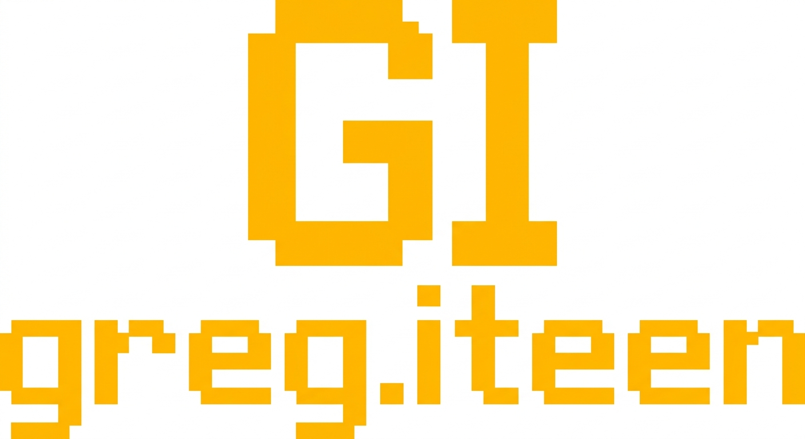

# Design System

---
theme_name: "Amber Phosphor Terminal"
colors:
  bg_pure_black: "#000000"
  amber_phosphor: "#FFB000"
  amber_dim: "#332000"
  amber_mid: "#805800"
typography:
  font_primary: "'IBM Plex Mono', 'Courier New', monospace"
  scale_base: "14px"
  scale_lg: "18px"
  scale_xl: "24px"
  letter_spacing_tracked: "0.12em"
spacing:
  cell_unit: "8px"
borders:
  solid_thin: "1px solid #FFB000"
  dashed_thin: "1px dashed #332000"
---

# DESIGN.md - Amber Phosphor Terminal

## Visual Identity & Mood
The visual system is modeled directly on late-1970s mainframe computer terminals, prioritizing high data density, structural monochrome hierarchy, and physical hardware constraints. By excluding typical modern layouts, the site highlights Greg Iteen's native, raw, low-level technical logic.

## Layout Strategy
Layouts adhere strictly to a monospace grid. Horizontal structural elements are separated with custom ASCII borders instead of random margin padding. Component items read sequentially like data sheets rather than marketing cards, creating an unyielding, professional landscape.

## Touch & Interactive Mechanics
To balance usability with vintage terminal restrictions, all interactive tags have a hidden minimum touch dimension of 44px achieved through transparent borders and absolute cell padding. Hovers are binary and instantaneous; there are no slow, heavy gradients or modern bezier transitions. Elements invert cleanly from amber-on-black to black-on-amber to mimic retro video RAM cell highlighting.

## section:css

```css
:root { --bg-black: #000000; --amber-high: #FFB000; --amber-mid: #805800; --amber-low: #332000; --amber-glow: rgba(255, 176, 0, 0.15); --font-mono: 'IBM Plex Mono', 'Courier New', monospace; --font-size-xs: 0.75rem; --font-size-sm: 0.875rem; --font-size-base: 1rem; --font-size-lg: 1.25rem; --font-size-xl: 1.75rem; --grid-unit: 8px; --touch-target: 44px; --transition-snap: 0s; --transition-pulse: opacity 1s infinite alternate; }

*,*::before,*::after{box-sizing:border-box;margin:0;padding:0}html,body.terminal-body{background-color:var(--bg-black);color:var(--amber-high);font-family:var(--font-mono);font-size:var(--font-size-base);line-height:1.6;-webkit-font-smoothing:none;background-image:linear-gradient(to bottom,rgba(255,176,0,0) 50%,var(--amber-glow) 50%);background-size:100% 4px}.terminal-content{max-width:100%}.terminal-content h1,.terminal-content h2,.terminal-content h3,.terminal-content h4,.terminal-content h5,.terminal-content h6{font-weight:700;text-transform:uppercase;margin-top:calc(var(--grid-unit)*4);margin-bottom:calc(var(--grid-unit)*2);line-height:1.2;letter-spacing:.05em}.terminal-content h1{font-size:var(--font-size-xl)}.terminal-content h2{font-size:var(--font-size-lg);border-bottom:1px dashed var(--amber-mid);padding-bottom:var(--grid-unit)}.terminal-content h3{font-size:var(--font-size-base)}.terminal-content p{margin-bottom:calc(var(--grid-unit)*2)}.terminal-content ul,.terminal-content ol{margin-bottom:calc(var(--grid-unit)*2);padding-left:calc(var(--grid-unit)*3)}.terminal-content li{margin-bottom:calc(var(--grid-unit)*1)}.terminal-content ul{list-style-type:square}.terminal-content a{color:var(--amber-high);text-decoration:underline;text-decoration-style:solid;text-decoration-color:var(--amber-mid);text-underline-offset:4px;transition:background-color var(--transition-snap),color var(--transition-snap);padding:10px 4px;margin:-10px -4px}.terminal-content a:hover,.terminal-content a:focus{background-color:var(--amber-high);color:var(--bg-black);outline:0}.terminal-content blockquote{border-left:2px solid var(--amber-high);padding:var(--grid-unit) calc(var(--grid-unit)*2);margin:calc(var(--grid-unit)*3) 0;color:var(--amber-high);background-color:var(--amber-glow)}.terminal-content pre{background:var(--bg-black);border:1px solid var(--amber-mid);padding:calc(var(--grid-unit)*2);overflow-x:auto;margin-bottom:calc(var(--grid-unit)*2)}.terminal-content code{font-family:var(--font-mono);font-size:var(--font-size-sm);background:var(--amber-low);padding:2px 4px;color:var(--amber-high)}.terminal-content pre code{background:0 0;padding:0}.terminal-content .md-img{max-width:100%;height:auto;display:block;margin:calc(var(--grid-unit)*3) 0;filter:grayscale(100%) sepia(100%) hue-rotate(350deg) saturate(300%) contrast(1.2) brightness(0.8);border:1px solid var(--amber-mid)}@media(prefers-reduced-motion:no-preference){.terminal-body{animation:terminal-flicker 10s infinite}}@keyframes terminal-flicker{0%{opacity:1}5%{opacity:.98}10%{opacity:1}50%{opacity:1}51%{opacity:.96}52%{opacity:1}100%{opacity:1}}

.terminal-shell { display: flex; flex-direction: column; min-height: 100vh; padding: calc(var(--grid-unit) * 2); box-sizing: border-box; width: 100%; } @media (min-width: 768px) { .terminal-shell { padding: calc(var(--grid-unit) * 4); } } @media (min-width: 1024px) { .terminal-shell { padding: calc(var(--grid-unit) * 8); } } .terminal-header { display: flex; flex-direction: column; gap: calc(var(--grid-unit) * 2); padding-bottom: calc(var(--grid-unit) * 2); border-bottom: 2px solid var(--amber-low); margin-bottom: calc(var(--grid-unit) * 4); } @media (min-width: 768px) { .terminal-header { flex-direction: row; justify-content: space-between; align-items: stretch; border-bottom-width: 4px; border-bottom-style: double; } } .terminal-footer { margin-top: auto; padding-top: calc(var(--grid-unit) * 3); border-top: 1px dashed var(--amber-mid); display: flex; flex-direction: column; gap: calc(var(--grid-unit) * 2); } @media (min-width: 768px) { .terminal-footer { flex-direction: row; justify-content: space-between; align-items: flex-end; } } .grid-matrix { display: grid; grid-template-columns: 1fr; gap: calc(var(--grid-unit) * 2); width: 100%; border: 1px solid var(--amber-low); padding: var(--grid-unit); } @media (min-width: 768px) { .grid-matrix { grid-template-columns: repeat(2, 1fr); gap: calc(var(--grid-unit) * 3); padding: calc(var(--grid-unit) * 2); } } @media (min-width: 1024px) { .grid-matrix { grid-template-columns: repeat(3, 1fr); } }

.badge { display: inline-block; font-family: var(--font-mono); font-size: var(--font-size-xs); color: var(--amber-high); border: 1px solid var(--amber-mid); padding: 4px 8px; margin: 0 4px 4px 0; text-transform: uppercase; background: var(--bg-black); transition: background 0.1s var(--transition-snap), color 0.1s var(--transition-snap); } .badge:hover, .badge:focus { background: var(--amber-high); color: var(--bg-black); } .src { display: inline-flex; align-items: center; justify-content: center; min-height: var(--touch-target); font-family: var(--font-mono); font-size: var(--font-size-sm); color: var(--amber-high); text-decoration: none; border: 1px dashed var(--amber-high); padding: 0 16px; background: var(--bg-black); text-transform: uppercase; transition: background 0.1s var(--transition-snap), color 0.1s var(--transition-snap); } .src:hover, .src:focus { background: var(--amber-high); color: var(--bg-black); text-decoration: none; } .backlink { display: inline-flex; align-items: center; min-height: var(--touch-target); font-family: var(--font-mono); font-size: var(--font-size-sm); color: var(--amber-high); text-decoration: none; padding: 0 16px; transition: background 0.1s var(--transition-snap), color 0.1s var(--transition-snap); border: 1px solid transparent; } .backlink:hover, .backlink:focus { background: var(--amber-mid); color: var(--bg-black); border-color: var(--amber-high); } .btn { display: inline-flex; align-items: center; justify-content: center; min-height: var(--touch-target); font-family: var(--font-mono); font-size: var(--font-size-base); color: var(--bg-black); background: var(--amber-high); border: 2px solid var(--amber-high); padding: 0 24px; text-decoration: none; text-transform: uppercase; font-weight: bold; cursor: pointer; transition: background 0.1s var(--transition-snap), color 0.1s var(--transition-snap), box-shadow 0.1s var(--transition-snap); } .btn:hover, .btn:focus { background: var(--bg-black); color: var(--amber-high); box-shadow: 0 0 15px var(--amber-glow); } .logo-wrapper { display: inline-flex; align-items: center; max-height: 36px; overflow: hidden; background: var(--bg-black); } .logo-wrapper img { display: block; max-height: 36px; width: auto; filter: invert(1) sepia(100%) hue-rotate(5deg) saturate(500%) contrast(150%); mix-blend-mode: screen; } .terminal-marquee { display: flex; overflow: hidden; white-space: nowrap; background: var(--amber-low); color: var(--amber-high); font-family: var(--font-mono); font-size: var(--font-size-xs); padding: 8px 0; border-top: 1px solid var(--amber-mid); border-bottom: 1px solid var(--amber-mid); } .terminal-marquee > * { display: inline-block; padding-right: 2rem; animation: marquee-scroll 15s linear infinite; } @keyframes marquee-scroll { 0% { transform: translateX(0); } 100% { transform: translateX(-100%); } } @media (prefers-reduced-motion: reduce) { .terminal-marquee > * { animation: none; } }

.terminal-hero { background-image: url('assets/hero.jpg'); background-size: cover; background-position: center; filter: grayscale(100%) contrast(300%) brightness(80%); mix-blend-mode: color-dodge; height: 350px; border-bottom: 2px double var(--amber-high); display: flex; flex-direction: column; justify-content: flex-end; padding: calc(var(--grid-unit) * 2); position: relative; overflow: hidden; } .gi-reveal { opacity: 0; clip-path: polygon(0 0, 100% 0, 100% 0, 0 0); transition: opacity 0s, clip-path 0.3s steps(5) var(--gi-stagger, 0s); } .gi-reveal.gi-in { opacity: 1; clip-path: polygon(0 0, 100% 0, 100% 100%, 0 100%); } .data-table-item { display: grid; grid-template-columns: 1fr; gap: calc(var(--grid-unit) * 1.5); padding: calc(var(--grid-unit) * 2); min-height: var(--touch-target); border: 1px dashed var(--amber-mid); border-left: 4px solid var(--amber-mid); margin-bottom: calc(var(--grid-unit) * 2); background: transparent; text-decoration: none; color: var(--amber-high); transition: background-color var(--transition-snap), border-color var(--transition-snap); position: relative; } .data-table-item:hover, .data-table-item:focus { background: var(--amber-low); border-color: var(--amber-high); outline: none; cursor: crosshair; } @media (min-width: 768px) { .data-table-item { grid-template-columns: minmax(0, 2fr) auto auto; align-items: start; } } .meta-cell { font-family: var(--font-mono); font-size: var(--font-size-xs); color: var(--amber-mid); text-transform: uppercase; white-space: nowrap; display: flex; align-items: center; min-height: calc(var(--touch-target) / 2); } .meta-cell::before { content: '[ '; color: var(--amber-low); transition: color 0.2s; } .meta-cell::after { content: ' ]'; color: var(--amber-low); transition: color 0.2s; } .data-table-item:hover .meta-cell::before, .data-table-item:hover .meta-cell::after { color: var(--amber-high); } @media (prefers-reduced-motion: no-preference) { .data-table-item:hover .meta-cell { animation: var(--transition-pulse); color: var(--amber-high); } }

/* Release invariant: a generated skin may not let an untrusted logo asset take over the viewport. */
.nav-bar img[src*="gi-logo-transparent"], header img[src*="gi-logo-transparent"],
.nav-bar img[src*="assets/logo"], header img[src*="assets/logo"] {
  display: block;
  inline-size: min(11.25rem, 48vw) !important;
  block-size: 3.5rem !important;
  max-inline-size: 100% !important;
  max-block-size: 3.5rem !important;
  object-fit: contain !important;
  object-position: left center !important;
}
.verified-brand-mark {
  inline-size: min(11.25rem, 48vw) !important;
  block-size: 3.5rem !important;
  max-inline-size: 100% !important;
  max-block-size: 3.5rem !important;
  object-fit: contain !important;
}
/* build-site emits both navigation layers; generated skins own the custom one. */
.tl-default { display: none !important; }
.tl-custom { display: flex; flex-wrap: wrap; align-items: center; }


/* review-board fix layer (pass 1) */
.tl-custom { display: flex !important; flex-wrap: wrap !important; gap: calc(var(--grid-unit) * 1.5) !important; align-items: center !important; } .tl-custom a, nav a, .terminal-header a { display: inline-flex !important; align-items: center !important; justify-content: center !important; min-height: var(--touch-target, 44px) !important; min-width: var(--touch-target, 44px) !important; padding: 8px 16px !important; margin: 0 !important; text-decoration: none !important; font-family: var(--font-mono) !important; font-size: var(--font-size-sm) !important; text-transform: uppercase !important; border: 1px solid transparent !important; transition: background-color 0.1s, border-color 0.1s !important; } .tl-custom a:hover, .tl-custom a:focus, nav a:hover, nav a:focus, .terminal-header a:hover, .terminal-header a:focus { background-color: var(--amber-low) !important; border-color: var(--amber-high) !important; color: var(--amber-high) !important; } .terminal-header a.logo-wrapper, .terminal-header a:has(img) { border: none !important; background: none !important; padding: 0 !important; min-width: auto !important; min-height: auto !important; } .terminal-content .data-table-item { margin: 0 0 calc(var(--grid-unit) * 2) 0 !important; padding: calc(var(--grid-unit) * 2.5) !important; text-decoration: none !important; } .data-table-item { display: flex !important; flex-flow: row wrap !important; align-items: center !important; gap: calc(var(--grid-unit) * 2) !important; min-height: auto !important; height: auto !important; } .data-table-item > * { margin: 0 !important; position: relative !important; top: auto !important; left: auto !important; transform: none !important; line-height: 1.5 !important; } .data-table-item > *:not(.badge):not(.meta-cell):not(.logo-wrapper) { width: 100% !important; flex: 1 1 100% !important; }
```

## section:layout:shell

```html
<div class="terminal-body"><div class="terminal-shell"><header class="terminal-header"><div class="logo-wrapper"></div><nav>{{NAV_LINKS}}</nav><div class="meta-cell">{{THEME_PILLS}}</div></header><div class="terminal-marquee"></div><main class="terminal-content">{{CONTENT}}</main><footer class="terminal-footer"><div class="meta-cell">{{SOURCE_PATH}}</div></footer></div></div>
```

## section:layout:home

```html
<section><div class="terminal-hero gi-reveal"><h1 class="meta-cell">{{HEADLINE}}</h1><p class="meta-cell">{{TAGLINE}}</p></div><div class="terminal-content gi-reveal">{{INTRO}}</div><div class="meta-cell gi-reveal">{{FEATURED_COUNT}}</div><div class="grid-matrix gi-reveal">{{FEATURED_PROJECTS}}</div></section>
```

## section:layout:projects_index

```html
<section><div class="meta-cell">{{PROJECT_COUNT}}</div><div class="grid-matrix">{{PROJECT_LIST}}</div></section>
```

## section:layout:designs_index

```html
<section class="terminal-content"><div class="terminal-marquee"><span class="meta-cell">{{DESIGN_COUNT}}</span></div><div class="grid-matrix">{{DESIGN_CARDS}}</div></section>
```

## section:layout:project_detail

```html
<section class="grid-matrix"><div class="meta-cell">{{BACKLINK}}</div><div class="grid-matrix"><div class="logo-wrapper">{{LOGO}}</div><div class="meta-cell">{{NAME}}</div><div class="meta-cell">{{DESCRIPTION}}</div><div class="meta-cell">{{ROLE}}</div><div class="meta-cell">{{YEAR}}</div><div class="meta-cell">{{SOURCE_PATH}}</div></div><div class="grid-matrix">{{TECH_BADGES}}</div><div class="grid-matrix">{{PROJECT_LINK}}{{REPO_LINK}}</div><div class="terminal-content">{{CONTENT}}</div></section>
```

## section:layout:design_detail

```html
<section class="grid-matrix gi-reveal"><div class="data-table-item">{{BACKLINK}}</div><div class="terminal-marquee"><div class="meta-cell">{{SOURCE_PATH}}</div></div><header class="data-table-item"><h1>{{NAME}}</h1><div class="meta-cell">{{DESCRIPTION}}</div></header><div class="grid-matrix"><div class="meta-cell">{{CLIENT}}</div><div class="meta-cell">{{ROLE}}</div><div class="meta-cell">{{YEAR}}</div></div><div class="grid-matrix"><div class="meta-cell">{{TAG_BADGES}}</div><a href="{{LINK_URL}}" class="btn">{{LINK_URL}}</a></div><div class="preview-wrapper"></div><article class="terminal-content gi-reveal">{{CONTENT}}</article></section>
```

## section:layout:page

```html
<section class="gi-reveal"><div class="terminal-marquee">{{SOURCE_PATH}}</div><div class="grid-matrix"><h1 class="meta-cell">{{NAME}}</h1><div class="terminal-content">{{CONTENT}}</div></div></section>
```

## section:layout:project_item

```html
<a href="{{URL}}" class="data-table-item grid-matrix"><span class="meta-cell">{{INDEX}}</span><span class="meta-cell">{{YEAR}}</span><span class="logo-wrapper">{{LOGO}}</span><span class="meta-cell">{{NAME}}</span><span class="meta-cell">{{DESCRIPTION}}</span><span class="meta-cell">{{TECH_BADGES}}</span></a>
```

## section:layout:design_item

```html
<a href="{{URL}}" class="data-table-item gi-reveal"><div class="grid-matrix"><div class="meta-cell">{{YEAR}}</div><div class="meta-cell">{{CLIENT}}</div></div><div class="logo-wrapper"></div><div class="terminal-content"><div>{{NAME}}</div><div>{{DESCRIPTION}}</div></div><div class="grid-matrix"><div>{{TAG_BADGES}}</div></div></a>
```

## section:layout:nav_item

```html
<a href="{{NAV_URL}}" class="{{NAV_ACTIVE_CLASS}}">{{NAV_NAME}}</a>
```
